# Ration — Orbital Supply Chain

> **Architecture:** React Router v7 (SSR) + Drizzle ORM + Better Auth | **Platform:** Cloudflare Workers | **Domain:** `ration.mayutic.com`

A pantry management and meal-planning application built as a Cloudflare Worker with SSR, AI-powered receipt scanning, meal generation, tiered subscriptions, and multi-tenant group sharing.

---

## Table of Contents

- [1. Infrastructure Overview](#1-infrastructure-overview)
- [2. User Request Lifecycle](#2-user-request-lifecycle)
- [3. Core User Workflows](#3-core-user-workflows)
  - [3.1 Receipt Scan (AI Gateway + D1 + KV)](#31-receipt-scan-ai-gateway--d1--kv)
  - [3.2 Credit Purchase (Stripe + D1 + KV)](#32-credit-purchase-stripe--d1--kv)
  - [3.3 Inventory Search (D1 + KV)](#33-inventory-search-d1--kv)
- [4. Database Schema](#4-database-schema)
  - [4.1 Entity-Relationship Diagram](#41-entity-relationship-diagram)
  - [4.2 Table Reference](#42-table-reference)
- [5. Security Architecture](#5-security-architecture)
  - [5.1 Authentication Flow](#51-authentication-flow)
  - [5.2 Multi-Tenant Isolation (Organizations)](#52-multi-tenant-isolation-organizations)
  - [5.3 Route Access Control](#53-route-access-control)
  - [5.4 Defence in Depth Layers](#54-defence-in-depth-layers)
- [6. Behaviour Under Load & At Scale](#6-behaviour-under-load--at-scale)
  - [6.1 Scalability Architecture](#61-scalability-architecture)
  - [6.2 Rate Limiting Matrix](#62-rate-limiting-matrix)
- [7. Tier & Capacity System](#7-tier--capacity-system)

---

## 1. Infrastructure Overview

The entire application runs on Cloudflare's edge network as a single Worker with bindings to D1, R2, KV, and AI Gateway.

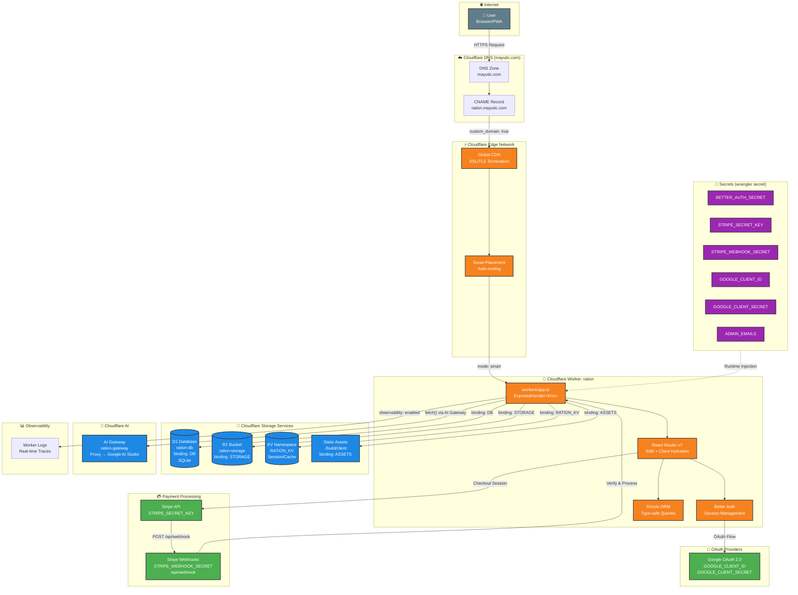

### Key Bindings Summary

| Binding | Service | Purpose |
|---------|---------|---------|
| `DB` | D1 (SQLite) | All persistent data: users, organizations, inventory, meals, plans, ledger |
| `RATION_KV` | KV Namespace | Distributed rate limiting, webhook idempotency, session caching |
| `STORAGE` | R2 Bucket | Object storage for uploads (images, exports) |
| `ASSETS` | Static Assets | Built client-side bundle (`./build/client`) |
| `AI` | Workers AI | AI model inference binding (reserved, currently unused) |
| AI Gateway | External fetch | Proxied AI calls via `gateway.ai.cloudflare.com` → Google AI Studio |

---

## 2. User Request Lifecycle

Every request follows this exact path from browser to response. The diagram shows how each Cloudflare service participates.

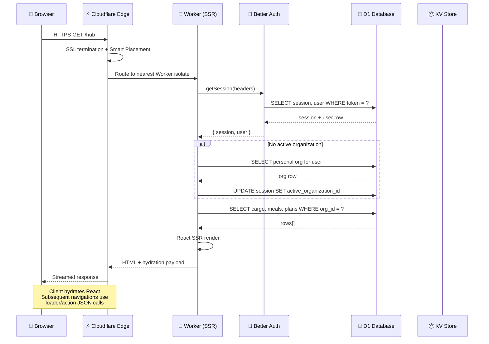

**Key design decisions:**

- **Smart Placement** (`mode: "smart"` in [`wrangler.jsonc`](wrangler.jsonc:29)) routes the Worker isolate to the Cloudflare PoP closest to D1, not the user. This reduces D1 latency from ~100ms (cross-region) to ~5ms (co-located).
- **Auth instance caching** — The Better Auth instance is cached at the module level (keyed on `BETTER_AUTH_SECRET`) inside [`auth.server.ts`](app/lib/auth.server.ts:196) to avoid re-constructing the Drizzle adapter on every request within the same isolate lifetime.
- **Bot-aware SSR** — The [`entry.server.tsx`](app/entry.server.tsx:36) waits for `allReady` on bot user-agents, ensuring search crawlers receive fully rendered HTML.

---

## 3. Core User Workflows

### 3.1 Receipt Scan (AI Gateway + D1 + KV)

The scan workflow is the most complex user-facing operation, touching KV (rate limit), D1 (credits + inventory), and AI Gateway (vision model).

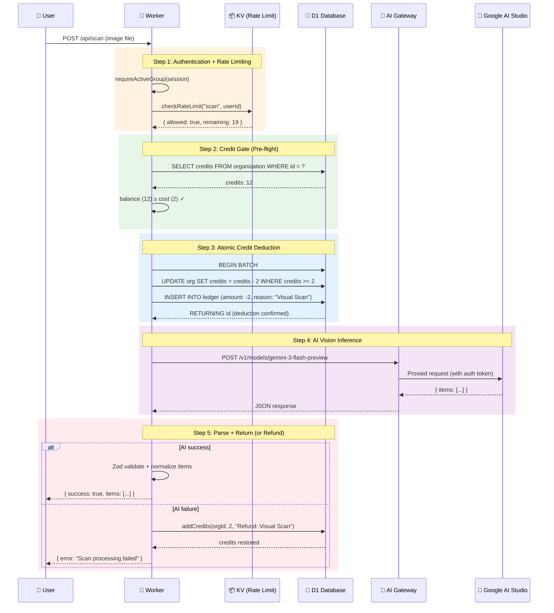

**Refund policy** (defined in [`ledger.server.ts`](app/lib/ledger.server.ts:236)): Every thrown error inside [`withCreditGate()`](app/lib/ledger.server.ts:247) triggers an automatic refund. The user never pays for a failed operation.

**AI Gateway routing** (in [`scan.tsx`](app/routes/api/scan.tsx:149)):

```
https://gateway.ai.cloudflare.com/v1/{ACCOUNT_ID}/{GATEWAY_ID}/google-ai-studio
  → /v1beta/models/gemini-3-flash-preview:generateContent
```

The AI Gateway provides: logging, rate limiting, caching, cost analytics, and fallback configuration — all managed in the Cloudflare dashboard without code changes.

---

### 3.2 Credit Purchase (Stripe + D1 + KV)

The payment flow uses Stripe Embedded Checkout with webhook fulfillment. KV provides idempotency guarantees for exactly-once credit delivery.

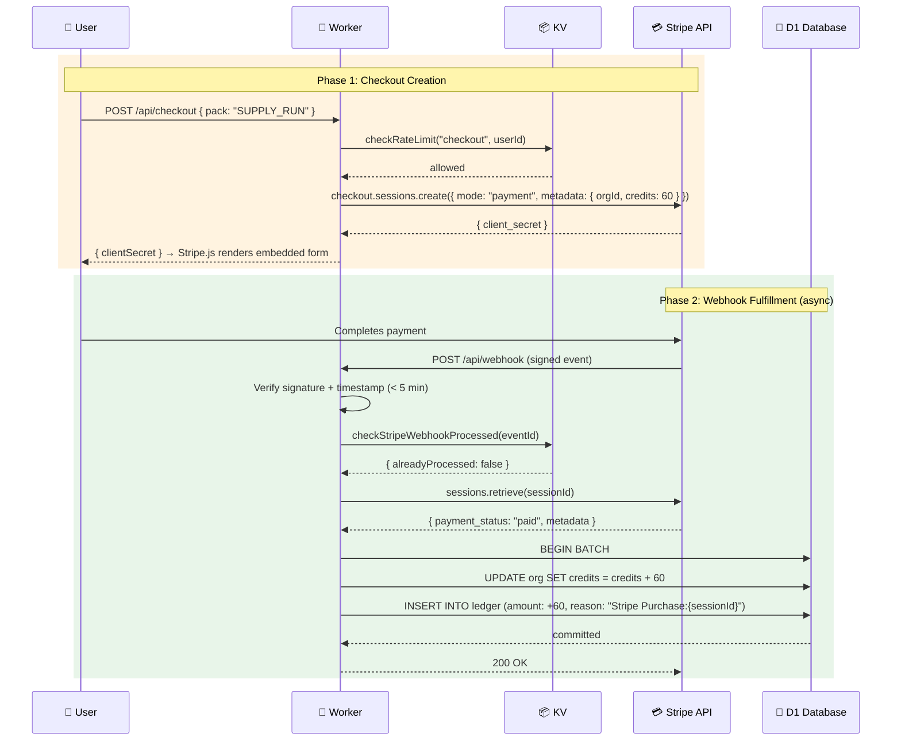

**Idempotency** (in [`idempotency.server.ts`](app/lib/idempotency.server.ts:34)): Each Stripe event ID is stored as a KV key with a 24-hour TTL. If the same event arrives again (Stripe retries), it is acknowledged with `200 OK` without re-processing. The ledger also uses `reason:${sessionId}` as a secondary idempotency guard in [`addCredits()`](app/lib/ledger.server.ts:122).

**Credit packs** (from [`stripe.server.ts`](app/lib/stripe.server.ts:22)):

| Pack | Credits | Price | Notes |
|------|---------|-------|-------|
| Taste Test | 15 | €0.99 | ~7 scans |
| Supply Run | 60 | €4.99 | Most Popular |
| Mission Crate | 150 | €9.99 | Best Value |
| Orbital Stockpile | 500 | €24.99 | Bulk |
| Crew Member (Annual) | 60/yr | €12/yr | Unlimited capacity + renewal credits |

---

### 3.3 Inventory Search (D1 + KV)

Search demonstrates the simpler read-path pattern: auth → rate limit → scoped query → response.

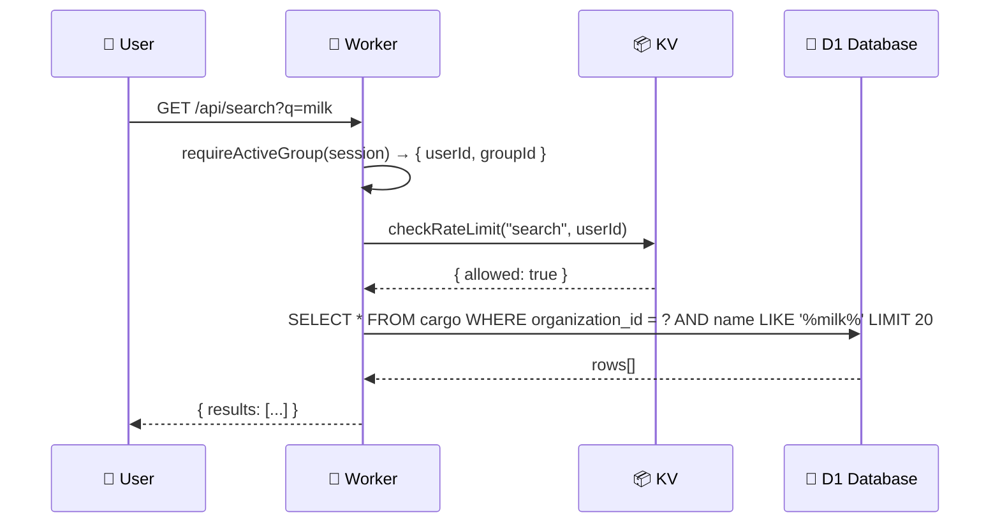

**Organization scoping**: Every D1 query includes `WHERE organization_id = ?` sourced from the session's [`activeOrganizationId`](app/db/schema.ts:60). This is the fundamental tenant isolation mechanism — there is no way for a user to query another organization's data without being a verified member.

---

## 4. Database Schema

### 4.1 Entity-Relationship Diagram

The schema centres on the [`organization`](app/db/schema.ts:109) table. All domain data (cargo, meals, plans, supply lists) is owned by an organization, not a user directly.

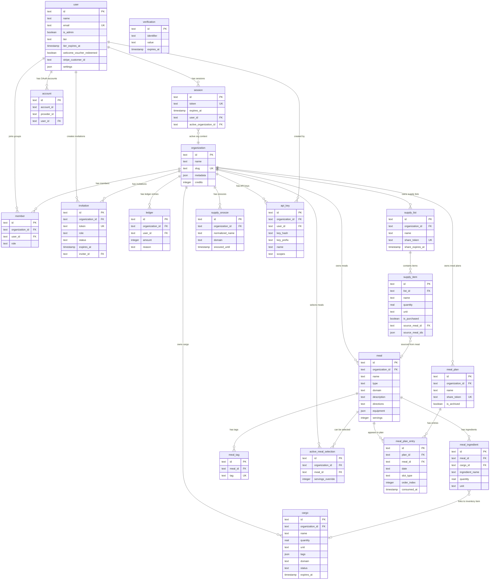

### 4.2 Table Reference

| Table | Owner | Purpose | Key Indexes |
|-------|-------|---------|-------------|
| [`user`](app/db/schema.ts:16) | — | Authenticated users, tier info, settings | `email` (unique) |
| [`session`](app/db/schema.ts:46) | user | Active auth sessions with org context | `token` (unique) |
| [`account`](app/db/schema.ts:72) | user | OAuth provider links (Google, email/pass) | — |
| [`verification`](app/db/schema.ts:94) | — | Auth verification tokens | `identifier` |
| [`organization`](app/db/schema.ts:109) | — | Groups/teams with credit pools | `slug` (unique) |
| [`member`](app/db/schema.ts:129) | org + user | Membership join table with roles | `(org_id, user_id)` unique |
| [`invitation`](app/db/schema.ts:160) | org | Shareable group invitation links | `token` (unique), `org_id` |
| [`cargo`](app/db/schema.ts:184) | org | Pantry/inventory items | `(org_id, domain)` |
| [`ledger`](app/db/schema.ts:220) | org | Immutable credit transaction log | `org_id`, `user_id` |
| [`meal`](app/db/schema.ts:242) | org | Recipes and provisions | `(org_id, domain)`, `(org_id, type)` |
| [`meal_ingredient`](app/db/schema.ts:294) | meal | Ingredient list with optional cargo link | `meal_id`, `ingredient_name` |
| [`meal_tag`](app/db/schema.ts:329) | meal | Categorization tags | `(meal_id, tag)` unique |
| [`active_meal_selection`](app/db/schema.ts:354) | org + meal | Currently "selected" meals for supply list generation | `(org_id, meal_id)` unique |
| [`supply_list`](app/db/schema.ts:392) | org | Shopping/supply lists with sharing | `org_id`, `share_token` |
| [`supply_item`](app/db/schema.ts:425) | supply_list | Individual items on a list | `list_id`, `(list_id, domain)` |
| [`supply_snooze`](app/db/schema.ts:465) | org | Items snoozed from auto-generation | `(org_id, name, domain)` unique |
| [`meal_plan`](app/db/schema.ts:498) | org | Weekly/custom meal plans with sharing | `org_id`, `share_token` |
| [`meal_plan_entry`](app/db/schema.ts:534) | meal_plan | Individual date+slot+meal assignments | `(plan_id, date)`, `(plan_id, date, slot_type)` |
| [`api_key`](app/db/schema.ts:579) | org + user | Programmatic API keys (SHA-256 hashed) | `key_prefix`, `org_id` |

---

## 5. Security Architecture

### 5.1 Authentication Flow

Authentication is handled by Better Auth with the organization plugin. The system supports Google OAuth (production) and email/password (development fallback).

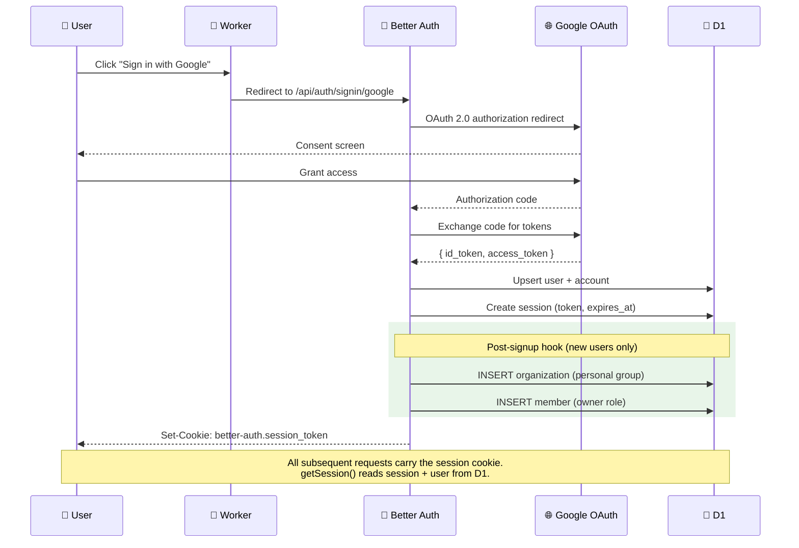

**Post-signup provisioning** (in [`auth.server.ts`](app/lib/auth.server.ts:136)): Every new user automatically receives a personal organization with `owner` role. This ensures the user always has at least one group context for queries.

---

### 5.2 Multi-Tenant Isolation (Organizations)

Ration uses an **organization-based multi-tenancy** model. Every piece of domain data is owned by an organization, and access is mediated through the `member` join table.

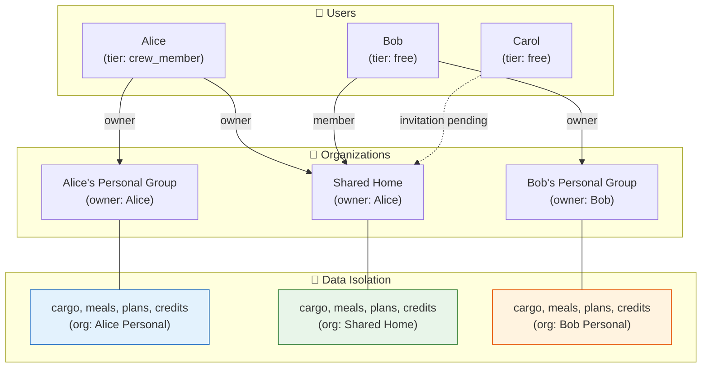

**Isolation guarantees:**

| Layer | Mechanism | Implementation |
|-------|-----------|----------------|
| **Session context** | `session.active_organization_id` | Set on login, switchable via [`GroupSwitcher`](app/components/shell/GroupSwitcher.tsx:1) UI. Only organizations the user is a verified `member` of can be activated. |
| **Query scoping** | `WHERE organization_id = ?` | Every query in [`cargo.server.ts`](app/lib/cargo.server.ts:1), [`meals.server.ts`](app/lib/meals.server.ts:1), [`supply.server.ts`](app/lib/supply.server.ts:1) etc. uses the `groupId` from [`requireActiveGroup()`](app/lib/auth.server.ts:381). |
| **Role-based access** | `member.role` (owner / admin / member) | Invitation creation requires `owner` or `admin` role. Credit transfers require `owner` on source org. Defined via Better Auth's access control in [`auth.server.ts`](app/lib/auth.server.ts:18). |
| **Tier-based gating** | Owner's `user.tier` determines group limits | Capacity checks in [`capacity.server.ts`](app/lib/capacity.server.ts:73) look up the **organization owner's** tier, not the current user's. |
| **Credit isolation** | `organization.credits` counter | Credits belong to the organization, not the user. A user purchasing credits adds them to their active org's pool. All members consume from the same pool. |
| **API key isolation** | `api_key.organization_id` | Programmatic API keys (prefix `rtn_live_`) are scoped to a single organization. Key verification in [`api-key.server.ts`](app/lib/api-key.server.ts:59) returns the `organizationId` for RLS. |

---

### 5.3 Route Access Control

```mermaid
flowchart TB
    Request["Incoming Request"] --> RouteMatch{"Route Match"}

    RouteMatch --> Public["🌐 Public Routes<br/>(no auth required)"]
    RouteMatch --> AuthRequired["🔐 Auth Required<br/>(session cookie)"]
    RouteMatch --> GroupRequired["🏢 Group Required<br/>(session + active org)"]
    RouteMatch --> AdminRequired["👑 Admin Required<br/>(user.is_admin)"]
    RouteMatch --> ApiKeyRequired["🔑 API Key Required<br/>(Bearer / X-Api-Key)"]

    Public --> P1["/ (landing)"]
    Public --> P2["/api/auth/* (login/signup)"]
    Public --> P3["/api/webhook (Stripe)"]
    Public --> P4["/shared/:token"]
    Public --> P5["/legal/*"]

    AuthRequired --> A1["/select-group"]
    AuthRequired --> A2["/api/groups/create"]
    AuthRequired --> A3["/api/user/purge"]

    GroupRequired --> G1["/hub/* (dashboard)"]
    GroupRequired --> G2["/api/meals/*"]
    GroupRequired --> G3["/api/cargo/*"]
    GroupRequired --> G4["/api/supply-lists/*"]
    GroupRequired --> G5["/api/scan"]
    GroupRequired --> G6["/api/search"]
    GroupRequired --> G7["/api/checkout"]
    GroupRequired --> G8["/api/meal-plans/*"]

    AdminRequired --> AD1["/admin"]
    AdminRequired --> AD2["/api/admin/users"]

    ApiKeyRequired --> K1["/api/v1/inventory/export"]
    ApiKeyRequired --> K2["/api/v1/inventory/import"]
    ApiKeyRequired --> K3["/api/v1/galley/export"]
    ApiKeyRequired --> K4["/api/v1/galley/import"]
    ApiKeyRequired --> K5["/api/v1/supply/export"]

    style Public fill:#c8e6c9,stroke:#2e7d32
    style AuthRequired fill:#fff9c4,stroke:#f9a825
    style GroupRequired fill:#bbdefb,stroke:#1565c0
    style AdminRequired fill:#ffcdd2,stroke:#c62828
    style ApiKeyRequired fill:#e1bee7,stroke:#7b1fa2
```

**Guard functions** (all in [`auth.server.ts`](app/lib/auth.server.ts)):

| Function | Returns | Redirects on fail |
|----------|---------|-------------------|
| [`requireAuth()`](app/lib/auth.server.ts:337) | `session` (with user) | `→ /` (home) |
| [`requireActiveGroup()`](app/lib/auth.server.ts:381) | `{ session, groupId }` | `→ /select-group` |
| [`requireAdmin()`](app/lib/auth.server.ts:355) | `user` (with isAdmin) | `→ /` (home) |
| [`requireApiKey()`](app/lib/api-key.server.ts:113) | `{ organizationId, scopes }` | 401 / 403 JSON |

---

### 5.4 Defence in Depth Layers

```mermaid
flowchart LR
    subgraph L1["Layer 1: Edge"]
        SSL["SSL/TLS Termination"]
        CSP["Content Security Policy"]
        HSTS["Strict-Transport-Security"]
        XFO["X-Frame-Options: DENY"]
    end

    subgraph L2["Layer 2: Authentication"]
        SessionAuth["Session Cookie Verification"]
        OAuthFlow["Google OAuth 2.0"]
        ApiKeyAuth["SHA-256 Hashed API Keys"]
        TimingAttack["Constant-time Comparison"]
    end

    subgraph L3["Layer 3: Authorization"]
        OrgMembership["Organization Membership Check"]
        RoleCheck["Role-based Gate (owner/admin/member)"]
        TierGate["Tier-based Feature Gating"]
    end

    subgraph L4["Layer 4: Rate Limiting"]
        DistributedRL["KV-backed Sliding Window"]
        PerUserLimits["Per-user Rate Limits"]
        PerIPLimits["Per-IP for Public Endpoints"]
    end

    subgraph L5["Layer 5: Data Integrity"]
        AtomicTx["D1 Batch Transactions"]
        IdempotencyKV["KV Idempotency Guards"]
        ZodValidation["Zod Schema Validation"]
        CreditGuard["SQL-level Overdraft Prevention"]
    end

    L1 --> L2 --> L3 --> L4 --> L5
```

**HTTP security headers** (set in [`root.tsx`](app/root.tsx:56)):
- `Content-Security-Policy` — Restrictive CSP allowing only self, Stripe JS, Google Fonts
- `Strict-Transport-Security` — HSTS with 1-year max-age
- `X-Frame-Options: DENY` — Prevents clickjacking
- `X-Content-Type-Options: nosniff` — Prevents MIME type sniffing
- `Referrer-Policy: strict-origin-when-cross-origin`

**API key security** (in [`api-key.server.ts`](app/lib/api-key.server.ts)):
- Keys use `rtn_live_` prefix format with 32 hex chars
- Only the SHA-256 hash is stored; raw key is shown once at creation
- Lookups use a prefix-based index, then [`secureCompare()`](app/lib/api-key.server.ts:34) (constant-time) to prevent timing attacks
- Each key has explicit JSON-encoded `scopes` (e.g. `["inventory", "galley"]`)

---

## 6. Behaviour Under Load & At Scale

### 6.1 Scalability Architecture

Ration runs entirely on Cloudflare's serverless edge. There are no fixed servers, no auto-scaling groups, and no cold-start containers.

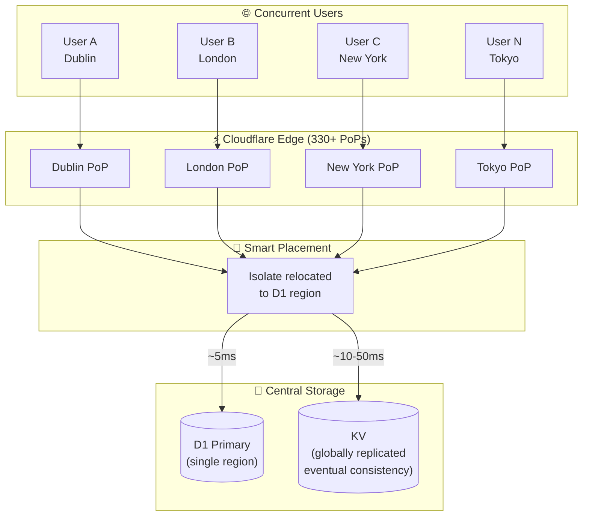

**How each service behaves under load:**

| Service | Scaling Model | Bottleneck | Mitigation |
|---------|--------------|------------|------------|
| **Worker** | Auto-scales to thousands of isolates. No cold starts (V8 isolate reuse). Each isolate handles one request. | CPU time limit (30s paid / 10ms free tier) | Heavy work offloaded to AI Gateway. Module-level auth caching. |
| **D1 (SQLite)** | Single-region writer with read replicas. Batch transactions for atomicity. | Write throughput to single leader (~10K writes/sec) | Compound indexes on hot paths. `WHERE org_id = ?` narrows scan windows. Smart Placement co-locates Worker with D1. |
| **KV** | Globally replicated reads (eventually consistent). Low-latency reads from every PoP. | 1,000 writes/sec/namespace. Eventual consistency (60s propagation). | Rate limit windows use TTL-expiring keys (self-cleaning). Fail-open on KV write errors to avoid cascading 500s. |
| **AI Gateway** | Managed proxy with queuing, retry, caching. | Upstream model rate limits (Google AI Studio). Token throughput. | Credit system prevents unbounded usage. 20 req/min per-user rate limit on scan. Automatic refunds on failure. |
| **R2** | S3-compatible, globally distributed. | Rarely a bottleneck for this use case. | Used for static exports, not hot path. |
| **Stripe** | Stripe's infrastructure (99.999% SLA). | Webhook delivery latency (~seconds). | KV idempotency ensures exactly-once processing. Event timestamp validation rejects stale replays. |

**KV failure resilience** (in [`rate-limiter.server.ts`](app/lib/rate-limiter.server.ts:181)): Rate limiting **fails open** — if KV is unreachable (e.g. 429 from KV itself), the request is allowed through with a `log.warn`. This prevents a KV outage from causing a complete service outage.

---

### 6.2 Rate Limiting Matrix

All rate limits use the **sliding window counter** algorithm implemented in [`rate-limiter.server.ts`](app/lib/rate-limiter.server.ts:152). Limits are enforced globally via KV (not per-isolate).

| Endpoint | Key | Window | Max Requests | Purpose |
|----------|-----|--------|-------------|---------|
| `/api/scan` | `rate:scan:{userId}` | 60s | 20 | AI cost control |
| `/api/meals/generate` | `rate:generate_meal:{userId}` | 60s | 10 | AI cost control |
| `/api/meals/import` | `rate:recipe_import:{userId}` | 60s | 10 | AI cost control |
| `/api/search` | `rate:search:{userId}` | 10s | 30 | Prevent DB abuse |
| `/api/checkout` | `rate:checkout:{userId}` | 60s | 10 | Payment spam prevention |
| `/api/groups/create` | `rate:group_create:{userId}` | 60s | 5 | Spam prevention |
| `/api/groups/invitations/create` | `rate:group_invite:{userId}` | 60s | 10 | Invitation spam |
| `/api/groups/credits/transfer` | `rate:credits_transfer:{userId}` | 60s | 10 | Transfer abuse |
| `/api/cargo/batch` | `rate:inventory_batch:{userId}` | 60s | 20 | Bulk write protection |
| `/api/user/purge` | `rate:user_purge:{userId}` | 300s | 1 | Destructive action guard |
| `/api/auth/*` | `rate:auth_public:{ip}` | 60s | 20 | Brute force protection |
| `/shared/:token` | `rate:shared_public:{ip}` | 60s | 60 | Public page abuse |
| `/api/v1/*/export` | `rate:api_export:{orgId}` | 60s | 30 | API export throttle |
| `/api/v1/*/import` | `rate:api_import:{orgId}` | 60s | 20 | API import throttle |
| Inventory mutations | `rate:inventory_mut:{userId}` | 60s | 60 | Write storm protection |
| Meal mutations | `rate:meal_mut:{userId}` | 60s | 30 | Write storm protection |
| Grocery mutations | `rate:grocery_mut:{userId}` | 60s | 60 | Write storm protection |

---

## 7. Tier & Capacity System

The tier system controls resource limits per organization. Limits are determined by the **organization owner's** tier — not the viewer's.

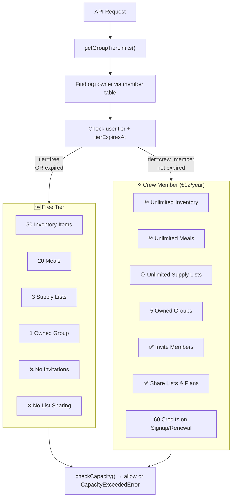

**Capacity enforcement** (in [`capacity.server.ts`](app/lib/capacity.server.ts:149)): Before any write operation (adding cargo, creating a meal, etc.), the route calls [`checkCapacity()`](app/lib/capacity.server.ts:182) or [`checkCapacityWithTier()`](app/lib/capacity.server.ts:149) which compares the current count against the tier limit. If exceeded, a `CapacityExceededError` is thrown with upgrade path information.

**AI operation costs** (from [`ledger.server.ts`](app/lib/ledger.server.ts:14)):

| Operation | Credit Cost | Route |
|-----------|-------------|-------|
| Receipt Scan | 2 | `/api/scan` |
| Meal Generate | 2 | `/api/meals/generate` |
| URL Recipe Import | 1 | `/api/meals/import` |
| Organize Cargo | 2 | *Not yet implemented* |
| Weekly Meal Plan | 3 | *Not yet implemented* |
