# Ration — AI-Powered Kitchen Management

> **Architecture:** React Router v7 (SSR) + Drizzle ORM + Better Auth | **Platform:** Cloudflare Workers | **Domain:** `ration.mayutic.com` | **AI connectivity:** MCP server at `mcp.ration.mayutic.com`

An AI-powered pantry and meal-planning application built as a Cloudflare Worker with SSR, AI-powered receipt scanning, semantic ingredient matching, meal generation, weekly meal planning, tiered subscriptions, and multi-tenant group sharing. Agents connect via **MCP** (Model Context Protocol) to operate inventory, recipes, meal plans, and shopping lists from Claude, Cursor, ChatGPT, and other compatible clients. Built for the Cloudflare paid plan — design decisions prioritise correctness, latency, and scale over free-tier frugality.

---

## Table of Contents

- [1. Infrastructure Overview](#1-infrastructure-overview)
- [2. User Request Lifecycle](#2-user-request-lifecycle)
- [3. Core User Workflows](#3-core-user-workflows)
  - [3.1 Receipt Scan (Queue + AI Gateway + D1 + R2 + Vectorize)](#31-receipt-scan-queue--ai-gateway--d1--r2--vectorize)
  - [3.2 Credit Purchase (Stripe + D1 + KV)](#32-credit-purchase-stripe--d1--kv)
  - [3.3 Inventory Search (D1 + KV)](#33-inventory-search-d1--kv)
  - [3.4 Meal Generation (Queue + AI Gateway + Vectorize)](#34-meal-generation-queue--ai-gateway--vectorize)
  - [3.5 Supply Sync (D1 + Vectorize)](#35-supply-sync-d1--vectorize)
  - [3.6 Meal Plan Consume Flow (D1 + Vectorize)](#36-meal-plan-consume-flow-d1--vectorize)
  - [3.7 Plan Week (Queue + AI Gateway)](#37-plan-week-queue--ai-gateway)
  - [3.8 Import URL (Queue + AI Gateway + Browser Rendering)](#38-import-url-queue--ai-gateway--browser-rendering)
- [4. Feature Reference](#4-feature-reference)
  - [4.1 Cargo (Inventory)](#41-cargo-inventory)
  - [4.2 Galley (Recipes & Provisions)](#42-galley-recipes--provisions)
  - [4.3 Manifest (Meal Plan Calendar)](#43-manifest-meal-plan-calendar)
  - [4.4 Supply List](#44-supply-list)
  - [4.5 Hub Dashboard](#45-hub-dashboard)
  - [4.6 Settings & Identity](#46-settings--identity)
- [5. AI & Vector Systems](#5-ai--vector-systems)
  - [5.1 Embedding Pipeline](#51-embedding-pipeline)
  - [5.2 Meal Matching Engine](#52-meal-matching-engine)
  - [5.3 AI Operations & Credit Costs](#53-ai-operations--credit-costs)
  - [5.4 Queue Architecture](#54-queue-architecture)
- [6. Database Schema](#6-database-schema)
  - [6.1 Entity-Relationship Diagram](#61-entity-relationship-diagram)
  - [6.2 Table Reference](#62-table-reference)
- [7. Security Architecture](#7-security-architecture)
  - [7.1 Authentication Flow](#71-authentication-flow)
  - [7.2 Multi-Tenant Isolation (Organizations)](#72-multi-tenant-isolation-organizations)
  - [7.3 Route Access Control](#73-route-access-control)
  - [7.4 Defence in Depth Layers](#74-defence-in-depth-layers)
- [8. Tier & Capacity System](#8-tier--capacity-system)
- [9. Behaviour Under Load & At Scale](#9-behaviour-under-load--at-scale)
  - [9.1 Scalability Architecture](#91-scalability-architecture)
  - [9.2 Rate Limiting Matrix](#92-rate-limiting-matrix)
- [10. MCP Server](#10-mcp-server)
- [11. Public REST API (v1)](#11-public-rest-api-v1)
- [12. Testing](#12-testing)
- [13. Local Development & Deployment](#13-local-development--deployment)
- [14. Fin knowledge hub (support)](#14-fin-knowledge-hub-support)

---

## 1. Infrastructure Overview

The entire application runs on Cloudflare's edge network as a single Worker (`ration`) with bindings to D1, R2, KV, Queues, Workers AI, and Vectorize. A separate `ration-mcp` Worker exposes the pantry to AI agents via the Model Context Protocol. Both Workers share the same D1/KV/R2/AI/Vectorize bindings in production.

#### 1.1 Traffic flow — Users and AI agents

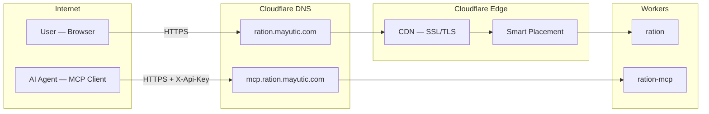

#### 1.2 Main Worker (ration) — internal stack

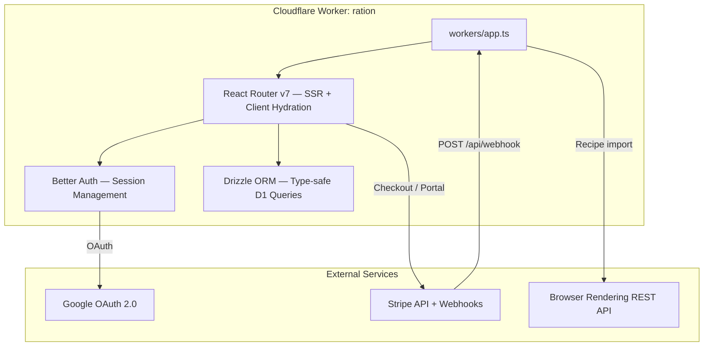

#### 1.3 MCP Worker (ration-mcp) — AI agent interface

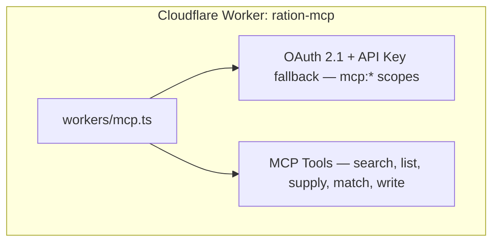

#### 1.4 Shared Cloudflare bindings — storage and AI

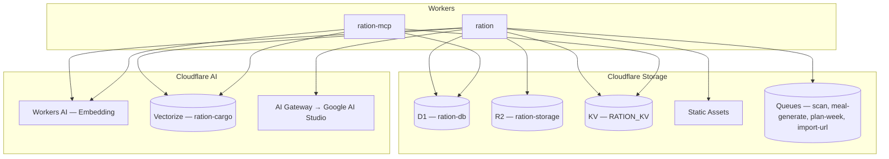

### Bindings Reference

| Binding | Service | Purpose |
|---------|---------|---------|
| `DB` | D1 (SQLite) | All persistent data: users, orgs, inventory, meals, plans, ledger, API keys |
| `RATION_KV` | KV Namespace | Rate limiting counters, webhook idempotency keys, tier cache, vector embedding cache |
| `STORAGE` | R2 Bucket | Object storage for scan images and data exports |
| `ASSETS` | Static Assets | Built client-side bundle (`./build/client`) served at the edge |
| `AI` | Workers AI | Embedding generation (`@cf/google/embeddinggemma-300m`, 768-dim) |
| `VECTORIZE` | Vectorize Index | Semantic ingredient search (`ration-cargo`, cosine similarity) |
| AI Gateway | External fetch | Proxied LLM calls to Google AI Studio — `gemini-3.5-flash` for scan, generate, plan, import |
| `SCAN_QUEUE` | Queue producer | Enqueue scan jobs; consumer runs AI vision + D1/Vectorize |
| `MEAL_GENERATE_QUEUE` | Queue producer | Enqueue meal generation jobs; consumer runs LLM + Vectorize verification |
| `PLAN_WEEK_QUEUE` | Queue producer | Enqueue plan-week jobs; consumer runs Gemini for weekly meal schedule |
| `IMPORT_URL_QUEUE` | Queue producer | Enqueue URL import jobs; consumer fetches page, runs Gemini extraction, creates meal |

**Secrets (wrangler):** `CF_BROWSER_RENDERING_TOKEN` — optional; when set, recipe import uses Cloudflare Browser Rendering for JS-heavy sites. When absent, plain fetch only.

**R2 lifecycle (`scan-pending/*`):** Failed/abandoned scans can leave orphaned objects under `scan-pending/*` in the `ration-storage` bucket. Cleanup is a native, zero-code **R2 Object Lifecycle Rule** (not application code), applied once per bucket by an operator:

```bash
npx wrangler r2 bucket lifecycle add ration-storage \
  --prefix "scan-pending/" \
  --expire-days 1 \
  --id "expire-scan-pending-orphans"
```

Apply the same rule to `ration-storage-dev` for dev/prod parity. Verify with `npx wrangler r2 bucket lifecycle list ration-storage`. This rule has not yet been applied in this environment — track it as an outstanding operator action, not a code deliverable.

**Vars:** `INTERCOM_APP_ID` — public Intercom workspace app id; set in `wrangler.jsonc` / `wrangler.dev.jsonc` / `wrangler.local.jsonc`. The Intercom Messenger loads only on authenticated `/hub/*` routes (see `app/components/support/HubIntercom.tsx`). The default floating launcher is hidden; support opens from the hub header **Ask Ration** primary control inside the grouped actions toolbar (`app/components/support/IntercomLauncherButton.tsx`, composed in `app/routes/hub.tsx`) so it does not cover the mobile bottom nav. `custom_launcher_selector` targets the shared class `ration-intercom-launcher` (`app/lib/intercom-hub-settings.ts`), also used on the **Ask Ration** link in **Help & Feedback** under System settings (`/hub/settings#help`, `HelpSection` in `app/routes/hub/settings.tsx`). On narrow viewports the header label shortens to **Ask** while the accessible name stays “Ask Ration (support chat)”. Theme switching stays in the header on `md+` and remains available under **Settings** on smaller viewports. The app **Content-Security-Policy** in `app/root.tsx` includes Intercom script/connect/img/font/media/frame/form-action sources required by their widget.

**Secrets (optional):** `INTERCOM_MESSENGER_JWT_SECRET` — `wrangler secret put INTERCOM_MESSENGER_JWT_SECRET`; when set, the root loader signs a short-lived HS256 JWT and the hub Messenger boots with `intercom_user_jwt` (Messenger Security / Fin). Generate the secret in Intercom under **Settings → Messenger → Security**. See [Authenticating users in the Messenger with JWTs](https://www.intercom.com/help/en/articles/10589769-authenticating-users-in-the-messenger-with-json-web-tokens-jwts).

**Secrets (optional):** `FIN_INTERCOM_CONNECTOR_SECRET` — shared secret between Intercom Fin Data Connectors and the Fin billing API routes. Store with `wrangler secret put FIN_INTERCOM_CONNECTOR_SECRET` (and in local `.dev.vars`). Intercom sends this as either `Authorization: Bearer <token>` or `x-intercom-token`; the Worker validates the token before reading or mutating user billing state in D1/Stripe.

**Fin billing endpoints (server-to-server only):**

| Method | Path | Purpose |
|--------|------|---------|
| `GET` | `/api/fin/billing-summary?user_id=…` | Read-only summary (plan, renewal, cancel-at-period-end). |
| `POST` | `/api/fin/subscription-cancel` | JSON body `{ "user_id": "…", "confirm": true }` — set **cancel at period end** on the user’s active Stripe subscription. Stricter rate limit than GET. |
| `POST` | `/api/fin/subscription-resume` | Same body shape — clear **cancel at period end** so the subscription renews. |

Configure each path as its own Fin Data Connector action. Never expose the connector secret to clients.

**JWT-only verification checklist (post-enforcement):**
- Hub requests contain `intercom_user_jwt`
- Intercom Security logs show accepted JWT requests
- No `user_hash` is present in Messenger payloads

**Operations note:** If you rotate `INTERCOM_MESSENGER_JWT_SECRET`, redeploy/restart the environment before validating new JWT traffic.

**Why AI Gateway instead of calling Google AI directly?** The gateway provides request logging, cost analytics, caching, and configurable retry/fallback — all from the Cloudflare dashboard with zero code changes. It also means the Google API key never needs to be rotated into application secrets; only the gateway ID is referenced.

**Why Smart Placement?** Without it, a Worker isolate spun up at a PoP near the user (e.g. Tokyo) would make every D1 read across the Atlantic to the D1 primary (~100ms per query). Smart Placement relocates the isolate to the PoP closest to D1, reducing per-query latency to ~5ms at the cost of slightly higher initial connection time.

---

## 2. User Request Lifecycle

Every request follows this path from browser to response.

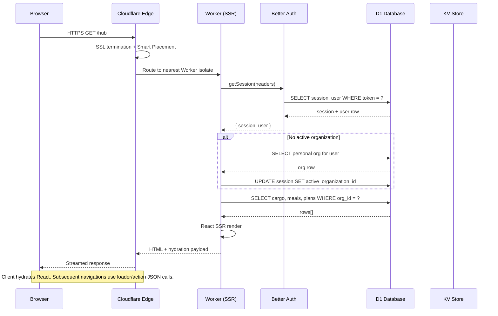

**Key design decisions:**

- **Auth instance caching** — The Better Auth instance is cached at module level in [`app/lib/auth.server.ts`](app/lib/auth.server.ts) (keyed on `BETTER_AUTH_SECRET`) to avoid re-constructing the Drizzle adapter and plugin chain on every request within the same isolate lifetime.
- **`ensureActiveOrganization()`** — Runs on every authenticated request. If no active org is set on the session, it falls back to the user's `defaultGroupId` preference, then to their personal group. This is transparent to the user and prevents a class of "missing group context" bugs on fresh sessions.
- **Bot-aware SSR** — The `entry.server.tsx` waits for `allReady` on bot user-agents, ensuring crawlers receive fully rendered HTML. For real users, streaming begins immediately.
- **`shouldRevalidate` on hub layout** — The `/hub` layout route forces revalidation when `?transaction=success` is in the URL so that tier and credit balance reflect a just-completed Stripe checkout without requiring a hard reload.

---

## 3. Core User Workflows

### 3.1 Receipt Scan (Queue + AI Gateway + D1 + R2 + Vectorize)

The scan workflow uses a queue to offload AI vision processing, avoiding Worker timeouts. It touches KV (rate limit), D1 (credits + queue job status), R2 (temporary image storage), Workers AI (embeddings), Vectorize (dedup), and AI Gateway (vision model).

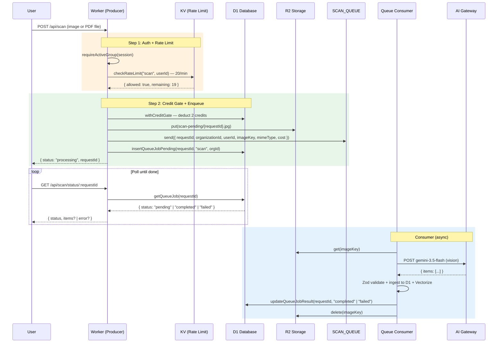

**Refund policy** (in [`app/lib/ledger.server.ts`](app/lib/ledger.server.ts)): Every thrown error inside `withCreditGate()` triggers an automatic `addCredits` refund. The consumer calls `updateQueueJobResult` with status `failed` and the error is returned to the user on the next poll. Users never pay for failed AI operations.

**File pre-processing** (in the `CameraInput` component): For images, the browser resizes to a maximum of 1024px on either side at 0.8 JPEG quality on a canvas with a white background before upload. For PDFs (e.g. exported grocery receipts), the file is sent directly without canvas processing. Both types share a 5 MB client-side and server-side size limit. Accepted formats: JPEG, PNG, WebP, PDF.

**PDF receipts**: When a PDF is uploaded the consumer selects a receipt-specific prompt optimised for parsing grocery receipt line items (item name, weight/count columns, brand-name stripping). The metadata `source` field is set to `"pdf"` to distinguish PDF scans from image scans.

**AI Gateway routing:**
```
https://gateway.ai.cloudflare.com/v1/{ACCOUNT_ID}/{GATEWAY_ID}/google-ai-studio
  → /v1beta/models/gemini-3.5-flash:generateContent
```

---

### 3.2 Credit Purchase (Stripe + D1 + KV)

The payment flow uses Stripe Embedded Checkout with webhook fulfillment. KV provides idempotency guarantees for exactly-once credit delivery.

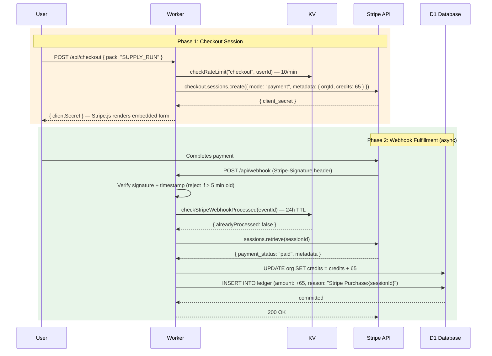

**Why webhook fulfillment instead of redirect-based confirmation?** Stripe can fire webhooks multiple times for the same event (network retries, timeouts). The KV idempotency key (event ID, 24h TTL) ensures credits are added exactly once regardless of how many times the webhook fires. The ledger's `reason:${sessionId}` provides a secondary guard inside `addCredits()`.

**Why reject events older than 5 minutes?** Stale replayed webhooks (e.g. from Stripe test mode or infrastructure issues) should not be processed. Signature verification alone does not protect against this.

**Credit packs** (from [`app/lib/stripe.server.ts`](app/lib/stripe.server.ts)):

| Pack | Credits | Price | Notes |
|------|---------|-------|-------|
| Taste Test | 12 | €1 | ~6 scans |
| Supply Run | 65 | €5 | Most Popular — `WELCOME65` promo (Supply Run only) |
| Mission Crate | 165 | €10 | ~82 scans |
| Orbital Stockpile | 550 | €25 | Best Value |
| Crew Member (Annual) | 65/year | €12/year | Subscription — unlimited capacity + 65 credits on start and renewal |
| Crew Member (Monthly) | — | €2/month | Unlimited capacity, no included credits — use WELCOME65 with Supply Run only or buy packs |

**Welcome voucher** (`WELCOME65`): New users are offered a 100% discount on the Supply Run (65 credits) via a Stripe Promotion Code. The code applies to Supply Run only. The voucher is tracked on `user.welcomeVoucherRedeemed` to show it exactly once.

---

### 3.3 Inventory Search (D1 + KV)

Search demonstrates the simpler read-path pattern: auth → rate limit → scoped query → response.

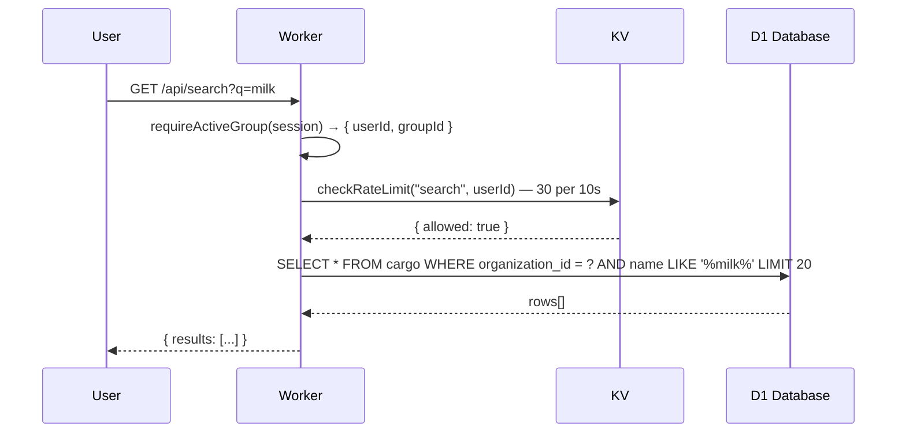

**Organization scoping:** Every D1 query includes `WHERE organization_id = ?` sourced from the session's `activeOrganizationId`. This is the fundamental tenant isolation mechanism — there is no way for a user to query another organization's data without being a verified member. The `groupId` is always sourced from `requireActiveGroup()`, never from client input.

---

### 3.4 Meal Generation (Queue + AI Gateway + Vectorize)

Meal generation uses a queue to offload the LLM and Vectorize verification (10–30s). The flow is two-phase: the consumer fetches pantry context, calls the LLM for recipe candidates, then Vectorize validates that proposed ingredients exist in the org's pantry before returning results.

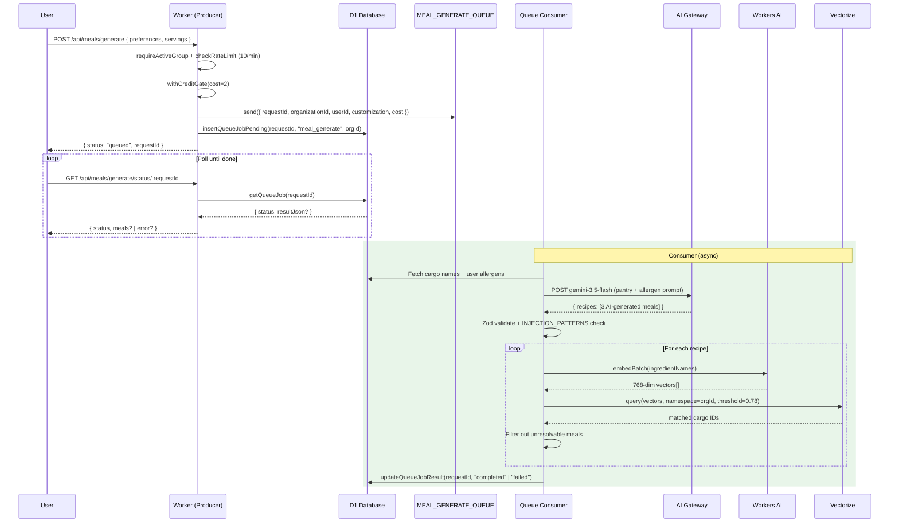

**Why verify against Vectorize after generation?** LLMs hallucinate. Without post-generation validation, the model might suggest "saffron" or "truffle oil" when the pantry contains only rice and chicken. The Vectorize check is a semantic guard — it catches both exact misses and conceptual mismatches above the similarity threshold (0.78).

**Prompt injection defence** (in [`app/lib/schemas/meal.ts`](app/lib/schemas/meal.ts)): All user-supplied text fields passed to the LLM (preferences, meal names) are checked against `INJECTION_PATTERNS` — a set of regexes targeting common prompt injection vectors — before being included in the AI prompt.

---

### 3.5 Supply Sync (D1 + Vectorize)

The supply list is generated by diffing what selected meals need against what cargo the org already has. Vectorize handles the gap between how an ingredient is named in a recipe vs. how it's labelled in the pantry.

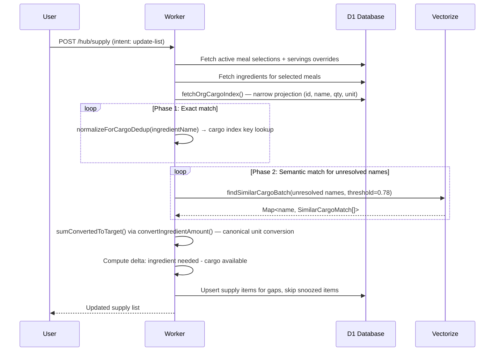

**Why a two-phase exact + semantic match?** Exact matching is free and handles well-structured data (e.g. cargo named identically to the recipe ingredient). Vectorize is only called for the unresolved remainder, minimising AI token cost and latency. The same `resolveIngredientsToCargo()` function is reused by supply sync, cook deduction, and AI generation verification — ensuring consistent resolution logic across all features.

**Supply snooze:** If a user has previously snoozed an ingredient (e.g. "soy sauce" — already have it somewhere), a `supply_snooze` row suppresses it from appearing in newly synced supply lists until the snooze expires.

---

### 3.6 Meal Plan Consume Flow (D1 + Vectorize)

When a user marks meal plan entries as "consumed", the system deducts those meals' ingredients from cargo — using the same Vectorize-backed resolution pipeline, but with a higher similarity threshold (0.80) to avoid over-subtracting real stock.

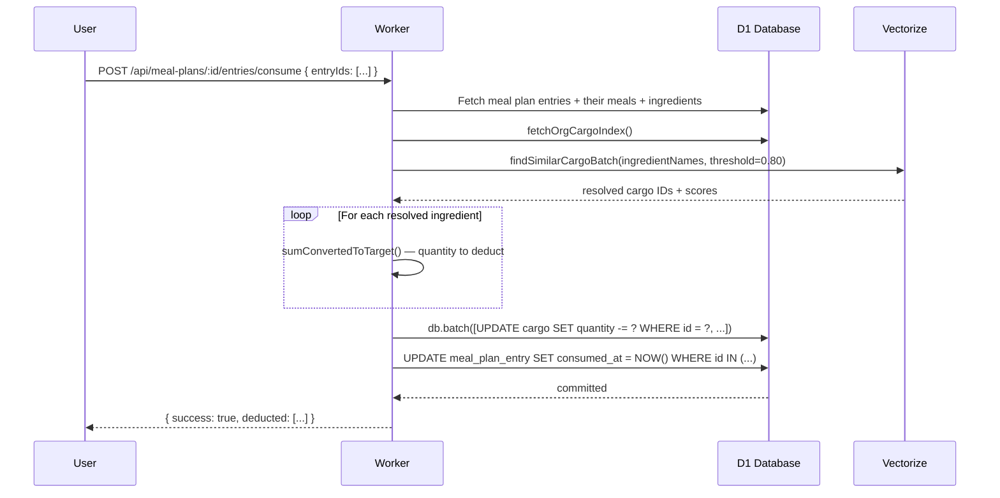

**Why a higher deduction threshold (0.80) vs. general matching (0.78)?** Subtracting from cargo is irreversible in normal flow. A false positive at 0.79 similarity might deduct "chicken thighs" from a cargo item named "chicken wings". The tighter threshold accepts a few missed deductions in exchange for correctness of the ones it does make.

---

### 3.7 Plan Week (Queue + AI Gateway)

Plan Week uses a queue to offload Gemini-based weekly meal scheduling. The flow mirrors scan and meal-generate: producer enqueues, returns `requestId`; client polls D1-backed status; consumer runs the AI and writes the result.

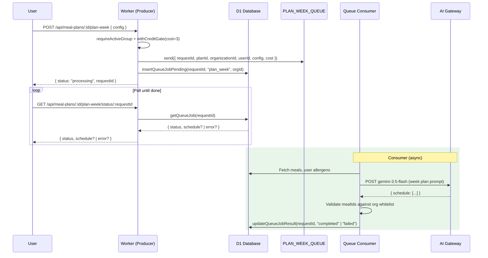

User confirms the preview → bulk add via `POST /api/meal-plans/:id/entries/bulk`. Credits are deducted at enqueue; refund on failure.

---

### 3.8 Import URL (Queue + AI Gateway + Browser Rendering)

URL import uses a queue to offload page fetch, AI extraction, and meal creation. Producer validates URL (SSRF, duplicate) before enqueue; consumer fetches (plain or Browser Rendering fallback), runs Gemini via AI Gateway, creates the meal in D1.

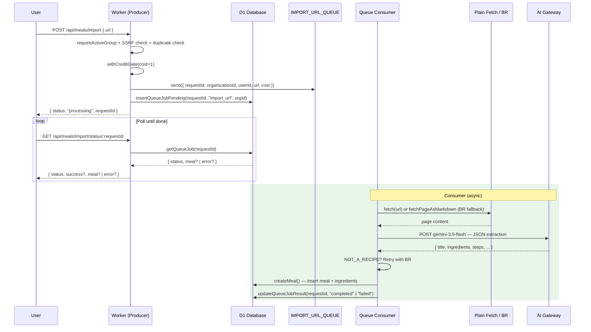

On success the client redirects to the new meal. Duplicate URLs return `DUPLICATE_URL` (sync or from poll). Browser Rendering is used when plain fetch yields 429/403, too little content, or `NOT_A_RECIPE`.

---

## 4. Feature Reference

### 4.1 Cargo (Inventory)

Cargo is the core inventory primitive. Each item belongs to an organization and carries: `name`, `quantity`, `unit`, `domain` (food / household / alcohol), `tags` (JSON array), `status`, and optional `expiresAt`.

**Key workflows:**
- **Add / Merge** — When a new cargo item is submitted, the system checks Vectorize for a similar existing item (`CARGO_MERGE` threshold: 0.78). If a match is found, the user is offered a "merge" (increment quantity) or "add new" choice. This prevents duplicate pantry entries from OCR variations (e.g. "whole milk 2%" vs. "2% milk").
- **Bulk ingest (scan)** — After a receipt scan, `POST /api/cargo/batch` runs `ingestCargoItems` which applies the same dedup logic for each item in the scan result.
- **Ingredient detail view** — `GET /hub/cargo/:id` shows full cargo metadata and all linked Galley meals, including whether each link is direct (`cargoId`) or an unlinked name match.
- **Promote to Galley** — A cargo item can be promoted to a single-ingredient Provision (see §4.2) for use in meal planning.
- **CSV import/export** — Via `POST /api/v1/inventory/import` and `GET /api/cargo/export`. Validated against `CargoCsvRowSchema` (max 500 rows per import).
- **Vectorize write-through** — Every cargo create/update triggers `upsertCargoVector`, keeping the Vectorize index in sync with D1. Deletes call `deleteCargoVectors`.

**Why `fetchOrgCargoIndex()`?** Matching and dedup only need 5 columns (`id`, `name`, `domain`, `quantity`, `unit`). The full cargo row has ~15 columns including JSON tags and timestamps. Using the narrow index cuts serialisation cost roughly in half and is enforced as a workspace rule.

---

### 4.2 Galley (Recipes & Provisions)

The Galley holds two types: **Recipes** (full multi-ingredient meals) and **Provisions** (single-ingredient items, e.g. "a banana"). Both are stored in the `meal` table discriminated by `type`.

**Key workflows:**
- **Create** — Via `MealBuilder` form or AI generation. Ingredients can be linked to an existing cargo item (`cargoId`) or left as a free-text name. The link is optional — it enables quantity deduction on cook but is not required.
- **AI generation** — `POST /api/meals/generate` (2 credits) sends pantry context to Gemini and returns 3 Vectorize-verified recipes.
- **URL import** — `POST /api/meals/import` (1 credit) returns `{ status: "processing", requestId }`; client polls `GET /api/meals/import/status/:requestId`. Consumer fetches the page (plain fetch or Browser Rendering fallback), runs Gemini 3.5 Flash via AI Gateway for extraction, creates the meal in D1. On success the client redirects to the meal. Duplicate URLs return `DUPLICATE_URL` synchronously (409) or from the poll. HTTPS-only URLs are enforced (SSRF guard). Browser Rendering is used when plain fetch yields 429/403, insufficient content, or AI returns `NOT_A_RECIPE`. Requires `CF_BROWSER_RENDERING_TOKEN` (optional); when absent, uses plain fetch only.
- **Cook** — `POST /api/meals/:id/cook` deducts all ingredients from cargo via the Vectorize-backed resolver. Accepts a `servings` override to scale quantities.
- **Match mode** — `GET /api/meals/match` returns meals ranked by how much of their ingredient list is already in the pantry, in either `strict` (100% match only) or `delta` (partial match, sorted by %) mode.
- **Tags** — Stored in a separate `meal_tag` join table (unique per meal+tag). Used for filtering in the Galley view and the MCP `list_meals` tool.
- **Export/import** — JSON manifest format (`GalleyManifestSchema`) via `/api/galley/export` and `/api/galley/import`. Import is validated against a discriminated union of recipe and provision schemas.

---

### 4.3 Manifest (Meal Plan Calendar)

The Manifest is a calendar-style meal plan. Each organization has a single active `meal_plan`. Days are divided into four slots: breakfast, lunch, dinner, snack.

**Key workflows:**
- **Add entry** — `POST /api/meal-plans/:id/entries` places a meal in a specific date+slot. Entries support `servingsOverride` and `notes`.
- **Bulk add** — `POST /api/meal-plans/:id/entries/bulk` inserts up to 50 entries atomically via `db.batch()`. Used for "copy day" (duplicating an entire day's meals to other days) and AI plan-week.
- **AI plan-week** — `POST /api/meal-plans/:id/plan-week` (3 credits) returns `{ status: "processing", requestId }`; client polls `GET /api/meal-plans/:id/plan-week/status/:requestId`. Consumer runs Gemini with the org's meal library and allergen profile, returns a schedule for preview. User confirms → bulk add via `POST /api/meal-plans/:id/entries/bulk`. All `mealId` values are validated against the org's meal whitelist (RLS guard).
- **Consume** — Marks selected entries as consumed and deducts ingredients from cargo when available. If required ingredients are missing, the API returns `{ requiresConfirmation: true, missingIngredients }` (HTTP 200); the client prompts **Consume anyway?** and retries with `confirmInsufficient: true` to mark eaten without deducting.
- **Day supply inclusion** — Each manifest day can be included or excluded from Supply sync via toggles on day headers (`POST /api/meal-plans/supply-days/:date`). Default: all days included. Excluded days persist in `manifest_supply_day` and filter manifest entries by `meal_plan_entry.date` during sync.
- **Readiness signal** — Each Manifest meal card shows a subtle availability dot (green = all required ingredients available, amber = missing ingredients) based on current cargo inventory.
- **Share** — Crew Member only. Generates a `shareToken` (URL-safe, unique). Public read-only at `/shared/manifest/:token`.
- **Week navigation** — The `?week=` query param shifts the 7-day window. The UI computes ISO week offsets on the client; the loader fetches entries for `startDate`–`endDate`.

---

### 4.4 Supply List

The supply list bridges the Galley and Cargo — it holds ingredients needed to cook the selected meals that aren't already in the pantry.

**Key workflows:**
- **Sync** — `POST /hub/supply` (intent `update-list`) re-computes the entire list from the current active meal selections + manifest week meals. Vectorize resolves fuzzy name matches. Snoozed items are excluded.
- **Unit normalization** — Supply sync can render quantities in `metric`, `imperial`, or `cooking` mode (`user.settings.supplyUnitMode`). In metric mode, volume-based solids (e.g. rice/flour/cheese in cups) are converted to weight using ingredient density so docked store quantities satisfy recipe needs without manual editing.
- **From meal** — `POST /api/supply-lists/:id/from-meal` adds missing ingredients for a single specific meal.
- **Dock cargo** — `POST /api/supply-lists/:id/complete` moves all purchased items into cargo inventory. Uses the same vector dedup pipeline as direct cargo adds. Purchased items are removed from the list in a single `db.batch()`.
- **Replenish (scan-from-Supply)** — The Supply hub **Replenish Cargo** action offers **From receipt** (scan/upload → server-side match via `GET /api/supply-lists/:id/scan-match` → review pairings → `POST .../scan-complete` docks to Cargo and reconciles list rows) or **From purchased list** (same as dock cargo above). Checked-off items get match priority during receipt pairing. Scan-complete validates pairings against the completed scan job and org-scoped idempotency keys in KV.
- **Snooze** — An item can be snoozed for a duration (via `supply_snooze` table, keyed on `normalizedName + domain`). Snoozed items are silently excluded from all future syncs until the snooze expires or is manually dismissed. Useful for items that are always on hand.
- **Share** — Crew Member only. Public URL at `/shared/:token`. Any visitor can toggle purchased state on items via `PATCH /api/shared/:token/items/:itemId` (rate-limited by IP, no session required). This supports shared household shopping.
- **Export** — `GET /api/supply-lists/:id/export?format=text|markdown` for clipboard/note-app sharing.
- **Mobile shopping UI** — Stacked list rows with title-case names, tap-to-edit quantity pills, one-tap check-off at the listed (or edited) amount, sticky progress/sort/domain bar, and hide-bought toggle. Quantities display via `formatQuantity()` (max 2 decimal places, vulgar fractions where appropriate).

---

### 4.5 Hub Dashboard

The Hub (`/hub`) is a customisable widget dashboard giving an at-a-glance view of the pantry's state.

**Widgets:**

| Widget | Data Source | Notes |
|--------|-------------|-------|
| `hub-stats` | D1 cargo/meal/list counts | Summary numbers |
| `meals-ready` | Vectorize meal match (strict) | Meals cookable right now |
| `meals-partial` | Vectorize meal match (delta) | Meals with most ingredients available |
| `snacks-ready` | Vectorize provision match (strict) | Quick snacks available |
| `cargo-expiring` | D1 `WHERE expires_at < NOW() + 7 days` | Items to use soon |
| `supply-preview` | D1 supply list | Shopping summary |
| `manifest-preview` | D1 meal plan entries | Next 7 days |

**Why deferred loaders on the Hub?** Meal matching involves an AI embedding call (or KV cache lookup) plus a Vectorize query. These are deferred via React Router's `defer()` so the page skeleton loads instantly and the matching widget fills in asynchronously, keeping the hub under 100ms for the initial paint.

**Layout customisation:** Users can customise the widget grid by choosing a profile preset (`full`, `cook`, `shop`, `minimal`) or dragging widgets. The layout is persisted in `user.settings.hubLayout` (JSON). The `LayoutEngine` component renders a 12-column CSS grid where widgets map to `sm` (4 cols), `md` (6 cols), or `lg` (12 cols) widths. On viewports below 768px, tapping "Customize" opens a mobile-optimized edit mode with a bottom sheet for widget size/filter settings; the widget drawer respects the app theme (light/dark).

**FAB padding:** Cargo, Galley, Supply, and Manifest routes use `pb-36 md:pb-0` on the main content area to reserve space for the floating action bar on mobile.

**Onboarding:** New users trigger a 6-step guided tour (`OnboardingTour`) that spotlights each major feature area in sequence. Progress is persisted to `user.settings.onboarding`. The tour respects keyboard navigation (Esc = skip, arrow keys = next/back) and fires a confetti animation on completion.

---

### 4.6 Settings & Identity

The Settings page (`/hub/settings`) supports profile identity management across collaborative groups:

- **Editable display name** — users can add or update their name directly in the profile card.
- **Avatar upload** — users can upload a JPEG/PNG/WebP profile photo (max 2MB), stored in R2 under `users/{userId}/avatar` (single object key, overwritten on update).
- **Fallback identity rendering** — when no name is available, the UI falls back to email for display labels and avatar initials.
- **Group member clarity** — member rows and role-change confirmations now consistently use `name || email || "Unknown"` so magic-link users remain identifiable.

**Developer** (`/hub/settings#developer`) — sub-tabs for agent and API integration:

- **Overview** — path cards for OAuth MCP vs REST/automation, quick MCP URL copy, links to `/docs/api`
- **MCP** (`#connected-agents`) — connect steps, OAuth grant list, agent-registered kitchen status, troubleshooting accordion; public `/connect` landing with one-click install deep links
- **API Keys** (`#api`) — create/revoke org-scoped keys with scope presets; REST quick reference

Avatars are served via `GET /api/user/avatar/:userId` and updated via `POST /api/user/avatar`.

---

## 5. AI & Vector Systems

### 5.1 Embedding Pipeline

All semantic search and matching is built on Cloudflare's native AI stack — no external embedding API calls.

**Model:** `@cf/google/embeddinggemma-300m` via the `AI` Workers AI binding.
**Dimensions:** 768
**Vectorize index:** `ration-cargo`, cosine similarity metric, namespaced per organization.

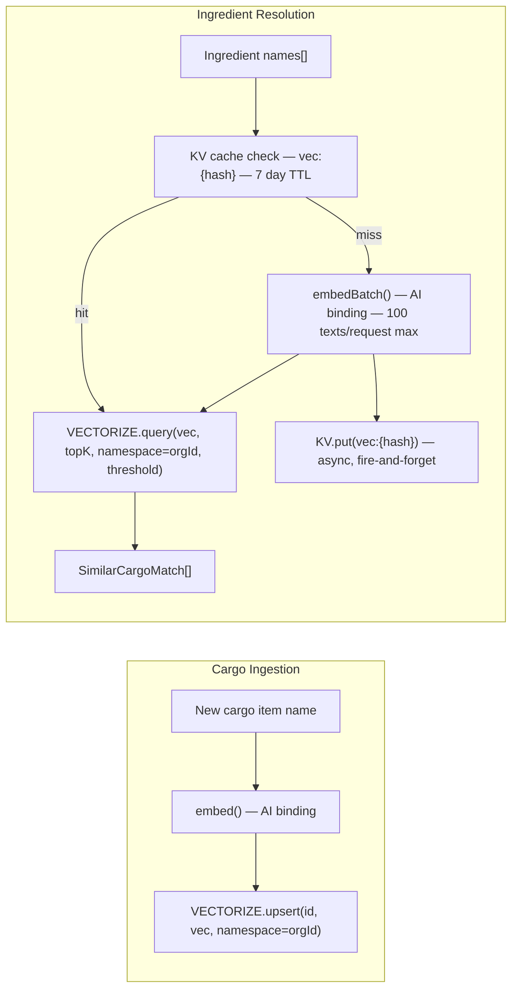

**Why cache embeddings in KV?** Ingredient names are highly stable — "chicken breast" will always embed to the same 768-dim vector. Without caching, every supply sync or meal match would re-embed the same names. The KV cache with a 7-day TTL eliminates redundant AI calls for repeat queries, which is the common case.

**Why namespaced Vectorize vectors?** The Vectorize index is shared across all organizations. Using `namespace = organizationId` ensures that a query for org A never returns results from org B, providing the same tenant isolation at the vector layer as the `WHERE organization_id = ?` clause at the SQL layer.

**Similarity thresholds** (in [`app/lib/vector.server.ts`](app/lib/vector.server.ts)):

| Context | Threshold | Reasoning |
|---------|-----------|-----------|
| `INGREDIENT_MATCH` | 0.78 | Universal threshold for supply sync and AI generation verification. Balanced for breadth. |
| `CARGO_MERGE` | 0.78 | Dedup on ingest — same threshold for consistency with matching. |
| `CARGO_DEDUCTION` | 0.80 | Cook deduction is irreversible — a tighter threshold prevents false positive subtractions. |
| MCP search | 0.60 | Agents benefit from wider recall when exploring the pantry. |

---

### 5.2 Meal Matching Engine

The matching engine (in [`app/lib/matching.server.ts`](app/lib/matching.server.ts)) determines which meals can be cooked with the current pantry contents.

**Two modes:**

- **Strict match** (`strictMatch`) — Returns only meals where every non-optional ingredient is fully covered by the pantry. `matchPercentage = 100`. Used for the "Meals Ready" hub widget.
- **Delta match** (`deltaMatch`) — Returns meals above a configurable `minMatch` percentage, sorted descending. Used for the "Meals Partial" widget and the Galley match view.

**Resolution pipeline inside `matchMeals()`:**

1. KV cache check (10s TTL, key `match:<orgId>:mode:...`) — absorbs repeated calls during page load.
2. Fetch meals with optional tag/type/domain filters + `preLimit` pre-filter.
3. Batch-fetch ingredients and tags in parallel.
4. `fetchOrgCargoIndex()` — narrow 5-column projection.
5. Phase 1: exact key lookup against normalised cargo names.
6. Phase 2: one `findSimilarCargoBatch()` call for all unresolved names.
7. Unit conversion via `sumConvertedToTarget()` — delegates to `convertIngredientAmount()`, the canonical conversion helper used by all product surfaces (matching, cook deduction, supply sync). Handles same-family and cross-family weight ↔ volume conversion via `lookupDensity()` (e.g. 500 g rice satisfies a recipe requiring 1 cup rice).
8. Apply scale factor if servings override given.
9. Write result to KV cache, return capped to `limit`.

---

### 5.3 AI Operations & Credit Costs

Credits belong to the **organization**, not the user. All members of a group draw from the same pool. Credits are deducted atomically via a SQL-level overdraft check (`UPDATE ... WHERE credits >= cost RETURNING id`) — a deduction only succeeds if the balance is sufficient. There is no race condition.

| Operation | Cost | Route | AI Service |
|-----------|------|-------|------------|
| Receipt Scan | 2 cr | `POST /api/scan` | AI Gateway → Gemini 3.5 Flash |
| Meal Generate | 2 cr | `POST /api/meals/generate` | AI Gateway → Gemini 3.5 Flash |
| URL Recipe Import | 1 cr | `POST /api/meals/import` | AI Gateway → Gemini 3.5 Flash |
| Weekly Meal Plan | 3 cr | `POST /api/meal-plans/:id/plan-week` | AI Gateway → Gemini 3.5 Flash |
| Organize Cargo | 2 cr | *(reserved — not yet implemented)* | — |

**Queue pattern (Scan, Meal Generate, Plan Week, Import URL):** All four AI features use the same queue + D1 status pattern. Producer: `withCreditGate` → enqueue → `insertQueueJobPending` → return `requestId`. Client polls `getQueueJob` until `completed` or `failed`. Consumer runs the AI and calls `updateQueueJobResult`. Credit costs unchanged; timeouts avoided.

**`withCreditGate()` pattern:** All credit-gated routes use this wrapper from `ledger.server.ts`:
1. Pre-flight `checkBalance` (cheap SELECT).
2. `deductCredits` (atomic UPDATE + ledger INSERT).
3. Execute the AI operation.
4. On any error: `addCredits` refund with matching ledger entry.

The pre-flight read is an optimistic guard — it won't stop a race condition, but it surfaces an early, friendly error for users with zero balance without burning a round-trip for the deduction. The actual deduction is atomic at the SQL level.

---

### 5.4 Queue Architecture

All AI-heavy operations use Cloudflare Queues with a central **registry** in `app/lib/ai-queue-registry.server.ts`. Adding a new queue requires: (1) create a consumer module, (2) register it in `AI_QUEUE_HANDLERS`. The worker's queue handler dispatches by queue name — no manual switch logic.

| Queue | Job Type | Consumer | AI Service |
|-------|----------|----------|------------|
| `ration-scan` | `scan` | `runScanConsumerJob` | AI Gateway → Gemini 3.5 Flash |
| `ration-meal-generate` | `meal_generate` | `runMealGenerateConsumerJob` | AI Gateway → Gemini 3.5 Flash |
| `ration-plan-week` | `plan_week` | `runPlanWeekConsumerJob` | AI Gateway → Gemini 3.5 Flash |
| `ration-import-url` | `import_url` | `runImportUrlConsumerJob` | AI Gateway → Gemini 3.5 Flash |

**Flow:** Producer → enqueue + `insertQueueJobPending(DB, requestId, jobType, orgId)` → return `requestId`. Client polls `GET /api/.../status/:requestId` which calls `getQueueJob(DB, requestId)`. Consumer runs the AI, writes `updateQueueJobResult(DB, requestId, status, result)`. D1 provides strong read-after-write consistency for status; no KV eventual consistency.

---

## 6. Database Schema

### 6.1 Entity-Relationship Diagram

The schema centres on the `organization` table. All domain data (cargo, meals, plans, supply lists) is owned by an organization, not a user directly. This is intentional — it enables group-shared pantries where any member can add/consume without each member having a personal silo.

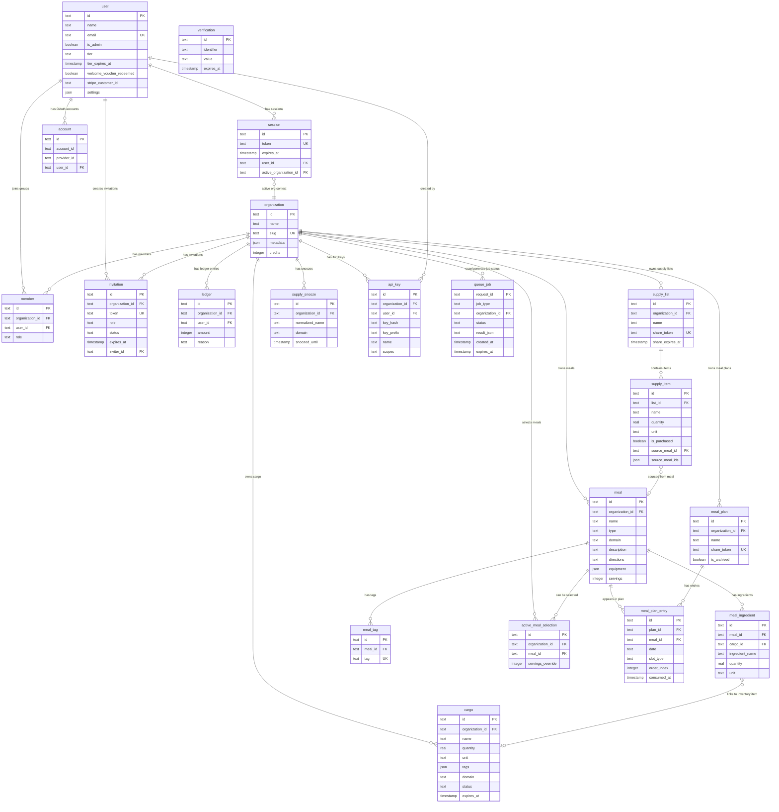

### 6.2 Table Reference

| Table | Owner | Purpose | Key Indexes |
|-------|-------|---------|-------------|
| `user` | — | Authenticated users, tier info, allergen settings, and legal acceptance metadata (`tos_accepted_at`, `tos_version`) | `email` (unique) |
| `session` | user | Active auth sessions with org context | `token` (unique) |
| `account` | user | OAuth provider links (Google, email/password) | — |
| `verification` | — | Auth verification tokens (email confirm) | `identifier` |
| `organization` | — | Groups/teams with pooled credit balance | `slug` (unique) |
| `member` | org + user | Membership join table with roles (owner/admin/member) | `(org_id, user_id)` unique |
| `invitation` | org | Shareable group invitation tokens (7-day expiry) | `token` (unique), `org_id` |
| `cargo` | org | Pantry/inventory items with quantity, unit, domain, tags | `(org_id, domain)` |
| `ledger` | org | Immutable credit transaction log (debits + credits) | `org_id`, `user_id` |
| `meal` | org | Recipes and provisions; `type` discriminates them | `(org_id, domain)`, `(org_id, type)` |
| `meal_ingredient` | meal | Ingredient list with optional soft FK to cargo | `meal_id`, `ingredient_name` |
| `meal_tag` | meal | Categorisation tags, unique per meal+tag | `(meal_id, tag)` unique |
| `active_meal_selection` | org + meal | Currently "selected" meals for supply list generation | `(org_id, meal_id)` unique |
| `supply_list` | org | Shopping/supply lists with optional share token | `org_id`, `share_token` |
| `supply_item` | supply_list | Individual items; `source_meal_ids` (JSON) tracks multiple sources | `list_id`, `(list_id, domain)` |
| `supply_snooze` | org | Items suppressed from auto-generation; keyed on `normalizedName + domain` | `(org_id, name, domain)` unique |
| `meal_plan` | org | Singleton active meal plan per org with optional share | `org_id`, `share_token` |
| `meal_plan_entry` | meal_plan | Single date+slot+meal assignment with `consumed_at` tracking | `(plan_id, date)`, `(plan_id, date, slot_type)` |
| `api_key` | org + user | Programmatic API keys (SHA-256 hashed, prefix-indexed) | `key_prefix`, `org_id` |
| `queue_job` | — | Scan and meal-generate job status for polling; D1-backed for strong consistency | `expires_at`, `(organization_id, status)` |

**D1 parameter limit:** D1 enforces a hard limit of 100 bound parameters per statement (vs. SQLite's 999). Every bulk write is chunked using constants from [`app/lib/query-utils.server.ts`](app/lib/query-utils.server.ts):

| Constant | Value | Columns | Table |
|----------|-------|---------|-------|
| `D1_MAX_INGREDIENT_ROWS_PER_STATEMENT` | 12 | 8 | `meal_ingredient` |
| `D1_MAX_TAG_ROWS_PER_STATEMENT` | 33 | 3 | `meal_tag` |
| `D1_MAX_PLAN_ENTRY_ROWS_PER_STATEMENT` | 12 | 8 | `meal_plan_entry` |

**Why `db.batch()` for multi-statement writes?** D1 is accessed over HTTP (not a local socket). Each `await db.insert(...)` is a separate HTTP round-trip. `db.batch([stmt1, stmt2, ...])` is a single round-trip regardless of statement count, and executes the statements atomically server-side. Sequential `await` loops are explicitly forbidden in the codebase for independent writes.

---

## 7. Security Architecture

### 7.1 Authentication Flow

Authentication is handled by Better Auth with the `organization` and `magicLink` plugins. Primary sign-in is via **magic link** (passwordless): users enter their email, receive a one-time link, and are authenticated on click. **Google OAuth** is available when `GOOGLE_CLIENT_ID` is configured. Unauthenticated users are redirected to `/` (root) by `requireAuth()`.

**Local development:** When `BETTER_AUTH_URL` contains `localhost`, the **Dev Login** button appears (credentials: `dev@ration.app` / `ration-dev`). This uses email/password auth enabled only in dev. Transactional emails (magic link, welcome, agent OTP, 30-day inactivity re-engagement) are skipped locally when the `EMAIL` send binding is unavailable.

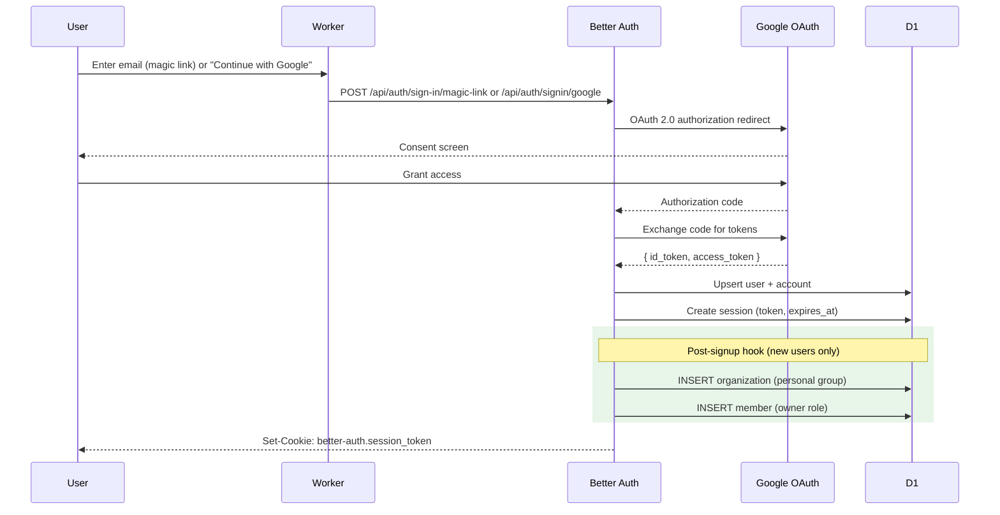

*Diagram shows Google OAuth flow. Magic link flow: user enters email → server sends link via Cloudflare Email Service → user clicks link → Better Auth verifies token → session created. New users also receive a welcome email after account creation. Users inactive for 30+ days (no Hub session, API key, or MCP activity) receive a daily cron re-engagement reminder (max 50 per run); verified human accounts only — agent stub kitchens and unverified emails are excluded.*

**Post-signup provisioning** (in [`app/lib/auth.server.ts`](app/lib/auth.server.ts)): Every new user automatically receives a personal organization with `owner` role, and legal acceptance metadata is stamped (`tosAcceptedAt`, `tosVersion`) at account creation. Failures in this hook are non-fatal — the user can manually create a group. This ensures every user always has a valid group context for queries without requiring a separate onboarding step.

---

### 7.2 Multi-Tenant Isolation (Organizations)

Ration uses an **organization-based multi-tenancy** model. Every piece of domain data is owned by an organization, and access is mediated through the `member` join table.

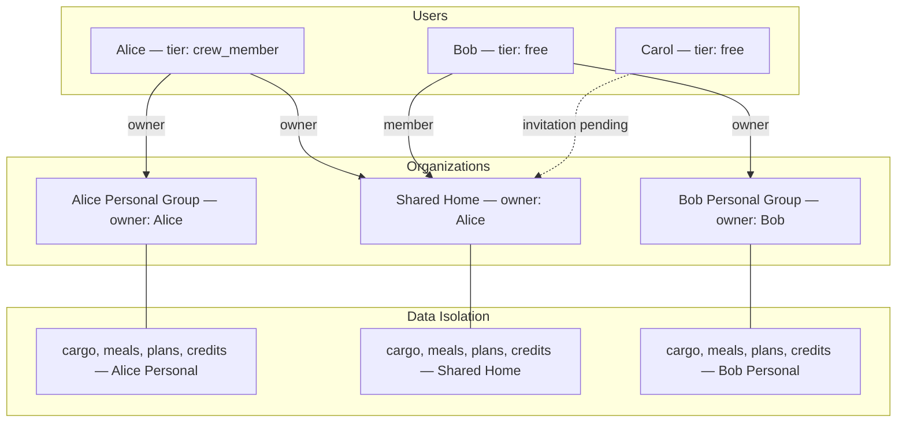

**Isolation guarantees:**

| Layer | Mechanism | Implementation |
|-------|-----------|----------------|
| **Session context** | `session.active_organization_id` | Only organizations the user is a verified `member` of can be activated. Switchable via the `GroupSwitcher` UI. |
| **Query scoping** | `WHERE organization_id = ?` | Every query in `cargo.server.ts`, `meals.server.ts`, `supply.server.ts`, etc. uses `groupId` from `requireActiveGroup()` — never from client input. |
| **Role-based access** | `member.role` (owner / admin / member) | Invitation creation requires `owner` or `admin`. Credit transfers require `owner` on the source org. |
| **Tier-based gating** | Owner's `user.tier` determines group limits | Capacity checks in `capacity.server.ts` look up the **organization owner's** tier, not the current user's. This prevents a free-tier member joining a crew member's group from being subject to free-tier limits — the group's capacity is determined by who owns and subscribes to it. |
| **Credit isolation** | `organization.credits` counter | Credits belong to the org. A user purchasing credits adds to their active org's pool; all members draw from it. |
| **Vectorize namespacing** | `namespace = organizationId` | Vector queries are scoped to the org's namespace, matching the D1 tenant isolation at the semantic layer. |
| **API key isolation** | `api_key.organization_id` | Programmatic keys are scoped to a single org. `verifyApiKey()` returns the `organizationId` which is used as the RLS anchor for all subsequent queries. |

**Account deletion and ownership transfer:** When a user deletes their account (Purge Account in settings), groups they own are handled as follows: if other members have joined, ownership auto-transfers to the first admin or first member. If the owner is the sole member (including when invitations are pending and not yet accepted), the group and all its data are permanently deleted. Owners can proactively transfer ownership to another member via the "Transfer ownership" option in group settings (Danger Zone) before deleting their account.

---

### 7.3 Route Access Control

```mermaid
flowchart TB
    Request["Incoming Request"] --> RouteMatch{"Route Match"}

    RouteMatch --> Public["Public Routes — no auth"]
    RouteMatch --> AuthRequired["Auth Required — session cookie"]
    RouteMatch --> GroupRequired["Group Required — session + active org"]
    RouteMatch --> AdminRequired["Admin Required — user.is_admin"]
    RouteMatch --> ApiKeyRequired["API Key Required — Bearer or X-Api-Key"]

    Public --> P1["/ (landing)"]
    Public --> P2["/api/auth/* (login/signup)"]
    Public --> P3["/api/webhook (Stripe — signature verified)"]
    Public --> P4["/shared/:token (supply list)"]
    Public --> P5["/shared/manifest/:token (meal plan)"]
    Public --> P6["/legal/*"]

    AuthRequired --> A1["/select-group"]
    AuthRequired --> A2["/api/groups/create"]
    AuthRequired --> A3["/api/user/purge"]

    GroupRequired --> G1["/hub/* (all dashboard pages)"]
    GroupRequired --> G2["/api/meals/*"]
    GroupRequired --> G3["/api/cargo/*"]
    GroupRequired --> G4["/api/supply-lists/*"]
    GroupRequired --> G5["/api/scan"]
    GroupRequired --> G6["/api/search"]
    GroupRequired --> G7["/api/checkout"]
    GroupRequired --> G8["/api/meal-plans/*"]

    AdminRequired --> AD1["/admin"]
    AdminRequired --> AD2["/api/admin/*"]

    ApiKeyRequired --> K1["/api/v1/inventory/export"]
    ApiKeyRequired --> K2["/api/v1/inventory/import"]
    ApiKeyRequired --> K3["/api/v1/galley/export"]
    ApiKeyRequired --> K4["/api/v1/galley/import"]
    ApiKeyRequired --> K5["/api/v1/supply/export"]
```

**Guard functions** (all in `app/lib/auth.server.ts` / `app/lib/api-key.server.ts`):

| Function | Returns | Redirects/throws on fail |
|----------|---------|--------------------------|
| `requireAuth()` | `session` (with user) | Redirect `→ /` |
| `requireActiveGroup()` | `{ session, groupId }` | Redirect `→ /select-group` |
| `requireAdmin()` | `user` (with isAdmin) | Redirect `→ /` |
| `requireApiKey()` | `{ organizationId, scopes }` | 401 / 403 JSON response |

**SEO & Discovery** — Public indexable pages (`/`, `/about`, `/legal/*`, `/blog`, `/blog/:slug`, `/tools/*`) include canonical URLs, Open Graph and Twitter Card meta tags, and JSON-LD structured data via [`app/lib/structured-data.ts`](app/lib/structured-data.ts) (`Organization`, `WebSite`, `SoftwareApplication`, `FAQPage`, `BreadcrumbList`, `Blog`, `BlogPosting`, `WebApplication`, `WebPage`, `Person`).

The discovery surface comprises:

- [`/robots.txt`](app/routes/robots-txt.ts) — explicit `Allow` rules for major AI crawlers (GPTBot, ClaudeBot, PerplexityBot, Google-Extended, etc.). Cloudflare's managed AI bot block must also be set to **Allow** for these bots in the dashboard; see [`docs/seo/ai-crawlers.md`](docs/seo/ai-crawlers.md).
- [`/sitemap.xml`](app/routes/sitemap.xml.ts) — every public route plus all blog posts with `<lastmod>` derived from each post's `dateModified` (see [`app/lib/sitemap.server.ts`](app/lib/sitemap.server.ts) for the canonical URL list).
- [`/llms.txt`](app/routes/llms-txt.ts) and [`/llms-full.txt`](app/routes/llms-full-txt.ts) — markdown index and full-content companion per the [llmstxt.org](https://llmstxt.org) spec, used by AI answer engines for grounding.
- [`/blog/rss.xml`](app/routes/blog.rss.xml.ts) — RSS 2.0 feed of all blog posts. Surfaced from the blog index head as `<link rel="alternate" type="application/rss+xml">`.

Blog frontmatter should include `title`, `description`, `date`, `dateModified`, `authorName`, optional `authorUrl`, optional `image` (1200x630 PNG/WebP under `public/static/og/<slug>.png`; see [`public/static/og/README.md`](public/static/og/README.md)), and optional `tags` so new posts automatically inherit sitemap, social, structured-data, RSS, and llms-full.txt coverage. Hub, API, admin, auth, and shared routes are disallowed from indexing for all crawlers (including AI).

Manual operator follow-ups (Search Console, Bing Webmaster, IndexNow, OG image generation) are tracked in [`docs/seo/checklist.md`](docs/seo/checklist.md).

Published blog posts include MCP onboarding guides such as [Your Kitchen Has an API Now](/blog/mcp-kitchen-assistant) (OAuth-first) and [Agent-First MCP Onboarding](/blog/agent-first-mcp-onboarding) (autonomous self-registration + claim-when-ready).

---

### 7.4 Defence in Depth Layers

```mermaid
flowchart LR
    subgraph L1["Layer 1 — Edge"]
        SSL["SSL/TLS Termination"]
        CSP["Content Security Policy"]
        HSTS["Strict-Transport-Security — 1 year"]
        XFO["X-Frame-Options: DENY"]
        XCTO["X-Content-Type-Options: nosniff"]
    end

    subgraph L2["Layer 2 — Authentication"]
        SessionAuth["Session Cookie Verification"]
        OAuthFlow["Google OAuth 2.0"]
        ApiKeyAuth["SHA-256 Hashed API Keys"]
        TimingAttack["Constant-time Comparison"]
    end

    subgraph L3["Layer 3 — Authorization"]
        OrgMembership["Organization Membership Check"]
        RoleCheck["Role-based Gate — owner/admin/member"]
        TierGate["Tier-based Feature Gating"]
        VectorNS["Vectorize Namespace Scoping"]
    end

    subgraph L4["Layer 4 — Rate Limiting"]
        DistributedRL["KV-backed Sliding Window — global"]
        PerUserLimits["Per-user limits on authenticated endpoints"]
        PerIPLimits["Per-IP limits on public endpoints"]
        TwoTierRL["L1 in-memory + L2 KV — fail-open on KV error"]
    end

    subgraph L5["Layer 5 — Data Integrity"]
        AtomicTx["db.batch() — atomic multi-statement writes"]
        IdempotencyKV["KV idempotency keys — Stripe webhooks"]
        ZodValidation["Zod schema validation at API boundary"]
        CreditGuard["SQL-level overdraft prevention — RETURNING id guard"]
        InjectionFilter["INJECTION_PATTERNS — prompt injection defence"]
        SSRFGuard["HTTPS-only URL validation — recipe import"]
    end

    L1 --> L2 --> L3 --> L4 --> L5
```

**HTTP security headers** (set in [`app/root.tsx`](app/root.tsx)):
- `Content-Security-Policy` — Restrictive policy allowing only self, Stripe JS (`js.stripe.com`), and Google Fonts
- `Strict-Transport-Security: max-age=31536000; includeSubDomains`
- `X-Frame-Options: DENY` — Prevents clickjacking
- `X-Content-Type-Options: nosniff`
- `Referrer-Policy: strict-origin-when-cross-origin`

**API key security** (in [`app/lib/api-key.server.ts`](app/lib/api-key.server.ts)):
- Format: `rtn_live_<32 hex chars>`. First 17 chars used as the lookup prefix (avoids full-table scans on lookup).
- Only the SHA-256 hash is stored in D1; the raw key is shown to the user exactly once.
- Lookups use `secureCompare()` — constant-time XOR comparison — to prevent timing attacks that could leak key validity via response latency differences.

**Rate limiter architecture** (in [`app/lib/rate-limiter.server.ts`](app/lib/rate-limiter.server.ts)):
- **L1 (in-memory `LOCAL_CACHE`):** Per-isolate, 5s TTL. Absorbs burst traffic within the same isolate with zero KV reads.
- **L2 (Cloudflare KV):** Global, eventually consistent. `cacheTtl: 60` at the PoP reduces read latency.
- On KV failure: **fails open** with a `log.warn`. A KV outage will not cause a service outage — it will temporarily disable rate limiting.

---

### 7.5 Transitive dependency overrides (supply chain)

[`package.json`](package.json) defines Bun **`overrides`** to pin patched versions of transitive packages that would otherwise stay vulnerable through optional peer chains (for example Prisma-related tooling pulled via `drizzle-orm`’s optional `@prisma/client` peer, the MCP SDK’s Express stack, or a nested `vite` copy under `vite-node`). After major dependency upgrades, run **`bun audit`** and trim overrides when upstream packages adopt the same floor.

---

## 8. Tier & Capacity System

The tier system controls resource limits per organization. Limits are determined by the **organization owner's** tier — not the current viewer's. This design is deliberate: if a free-tier user joins a crew member's household group, that group's capacity should reflect the crew member's subscription, not the joining member's tier.

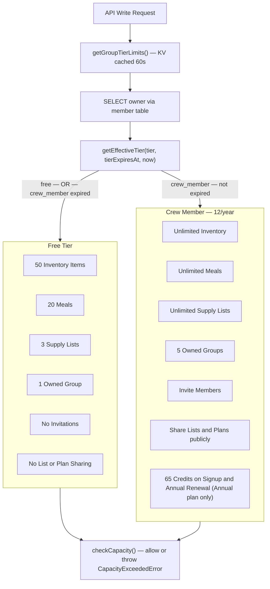

**Tier enforcement mechanics** (in [`app/lib/capacity.server.ts`](app/lib/capacity.server.ts)):

1. `getGroupTierLimits()` checks KV for a cached tier result (key `tier:<orgId>`, 60s TTL). Cache miss → DB query for the org owner's `user.tier` + `tierExpiresAt`.
2. `getEffectiveTier()` checks expiry: a `crew_member` with an expired `tierExpiresAt` is treated as `free`.
3. `checkCapacity()` compares the current count against the tier limit. Throws `CapacityExceededError` with `resource`, `current`, `limit`, `tier`, `isExpired`, and `canAdd` fields — all surfaced in the `UpgradePrompt` component.
4. After a Stripe webhook processes a subscription, `invalidateTierCache()` deletes the KV key so the next request picks up the new tier immediately.

**Tier-gated features beyond capacity limits:**
- `canInviteMembers` — creating group invitations requires Crew Member
- `canShareGroceryLists` — supply list and meal plan share tokens require Crew Member

---

## 9. Behaviour Under Load & At Scale

### 9.1 Scalability Architecture

Ration runs entirely on Cloudflare's serverless edge. There are no fixed servers, no auto-scaling groups, and no cold-start containers. Each request is handled by a V8 isolate that is reused across requests (warm) within the same PoP.

```mermaid
flowchart TB
    subgraph Users["Concurrent Users — Global"]
        U1["User A — Dublin"]
        U2["User B — London"]
        U3["User C — New York"]
        U4["User N — Tokyo"]
    end

    subgraph Edge["Cloudflare Edge — 330+ PoPs"]
        PoP1["Dublin PoP"]
        PoP2["London PoP"]
        PoP3["New York PoP"]
        PoP4["Tokyo PoP"]
    end

    subgraph SmartPlace["Smart Placement"]
        SP["Isolate relocated to D1 region — ~5ms to D1"]
    end

    subgraph Storage["Central Storage"]
        D1Main[("D1 Primary — single region writer")]
        KVGlobal[("KV — globally replicated — eventual consistency")]
        VectorizeIdx[("Vectorize — distributed query layer")]
    end

    U1 --> PoP1
    U2 --> PoP2
    U3 --> PoP3
    U4 --> PoP4

    PoP1 --> SP
    PoP2 --> SP
    PoP3 --> SP
    PoP4 --> SP

    SP -->|"~5ms"| D1Main
    SP -->|"~10-50ms"| KVGlobal
    SP -->|"~20-50ms"| VectorizeIdx
```

**How each service behaves under load:**

| Service | Scaling Model | Bottleneck | Mitigation |
|---------|--------------|------------|------------|
| **Worker** | Auto-scales to thousands of isolates. V8 isolate reuse — no cold starts within a PoP. | CPU time per request. | Heavy AI work offloaded to Queues. Module-level auth instance caching. |
| **Queues** | Batch processing; consumer invokes per message. | AI vision/LLM latency (5–30s). | Scan and meal-generate offloaded; no Worker timeout. `queue_job` TTL cleanup via CRON. |
| **D1 (SQLite)** | Single-region writer with read replicas. Drizzle batch for atomicity. | Write throughput to single leader. | Compound indexes on hot paths. `WHERE org_id = ?` narrows scan windows. Smart Placement co-locates Worker with D1. |
| **KV** | Globally replicated reads (eventually consistent). Low-latency reads from every PoP. | 1,000 writes/sec per namespace; 60s eventual consistency on reads. | Rate limit windows use TTL-expiring keys (self-cleaning). Fails open on KV errors. |
| **Workers AI** | Metered per token, Workers-native. | Embedding throughput (100 texts per batch). | KV embedding cache eliminates repeat calls. Batch embedding for all ingredients in a single AI call. |
| **Vectorize** | Distributed ANN index. Namespaced per org. | Parallel query concurrency limits. | All ingredient names for a single resolution are batched into one `findSimilarCargoBatch` call with `Promise.all` per name. |
| **AI Gateway** | Managed proxy with queuing, retry, caching. | Upstream Google AI Studio rate limits. | Credit system prevents unbounded usage. Per-user rate limits on all AI endpoints. Automatic refunds on failure. |
| **R2** | S3-compatible, globally distributed. | Not a hot-path service. | Used only for exports and scan image storage. |
| **Stripe** | Stripe's infrastructure (99.999% SLA). | Webhook delivery latency. | KV idempotency ensures exactly-once processing. Timestamp validation rejects stale replays. |

---

### 9.2 Rate Limiting Matrix

All rate limits use a **sliding window counter** algorithm implemented in [`app/lib/rate-limiter.server.ts`](app/lib/rate-limiter.server.ts). Limits are enforced globally via KV (not per-isolate). The L1 in-memory layer absorbs burst traffic within the same isolate within the same 5s window before touching KV.

| Endpoint | Identifier | Window | Max | Purpose |
|----------|------------|--------|-----|---------|
| `POST /api/scan` | userId | 60s | 20 | AI cost control |
| `POST /api/meals/generate` | userId | 60s | 10 | AI cost control |
| `POST /api/meals/import` | userId | 60s | 10 | AI cost control |
| `POST /api/meal-plans/:id/plan-week` | userId | 60s | 5 | AI cost control (most expensive op) |
| `GET /api/search` | userId | 10s | 30 | Prevent D1 abuse |
| `POST /api/checkout` | userId | 60s | 10 | Payment spam prevention |
| `POST /api/groups/create` | userId | 60s | 5 | Spam prevention |
| `POST /api/groups/invitations/create` | userId | 60s | 10 | Invitation spam |
| `POST /api/groups/ownership/transfer` | userId | 60s | 5 | Ownership transfer abuse |
| `POST /api/groups/credits/transfer` | userId | 60s | 10 | Transfer abuse |
| `POST /api/cargo/batch` | userId | 60s | 20 | Bulk write protection |
| `POST /api/user/purge` | userId | 300s | 1 | Destructive action guard |
| `POST /api/auth/*` | IP | 60s | 20 | Brute force protection |
| `GET /shared/:token` | IP | 60s | 60 | Public page abuse |
| `PATCH /api/shared/:token/items/:itemId` | IP | 60s | 30 | Public toggle abuse |
| `GET /api/v1/*/export` | orgId | 60s | 30 | API export throttle |
| `POST /api/v1/*/import` | orgId | 60s | 20 | API import throttle |
| Inventory mutations | userId | 60s | 60 | Write storm protection |
| Meal mutations | userId | 60s | 30 | Write storm protection |
| Supply list mutations | userId | 60s | 60 | Write storm protection (Hub Supply → Update list, REST) |
| `GET /api/mobile/v1/hub` | userId | 60s | 60 | `hub_read` — 10-way parallel fan-out per call; same tier class as `cargo_list`/`meal_list` |
| `GET /api/mobile/v1/supply` | userId | 60s | 60 | `supply_read` — read-only, same tier class as `cargo_list` |
| MCP `search_ingredients`, `match_meals` | orgId | 60s | 20 | AI cost (mcp_search) |
| MCP read tools (list_inventory, get_supply_list, get_meal_plan, list_meals, get_expiring_items, get_user_preferences, get_context, inventory_import_schema, preview_inventory_import) | orgId | 60s | 30 | D1 read throttle (mcp_list) |
| MCP write tools | orgId | 60s | 15 | Mutation throttle (mcp_write) |
| MCP write tools, per-credential | apiKeyId / OAuth client | 60s | 15 | Compromised-key cap (`mcp_write_per_key`; includes `mcp_supply_sync`) |
| MCP `sync_supply_from_selected_meals` | orgId | 60s | 8 | Heavy sync (D1 + Vectorize); separate from mcp_write |
| MCP delegated read (Fin `actor_token`) | subjectUserId | 60s | 20 | Per end-user cap (mcp_delegated_read) |
| MCP delegated write (Fin `actor_token`) | subjectUserId | 60s | 6 | Per end-user cap (mcp_delegated_write) |
| `POST /api/automation/trigger` | userId | 60s | 10 | Automation abuse |

---

## 10. MCP Server

A separate Cloudflare Worker (`ration-mcp`) exposes the Ration pantry to AI agents via the **Model Context Protocol (MCP)**. It runs at `mcp.ration.mayutic.com` and shares all storage bindings with the main Worker.

**Authentication:** The MCP Worker accepts **OAuth 2.1 bearer tokens** (delegated user consent via Better Auth on the app domain) or **organization API keys** (`rtn_live_*`). OAuth tokens are short-lived JWTs bound to a single household (`https://ration.mayutic.com/org` claim) and granular `mcp:*` scopes; the resource server validates signatures via JWKS (cached in KV for **10 minutes**, with a one-shot refetch on signing-key rotation), then re-checks org membership **and an active consent grant** on every request — so revoking a grant takes effect immediately rather than waiting out the token TTL. API keys use `authenticateMcp()` → `verifyApiKey()` with legacy `mcp` or fine-grained `mcp:*` scopes. Set `MCP_OAUTH_ENABLED=false` to disable OAuth and require API keys only.

**Fin delegated access:** Intercom Fin uses one workspace-level OAuth grant (`mcp:delegate` on an allowlisted client). End-user pantry data requires a signed **`actor_token`** (delegation JWT shipped as `ration_mcp_delegation` in the Intercom Messenger JWT). Secrets: `FIN_MCP_DELEGATION_SECRET` (both workers), `FIN_DELEGATION_CLIENT_IDS` (MCP worker). See [plans/fin-mcp-delegation-runbook.md](plans/fin-mcp-delegation-runbook.md).

**OAuth discovery (MCP 2025-06-18):** `GET /.well-known/oauth-protected-resource` on the MCP host advertises `authorization_servers`; clients complete browser login at `/oauth/sign-in`, household selection at `/oauth/select-org` (`oauth2Continue`), then consent at `/oauth/consent`. After sign-in, the browser resumes via native `/api/auth/oauth2/authorize`. Better Auth (`@better-auth/oauth-provider` 1.6.16+) holds authorization state via the signed `oauth_query`, session, and `ba_pl` postLogin marker; Ration adds a short-lived `ration_oauth_org_selected` cookie so multi-household users advance past the picker after Continue (stripped on fresh authorize). OIDC-compatible discovery aliases live at `/.well-known/openid-configuration` (+ `/api/auth` issuer-path variant). Dynamic client registration defaults to all granular `mcp:*` scopes except `mcp:delegate` (Fin only); public `scopes_supported` in discovery omits `mcp:delegate` so DCR clients (e.g. Warp) do not request a blocked scope; consent pre-checks read, with write scopes optional. Revoke grants in Hub → Settings → Developer → MCP. See [plans/oauth-flow-contract.md](plans/oauth-flow-contract.md).

**Agent-first onboarding (v1.3.8):** Agents can self-register without human signup via `POST /api/agent/auth` (`{ "type": "anonymous" }`), receiving a **full-write** pre-claim API key (`AGENT_API_KEY_SCOPES`) and a human claim URL. Tier 1 claim verifies email via OTP plus mandatory ToS acceptance (`/api/agent/auth/claim` + `/claim/complete`); claim transfers ownership (scopes unchanged) and merges stub org data when the email matches an existing user. Claim recovery: Option B slides `claimTokenExpiresAt` on each API/MCP auth; Option A reissues via `POST /api/agent/auth/claim/reissue` with the agent API key. Unclaimed idle kitchens purge after 180 days (cron). Discovery: [`/auth.md`](/auth.md) (retention table + recovery), WorkOS/isitagentready `agent_auth` block (`skill`, `register_uri`, `claim_uri`, `reissue_uri`, …), enriched app-domain PRM. Public connect landing: [`/connect`](/connect); claim UI: [`/connect/claim`](/connect/claim). Blog walkthrough: [/blog/agent-first-mcp-onboarding](/blog/agent-first-mcp-onboarding). Contract: [plans/agent-onboarding-contract.md](plans/agent-onboarding-contract.md).

**Why a new server instance per request?** MCP server state must be strictly isolated per request to prevent cross-request data leakage (analogous to the CVE consideration for stateful servers). `createMcpHandler` creates a fresh `McpServer` on every fetch.

**Code layout:** [`workers/mcp.ts`](workers/mcp.ts) is the Worker entry. Shared logic lives under [`app/lib/mcp/`](app/lib/mcp/): [`tool-runtime.ts`](app/lib/mcp/tool-runtime.ts) (`makeTool`, `registerMcpTool`, rate limits), domain modules in [`tools/`](app/lib/mcp/tools/) (`read`, `inventory`, `galley`, `manifest`, `supply`, `preferences`), [`transport.server.ts`](app/lib/mcp/transport.server.ts) (body/batch limits), and [`worker-response.server.ts`](app/lib/mcp/worker-response.server.ts) (500 sanitization, CORS). Org membership checks are centralized in [`org-membership.server.ts`](app/lib/org-membership.server.ts).

**Version:** MCP server identity (`McpServer` metadata, `get_context.versions.mcp`, server card) uses `MCP_SERVER_VERSION` from [`app/lib/version.ts`](app/lib/version.ts), which tracks `package.json` — bump both together on every release.

**Transport hardening:** POST bodies are capped at **4 MB**; JSON-RPC batches are capped at **10** requests (enforced even when `Content-Length` is absent). HTTP rate limiting keys on **`CF-Connecting-IP`** only (not spoofable `X-Forwarded-For`).

**Tool envelope:** Every tool returns one `text` content item containing a uniform JSON envelope. Success: `{ ok: true, tool, data, warnings?, meta? }`. Error: `{ ok: false, tool, error: { code, message, details?, retryAfter? } }`. Error codes: `rate_limited`, `invalid_input`, `not_found`, `unauthorized`, `insufficient_scope`, `capacity_exceeded`, `conflict`, `idempotency_replay`, `internal_error`, `insufficient_cargo`. List tools support cursor pagination via `args.cursor` and `meta.nextCursor`.

**Audit logging:** Every mutating tool call emits a structured `mcp_audit` log line with **redacted** identifiers (`organizationId`, `userId`, `apiKeyId`, `keyPrefix`, delegation subjects), plus `tool`, `outcome`, `durationMs`, and optional `errorCode` — for security review without logging raw IDs.

**Available tools (grouped by domain):**

| Tool | Type | Scope | Description | Rate Category |
|------|------|-------|-------------|---------------|
| `search_ingredients` | Read | `mcp:read` | Semantic vector search against the org's cargo (Vectorize, threshold 0.60) | mcp_search (20/min) |
| `list_inventory` | Read | `mcp:read` | Cursor-paginated cargo list (default 100, max 200), `meta.nextCursor` for next page | mcp_list (30/min) |
| `get_cargo_item` | Read | `mcp:read` | Full single-item view (tags, expiresAt, customFields) | mcp_list (30/min) |
| `get_supply_list` | Read | `mcp:read` | Active supply list with item names, quantities, units, and source meal names | mcp_list (30/min) |
| `get_meal_plan` | Read | `mcp:read` | Weekly meal plan entries for a date range (default: next 7 days) | mcp_list (30/min) |
| `list_meals` | Read | `mcp:read` | Cursor-paginated recipes; pass `includeIngredients:false` to skip fan-out | mcp_list (30/min) |
| `match_meals` | Read | `mcp:read` | Meals cookable from pantry (strict or delta mode) | mcp_search (20/min) |
| `get_expiring_items` | Read | `mcp:read` | Items expiring within a given number of days (default 7) | mcp_list (30/min) |
| `get_user_preferences` | Read | `mcp:read` | Allergens, expiration alert days, theme, default unit mode | mcp_list (30/min) |
| `get_context` | Read | `mcp:read` | Returns org/key context, onboarding state, kitchen tier/usage/credits/lastActivityAt, capabilities, and suggested next actions | mcp_list (30/min) |
| `inventory_import_schema` | Read | `mcp:read` | Returns the JSON shape `apply_inventory_import` expects | mcp_list (30/min) |
| `preview_inventory_import` | Write | `mcp:inventory:write` | Validates parsed receipt items, returns `previewToken` (10-min KV TTL) | mcp_write (15/min) |
| `apply_inventory_import` | Write | `mcp:inventory:write` | Applies a preview; idempotent via `idempotencyKey` (24h KV TTL) | mcp_write (15/min) |
| `import_inventory_csv` | Write | `mcp:inventory:write` | Parse a CSV string and apply directly | mcp_write (15/min) |
| `add_cargo_item` | Write | `mcp:inventory:write` | Add pantry stock (skips embedding generation, no credit cost) | mcp_write (15/min) |
| `update_cargo_item` | Write | `mcp:inventory:write` | Update pantry item (name, quantity, unit, expiry, domain, tags) | mcp_write (15/min) |
| `remove_cargo_item` | Write | `mcp:inventory:write` | Remove a pantry item (requires `confirm: true`) | mcp_write (15/min) |
| `create_meal` | Write | `mcp:galley:write` | Create a new Galley recipe (structured data) | mcp_write (15/min) |
| `update_meal` | Write | `mcp:galley:write` | Update any aspect of a Galley recipe | mcp_write (15/min) |
| `delete_meal` | Write | `mcp:galley:write` | Delete a recipe (requires `confirm: true`) | mcp_write (15/min) |
| `consume_meal` | Write | `mcp:galley:write` + `mcp:inventory:write` | Cook a meal and deduct ingredients | mcp_write (15/min) |
| `toggle_meal_active` | Write | `mcp:galley:write` | Mark a meal active/inactive in the current selection | mcp_write (15/min) |
| `clear_active_meals` | Write | `mcp:galley:write` | Clear all active meal selections (requires `confirm: true`) | mcp_write (15/min) |
| `add_meal_plan_entry` | Write | `mcp:manifest:write` | Schedule a meal on a date/slot | mcp_write (15/min) |
| `bulk_add_meal_plan_entries` | Write | `mcp:manifest:write` | Add multiple meal plan entries in one call (idempotent) | mcp_write (15/min) |
| `update_meal_plan_entry` | Write | `mcp:manifest:write` | Patch date/slot/servings/notes/order; cannot edit consumed | mcp_write (15/min) |
| `remove_meal_plan_entry` | Write | `mcp:manifest:write` | Remove a meal plan entry by id | mcp_write (15/min) |
| `add_supply_item` | Write | `mcp:supply:write` | Add item to the active supply/shopping list | mcp_write (15/min) |
| `update_supply_item` | Write | `mcp:supply:write` | Update a supply list item (name, quantity, unit) | mcp_write (15/min) |
| `remove_supply_item` | Write | `mcp:supply:write` | Remove item from the supply list | mcp_write (15/min) |
| `mark_supply_purchased` | Write | `mcp:supply:write` | Mark a supply item as purchased or unpurchased | mcp_write (15/min) |
| `sync_supply_from_selected_meals` | Write | `mcp:supply:write` | Rebuild supply from manifest + Galley selections | mcp_supply_sync (8/min) |
| `complete_supply_list` | Write | `mcp:supply:write` | Archive the current list and start a fresh one | mcp_write (15/min) |
| `update_user_preferences` | Write | `mcp:preferences:write` | Patch allergens, expiration alert days, theme | mcp_write (15/min) |

**Rate limits:** Read tools use `mcp_list` (30/min) or `mcp_search` (20/min). Write tools use `mcp_write` (15/min), except `sync_supply_from_selected_meals` which uses `mcp_supply_sync` (8/min) because it is heavier (D1 + Vectorize). A separate `mcp_write_per_key` (15/min per API key or OAuth client) caps **all mutation categories** including `mcp_supply_sync` from any single compromised credential. Writes do not consume **AI credits**. Hub Supply → Update list uses `grocery_mutation` (60/min per user); MCP sync is org-scoped and separate. Bulk recipe import remains `POST /api/v1/galley/import` (galley scope).

**Tests:** MCP security and behavior are covered by unit tests under `app/lib/mcp/__tests__/` (worker fetch, transport, scopes, auth, OAuth RS, delegation, tools). Run `bun run test:unit`.

**MCP resources & prompts:** The server also publishes static resources (`ration://resources/units`, `domains`, `inventory_import_schema`, `capabilities`, `connection_guide`) and prompts (`parse_receipt`, `plan_week`) so agents can fetch canonical reference data and instruction templates without scraping documentation.

**No-credit boundary:** AI features that would charge credits (receipt scan, AI meal generation, AI plan week, URL recipe import) are **not** exposed as MCP tools. The agent's own LLM does any parsing locally, and the deterministic data path is the only thing that touches Ration. Cargo writes via MCP set `skipVectorPhase: true`, so adding pantry items costs zero credits. The `get_credit_balance` tool was intentionally removed.

**Integration example (OAuth — recommended):**

Paste the MCP URL into Cursor, Claude Desktop, ChatGPT desktop, or any client with OAuth 2.1 discovery. No config snippet required — the client discovers auth via the MCP server card and protected-resource metadata:

```
https://mcp.ration.mayutic.com/mcp
```

Complete browser sign-in, select your household, and approve scopes. Manage or revoke grants in **Hub → Settings → Developer → MCP**.

**Integration example (Advanced — API key, Cursor `~/.cursor/mcp.json`):**

```json
{
  "mcpServers": {
    "ration": {
      "url": "https://mcp.ration.mayutic.com/mcp",
      "headers": { "Authorization": "Bearer rtn_live_<your-key>" }
    }
  }
}
```

**Integration example (Advanced — mcp-remote bridge):**

```json
{
  "mcpServers": {
    "ration": {
      "command": "npx",
      "args": [
        "mcp-remote",
        "https://mcp.ration.mayutic.com/mcp",
        "--header",
        "Authorization:${RATION_AUTH_HEADER}"
      ],
      "env": {
        "RATION_AUTH_HEADER": "Bearer rtn_live_<your-key>"
      }
    }
  }
}
```

Only `/mcp` requires authentication; discovery endpoints under `/.well-known/...` are intentionally public.

**Deploy (MCP OAuth):** Deploy the main `ration` worker first, then `ration-mcp`. After deploy, users with stuck grants should revoke in Developer → MCP and reconnect from the MCP client.

**Troubleshooting MCP connections:**

- **Browser shows "No authorization code received":** The MCP client callback opened without `?code=` — usually **Deny** was clicked, the flow expired (~10 minutes), or a stale browser tab was reused. Remove and re-add the MCP server in Cursor, then complete **sign-in → select household → Authorize** in one fresh tab. Prefer native URL config (`url` only) over `mcp-remote` when Cursor supports it.
- **OAuth authorization failed / reconnect loop:** Revoke the grant in Hub → Settings → Developer → MCP, remove and re-add the MCP server in your client, then complete **sign-in → select household → authorize** in a single browser tab within ~10 minutes. Ensure the client supports OAuth 2.1 / protected-resource discovery (`oauth2` on the server card).
- **Observability:** Production Worker logs emit structured `oauth_flow` events (`step`, `outcome`, `error_code`, `correlation_id`) and MCP RS `mcp_oauth_verify_failed` events — no tokens or `oauth_query` payloads.
- **ServerError / Connection closed (API key):** Ensure `Authorization` is exactly `Bearer ` + your full key (e.g. `Bearer rtn_live_xxxxx`).
- **Wrong key format:** The env var must be exactly `Bearer ` + your key. Do not pass the key alone.
- **Debug logging:** Add `--debug` to mcp-remote args; logs are written to `~/.mcp-auth/{server_hash}_debug.log`.

**Agent discovery endpoints:** The main Worker publishes RFC-style discovery surfaces so AI agents can find the REST API, MCP server, auth metadata, and markdown content without scraping the HTML UI.

| Path | Content Type | Purpose |
|------|--------------|---------|
| `/.well-known/api-catalog` | `application/linkset+json` | RFC 9727 API catalog with REST and MCP anchors. |
| `/api/openapi.json` | `application/vnd.oai.openapi+json` | OpenAPI 3.1 for agent auth, REST v1 import/export (Zod-derived JSON Schema). |
| `/.well-known/oauth-protected-resource` | `application/json` | MCP host: OAuth protected-resource metadata with authorization servers and `mcp:*` scopes. App domain metadata documents API-key auth for REST. |
| `/.well-known/oauth-authorization-server` | `application/json` | Better Auth OAuth 2.1 authorization-server metadata (issuer includes `/api/auth`). |
| `/.well-known/openid-configuration` | `application/json` | OIDC-compatible alias of the authorization-server metadata. |
| `/.well-known/mcp/server-card.json` | `application/json` | MCP server card with transport (auth: `oauth2`) and tool capability groups. |
| `/.well-known/agent-skills/index.json` | `application/json` | Agent skills discovery index with SHA-256 digests. |
| `/.well-known/agent-skills/:skill/SKILL.md` | `text/markdown` | Individual agent skill instructions. |
| `/auth.md` | `text/markdown` | WorkOS/isitagentready agent registration discovery (Tier 0 anonymous + Tier 1 claim). H1 contains `auth.md`. |
| `/` and `/docs/api` with `Accept: text/markdown` | `text/markdown` | Markdown versions of the splash page and API docs for agents. |

The OAuth authorization-server metadata at `/.well-known/oauth-authorization-server` merges an **`agent_auth`** block (`skill`, `register_uri`, `claim_uri`, `identity_types_supported`, `anonymous.credential_types_supported`) alongside standard RFC 8414 fields. App-domain PRM links to `/auth.md` via `agent_auth`.

**DNS-AID (DNS discovery):** Production publishes [DNS for AI Discovery](https://datatracker.ietf.org/doc/html/draft-mozleywilliams-dnsop-dnsaid) HTTPS records in the **`mayutic.com`** Cloudflare zone (authoritative DNS). DNSSEC is enabled in Cloudflare with the DS record at the AWS registrar. Records: `_index._agents.ration.mayutic.com` → `ration.mayutic.com`, `_mcp._agents.ration.mayutic.com` → `mcp.ration.mayutic.com` (priority `1`, `alpn="h2,http/1.1"`, port `443`). Verify with `dig -t TYPE65 _mcp._agents.ration.mayutic.com @1.1.1.1 +dnssec`. HTTP discovery (Link headers, api-catalog, MCP card) remains primary; DNS-AID complements it for validating resolvers.

The MCP server now supports OAuth 2.1, so Better Auth publishes real authorization-server metadata at `/.well-known/oauth-authorization-server` (issuer `https://<app-domain>/api/auth`, including the `/api/auth` basePath). The issuer identifier embedded in the JWT `iss` claim therefore also includes `/api/auth`; the MCP resource server must verify tokens against that exact issuer (not the bare origin) while fetching JWKS from `<issuer>/jwks`. The public REST API continues to authenticate with Ration API keys.

---

## 11. Public REST API (v1)

Ration exposes a programmatic REST API for external integrations, authenticated with API keys. Keys are created and managed at `/hub/settings` and are scoped to specific capabilities.

**Authentication:** Include the key as either `Authorization: Bearer rtn_live_...` or `X-Api-Key: rtn_live_...`. All v1 endpoints enforce scope requirements and per-org rate limits.

**Key scopes:**

| Scope | Grants access to |
|-------|-----------------|
| `inventory` | `GET /api/v1/inventory/export`, `POST /api/v1/inventory/import` |
| `galley` | `GET /api/v1/galley/export`, `POST /api/v1/galley/import` |
| `supply` | `GET /api/v1/supply/export` |
| `mcp` | All MCP Worker tools (legacy/full access) |
| `mcp:read` | All MCP read tools (no mutation) |
| `mcp:inventory:write` | MCP cargo writes + receipt import |
| `mcp:galley:write` | MCP recipe and meal-selection writes |
| `mcp:manifest:write` | MCP meal-plan writes |
| `mcp:supply:write` | MCP supply list writes |
| `mcp:preferences:write` | MCP `update_user_preferences` |

**Endpoints:**

| Method | Path | Scope | Description |
|--------|------|-------|-------------|
| `GET` | `/api/v1/inventory/export` | `inventory` | Export all cargo as CSV |
| `POST` | `/api/v1/inventory/import` | `inventory` | Bulk import cargo from CSV body (max 500 rows, ≤1MB) |
| `GET` | `/api/v1/galley/export` | `galley` | Export full recipe library as JSON (`GalleyManifestSchema`) |
| `POST` | `/api/v1/galley/import` | `galley` | Import recipes from JSON manifest (≤1MB) |
| `GET` | `/api/v1/supply/export` | `supply` | Export active supply list as CSV |

**Key security model:** Keys use the format `rtn_live_<32 hex chars>`. Only the SHA-256 hash is stored in D1. The raw key is shown exactly once at creation. Lookups use a prefix index (first 17 chars) then constant-time comparison. On successful use, `lastUsedAt` is updated via `ctx.waitUntil` (non-blocking — does not add latency to the response).

### 11.1 Mobile REST API (v1)

Bearer-authenticated REST surface for the **iOS app** at `/api/mobile/v1/*`. Web hub routes (`/api/*` with cookies) are unchanged.

**Authentication:** `Authorization: Bearer <access_jwt>`. Obtain tokens via a **PKCE-protected** magic link: the app generates a `code_verifier`, sends its S256 `codeChallenge` (`POST /api/mobile/v1/auth/magic-link { email, codeChallenge }`) → email → `/auth/mobile-callback?client=ios&code_challenge=...` (challenge bound to the one-time code) → `ration://auth/callback?code=...` → `POST /api/mobile/v1/auth/token` with `grantType: authorization_code` **and `codeVerifier`** (server verifies `S256(verifier)`, rejecting a mismatch with `invalid_grant`). Refresh with `grantType: refresh_token`. PKCE binds the one-time code to the originating app so a hijacked `ration://` redirect cannot be redeemed.

**OpenAPI:** [`GET /api/openapi/mobile-v1.json`](/api/openapi/mobile-v1.json)

**Representative endpoints:**

| Method | Path | Description |
|--------|------|-------------|
| `POST` | `/api/mobile/v1/auth/magic-link` | Request sign-in email |
| `POST` | `/api/mobile/v1/auth/token` | Exchange code or refresh token |
| `DELETE` | `/api/mobile/v1/auth/session` | Revoke all mobile refresh tokens |
| `GET` | `/api/mobile/v1/session` | User, org, credits, tier, `aiCosts` |
| `GET` | `/api/mobile/v1/hub` | Widget grid data + resolved layout |
| `GET` / `POST` | `/api/mobile/v1/cargo` | Paginated inventory / create item |
| `GET` | `/api/mobile/v1/cargo/tags` | Distinct cargo tags (filter picker) |
| `GET` | `/api/mobile/v1/cargo/tag-index` | Cargo name→tag index (supply filter) |
| `GET` / `PATCH` / `DELETE` | `/api/mobile/v1/cargo/:id` | Cargo detail / update / delete |
| `POST` | `/api/mobile/v1/cargo/batch` | Batch add cargo (scan confirm) |
| `GET` | `/api/mobile/v1/search` | Cargo keyword search |
| `GET` / `PATCH` | `/api/mobile/v1/settings` | User preferences, AI consent, hub layout |
| `DELETE` | `/api/mobile/v1/account` | Permanently delete account |
| `GET` / `POST` | `/api/mobile/v1/manifest` | Meal plan week / add entry |
| `POST` | `/api/mobile/v1/manifest/consume` | Consume planned entries |
| `POST` | `/api/mobile/v1/undo` | Reverse cook or manifest consume within 5s (KV token) |
| `POST` | `/api/mobile/v1/manifest/plan-week` | AI plan week (3 credits) |
| `GET` | `/api/mobile/v1/manifest/plan-week/:requestId` | Poll plan-week job |
| `POST` | `/api/mobile/v1/manifest/bulk` | Bulk add plan entries |
| `DELETE` | `/api/mobile/v1/manifest/entries/:entryId` | Remove manifest entry |
| `GET` | `/api/mobile/v1/groups/members` | List active group members |
| `POST` | `/api/mobile/v1/groups` | Create group (`{ name, slug }`) |
| `POST` | `/api/mobile/v1/groups/delete` | Delete group (owner; `{ organizationId }`) |
| `POST` | `/api/mobile/v1/groups/invitations/create` | Create invite link (owner/admin, Crew tier) |
| `PATCH` | `/api/mobile/v1/groups/members/:memberId/role` | Change member role (`{ role: "admin" \| "member" }`) |
| `POST` | `/api/mobile/v1/groups/ownership/transfer` | Transfer group ownership (`{ newOwnerMemberId }`) |
| `POST` | `/api/mobile/v1/groups/credits/transfer` | Transfer credits between orgs (source owner, dest member) |
| `GET` / `POST` | `/api/mobile/v1/meals` | List/create meals |
| `POST` | `/api/mobile/v1/provisions` | Create provision (single-item snack/staple) |
| `GET` / `PATCH` / `DELETE` | `/api/mobile/v1/meals/:id` | Meal detail / update / delete |
| `GET` | `/api/mobile/v1/meals/tags` | Distinct meal tags |
| `GET` | `/api/mobile/v1/meals/match` | Match meals to cargo |
| `POST` | `/api/mobile/v1/meals/generate` | AI meal ideas (2 credits) |
| `GET` | `/api/mobile/v1/meals/generate/:requestId` | Poll generate job |
| `POST` | `/api/mobile/v1/meals/import` | URL recipe import (1 credit) |
| `GET` | `/api/mobile/v1/meals/import/:requestId` | Poll import job |
| `POST` | `/api/mobile/v1/meals/import/confirm` | Confirm imported recipe |
| `POST` | `/api/mobile/v1/meals/:id/cook` | Cook meal (deduct cargo) |
| `POST` | `/api/mobile/v1/meals/:id/toggle-active` | Toggle meal for supply sync (optional `{ servings }` body) |
| `GET` | `/api/mobile/v1/billing/status` | Entitlements, purchase eligibility, credits |
| `POST` | `/api/mobile/v1/scan` | Multipart receipt upload |
| `GET` | `/api/mobile/v1/supply` | Active supply list + items |
| `POST` / `DELETE` | `/api/mobile/v1/supply/items` / `.../:id` | Add / remove supply items; `POST .../:id` snoozes item (`{ duration: "24h" \| "3d" \| "1w" }`) |
| `GET` / `DELETE` | `/api/mobile/v1/supply/snoozes` / `.../:snoozeId` | List active snoozes / unsnooze |
| `GET` | `/api/mobile/v1/hub` | Hub widgets; `latestSupplyList` includes `itemCount`, `uncheckedCount`, `purchasedCount` before sliced `items` |
| `POST` | `/api/mobile/v1/supply/sync` | Rebuild supply from selected meals |
| `POST` | `/api/mobile/v1/supply/complete` | Dock purchased items to cargo |
| `GET` / `POST` / `DELETE` | `/api/mobile/v1/manifest/share` | Share state / create / revoke manifest link (Crew) |
| `GET` / `POST` / `DELETE` | `/api/mobile/v1/supply/share` | Share state / create / revoke supply link (Crew) |
| `POST` | `/api/mobile/v1/user/avatar` | Multipart profile avatar upload (≤2MB, JPEG/PNG/WebP) |
| `POST` | `/api/mobile/v1/organization/avatar` | Multipart group logo upload (owner/admin, ≤2MB) |

`GET /api/organization/avatar/:orgId` accepts **cookie session or mobile Bearer** (membership required).

**PWA (web):** `public/manifest.webmanifest` and a shell-only service worker (`public/sw.js`) support Add to Home Screen on mobile browsers without the native app.

**Native iOS client:** A SwiftUI app consuming this API lives in [`ios/`](ios/README.md). Tabs: Hub, Cargo, Galley, Manifest, Supply. Global chrome: org switcher (avatar + credits), profile avatar, per-page filter sheet, conditional offline/stale sync indicator, and icon-only bottom FAB menus (v1.4.5). Hub uses customizable widget grid with layout presets, per-widget size (S/M/L), and filters (`GET /hub`, shared `hubLayout` with web). Galley renders structured recipe steps; AI flows use single-screen intro+input. Manifest week navigation uses fetch-then-commit; hub widgets deep-link to cargo/meal/manifest detail. Features include PKCE auth, onboarding, AI consent gating, org-scoped offline snapshots, supply sync/dock, scan-to-cargo confirm, profile/group image uploads, Crew-gated manifest & supply share links, cargo detail with connected meals, Galley meal ingredient-availability + servings scaler, and RevenueCat subscriptions + credit packs. Auth handoff uses **Universal Links** (`applinks:ration.mayutic.com` → `/auth/mobile-callback/open`) with the `ration://` custom scheme as a PKCE-bound fallback; the AASA is served at [`/.well-known/apple-app-site-association`](app/routes/well-known.apple-app-site-association.ts). App Review notes: [`plans/app-review-notes.md`](plans/app-review-notes.md).

**AI consent (v1.4.8, symmetric across all four AI entry points):** `POST /api/mobile/v1/scan` now enforces the same server-side AI-consent gate (`requireMobileAIConsent`, 403 `ai_consent_required`) that `generate`/`import`/`plan-week` already enforced — closing the one endpoint that was previously permissive client-side and server-enforced-but-unchecked. Client-side, consent state (`aiConsentAt`) is lifted out of `ScanView` into `SessionStore.hasAIConsent`, loaded once at app start in `RootView`; a shared `AIConsentCoordinator` (`ios/Ration/Core/Consent/AIConsentCoordinator.swift`) gates the "proceed" action in all four sheets (`ScanView`, `GenerateMealSheet`, `ImportRecipeSheet`, `PlanWeekSheet`) against that single flag, so the full-screen consent gate is shown at most once per user regardless of which AI feature they reach first — accepting from any one immediately clears the gate for the other three without a second prompt or network fetch.

**Forced-logout full wipe (v1.4.9):** A forced sign-out (401 from an expired/revoked refresh token, handled in `APIClient.swift` and `AuthManager.bootstrap()`) now runs the exact same full wipe as the explicit "Sign out" action, via `AuthManager.onSignedOut`, wired once in `AppEnvironment.init()`: `SnapshotStore.clearAll()` (offline pantry/meal snapshots), `BillingManager.logOut()`, `SessionStore.clear()` (in-memory session + AI-consent cache), and `AuthImageLoader.clearAll()` (cached authenticated images). This closes a shared-device cross-account data leakage gap — previously a forced logout left offline snapshots and cached images on disk for the next person signing in on the same device to read. `signOutLocal()` also deletes any orphaned PKCE verifier from Keychain on every sign-out (bundled fix, closes an abandoned-magic-link Keychain leak).

### 11.2 RevenueCat billing (setup & safe rollout)

Cross-platform entitlements use **RevenueCat** as the product/subscriber authority. Ration materializes `user.tier` and org credits from **RevenueCat webhook events** when fulfillment is enabled. Until then, **Stripe webhooks remain authoritative** (no behavior change for existing subscribers).

#### Step 1 — Create the RevenueCat project

1. Sign in at [app.revenuecat.com](https://app.revenuecat.com).
2. **Create project** → name it `Ration` (or match your App Store app name).
3. Note your **Project ID** (Settings → General).

#### Step 2 — Connect App Store Connect (iOS)

1. RevenueCat → **Apps** → **+ New** → **Apple App Store**.
2. Link your App Store Connect app (Bundle ID: `com.mayutic.ration` or your production ID).
3. Upload **In-App Purchase Key** (.p8) from App Store Connect → Users and Access → Integrations → In-App Purchase.
4. Enter **Issuer ID** and **Key ID** from Apple.

#### Step 3 — Connect Stripe (two different places in RevenueCat)

RevenueCat has **two** Stripe integrations. Ration uses **your own** embedded Stripe Checkout on `/hub/pricing`, so you need the **Stripe app** (`strp_` key) — **not** the Web Billing `rcb_` key.

##### 3a — Account-level Stripe link (one-time)

1. RevenueCat → **Account settings** (avatar, top-left) → **Connect Stripe**
2. In Stripe: install **RevenueCat** from the [Stripe App Marketplace](https://marketplace.stripe.com/apps/revenuecat)
3. In the Stripe app → **Sign in with RevenueCat**
4. Confirm the account appears connected in RevenueCat account settings

This alone does **not** produce `REVENUECAT_STRIPE_PUBLIC_API_KEY`.

##### 3b — Add a **Stripe app** inside your Ration **project** (this is the key you need)

Ration syncs via `POST /v1/receipts` ([track external purchases](https://www.revenuecat.com/docs/web/integrations/stripe/track-external-purchases)). That uses the **Stripe app public key** (`strp_…`), created when you add Stripe under **Apps & providers** — not when you create a **Web** billing config.

1. Open your **Ration** project in RevenueCat
2. **Apps & providers** (left sidebar) → **+ New** / **New app configuration**
3. Choose **Stripe** (not “Web Billing”, not “Apple”)
4. Name it e.g. `Ration Web (Stripe)`
5. Open that app → copy **App public API key** (prefix **`strp_`**) → `REVENUECAT_STRIPE_PUBLIC_API_KEY`

| You set up… | Key you see | Used for Ration Worker? |
|-------------|-------------|-------------------------|
| Account → Connect Stripe only | (none) | No |
| Project → **Web** → Stripe config | `rcb_` / `rcb_sb_` | **No** — RC-hosted checkout |
| Project → **Apps & providers** → **Stripe app** | **`strp_`** | **Yes** |

If you only created a **Web** Stripe configuration, add a **Stripe app** under **Apps & providers**.

##### 3c — Stripe → RevenueCat server notifications (recommended)

On the **same Stripe app** (3b):

1. Stripe app settings → **Webhook configuration** → copy RevenueCat’s **Stripe Webhook Endpoint**
2. [Stripe Dashboard → Webhooks](https://dashboard.stripe.com/webhooks) → **Add endpoint** → paste URL
3. Events only: `customer.subscription.created`, `customer.subscription.updated`, `customer.subscription.deleted`, `checkout.session.completed`, `invoice.updated`, `charge.refunded`
4. Copy Stripe signing secret → RevenueCat Stripe app → **Stripe Webhook Secret**
5. Enable **Track new purchases from server-to-server notifications**
6. **App User ID** metadata field: **`app_user_id`**

**Not the same as** Ration’s webhook `https://ration.mayutic.com/api/webhook/revenuecat` (Step 6) — that is RevenueCat → Ration.

#### Step 4 — Define entitlements & products (catalog lives in RC)

Create in RevenueCat dashboard — **not in Ration code**:

| RevenueCat entitlement | Meaning in Ration |
|------------------------|-------------------|
| `crew_member` | `user.tier = crew_member` |

| RevenueCat product ID | Type | Grants | Attach stores |
|-----------------------|------|--------|---------------|
| `crew_monthly` | Subscription | `crew_member` | Stripe Price + App Store sub |
| `crew_annual` | Subscription | `crew_member` + 65 credits on purchase/renewal | Stripe Price + App Store sub |
| `credits_s` | Consumable | 12 credits | Stripe + App Store |
| `credits_m` | Consumable | 65 credits | Stripe + App Store |
| `credits_l` | Consumable | 165 credits | Stripe + App Store |
| `credits_xl` | Consumable | 550 credits | Stripe + App Store |

Map each RC product to the matching Stripe Price ID and App Store product ID in the RC product editor.

#### Step 5 — Stripe server notifications → RevenueCat

1. RevenueCat → Stripe app → **Server Notifications** → enable.
2. Set **App User ID detection** to read metadata field **`app_user_id`** (fallback: `userId` — Ration sends both).
3. Ensure metadata is on **both** Checkout Session and Subscription (Ration checkout already sets this).

Alternatively, configure Stripe Dashboard → Webhooks to forward to RevenueCat per [RC Stripe docs](https://www.revenuecat.com/docs/platform-resources/server-notifications/stripe-server-notifications).

#### Step 6 — RevenueCat webhook → Ration Worker

1. RevenueCat → **Integrations** → **Webhooks** → **+ New**.
2. **URL:** `https://ration.mayutic.com/api/webhook/revenuecat` (use your production hostname).
3. **Authorization:** generate a strong random secret (e.g. `openssl rand -hex 32`). This becomes `REVENUECAT_WEBHOOK_SECRET`.
4. Enable events: `INITIAL_PURCHASE`, `RENEWAL`, `CANCELLATION`, `EXPIRATION`, `NON_RENEWING_PURCHASE`, `UNCANCELLATION`, `PRODUCT_CHANGE`.
5. Send a test event; expect `200 OK` after secrets are deployed.

#### Step 7 — Cloudflare secrets

```bash
# Subscriber API (Project Settings → API keys → Secret key)
wrangler secret put REVENUECAT_API_KEY

# Stripe app public key (Stripe app in RC dashboard)
wrangler secret put REVENUECAT_STRIPE_PUBLIC_API_KEY

# Same value you configured as Bearer token in RC webhook
wrangler secret put REVENUECAT_WEBHOOK_SECRET

# DO NOT set until backfill + sandbox verification complete:
# wrangler secret put REVENUECAT_FULFILLMENT_ENABLED
# Enter: true
```

Add to local `.dev.vars` for testing:

```env
REVENUECAT_API_KEY=sk_...
REVENUECAT_STRIPE_PUBLIC_API_KEY=sk_...
REVENUECAT_WEBHOOK_SECRET=whsec_...
# REVENUECAT_FULFILLMENT_ENABLED=true
```

#### Step 8 — Deploy (phase 1: additive, safe)

1. Deploy Worker **v1.3.34+** with secrets above.
2. Leave `REVENUECAT_FULFILLMENT_ENABLED` **unset** — Stripe still grants tier/credits; RC webhooks are acknowledged only; Stripe events sync to RC in the background.
3. Confirm existing subscribers still have Crew Member on web.

#### Step 9 — Backfill existing Stripe subscribers

```bash
STRIPE_SECRET_KEY=sk_live_... \
REVENUECAT_STRIPE_PUBLIC_API_KEY=sk_... \
bun run scripts/revenuecat-backfill-stripe.ts
```

This posts each active Stripe subscription to RevenueCat with `app_user_id = user.id` so iOS `Purchases.logIn(userId)` sees entitlements without re-purchase.

#### Step 10 — Verify in sandbox

1. Sandbox Apple purchase → RC webhook → (with fulfillment off) check RC dashboard subscriber has `crew_member`.
2. Stripe test checkout → confirm RC subscriber updates.
3. `GET /api/mobile/v1/billing/status` with Bearer token → `entitlements.crew_member.active`.

#### Step 11 — Enable RevenueCat fulfillment

```bash
wrangler secret put REVENUECAT_FULFILLMENT_ENABLED
# Enter: true
```

When enabled:

- **RevenueCat webhooks** become the **sole** tier/credit grant path (idempotency key: `rc:{event.id}`).
- **Stripe webhooks** only **sync** purchases to RC (no duplicate tier/credit grants).
- Purchase guards **fail closed** if RC API is unreachable (checkout returns 503).

#### Identity rule (critical)

`app_user_id` in RevenueCat **must equal** Ration `user.id`:

- iOS: `Purchases.logIn(user.id)` after auth
- Stripe: checkout metadata `app_user_id` + `userId`
- Same user on web and iOS shares one `crew_member` entitlement

#### API reference

| Endpoint | Auth | Purpose |
|----------|------|---------|
| `POST /api/webhook/revenuecat` | Bearer `REVENUECAT_WEBHOOK_SECRET` | RC → Ration fulfillment |
| `GET /api/mobile/v1/billing/status` | Bearer JWT | Entitlements + purchase eligibility |
| `POST /api/checkout` | Cookie session | Stripe checkout (guarded) |

OpenAPI: [`GET /api/openapi/mobile-v1.json`](/api/openapi/mobile-v1.json) includes `MobileBillingStatus`.

---

## 12. Testing

The test suite uses **Vitest** with co-located `__tests__/` directories. The `AI` binding, `DB`, `KV`, `VECTORIZE`, and `R2` are all stubbed via `app/test/helpers/mock-env.ts` — no real Cloudflare bindings are required to run unit tests.

**Run tests:**

```bash
bun run test:unit     # Vitest unit tests
bun run test:e2e      # Playwright E2E (starts dev server)
bun run test:e2e:ui   # Playwright UI mode
bun run test:e2e:headed # Playwright headed (visible browser)
bun run test:e2e:report # Open last HTML report
bun run typecheck     # cf-typegen + react-router typegen + tsc -b
bun run lint          # Biome v2 lint check
bun run lint:fix      # Biome v2 auto-fix
```

**Vitest startup errors (`Cannot find package .../esbuild/lib/main.js` or similar):** Usually a corrupted or incomplete `node_modules` tree. `pretest:unit` runs [`scripts/verify-test-deps.ts`](scripts/verify-test-deps.ts) before Vitest. If tests still fail to start, see [Dependency install issues](#dependency-install-issues) below.

**E2E testing:** After upgrading `@playwright/test`, run `bunx playwright install` (or `bunx playwright install chromium`) so browser binaries match the installed version; otherwise tests fail with “Executable doesn't exist”. Playwright uses `bun run dev:local` (local D1/KV/R2, fast startup). `pretest:e2e` applies pending local D1 migrations automatically; run `bun run db:migrate:local` manually if you skip the npm lifecycle hook. If a dev server is already running on port 5173, Playwright reuses it. Dev Login (`dev@ration.app`). Auth state saved in `e2e/.auth/user.json`. Public smoke tests run without auth state; journeys reuse the saved authenticated session. To scale local runs, set workers explicitly (for example `PLAYWRIGHT_WORKERS=4 bun run test:e2e`). Fixtures: `e2e/fixtures/avatar.png`, `e2e/fixtures/sample-scan.png`. Scan tests mock the API to avoid AI/credits. **Stability:** use `CI=true bun run test:e2e` to match CI retries/reporter, and `bun x playwright test --repeat-each=3` to hunt flakes. Spec inventory and triage notes live in [`plans/e2e-review.md`](plans/e2e-review.md). Magic-link UI tests mock **POST** `/api/auth/sign-in/magic-link` (Better Auth 1.6), not a `magic-link/send` path.

**What is tested:**

| Category | Location | Examples |
|----------|----------|---------|
| Core lib utilities | `app/lib/__tests__/` | `rate-limiter` (incl. `hub_read`/`supply_read` tiers), `ledger`, `capacity`, `vector`, `matching`, `query-utils`, `error-handler`, `api-key`, `idempotency`, `supply-pagination` |
| Zod schemas | `app/lib/schemas/__tests__/` | `scan`, `meal`, `supply`, `week-plan`, `manifest`, `units`, `recipe-import`, `api-import` |
| Mobile route logic | `app/lib/mobile/__tests__/`, `app/routes/api/mobile/__tests__/` | `ai-consent.server`, `hub.server`, `v1.hub`, `v1.supply`, `v1.meals.match` |
| Native iOS | `ios/RationTests/` | XCTest suite, run via `bun run ios:check`; includes `AuthManagerSignOutTests`, `AppEnvironmentForcedLogoutWipeTests`, `AIConsentGateSymmetryTests` |

**What is not tested (by design):**
- React components — UI layer, deferred to a separate initiative
- Route loaders/actions with full D1/KV/Vectorize dependencies — integration tier, deferred
- Config files, constants, type-only files

**Test conventions:**
- Time-dependent logic injects `now` as a parameter; tests use `vi.useFakeTimers()` + `vi.setSystemTime()`
- Mock bindings from `app/test/helpers/mock-env.ts` replace all Cloudflare runtime APIs (`vi.fn()` stubs)
- Shared data shapes use factories from `app/test/helpers/fixtures.ts`
- Prefer `toBe()` / `toEqual()` over `toBeTruthy()`. Test boundary conditions, not just happy paths

**Definition of done:** A change is not complete until `bun run test:unit`, `bun run typecheck`, and `bun run lint` all pass without errors.

---

## 13. Local Development & Deployment

### Dependency install issues

Symptoms: `bun install` fails in postinstall, or `bun run test:unit` fails at startup with `MODULE_NOT_FOUND` for packages such as **esbuild**, **undici**, or **obug** (often `Cannot find module './lib/dispatcher/client'` from undici).

This usually means `node_modules` is corrupted or incomplete.

**Recovery:**

```bash
rm -rf node_modules
bun install --ignore-scripts
bun run cf-typegen
bun run test:unit
```

`postinstall` runs [`scripts/postinstall.ts`](scripts/postinstall.ts): it skips `cf-typegen` with recovery instructions if Wrangler dependencies are incomplete (so install can still finish), and runs `wrangler types` when the tree is healthy. `pretest:unit` runs [`scripts/verify-test-deps.ts`](scripts/verify-test-deps.ts) before Vitest.

### Local dev server

| Command | Config | Bindings |
|---------|--------|----------|
| `bun run dev:local` | [`wrangler.local.jsonc`](wrangler.local.jsonc) via `RATION_DEV_MODE=local` | Local Miniflare (D1/KV/R2/queues). AI and Vectorize are unavailable — use `dev:remote` for scan/semantic search. |
| `bun run dev:remote` | [`wrangler.dev.jsonc`](wrangler.dev.jsonc) | Remote Cloudflare resources (`remote: true` on D1/KV/R2/AI/Vectorize). |

`dev:local` sets `remoteBindings: false` in [`vite.config.ts`](vite.config.ts) so Wrangler does not open an edge-preview proxy (required for remote AI). Do **not** set `CLOUDFLARE_ENV=local` for local dev — the Cloudflare Vite plugin maps that variable to `wrangler --env local`, which expects an `env.local` section and duplicates binding config.

### Cloudflare Workers Builds

Both Workers share this repo and `package.json`. Configure build commands in the Cloudflare dashboard (Workers Builds has no repo-side config file):

**Main HTTP worker (`ration`, [`wrangler.jsonc`](wrangler.jsonc)):**

```bash
bun install --frozen-lockfile && bun run build && bunx wrangler deploy
```

**MCP worker (`ration-mcp`, [`wrangler.mcp.jsonc`](wrangler.mcp.jsonc)):**

```bash
bun install --frozen-lockfile && bunx wrangler deploy --config wrangler.mcp.jsonc
```

`postinstall` runs [`scripts/postinstall.ts`](scripts/postinstall.ts) (cf-typegen via `wrangler types` when dependencies are intact). The MCP worker does not need `bun run build` — Wrangler bundles `workers/mcp.ts` directly.

**Manual deploy (local):**

```bash
bun run db:migrate:prod   # run before schema-dependent releases
bun run deploy            # main worker
bun run deploy:mcp        # MCP worker
```

---

## 14. Fin knowledge hub (support)

Customer-facing Markdown for **Intercom Fin** (and similar) lives in [`docs/fin/`](docs/fin/). See [`docs/fin/README.md`](docs/fin/README.md) for collection mapping, [`docs/fin/INDEX.md`](docs/fin/INDEX.md) for article titles and example questions, and [`docs/fin/QA-CHECKLIST.md`](docs/fin/QA-CHECKLIST.md) for post-import golden questions. Keep articles aligned with sections 3–11 of this README when user-visible behavior changes.
