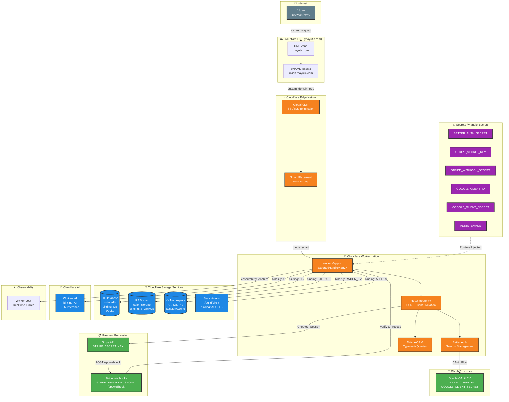
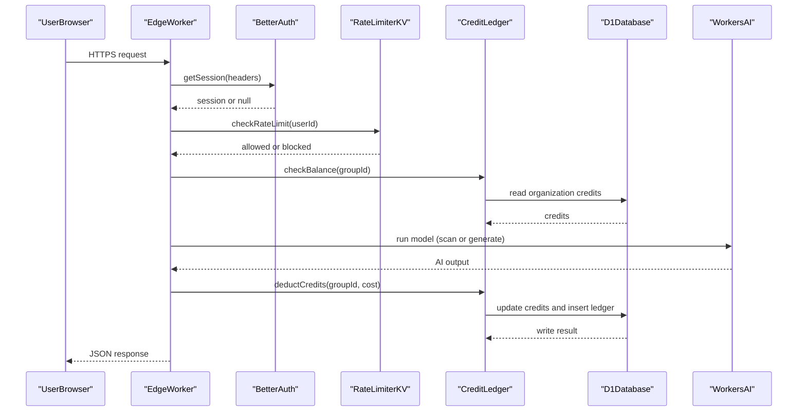
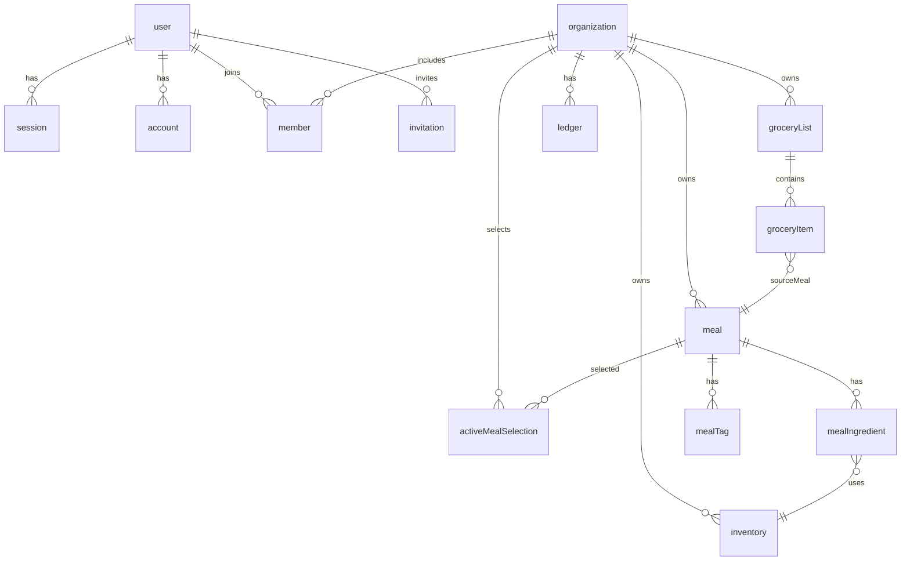
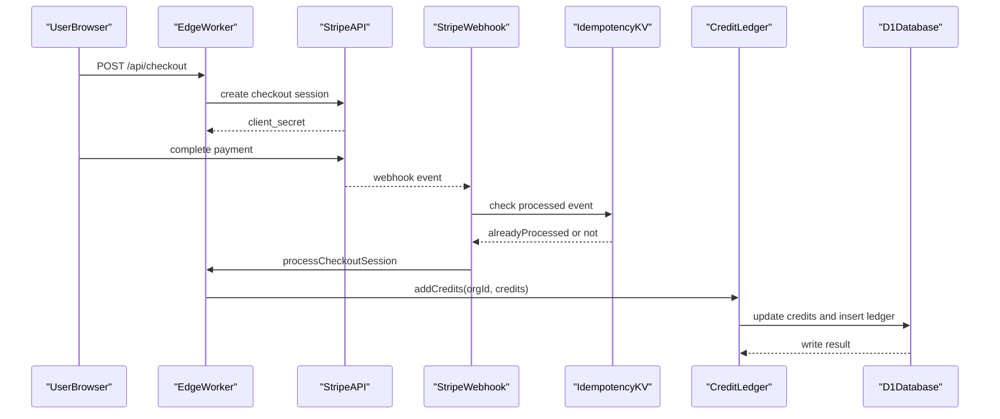

[🎨 View/Edit Live Diagram on Mermaid.ai](https://mermaid.ai/live/edit?utm_source=mermaid_mcp_server&utm_medium=remote_server&utm_campaign=claude#pako:eNqdVt1uGkcUfpURUSxHXcDg35Iq0gJbGxkD2d3YakOFZncH2HrZoTODMal70duqUpM2qqreRJUi9QF606s-TF-geYTOHzCLCULmAs05-50zZ87PN_NtLsQRylVy_QRPwyEkDPjVbgr4j06CAYHjIWikDJEUsZfd3Id3P75eyN3cVwopfi8oIhLw5r1cfxaQ4rMqwVO-Lnau7AUYpVE3XdmhluBJ1E8gQfWWx738-9v3__39k6EGXA92R3A2YXFYCPHoSWZzZSUwX-IUya0NbAZam1CGR3U8gnHKbWot-8IBLgoxiaQdgSzGaWGd-ebInWiAROi__2HGLbSghdgUk-tsHPUWR58mOICJEOTmntcs-k0P-IiM4lRGkjHyRrxAnQSGaIRSUQ-pAAuNdGJPGM4TzMNPB1vGfsWj0-V7-6cZvvpQAeR-LFFMUCi0i4YRv4WnqVzQIhyPC4zKwJzbMSYMRWcwjRJEdhL21Elvdgbsacaxi2DIXB6_9CMloERwc6zT5IJPeJgxPzI4m0Vroqsixg14KobchxKAkJQ9olQEfgFTOJCJy3YTiV-9SlDbvRBNpQTAJWnrz8YoT2EfgecTRGJEM6ariQD5_DPzQGtPKUHLgD-OWQa2TVE9hgmUPfnh3c__mFXVX4CHyE0crhyhXnq5y49dAnXIYAApMsYiHwVSCuI04t1VAfWqSujzZsxQN_fELGNZ-HHLoDoJrxEzvVC1f9aV57dd-9TJOjm_FE7OL0ELjhAd8zaXRq7tN9qt3vmlWc5iDYbDlSBsShGjYlAY3zrUsrQqFINJnETFULZRNhbb8xzf23J47IZM8ftfzRTbjUxSVTdQCdVrDlnZVMnN5gVn2D4iKA3RliG0A86yNzCIk5jNZDS__AAyykw0TTygi0CkpLKKYJJn8QgBn0CzLdZt7tyKSwAmesQ4cbwGbSGADsE3ccRPmNnzFONBIppRLTS2XNiTW5-226dNp1drNpyW32vU1yg9p-Y6_lYxdeBMDDVVrf8X0LKILBS9YvCiZFVG4jGSTSIWwO6oSni-2-g4euPeufPFGqsrFAwxvl4aawU1PVw51bN2-1x7kl84L8bFqcJuPJOHQoL0Ud6-mYtgd0pgyvNIAJWaJx_h5qZrRFwSXOj4vuP27Bf-2WpKJaYsjrL54PtLSPZkWdiBKPZKXbOIw3uIdX6OOMquXzRaPefCbjTXjuXjx6CG01QfWrxlqPogniKCO--6uTPf73icU7-ZIMoJ_068GhRIPBwEv5pvA_XF1Gg3oVT1IqmrAEYmSDjjV7g2qbeks-xdrb5lddrhiD_AKoCKT8KRmsr5wZbXCEcatCvjL23CLPj0jlPxJuCCTAWU_2-AznnxThPpRmxjeRpOfGug2CSoCi8nDBIUCStBSfMMLC9GbaaY43NeYwFVdKKgK_clx9aGKLzmCqDvCGGhBlUXRA2tAnfang-yg3mXHXPTSKu07SV_C_RnYGfOMfcrOZ_cfEEauJNUUm0j_Vp17X0L3tQemyWCrqQcJpDSOurzxeKe6cdJUnnUPzopl_oWZQRfo8qj_f19vc5P44gNK-XxrRXiBBMO7fdXvOnbWLsqoZMTdPhAV0gTsPZ1EML-4d5Dw9L5Uq4-DcvHwUNdTQQJKD9He8fRSbC9H8OTro5ldJm1bE5r-TizOAVYK6O-LJnpsV6y3LJ1fmmpcbIW0zIviglWnW6p7rOyTThPvIn3SpZXtrx9yzuwvEPLO5qn1ARJfhT5yX33P_vamic)

> **Architecture:** React Router v7 (SSR) + Drizzle ORM + Better Auth | **Platform:** Cloudflare Workers | **Domain:** `ration.mayutic.com`

## Security Architecture Diagrams

### API Request Flow

### Database Schema

### Payment And Credit Flow

### Route Access Control Map

```mermaid
flowchart TB
    Routes["Routes"] --> PublicRoutes["PublicRoutes"]
    Routes --> AuthRoutes["AuthRoutes"]
    Routes --> GroupRoutes["GroupRoutes"]
    Routes --> AdminRoutes["AdminRoutes"]

    PublicRoutes --> Home["/"]
    PublicRoutes --> Shared["/shared/:token"]
    PublicRoutes --> Legal["/legal/*"]
    PublicRoutes --> AuthApi["/api/auth/*"]
    PublicRoutes --> Webhook["/api/webhook"]

    AuthRoutes --> SelectGroup["/select-group"]
    AuthRoutes --> GroupCreate["/api/groups/create"]
    AuthRoutes --> UserPurge["/api/user/purge"]

    GroupRoutes --> Dashboard["/dashboard/*"]
    GroupRoutes --> Meals["/api/meals/*"]
    GroupRoutes --> Inventory["/api/inventory/*"]
    GroupRoutes --> Grocery["/api/grocery-lists/*"]
    GroupRoutes --> Scan["/api/scan"]
    GroupRoutes --> Search["/api/search"]
    GroupRoutes --> Checkout["/api/checkout"]

    AdminRoutes --> Admin["/admin"]
```

