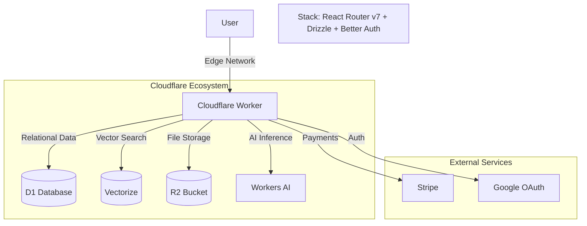

```mermaid
graph TD
    User[User] -->|Edge Network| CF[Cloudflare Worker]
    
    subgraph "Cloudflare Ecosystem"
        CF -->|Relational Data| D1[(D1 Database)]
        CF -->|Vector Search| Vec[(Vectorize)]
        CF -->|File Storage| R2[(R2 Bucket)]
        CF -->|AI Inference| AI[Workers AI]
    end
    
    subgraph "External Services"
        CF -->|Payments| Stripe[Stripe]
        CF -->|Auth| Google[Google OAuth]
    end
    
    Note[Stack: React Router v7 + Drizzle + Better Auth]
```