# Ration — Orbital Supply Chain

> **Architecture:** React Router v7 (SSR) + Drizzle ORM + Better Auth | **Platform:** Cloudflare Workers | **Domain:** `ration.mayutic.com`

A pantry management and meal-planning application built as a Cloudflare Worker with SSR, AI-powered receipt scanning, semantic ingredient matching, meal generation, weekly meal planning, tiered subscriptions, and multi-tenant group sharing. Built for the Cloudflare paid plan — design decisions prioritise correctness, latency, and scale over free-tier frugality.

---

## Table of Contents

- [1. Infrastructure Overview](#1-infrastructure-overview)
- [2. User Request Lifecycle](#2-user-request-lifecycle)
- [3. Core User Workflows](#3-core-user-workflows)
  - [3.1 Receipt Scan (Queue + AI Gateway + D1 + R2 + Vectorize)](#31-receipt-scan-queue--ai-gateway--d1--r2--vectorize)
  - [3.2 Credit Purchase (Stripe + D1 + KV)](#32-credit-purchase-stripe--d1--kv)
  - [3.3 Inventory Search (D1 + KV)](#33-inventory-search-d1--kv)
  - [3.4 Meal Generation (Queue + AI Gateway + Vectorize)](#34-meal-generation-queue--ai-gateway--vectorize)
  - [3.5 Supply Sync (D1 + Vectorize)](#35-supply-sync-d1--vectorize)
  - [3.6 Meal Plan Consume Flow (D1 + Vectorize)](#36-meal-plan-consume-flow-d1--vectorize)
  - [3.7 Plan Week (Queue + AI Gateway)](#37-plan-week-queue--ai-gateway)
  - [3.8 Import URL (Queue + Workers AI + Browser Rendering)](#38-import-url-queue--workers-ai--browser-rendering)
- [4. Feature Reference](#4-feature-reference)
  - [4.1 Cargo (Inventory)](#41-cargo-inventory)
  - [4.2 Galley (Recipes & Provisions)](#42-galley-recipes--provisions)
  - [4.3 Manifest (Meal Plan Calendar)](#43-manifest-meal-plan-calendar)
  - [4.4 Supply List](#44-supply-list)
  - [4.5 Hub Dashboard](#45-hub-dashboard)
  - [4.6 Settings & Identity](#46-settings--identity)
- [5. AI & Vector Systems](#5-ai--vector-systems)
  - [5.1 Embedding Pipeline](#51-embedding-pipeline)
  - [5.2 Meal Matching Engine](#52-meal-matching-engine)
  - [5.3 AI Operations & Credit Costs](#53-ai-operations--credit-costs)
  - [5.4 Queue Architecture](#54-queue-architecture)
- [6. Database Schema](#6-database-schema)
  - [6.1 Entity-Relationship Diagram](#61-entity-relationship-diagram)
  - [6.2 Table Reference](#62-table-reference)
- [7. Security Architecture](#7-security-architecture)
  - [7.1 Authentication Flow](#71-authentication-flow)
  - [7.2 Multi-Tenant Isolation (Organizations)](#72-multi-tenant-isolation-organizations)
  - [7.3 Route Access Control](#73-route-access-control)
  - [7.4 Defence in Depth Layers](#74-defence-in-depth-layers)
- [8. Tier & Capacity System](#8-tier--capacity-system)
- [9. Behaviour Under Load & At Scale](#9-behaviour-under-load--at-scale)
  - [9.1 Scalability Architecture](#91-scalability-architecture)
  - [9.2 Rate Limiting Matrix](#92-rate-limiting-matrix)
- [10. MCP Server](#10-mcp-server)
- [11. Public REST API (v1)](#11-public-rest-api-v1)
- [12. Testing](#12-testing)
- [13. Fin knowledge hub (support)](#13-fin-knowledge-hub-support)

---

## 1. Infrastructure Overview

The entire application runs on Cloudflare's edge network as a single Worker (`ration`) with bindings to D1, R2, KV, Queues, Workers AI, and Vectorize. A separate `ration-mcp` Worker exposes the pantry to AI agents via the Model Context Protocol. Both Workers share the same D1/KV/R2/AI/Vectorize bindings in production.

#### 1.1 Traffic flow — Users and AI agents

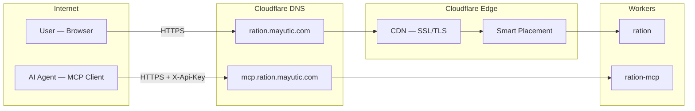

#### 1.2 Main Worker (ration) — internal stack

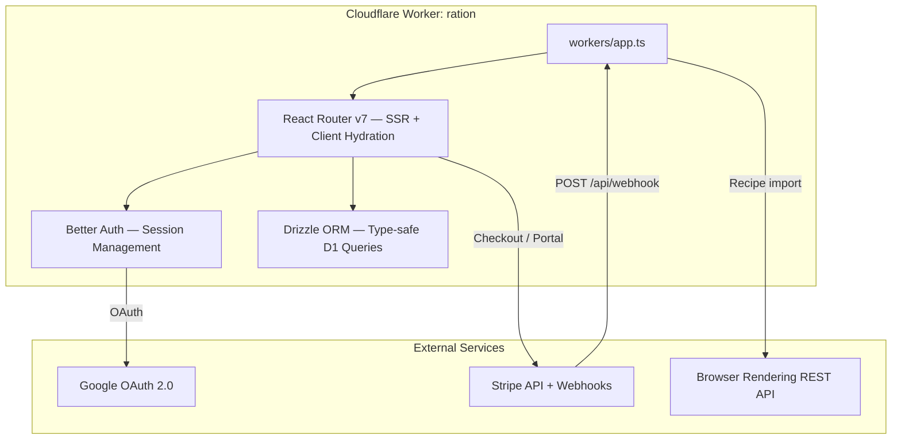

#### 1.3 MCP Worker (ration-mcp) — AI agent interface

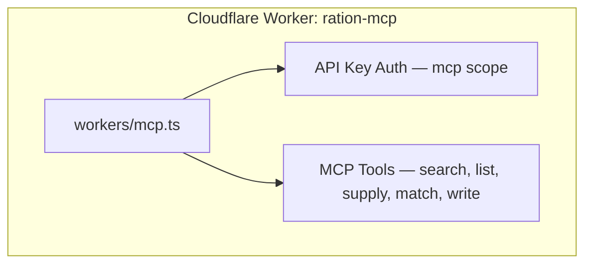

#### 1.4 Shared Cloudflare bindings — storage and AI

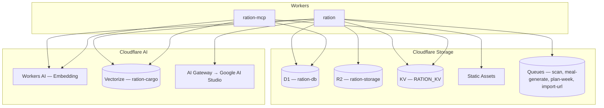

### Bindings Reference

| Binding | Service | Purpose |
|---------|---------|---------|
| `DB` | D1 (SQLite) | All persistent data: users, orgs, inventory, meals, plans, ledger, API keys |
| `RATION_KV` | KV Namespace | Rate limiting counters, webhook idempotency keys, tier cache, vector embedding cache |
| `STORAGE` | R2 Bucket | Object storage for scan images and data exports |
| `ASSETS` | Static Assets | Built client-side bundle (`./build/client`) served at the edge |
| `AI` | Workers AI | Embedding generation (`@cf/google/embeddinggemma-300m`, 768-dim) |
| `VECTORIZE` | Vectorize Index | Semantic ingredient search (`ration-cargo`, cosine similarity) |
| AI Gateway | External fetch | Proxied LLM calls to Google AI Studio — `gemini-3-flash-preview` for scan, generate, plan |
| `SCAN_QUEUE` | Queue producer | Enqueue scan jobs; consumer runs AI vision + D1/Vectorize |
| `MEAL_GENERATE_QUEUE` | Queue producer | Enqueue meal generation jobs; consumer runs LLM + Vectorize verification |
| `PLAN_WEEK_QUEUE` | Queue producer | Enqueue plan-week jobs; consumer runs Gemini for weekly meal schedule |
| `IMPORT_URL_QUEUE` | Queue producer | Enqueue URL import jobs; consumer fetches page, runs Llama 3.3 extraction, creates meal |

**Secrets (wrangler):** `CF_BROWSER_RENDERING_TOKEN` — optional; when set, recipe import uses Cloudflare Browser Rendering for JS-heavy sites. When absent, plain fetch only.

**Vars:** `INTERCOM_APP_ID` — public Intercom workspace app id; set in `wrangler.jsonc` / `wrangler.dev.jsonc` / `wrangler.local.jsonc`. The Intercom Messenger loads only on authenticated `/hub/*` routes (see `app/components/support/HubIntercom.tsx`). The default floating launcher is hidden; support opens from the hub header **Ask Ration** primary control inside the grouped actions toolbar (`app/components/support/IntercomLauncherButton.tsx`, composed in `app/routes/hub.tsx`) so it does not cover the mobile bottom nav. On narrow viewports the label shortens to **Ask** while the accessible name stays “Ask Ration (support chat)”. Theme switching stays in the header on `md+` and remains available under **Settings** on smaller viewports. The app **Content-Security-Policy** in `app/root.tsx` includes Intercom script/connect/img/font/media/frame/form-action sources required by their widget.

**Secrets (optional):** `INTERCOM_MESSENGER_JWT_SECRET` — `wrangler secret put INTERCOM_MESSENGER_JWT_SECRET`; when set, the root loader signs a short-lived HS256 JWT and the hub Messenger boots with `intercom_user_jwt` (Messenger Security / Fin). Generate the secret in Intercom under **Settings → Messenger → Security**. See [Authenticating users in the Messenger with JWTs](https://www.intercom.com/help/en/articles/10589769-authenticating-users-in-the-messenger-with-json-web-tokens-jwts).

**Secrets (optional):** `FIN_INTERCOM_CONNECTOR_SECRET` — shared secret between Intercom Fin Data Connectors and the Fin billing API routes. Store with `wrangler secret put FIN_INTERCOM_CONNECTOR_SECRET` (and in local `.dev.vars`). Intercom sends this as either `Authorization: Bearer <token>` or `x-intercom-token`; the Worker validates the token before reading or mutating user billing state in D1/Stripe.

**Fin billing endpoints (server-to-server only):**

| Method | Path | Purpose |
|--------|------|---------|
| `GET` | `/api/fin/billing-summary?user_id=…` | Read-only summary (plan, renewal, cancel-at-period-end). |
| `POST` | `/api/fin/subscription-cancel` | JSON body `{ "user_id": "…", "confirm": true }` — set **cancel at period end** on the user’s active Stripe subscription. Stricter rate limit than GET. |
| `POST` | `/api/fin/subscription-resume` | Same body shape — clear **cancel at period end** so the subscription renews. |

Configure each path as its own Fin Data Connector action. Never expose the connector secret to clients.

**JWT-only verification checklist (post-enforcement):**
- Hub requests contain `intercom_user_jwt`
- Intercom Security logs show accepted JWT requests
- No `user_hash` is present in Messenger payloads

**Operations note:** If you rotate `INTERCOM_MESSENGER_JWT_SECRET`, redeploy/restart the environment before validating new JWT traffic.

**Why AI Gateway instead of calling Google AI directly?** The gateway provides request logging, cost analytics, caching, and configurable retry/fallback — all from the Cloudflare dashboard with zero code changes. It also means the Google API key never needs to be rotated into application secrets; only the gateway ID is referenced.

**Why Smart Placement?** Without it, a Worker isolate spun up at a PoP near the user (e.g. Tokyo) would make every D1 read across the Atlantic to the D1 primary (~100ms per query). Smart Placement relocates the isolate to the PoP closest to D1, reducing per-query latency to ~5ms at the cost of slightly higher initial connection time.

---

## 2. User Request Lifecycle

Every request follows this path from browser to response.

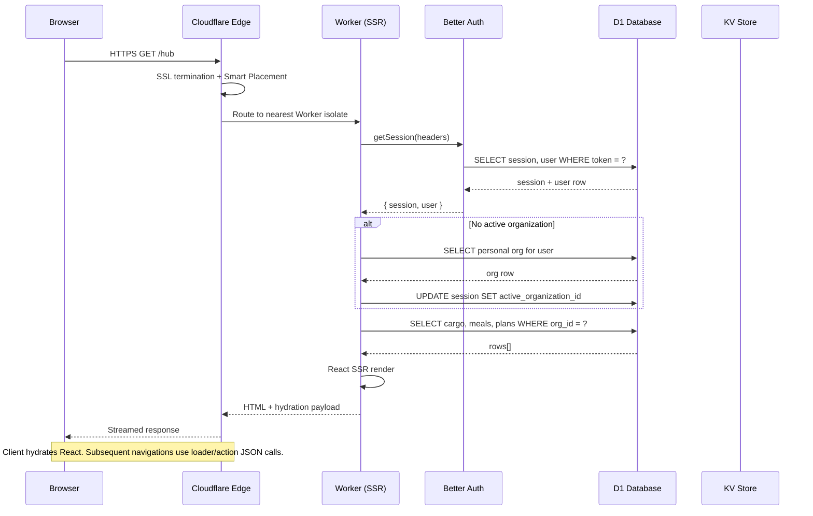

**Key design decisions:**

- **Auth instance caching** — The Better Auth instance is cached at module level in [`app/lib/auth.server.ts`](app/lib/auth.server.ts) (keyed on `BETTER_AUTH_SECRET`) to avoid re-constructing the Drizzle adapter and plugin chain on every request within the same isolate lifetime.
- **`ensureActiveOrganization()`** — Runs on every authenticated request. If no active org is set on the session, it falls back to the user's `defaultGroupId` preference, then to their personal group. This is transparent to the user and prevents a class of "missing group context" bugs on fresh sessions.
- **Bot-aware SSR** — The `entry.server.tsx` waits for `allReady` on bot user-agents, ensuring crawlers receive fully rendered HTML. For real users, streaming begins immediately.
- **`shouldRevalidate` on hub layout** — The `/hub` layout route forces revalidation when `?transaction=success` is in the URL so that tier and credit balance reflect a just-completed Stripe checkout without requiring a hard reload.

---

## 3. Core User Workflows

### 3.1 Receipt Scan (Queue + AI Gateway + D1 + R2 + Vectorize)

The scan workflow uses a queue to offload AI vision processing, avoiding Worker timeouts. It touches KV (rate limit), D1 (credits + queue job status), R2 (temporary image storage), Workers AI (embeddings), Vectorize (dedup), and AI Gateway (vision model).

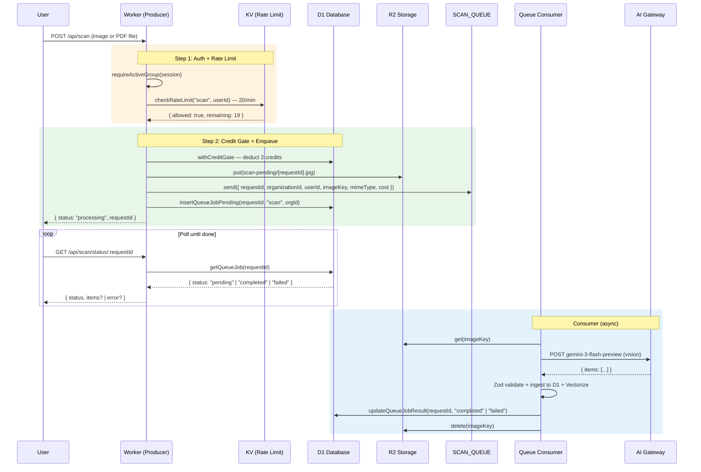

**Refund policy** (in [`app/lib/ledger.server.ts`](app/lib/ledger.server.ts)): Every thrown error inside `withCreditGate()` triggers an automatic `addCredits` refund. The consumer calls `updateQueueJobResult` with status `failed` and the error is returned to the user on the next poll. Users never pay for failed AI operations.

**File pre-processing** (in the `CameraInput` component): For images, the browser resizes to a maximum of 1024px on either side at 0.8 JPEG quality on a canvas with a white background before upload. For PDFs (e.g. exported grocery receipts), the file is sent directly without canvas processing. Both types share a 5 MB client-side and server-side size limit. Accepted formats: JPEG, PNG, WebP, PDF.

**PDF receipts**: When a PDF is uploaded the consumer selects a receipt-specific prompt optimised for parsing grocery receipt line items (item name, weight/count columns, brand-name stripping). The metadata `source` field is set to `"pdf"` to distinguish PDF scans from image scans.

**AI Gateway routing:**
```
https://gateway.ai.cloudflare.com/v1/{ACCOUNT_ID}/{GATEWAY_ID}/google-ai-studio
  → /v1beta/models/gemini-3-flash-preview:generateContent
```

---

### 3.2 Credit Purchase (Stripe + D1 + KV)

The payment flow uses Stripe Embedded Checkout with webhook fulfillment. KV provides idempotency guarantees for exactly-once credit delivery.

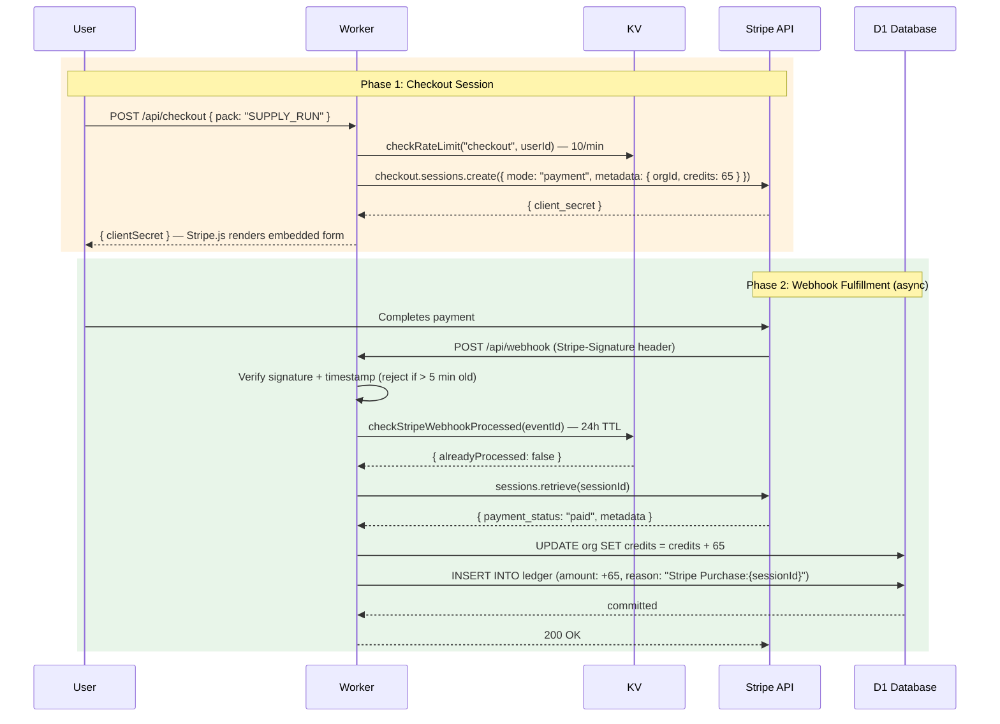

**Why webhook fulfillment instead of redirect-based confirmation?** Stripe can fire webhooks multiple times for the same event (network retries, timeouts). The KV idempotency key (event ID, 24h TTL) ensures credits are added exactly once regardless of how many times the webhook fires. The ledger's `reason:${sessionId}` provides a secondary guard inside `addCredits()`.

**Why reject events older than 5 minutes?** Stale replayed webhooks (e.g. from Stripe test mode or infrastructure issues) should not be processed. Signature verification alone does not protect against this.

**Credit packs** (from [`app/lib/stripe.server.ts`](app/lib/stripe.server.ts)):

| Pack | Credits | Price | Notes |
|------|---------|-------|-------|
| Taste Test | 12 | €1 | ~6 scans |
| Supply Run | 65 | €5 | Most Popular — `WELCOME65` promo (Supply Run only) |
| Mission Crate | 165 | €10 | ~82 scans |
| Orbital Stockpile | 550 | €25 | Best Value |
| Crew Member (Annual) | 65/year | €12/year | Subscription — unlimited capacity + 65 credits on start and renewal |
| Crew Member (Monthly) | — | €2/month | Unlimited capacity, no included credits — use WELCOME65 with Supply Run only or buy packs |

**Welcome voucher** (`WELCOME65`): New users are offered a 100% discount on the Supply Run (65 credits) via a Stripe Promotion Code. The code applies to Supply Run only. The voucher is tracked on `user.welcomeVoucherRedeemed` to show it exactly once.

---

### 3.3 Inventory Search (D1 + KV)

Search demonstrates the simpler read-path pattern: auth → rate limit → scoped query → response.

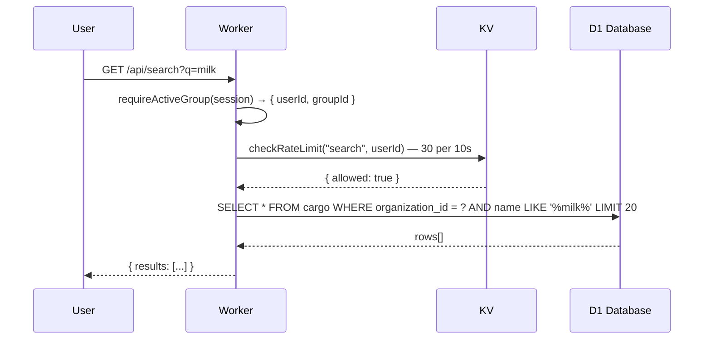

**Organization scoping:** Every D1 query includes `WHERE organization_id = ?` sourced from the session's `activeOrganizationId`. This is the fundamental tenant isolation mechanism — there is no way for a user to query another organization's data without being a verified member. The `groupId` is always sourced from `requireActiveGroup()`, never from client input.

---

### 3.4 Meal Generation (Queue + AI Gateway + Vectorize)

Meal generation uses a queue to offload the LLM and Vectorize verification (10–30s). The flow is two-phase: the consumer fetches pantry context, calls the LLM for recipe candidates, then Vectorize validates that proposed ingredients exist in the org's pantry before returning results.


**Why verify against Vectorize after generation?** LLMs hallucinate. Without post-generation validation, the model might suggest "saffron" or "truffle oil" when the pantry contains only rice and chicken. The Vectorize check is a semantic guard — it catches both exact misses and conceptual mismatches above the similarity threshold (0.78).

**Prompt injection defence** (in [`app/lib/schemas/meal.ts`](app/lib/schemas/meal.ts)): All user-supplied text fields passed to the LLM (preferences, meal names) are checked against `INJECTION_PATTERNS` — a set of regexes targeting common prompt injection vectors — before being included in the AI prompt.

---

### 3.5 Supply Sync (D1 + Vectorize)

The supply list is generated by diffing what selected meals need against what cargo the org already has. Vectorize handles the gap between how an ingredient is named in a recipe vs. how it's labelled in the pantry.

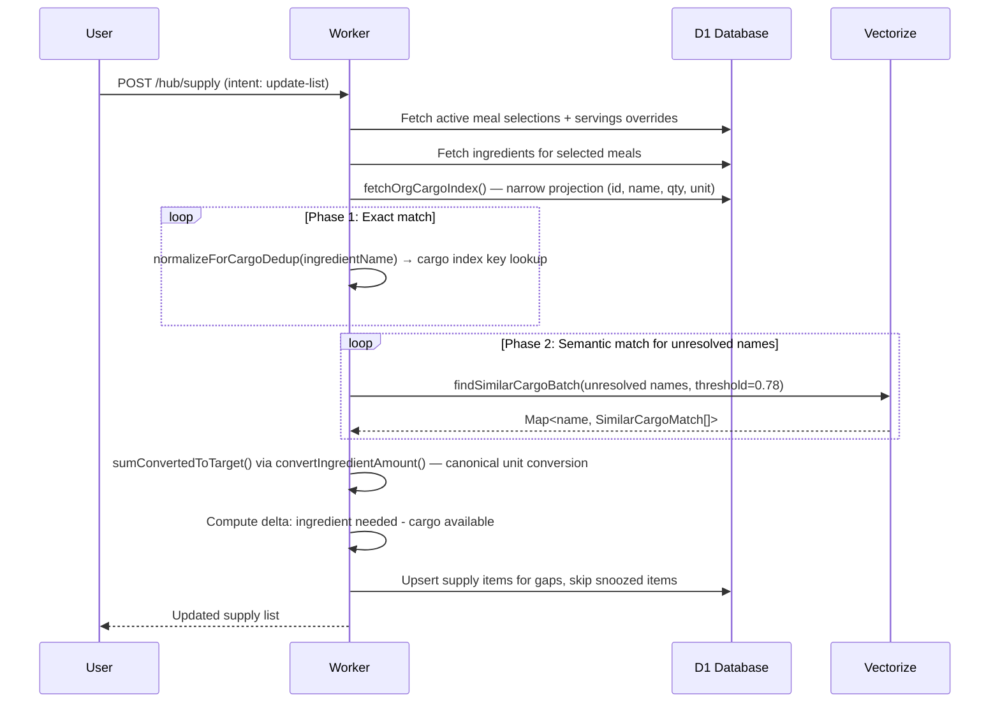

**Why a two-phase exact + semantic match?** Exact matching is free and handles well-structured data (e.g. cargo named identically to the recipe ingredient). Vectorize is only called for the unresolved remainder, minimising AI token cost and latency. The same `resolveIngredientsToCargo()` function is reused by supply sync, cook deduction, and AI generation verification — ensuring consistent resolution logic across all features.

**Supply snooze:** If a user has previously snoozed an ingredient (e.g. "soy sauce" — already have it somewhere), a `supply_snooze` row suppresses it from appearing in newly synced supply lists until the snooze expires.

---

### 3.6 Meal Plan Consume Flow (D1 + Vectorize)

When a user marks meal plan entries as "consumed", the system deducts those meals' ingredients from cargo — using the same Vectorize-backed resolution pipeline, but with a higher similarity threshold (0.80) to avoid over-subtracting real stock.

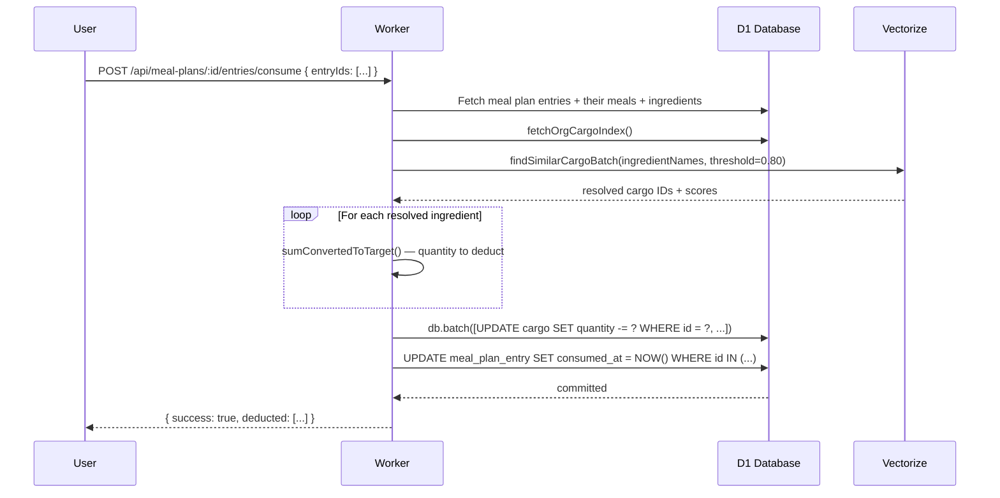

**Why a higher deduction threshold (0.80) vs. general matching (0.78)?** Subtracting from cargo is irreversible in normal flow. A false positive at 0.79 similarity might deduct "chicken thighs" from a cargo item named "chicken wings". The tighter threshold accepts a few missed deductions in exchange for correctness of the ones it does make.

---

### 3.7 Plan Week (Queue + AI Gateway)

Plan Week uses a queue to offload Gemini-based weekly meal scheduling. The flow mirrors scan and meal-generate: producer enqueues, returns `requestId`; client polls D1-backed status; consumer runs the AI and writes the result.


User confirms the preview → bulk add via `POST /api/meal-plans/:id/entries/bulk`. Credits are deducted at enqueue; refund on failure.

---

### 3.8 Import URL (Queue + Workers AI + Browser Rendering)

URL import uses a queue to offload page fetch, AI extraction, and meal creation. Producer validates URL (SSRF, duplicate) before enqueue; consumer fetches (plain or Browser Rendering fallback), runs Llama 3.3, creates the meal in D1.


On success the client redirects to the new meal. Duplicate URLs return `DUPLICATE_URL` (sync or from poll). Browser Rendering is used when plain fetch yields 429/403, too little content, or `NOT_A_RECIPE`.

---

## 4. Feature Reference

### 4.1 Cargo (Inventory)

Cargo is the core inventory primitive. Each item belongs to an organization and carries: `name`, `quantity`, `unit`, `domain` (food / household / alcohol), `tags` (JSON array), `status`, and optional `expiresAt`.

**Key workflows:**
- **Add / Merge** — When a new cargo item is submitted, the system checks Vectorize for a similar existing item (`CARGO_MERGE` threshold: 0.78). If a match is found, the user is offered a "merge" (increment quantity) or "add new" choice. This prevents duplicate pantry entries from OCR variations (e.g. "whole milk 2%" vs. "2% milk").
- **Bulk ingest (scan)** — After a receipt scan, `POST /api/cargo/batch` runs `ingestCargoItems` which applies the same dedup logic for each item in the scan result.
- **Ingredient detail view** — `GET /hub/cargo/:id` shows full cargo metadata and all linked Galley meals, including whether each link is direct (`cargoId`) or an unlinked name match.
- **Promote to Galley** — A cargo item can be promoted to a single-ingredient Provision (see §4.2) for use in meal planning.
- **CSV import/export** — Via `POST /api/v1/inventory/import` and `GET /api/cargo/export`. Validated against `CargoCsvRowSchema` (max 500 rows per import).
- **Vectorize write-through** — Every cargo create/update triggers `upsertCargoVector`, keeping the Vectorize index in sync with D1. Deletes call `deleteCargoVectors`.

**Why `fetchOrgCargoIndex()`?** Matching and dedup only need 5 columns (`id`, `name`, `domain`, `quantity`, `unit`). The full cargo row has ~15 columns including JSON tags and timestamps. Using the narrow index cuts serialisation cost roughly in half and is enforced as a workspace rule.

---

### 4.2 Galley (Recipes & Provisions)

The Galley holds two types: **Recipes** (full multi-ingredient meals) and **Provisions** (single-ingredient items, e.g. "a banana"). Both are stored in the `meal` table discriminated by `type`.

**Key workflows:**
- **Create** — Via `MealBuilder` form or AI generation. Ingredients can be linked to an existing cargo item (`cargoId`) or left as a free-text name. The link is optional — it enables quantity deduction on cook but is not required.
- **AI generation** — `POST /api/meals/generate` (2 credits) sends pantry context to Gemini and returns 3 Vectorize-verified recipes.
- **URL import** — `POST /api/meals/import` (1 credit) returns `{ status: "processing", requestId }`; client polls `GET /api/meals/import/status/:requestId`. Consumer fetches the page (plain fetch or Browser Rendering fallback), runs Llama 3.3 70B for extraction, creates the meal in D1. On success the client redirects to the meal. Duplicate URLs return `DUPLICATE_URL` synchronously (409) or from the poll. HTTPS-only URLs are enforced (SSRF guard). Browser Rendering is used when plain fetch yields 429/403, insufficient content, or AI returns `NOT_A_RECIPE`. Requires `CF_BROWSER_RENDERING_TOKEN` (optional); when absent, uses plain fetch only.
- **Cook** — `POST /api/meals/:id/cook` deducts all ingredients from cargo via the Vectorize-backed resolver. Accepts a `servings` override to scale quantities.
- **Match mode** — `GET /api/meals/match` returns meals ranked by how much of their ingredient list is already in the pantry, in either `strict` (100% match only) or `delta` (partial match, sorted by %) mode.
- **Tags** — Stored in a separate `meal_tag` join table (unique per meal+tag). Used for filtering in the Galley view and the MCP `list_meals` tool.
- **Export/import** — JSON manifest format (`GalleyManifestSchema`) via `/api/galley/export` and `/api/galley/import`. Import is validated against a discriminated union of recipe and provision schemas.

---

### 4.3 Manifest (Meal Plan Calendar)

The Manifest is a calendar-style meal plan. Each organization has a single active `meal_plan`. Days are divided into four slots: breakfast, lunch, dinner, snack.

**Key workflows:**
- **Add entry** — `POST /api/meal-plans/:id/entries` places a meal in a specific date+slot. Entries support `servingsOverride` and `notes`.
- **Bulk add** — `POST /api/meal-plans/:id/entries/bulk` inserts up to 50 entries atomically via `db.batch()`. Used for "copy day" (duplicating an entire day's meals to other days) and AI plan-week.
- **AI plan-week** — `POST /api/meal-plans/:id/plan-week` (3 credits) returns `{ status: "processing", requestId }`; client polls `GET /api/meal-plans/:id/plan-week/status/:requestId`. Consumer runs Gemini with the org's meal library and allergen profile, returns a schedule for preview. User confirms → bulk add via `POST /api/meal-plans/:id/entries/bulk`. All `mealId` values are validated against the org's meal whitelist (RLS guard).
- **Consume** — Marks selected entries as consumed and deducts ingredients from cargo (see §3.6).
- **Readiness signal** — Each Manifest meal card shows a subtle availability dot (green = all required ingredients available, amber = missing ingredients) based on current cargo inventory.
- **Share** — Crew Member only. Generates a `shareToken` (URL-safe, unique). Public read-only at `/shared/manifest/:token`.
- **Week navigation** — The `?week=` query param shifts the 7-day window. The UI computes ISO week offsets on the client; the loader fetches entries for `startDate`–`endDate`.

---

### 4.4 Supply List

The supply list bridges the Galley and Cargo — it holds ingredients needed to cook the selected meals that aren't already in the pantry.

**Key workflows:**
- **Sync** — `POST /hub/supply` (intent `update-list`) re-computes the entire list from the current active meal selections + manifest week meals. Vectorize resolves fuzzy name matches. Snoozed items are excluded.
- **Unit normalization** — Supply sync can render quantities in `metric`, `imperial`, or `cooking` mode (`user.settings.supplyUnitMode`). In metric mode, volume-based solids (e.g. rice/flour/cheese in cups) are converted to weight using ingredient density so docked store quantities satisfy recipe needs without manual editing.
- **From meal** — `POST /api/supply-lists/:id/from-meal` adds missing ingredients for a single specific meal.
- **Dock cargo** — `POST /api/supply-lists/:id/complete` moves all purchased items into cargo inventory. Uses the same vector dedup pipeline as direct cargo adds. Purchased items are removed from the list in a single `db.batch()`.
- **Snooze** — An item can be snoozed for a duration (via `supply_snooze` table, keyed on `normalizedName + domain`). Snoozed items are silently excluded from all future syncs until the snooze expires or is manually dismissed. Useful for items that are always on hand.
- **Share** — Crew Member only. Public URL at `/shared/:token`. Any visitor can toggle purchased state on items via `PATCH /api/shared/:token/items/:itemId` (rate-limited by IP, no session required). This supports shared household shopping.
- **Export** — `GET /api/supply-lists/:id/export?format=text|markdown` for clipboard/note-app sharing.

---

### 4.5 Hub Dashboard

The Hub (`/hub`) is a customisable widget dashboard giving an at-a-glance view of the pantry's state.

**Widgets:**

| Widget | Data Source | Notes |
|--------|-------------|-------|
| `hub-stats` | D1 cargo/meal/list counts | Summary numbers |
| `meals-ready` | Vectorize meal match (strict) | Meals cookable right now |
| `meals-partial` | Vectorize meal match (delta) | Meals with most ingredients available |
| `snacks-ready` | Vectorize provision match (strict) | Quick snacks available |
| `cargo-expiring` | D1 `WHERE expires_at < NOW() + 7 days` | Items to use soon |
| `supply-preview` | D1 supply list | Shopping summary |
| `manifest-preview` | D1 meal plan entries | Next 7 days |

**Why deferred loaders on the Hub?** Meal matching involves an AI embedding call (or KV cache lookup) plus a Vectorize query. These are deferred via React Router's `defer()` so the page skeleton loads instantly and the matching widget fills in asynchronously, keeping the hub under 100ms for the initial paint.

**Layout customisation:** Users can customise the widget grid by choosing a profile preset (`full`, `cook`, `shop`, `minimal`) or dragging widgets. The layout is persisted in `user.settings.hubLayout` (JSON). The `LayoutEngine` component renders a 12-column CSS grid where widgets map to `sm` (4 cols), `md` (6 cols), or `lg` (12 cols) widths. On viewports below 768px, tapping "Customize" opens a mobile-optimized edit mode with a bottom sheet for widget size/filter settings; the widget drawer respects the app theme (light/dark).

**FAB padding:** Cargo, Galley, Supply, and Manifest routes use `pb-36 md:pb-0` on the main content area to reserve space for the floating action bar on mobile.

**Onboarding:** New users trigger a 6-step guided tour (`OnboardingTour`) that spotlights each major feature area in sequence. Progress is persisted to `user.settings.onboarding`. The tour respects keyboard navigation (Esc = skip, arrow keys = next/back) and fires a confetti animation on completion.

---

### 4.6 Settings & Identity

The Settings page (`/hub/settings`) supports profile identity management across collaborative groups:

- **Editable display name** — users can add or update their name directly in the profile card.
- **Avatar upload** — users can upload a JPEG/PNG/WebP profile photo (max 2MB), stored in R2 under `users/{userId}/avatar` (single object key, overwritten on update).
- **Fallback identity rendering** — when no name is available, the UI falls back to email for display labels and avatar initials.
- **Group member clarity** — member rows and role-change confirmations now consistently use `name || email || "Unknown"` so magic-link users remain identifiable.

Avatars are served via `GET /api/user/avatar/:userId` and updated via `POST /api/user/avatar`.

---

## 5. AI & Vector Systems

### 5.1 Embedding Pipeline

All semantic search and matching is built on Cloudflare's native AI stack — no external embedding API calls.

**Model:** `@cf/google/embeddinggemma-300m` via the `AI` Workers AI binding.
**Dimensions:** 768
**Vectorize index:** `ration-cargo`, cosine similarity metric, namespaced per organization.

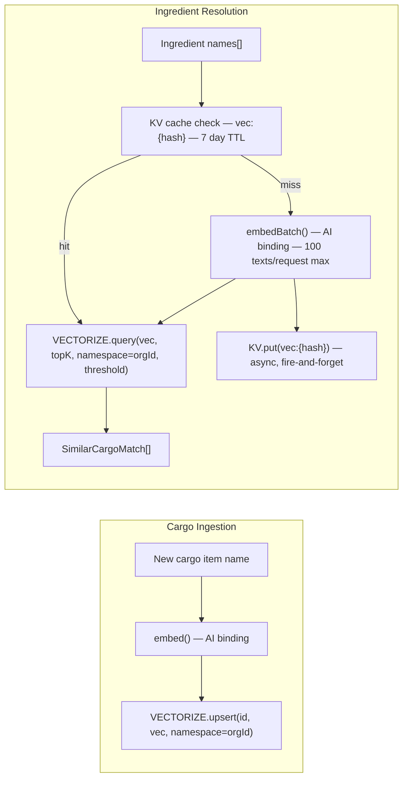

**Why cache embeddings in KV?** Ingredient names are highly stable — "chicken breast" will always embed to the same 768-dim vector. Without caching, every supply sync or meal match would re-embed the same names. The KV cache with a 7-day TTL eliminates redundant AI calls for repeat queries, which is the common case.

**Why namespaced Vectorize vectors?** The Vectorize index is shared across all organizations. Using `namespace = organizationId` ensures that a query for org A never returns results from org B, providing the same tenant isolation at the vector layer as the `WHERE organization_id = ?` clause at the SQL layer.

**Similarity thresholds** (in [`app/lib/vector.server.ts`](app/lib/vector.server.ts)):

| Context | Threshold | Reasoning |
|---------|-----------|-----------|
| `INGREDIENT_MATCH` | 0.78 | Universal threshold for supply sync and AI generation verification. Balanced for breadth. |
| `CARGO_MERGE` | 0.78 | Dedup on ingest — same threshold for consistency with matching. |
| `CARGO_DEDUCTION` | 0.80 | Cook deduction is irreversible — a tighter threshold prevents false positive subtractions. |
| MCP search | 0.60 | Agents benefit from wider recall when exploring the pantry. |

---

### 5.2 Meal Matching Engine

The matching engine (in [`app/lib/matching.server.ts`](app/lib/matching.server.ts)) determines which meals can be cooked with the current pantry contents.

**Two modes:**

- **Strict match** (`strictMatch`) — Returns only meals where every non-optional ingredient is fully covered by the pantry. `matchPercentage = 100`. Used for the "Meals Ready" hub widget.
- **Delta match** (`deltaMatch`) — Returns meals above a configurable `minMatch` percentage, sorted descending. Used for the "Meals Partial" widget and the Galley match view.

**Resolution pipeline inside `matchMeals()`:**

1. KV cache check (10s TTL, key `match:<orgId>:mode:...`) — absorbs repeated calls during page load.
2. Fetch meals with optional tag/type/domain filters + `preLimit` pre-filter.
3. Batch-fetch ingredients and tags in parallel.
4. `fetchOrgCargoIndex()` — narrow 5-column projection.
5. Phase 1: exact key lookup against normalised cargo names.
6. Phase 2: one `findSimilarCargoBatch()` call for all unresolved names.
7. Unit conversion via `sumConvertedToTarget()` — delegates to `convertIngredientAmount()`, the canonical conversion helper used by all product surfaces (matching, cook deduction, supply sync). Handles same-family and cross-family weight ↔ volume conversion via `lookupDensity()` (e.g. 500 g rice satisfies a recipe requiring 1 cup rice).
8. Apply scale factor if servings override given.
9. Write result to KV cache, return capped to `limit`.

---

### 5.3 AI Operations & Credit Costs

Credits belong to the **organization**, not the user. All members of a group draw from the same pool. Credits are deducted atomically via a SQL-level overdraft check (`UPDATE ... WHERE credits >= cost RETURNING id`) — a deduction only succeeds if the balance is sufficient. There is no race condition.

| Operation | Cost | Route | AI Service |
|-----------|------|-------|------------|
| Receipt Scan | 2 cr | `POST /api/scan` | AI Gateway → Gemini 3 Flash |
| Meal Generate | 2 cr | `POST /api/meals/generate` | AI Gateway → Gemini 3 Flash |
| URL Recipe Import | 1 cr | `POST /api/meals/import` | Workers AI → Llama 3.3 70B |
| Weekly Meal Plan | 3 cr | `POST /api/meal-plans/:id/plan-week` | AI Gateway → Gemini 3 Flash |
| Organize Cargo | 2 cr | *(reserved — not yet implemented)* | — |

**Queue pattern (Scan, Meal Generate, Plan Week, Import URL):** All four AI features use the same queue + D1 status pattern. Producer: `withCreditGate` → enqueue → `insertQueueJobPending` → return `requestId`. Client polls `getQueueJob` until `completed` or `failed`. Consumer runs the AI and calls `updateQueueJobResult`. Credit costs unchanged; timeouts avoided.

**`withCreditGate()` pattern:** All credit-gated routes use this wrapper from `ledger.server.ts`:
1. Pre-flight `checkBalance` (cheap SELECT).
2. `deductCredits` (atomic UPDATE + ledger INSERT).
3. Execute the AI operation.
4. On any error: `addCredits` refund with matching ledger entry.

The pre-flight read is an optimistic guard — it won't stop a race condition, but it surfaces an early, friendly error for users with zero balance without burning a round-trip for the deduction. The actual deduction is atomic at the SQL level.

---

### 5.4 Queue Architecture

All AI-heavy operations use Cloudflare Queues with a central **registry** in `app/lib/ai-queue-registry.server.ts`. Adding a new queue requires: (1) create a consumer module, (2) register it in `AI_QUEUE_HANDLERS`. The worker's queue handler dispatches by queue name — no manual switch logic.

| Queue | Job Type | Consumer | AI Service |
|-------|----------|----------|------------|
| `ration-scan` | `scan` | `runScanConsumerJob` | AI Gateway → Gemini 3 Flash |
| `ration-meal-generate` | `meal_generate` | `runMealGenerateConsumerJob` | AI Gateway → Gemini 3 Flash |
| `ration-plan-week` | `plan_week` | `runPlanWeekConsumerJob` | AI Gateway → Gemini 3 Flash |
| `ration-import-url` | `import_url` | `runImportUrlConsumerJob` | Workers AI → Llama 3.3 70B |

**Flow:** Producer → enqueue + `insertQueueJobPending(DB, requestId, jobType, orgId)` → return `requestId`. Client polls `GET /api/.../status/:requestId` which calls `getQueueJob(DB, requestId)`. Consumer runs the AI, writes `updateQueueJobResult(DB, requestId, status, result)`. D1 provides strong read-after-write consistency for status; no KV eventual consistency.

---

## 6. Database Schema

### 6.1 Entity-Relationship Diagram

The schema centres on the `organization` table. All domain data (cargo, meals, plans, supply lists) is owned by an organization, not a user directly. This is intentional — it enables group-shared pantries where any member can add/consume without each member having a personal silo.


### 6.2 Table Reference

| Table | Owner | Purpose | Key Indexes |
|-------|-------|---------|-------------|
| `user` | — | Authenticated users, tier info, allergen settings, and legal acceptance metadata (`tos_accepted_at`, `tos_version`) | `email` (unique) |
| `session` | user | Active auth sessions with org context | `token` (unique) |
| `account` | user | OAuth provider links (Google, email/password) | — |
| `verification` | — | Auth verification tokens (email confirm) | `identifier` |
| `organization` | — | Groups/teams with pooled credit balance | `slug` (unique) |
| `member` | org + user | Membership join table with roles (owner/admin/member) | `(org_id, user_id)` unique |
| `invitation` | org | Shareable group invitation tokens (7-day expiry) | `token` (unique), `org_id` |
| `cargo` | org | Pantry/inventory items with quantity, unit, domain, tags | `(org_id, domain)` |
| `ledger` | org | Immutable credit transaction log (debits + credits) | `org_id`, `user_id` |
| `meal` | org | Recipes and provisions; `type` discriminates them | `(org_id, domain)`, `(org_id, type)` |
| `meal_ingredient` | meal | Ingredient list with optional soft FK to cargo | `meal_id`, `ingredient_name` |
| `meal_tag` | meal | Categorisation tags, unique per meal+tag | `(meal_id, tag)` unique |
| `active_meal_selection` | org + meal | Currently "selected" meals for supply list generation | `(org_id, meal_id)` unique |
| `supply_list` | org | Shopping/supply lists with optional share token | `org_id`, `share_token` |
| `supply_item` | supply_list | Individual items; `source_meal_ids` (JSON) tracks multiple sources | `list_id`, `(list_id, domain)` |
| `supply_snooze` | org | Items suppressed from auto-generation; keyed on `normalizedName + domain` | `(org_id, name, domain)` unique |
| `meal_plan` | org | Singleton active meal plan per org with optional share | `org_id`, `share_token` |
| `meal_plan_entry` | meal_plan | Single date+slot+meal assignment with `consumed_at` tracking | `(plan_id, date)`, `(plan_id, date, slot_type)` |
| `api_key` | org + user | Programmatic API keys (SHA-256 hashed, prefix-indexed) | `key_prefix`, `org_id` |
| `queue_job` | — | Scan and meal-generate job status for polling; D1-backed for strong consistency | `expires_at`, `(organization_id, status)` |

**D1 parameter limit:** D1 enforces a hard limit of 100 bound parameters per statement (vs. SQLite's 999). Every bulk write is chunked using constants from [`app/lib/query-utils.server.ts`](app/lib/query-utils.server.ts):

| Constant | Value | Columns | Table |
|----------|-------|---------|-------|
| `D1_MAX_INGREDIENT_ROWS_PER_STATEMENT` | 12 | 8 | `meal_ingredient` |
| `D1_MAX_TAG_ROWS_PER_STATEMENT` | 33 | 3 | `meal_tag` |
| `D1_MAX_PLAN_ENTRY_ROWS_PER_STATEMENT` | 12 | 8 | `meal_plan_entry` |

**Why `db.batch()` for multi-statement writes?** D1 is accessed over HTTP (not a local socket). Each `await db.insert(...)` is a separate HTTP round-trip. `db.batch([stmt1, stmt2, ...])` is a single round-trip regardless of statement count, and executes the statements atomically server-side. Sequential `await` loops are explicitly forbidden in the codebase for independent writes.

---

## 7. Security Architecture

### 7.1 Authentication Flow

Authentication is handled by Better Auth with the `organization` and `magicLink` plugins. Primary sign-in is via **magic link** (passwordless): users enter their email, receive a one-time link, and are authenticated on click. **Google OAuth** is available when `GOOGLE_CLIENT_ID` is configured. Unauthenticated users are redirected to `/` (root) by `requireAuth()`.

**Local development:** When `BETTER_AUTH_URL` contains `localhost`, the **Dev Login** button appears (credentials: `dev@ration.app` / `ration-dev`). This uses email/password auth enabled only in dev. Magic links log to the server in dev when `RESEND_API_KEY` is not set (no email sent).

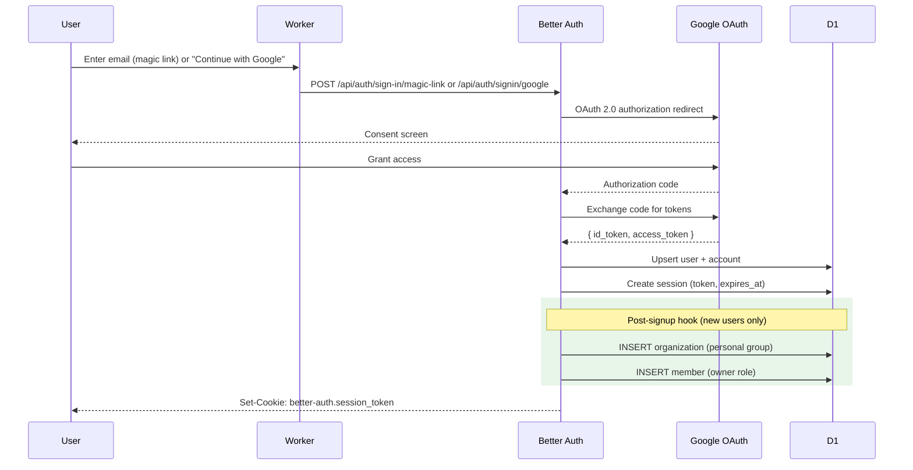

*Diagram shows Google OAuth flow. Magic link flow: user enters email → server sends link via Resend → user clicks link → Better Auth verifies token → session created.*

**Post-signup provisioning** (in [`app/lib/auth.server.ts`](app/lib/auth.server.ts)): Every new user automatically receives a personal organization with `owner` role, and legal acceptance metadata is stamped (`tosAcceptedAt`, `tosVersion`) at account creation. Failures in this hook are non-fatal — the user can manually create a group. This ensures every user always has a valid group context for queries without requiring a separate onboarding step.

---

### 7.2 Multi-Tenant Isolation (Organizations)

Ration uses an **organization-based multi-tenancy** model. Every piece of domain data is owned by an organization, and access is mediated through the `member` join table.

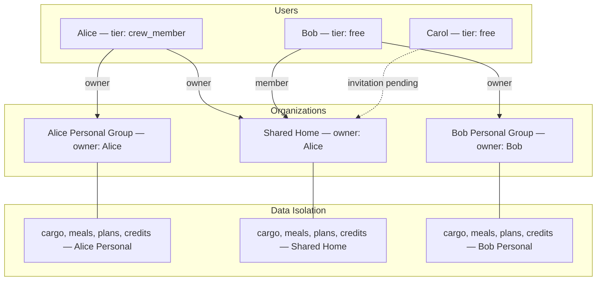

**Isolation guarantees:**

| Layer | Mechanism | Implementation |
|-------|-----------|----------------|
| **Session context** | `session.active_organization_id` | Only organizations the user is a verified `member` of can be activated. Switchable via the `GroupSwitcher` UI. |
| **Query scoping** | `WHERE organization_id = ?` | Every query in `cargo.server.ts`, `meals.server.ts`, `supply.server.ts`, etc. uses `groupId` from `requireActiveGroup()` — never from client input. |
| **Role-based access** | `member.role` (owner / admin / member) | Invitation creation requires `owner` or `admin`. Credit transfers require `owner` on the source org. |
| **Tier-based gating** | Owner's `user.tier` determines group limits | Capacity checks in `capacity.server.ts` look up the **organization owner's** tier, not the current user's. This prevents a free-tier member joining a crew member's group from being subject to free-tier limits — the group's capacity is determined by who owns and subscribes to it. |
| **Credit isolation** | `organization.credits` counter | Credits belong to the org. A user purchasing credits adds to their active org's pool; all members draw from it. |
| **Vectorize namespacing** | `namespace = organizationId` | Vector queries are scoped to the org's namespace, matching the D1 tenant isolation at the semantic layer. |
| **API key isolation** | `api_key.organization_id` | Programmatic keys are scoped to a single org. `verifyApiKey()` returns the `organizationId` which is used as the RLS anchor for all subsequent queries. |

**Account deletion and ownership transfer:** When a user deletes their account (Purge Account in settings), groups they own are handled as follows: if other members have joined, ownership auto-transfers to the first admin or first member. If the owner is the sole member (including when invitations are pending and not yet accepted), the group and all its data are permanently deleted. Owners can proactively transfer ownership to another member via the "Transfer ownership" option in group settings (Danger Zone) before deleting their account.

---

### 7.3 Route Access Control

```mermaid
flowchart TB
    Request["Incoming Request"] --> RouteMatch{"Route Match"}

    RouteMatch --> Public["Public Routes — no auth"]
    RouteMatch --> AuthRequired["Auth Required — session cookie"]
    RouteMatch --> GroupRequired["Group Required — session + active org"]
    RouteMatch --> AdminRequired["Admin Required — user.is_admin"]
    RouteMatch --> ApiKeyRequired["API Key Required — Bearer or X-Api-Key"]

    Public --> P1["/ (landing)"]
    Public --> P2["/api/auth/* (login/signup)"]
    Public --> P3["/api/webhook (Stripe — signature verified)"]
    Public --> P4["/shared/:token (supply list)"]
    Public --> P5["/shared/manifest/:token (meal plan)"]
    Public --> P6["/legal/*"]

    AuthRequired --> A1["/select-group"]
    AuthRequired --> A2["/api/groups/create"]
    AuthRequired --> A3["/api/user/purge"]

    GroupRequired --> G1["/hub/* (all dashboard pages)"]
    GroupRequired --> G2["/api/meals/*"]
    GroupRequired --> G3["/api/cargo/*"]
    GroupRequired --> G4["/api/supply-lists/*"]
    GroupRequired --> G5["/api/scan"]
    GroupRequired --> G6["/api/search"]
    GroupRequired --> G7["/api/checkout"]
    GroupRequired --> G8["/api/meal-plans/*"]

    AdminRequired --> AD1["/admin"]
    AdminRequired --> AD2["/api/admin/*"]

    ApiKeyRequired --> K1["/api/v1/inventory/export"]
    ApiKeyRequired --> K2["/api/v1/inventory/import"]
    ApiKeyRequired --> K3["/api/v1/galley/export"]
    ApiKeyRequired --> K4["/api/v1/galley/import"]
    ApiKeyRequired --> K5["/api/v1/supply/export"]
```

**Guard functions** (all in `app/lib/auth.server.ts` / `app/lib/api-key.server.ts`):

| Function | Returns | Redirects/throws on fail |
|----------|---------|--------------------------|
| `requireAuth()` | `session` (with user) | Redirect `→ /` |
| `requireActiveGroup()` | `{ session, groupId }` | Redirect `→ /select-group` |
| `requireAdmin()` | `user` (with isAdmin) | Redirect `→ /` |
| `requireApiKey()` | `{ organizationId, scopes }` | 401 / 403 JSON response |

**SEO & Discovery** — Public indexable pages (`/`, `/legal/*`, `/blog`, `/blog/:slug`, `/tools/*`) include canonical URLs plus Open Graph and Twitter Card meta tags for social sharing. `robots.txt` allows crawlers for `/`, `/legal/`, `/blog/`, and `/tools/`; `sitemap.xml` lists indexable URLs including blog posts. Blog posts use `BlogPosting` JSON-LD plus article-specific Open Graph metadata. Blog frontmatter should include `title`, `description`, `date`, `dateModified`, `authorName`, optional `authorUrl`, optional `image`, and optional `tags` so new posts automatically inherit sitemap, social, and structured-data coverage. Hub, API, admin, and shared routes are disallowed from indexing.

---

### 7.4 Defence in Depth Layers

```mermaid
flowchart LR
    subgraph L1["Layer 1 — Edge"]
        SSL["SSL/TLS Termination"]
        CSP["Content Security Policy"]
        HSTS["Strict-Transport-Security — 1 year"]
        XFO["X-Frame-Options: DENY"]
        XCTO["X-Content-Type-Options: nosniff"]
    end

    subgraph L2["Layer 2 — Authentication"]
        SessionAuth["Session Cookie Verification"]
        OAuthFlow["Google OAuth 2.0"]
        ApiKeyAuth["SHA-256 Hashed API Keys"]
        TimingAttack["Constant-time Comparison"]
    end

    subgraph L3["Layer 3 — Authorization"]
        OrgMembership["Organization Membership Check"]
        RoleCheck["Role-based Gate — owner/admin/member"]
        TierGate["Tier-based Feature Gating"]
        VectorNS["Vectorize Namespace Scoping"]
    end

    subgraph L4["Layer 4 — Rate Limiting"]
        DistributedRL["KV-backed Sliding Window — global"]
        PerUserLimits["Per-user limits on authenticated endpoints"]
        PerIPLimits["Per-IP limits on public endpoints"]
        TwoTierRL["L1 in-memory + L2 KV — fail-open on KV error"]
    end

    subgraph L5["Layer 5 — Data Integrity"]
        AtomicTx["db.batch() — atomic multi-statement writes"]
        IdempotencyKV["KV idempotency keys — Stripe webhooks"]
        ZodValidation["Zod schema validation at API boundary"]
        CreditGuard["SQL-level overdraft prevention — RETURNING id guard"]
        InjectionFilter["INJECTION_PATTERNS — prompt injection defence"]
        SSRFGuard["HTTPS-only URL validation — recipe import"]
    end

    L1 --> L2 --> L3 --> L4 --> L5
```

**HTTP security headers** (set in [`app/root.tsx`](app/root.tsx)):
- `Content-Security-Policy` — Restrictive policy allowing only self, Stripe JS (`js.stripe.com`), and Google Fonts
- `Strict-Transport-Security: max-age=31536000; includeSubDomains`
- `X-Frame-Options: DENY` — Prevents clickjacking
- `X-Content-Type-Options: nosniff`
- `Referrer-Policy: strict-origin-when-cross-origin`

**API key security** (in [`app/lib/api-key.server.ts`](app/lib/api-key.server.ts)):
- Format: `rtn_live_<32 hex chars>`. First 17 chars used as the lookup prefix (avoids full-table scans on lookup).
- Only the SHA-256 hash is stored in D1; the raw key is shown to the user exactly once.
- Lookups use `secureCompare()` — constant-time XOR comparison — to prevent timing attacks that could leak key validity via response latency differences.

**Rate limiter architecture** (in [`app/lib/rate-limiter.server.ts`](app/lib/rate-limiter.server.ts)):
- **L1 (in-memory `LOCAL_CACHE`):** Per-isolate, 5s TTL. Absorbs burst traffic within the same isolate with zero KV reads.
- **L2 (Cloudflare KV):** Global, eventually consistent. `cacheTtl: 60` at the PoP reduces read latency.
- On KV failure: **fails open** with a `log.warn`. A KV outage will not cause a service outage — it will temporarily disable rate limiting.

---

### 7.5 Transitive dependency overrides (supply chain)

[`package.json`](package.json) defines Bun **`overrides`** to pin patched versions of transitive packages that would otherwise stay vulnerable through optional peer chains (for example Prisma-related tooling pulled via `drizzle-orm`’s optional `@prisma/client` peer, the MCP SDK’s Express stack, or a nested `vite` copy under `vite-node`). After major dependency upgrades, run **`bun audit`** and trim overrides when upstream packages adopt the same floor.

---

## 8. Tier & Capacity System

The tier system controls resource limits per organization. Limits are determined by the **organization owner's** tier — not the current viewer's. This design is deliberate: if a free-tier user joins a crew member's household group, that group's capacity should reflect the crew member's subscription, not the joining member's tier.

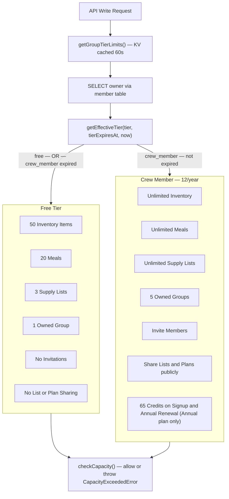

**Tier enforcement mechanics** (in [`app/lib/capacity.server.ts`](app/lib/capacity.server.ts)):

1. `getGroupTierLimits()` checks KV for a cached tier result (key `tier:<orgId>`, 60s TTL). Cache miss → DB query for the org owner's `user.tier` + `tierExpiresAt`.
2. `getEffectiveTier()` checks expiry: a `crew_member` with an expired `tierExpiresAt` is treated as `free`.
3. `checkCapacity()` compares the current count against the tier limit. Throws `CapacityExceededError` with `resource`, `current`, `limit`, `tier`, `isExpired`, and `canAdd` fields — all surfaced in the `UpgradePrompt` component.
4. After a Stripe webhook processes a subscription, `invalidateTierCache()` deletes the KV key so the next request picks up the new tier immediately.

**Tier-gated features beyond capacity limits:**
- `canInviteMembers` — creating group invitations requires Crew Member
- `canShareGroceryLists` — supply list and meal plan share tokens require Crew Member

---

## 9. Behaviour Under Load & At Scale

### 9.1 Scalability Architecture

Ration runs entirely on Cloudflare's serverless edge. There are no fixed servers, no auto-scaling groups, and no cold-start containers. Each request is handled by a V8 isolate that is reused across requests (warm) within the same PoP.

```mermaid
flowchart TB
    subgraph Users["Concurrent Users — Global"]
        U1["User A — Dublin"]
        U2["User B — London"]
        U3["User C — New York"]
        U4["User N — Tokyo"]
    end

    subgraph Edge["Cloudflare Edge — 330+ PoPs"]
        PoP1["Dublin PoP"]
        PoP2["London PoP"]
        PoP3["New York PoP"]
        PoP4["Tokyo PoP"]
    end

    subgraph SmartPlace["Smart Placement"]
        SP["Isolate relocated to D1 region — ~5ms to D1"]
    end

    subgraph Storage["Central Storage"]
        D1Main[("D1 Primary — single region writer")]
        KVGlobal[("KV — globally replicated — eventual consistency")]
        VectorizeIdx[("Vectorize — distributed query layer")]
    end

    U1 --> PoP1
    U2 --> PoP2
    U3 --> PoP3
    U4 --> PoP4

    PoP1 --> SP
    PoP2 --> SP
    PoP3 --> SP
    PoP4 --> SP

    SP -->|"~5ms"| D1Main
    SP -->|"~10-50ms"| KVGlobal
    SP -->|"~20-50ms"| VectorizeIdx
```

**How each service behaves under load:**

| Service | Scaling Model | Bottleneck | Mitigation |
|---------|--------------|------------|------------|
| **Worker** | Auto-scales to thousands of isolates. V8 isolate reuse — no cold starts within a PoP. | CPU time per request. | Heavy AI work offloaded to Queues. Module-level auth instance caching. |
| **Queues** | Batch processing; consumer invokes per message. | AI vision/LLM latency (5–30s). | Scan and meal-generate offloaded; no Worker timeout. `queue_job` TTL cleanup via CRON. |
| **D1 (SQLite)** | Single-region writer with read replicas. Drizzle batch for atomicity. | Write throughput to single leader. | Compound indexes on hot paths. `WHERE org_id = ?` narrows scan windows. Smart Placement co-locates Worker with D1. |
| **KV** | Globally replicated reads (eventually consistent). Low-latency reads from every PoP. | 1,000 writes/sec per namespace; 60s eventual consistency on reads. | Rate limit windows use TTL-expiring keys (self-cleaning). Fails open on KV errors. |
| **Workers AI** | Metered per token, Workers-native. | Embedding throughput (100 texts per batch). | KV embedding cache eliminates repeat calls. Batch embedding for all ingredients in a single AI call. |
| **Vectorize** | Distributed ANN index. Namespaced per org. | Parallel query concurrency limits. | All ingredient names for a single resolution are batched into one `findSimilarCargoBatch` call with `Promise.all` per name. |
| **AI Gateway** | Managed proxy with queuing, retry, caching. | Upstream Google AI Studio rate limits. | Credit system prevents unbounded usage. Per-user rate limits on all AI endpoints. Automatic refunds on failure. |
| **R2** | S3-compatible, globally distributed. | Not a hot-path service. | Used only for exports and scan image storage. |
| **Stripe** | Stripe's infrastructure (99.999% SLA). | Webhook delivery latency. | KV idempotency ensures exactly-once processing. Timestamp validation rejects stale replays. |

---

### 9.2 Rate Limiting Matrix

All rate limits use a **sliding window counter** algorithm implemented in [`app/lib/rate-limiter.server.ts`](app/lib/rate-limiter.server.ts). Limits are enforced globally via KV (not per-isolate). The L1 in-memory layer absorbs burst traffic within the same isolate within the same 5s window before touching KV.

| Endpoint | Identifier | Window | Max | Purpose |
|----------|------------|--------|-----|---------|
| `POST /api/scan` | userId | 60s | 20 | AI cost control |
| `POST /api/meals/generate` | userId | 60s | 10 | AI cost control |
| `POST /api/meals/import` | userId | 60s | 10 | AI cost control |
| `POST /api/meal-plans/:id/plan-week` | userId | 60s | 5 | AI cost control (most expensive op) |
| `GET /api/search` | userId | 10s | 30 | Prevent D1 abuse |
| `POST /api/checkout` | userId | 60s | 10 | Payment spam prevention |
| `POST /api/groups/create` | userId | 60s | 5 | Spam prevention |
| `POST /api/groups/invitations/create` | userId | 60s | 10 | Invitation spam |
| `POST /api/groups/ownership/transfer` | userId | 60s | 5 | Ownership transfer abuse |
| `POST /api/groups/credits/transfer` | userId | 60s | 10 | Transfer abuse |
| `POST /api/cargo/batch` | userId | 60s | 20 | Bulk write protection |
| `POST /api/user/purge` | userId | 300s | 1 | Destructive action guard |
| `POST /api/auth/*` | IP | 60s | 20 | Brute force protection |
| `GET /shared/:token` | IP | 60s | 60 | Public page abuse |
| `PATCH /api/shared/:token/items/:itemId` | IP | 60s | 30 | Public toggle abuse |
| `GET /api/v1/*/export` | orgId | 60s | 30 | API export throttle |
| `POST /api/v1/*/import` | orgId | 60s | 20 | API import throttle |
| Inventory mutations | userId | 60s | 60 | Write storm protection |
| Meal mutations | userId | 60s | 30 | Write storm protection |
| Supply list mutations | userId | 60s | 60 | Write storm protection (Hub Supply → Update list, REST) |
| MCP `search_ingredients`, `match_meals` | orgId | 60s | 20 | AI cost (mcp_search) |
| MCP read tools (list_inventory, get_supply_list, get_meal_plan, list_meals, get_expiring_items, get_credit_balance) | orgId | 60s | 30 | D1 read throttle (mcp_list) |
| MCP write tools | orgId | 60s | 15 | Mutation throttle (mcp_write) |
| MCP `sync_supply_from_selected_meals` | orgId | 60s | 8 | Heavy sync (D1 + Vectorize); separate from mcp_write |
| `POST /api/automation/trigger` | userId | 60s | 10 | Automation abuse |

---

## 10. MCP Server

A separate Cloudflare Worker (`ration-mcp`) exposes the Ration pantry to AI agents via the **Model Context Protocol (MCP)**. It runs at `mcp.ration.mayutic.com` and shares all storage bindings with the main Worker.

**Authentication:** The MCP Worker accepts requests authenticated with a Ration API key (scope: `mcp`). The `authenticateMcp()` function in `app/lib/mcp/auth.ts` verifies the key via `requireApiKey()` and injects `__orgId` into the environment for all tool handlers. Internal errors are masked as `500 Internal Server Error`; auth errors surface their message to the caller.

**Why a new server instance per request?** MCP server state must be strictly isolated per request to prevent cross-request data leakage (analogous to the CVE consideration for stateful servers). `createMcpHandler` creates a fresh `McpServer` on every fetch.

**Available tools:**

| Tool | Type | Description | Rate Category |
|------|------|-------------|---------------|
| `search_ingredients` | Read | Semantic vector search against the org's cargo (Vectorize, threshold 0.60 for agent-friendly recall) | mcp_search (20/min) |
| `list_inventory` | Read | Full cargo listing, optionally filtered by `domain` (food/household/alcohol) | mcp_list (30/min) |
| `get_supply_list` | Read | Active supply list with item names, quantities, units, and source meal names | mcp_list (30/min) |
| `get_meal_plan` | Read | Weekly meal plan entries for a date range (default: next 7 days) | mcp_list (30/min) |
| `list_meals` | Read | All meals/recipes with full data (ingredients, directions, equipment, etc.) for editing; optionally filtered by `tag` | mcp_list (30/min) |
| `match_meals` | Read | Meals cookable from pantry (strict or delta mode, with missing-ingredient details) | mcp_search (20/min) |
| `get_expiring_items` | Read | Items expiring within a given number of days (default 7) | mcp_list (30/min) |
| `get_credit_balance` | Read | Current AI credits for the organization | mcp_list (30/min) |
| `add_supply_item` | Write | Add item to the active supply/shopping list | mcp_write (15/min) |
| `update_supply_item` | Write | Update a supply list item (name, quantity, unit) | mcp_write (15/min) |
| `remove_supply_item` | Write | Remove item from the supply list | mcp_write (15/min) |
| `mark_supply_purchased` | Write | Mark a supply item as purchased or unpurchased | mcp_write (15/min) |
| `add_cargo_item` | Write | Add item to the pantry (uses `skipVectorPhase` to avoid AI cost) | mcp_write (15/min) |
| `update_cargo_item` | Write | Update pantry item (name, quantity, unit, expiry, domain, tags) | mcp_write (15/min) |
| `update_meal` | Write | Update any aspect of a Galley recipe; pass full meal from list_meals with modifications | mcp_write (15/min) |
| `remove_cargo_item` | Write | Remove item from the pantry | mcp_write (15/min) |
| `consume_meal` | Write | Cook a meal and deduct its ingredients from cargo | mcp_write (15/min) |
| `add_meal_plan_entry` | Write | Add a meal to the weekly plan for a date and slot | mcp_write (15/min) |
| `remove_meal_plan_entry` | Write | Remove a meal plan entry by id (from `get_meal_plan`) | mcp_write (15/min) |
| `update_meal_plan_entry` | Write | Patch date, slot, servings override (set int or clearServingsOverride: true), notes, or order on a plan entry; omit servings fields to leave unchanged | mcp_write (15/min) |
| `sync_supply_from_selected_meals` | Write | Rebuild the supply list from the current week’s manifest plus Galley selections (same as Supply → Update list); may query Vectorize for ingredient resolution | mcp_supply_sync (8/min) |
| `create_meal` | Write | Create a new Galley recipe (structured data); respects meal capacity limits | mcp_write (15/min) |

**Rate limits:** Read tools use `mcp_list` (30/min) or `mcp_search` (20/min). Write tools use `mcp_write` (15/min), except `sync_supply_from_selected_meals` which uses `mcp_supply_sync` (8/min) because it is heavier (D1 + Vectorize). Writes do not consume **AI credits**. Hub Supply → Update list uses `grocery_mutation` (60/min per user); MCP sync is org-scoped and separate. Bulk recipe import remains `POST /api/v1/galley/import` (galley scope).

**AI features (scan, meal generation, plan week, URL import)** are only available in the Ration app and use the credit ledger — they are **not** exposed as MCP tools.

**Integration example:**

```bash
# Connect with any MCP-compatible client using an API key with "mcp" scope
Host: mcp.ration.mayutic.com
Authorization: Bearer rtn_live_<your-api-key>
```

**Troubleshooting MCP connections:**

- **ServerError / Connection closed:** Ensure `RATION_AUTH_HEADER` in your Cursor/Claude config is set to the full value including the `Bearer ` prefix (e.g. `Bearer rtn_live_xxxxx`). Only `/mcp` requires auth; OAuth discovery paths return 404 so mcp-remote can use custom headers.
- **Wrong key format:** The env var must be exactly `Bearer ` + your key. Do not pass the key alone.
- **Debug logging:** Add `--debug` to mcp-remote args; logs are written to `~/.mcp-auth/{server_hash}_debug.log`.

---

## 11. Public REST API (v1)

Ration exposes a programmatic REST API for external integrations, authenticated with API keys. Keys are created and managed at `/hub/settings` and are scoped to specific capabilities.

**Authentication:** Include the key as either `Authorization: Bearer rtn_live_...` or `X-Api-Key: rtn_live_...`. All v1 endpoints enforce scope requirements and per-org rate limits.

**Key scopes:**

| Scope | Grants access to |
|-------|-----------------|
| `inventory` | `GET /api/v1/inventory/export`, `POST /api/v1/inventory/import` |
| `galley` | `GET /api/v1/galley/export`, `POST /api/v1/galley/import` |
| `supply` | `GET /api/v1/supply/export` |
| `mcp` | MCP Worker tools |

**Endpoints:**

| Method | Path | Scope | Description |
|--------|------|-------|-------------|
| `GET` | `/api/v1/inventory/export` | `inventory` | Export all cargo as CSV |
| `POST` | `/api/v1/inventory/import` | `inventory` | Bulk import cargo from CSV body (max 500 rows, ≤1MB) |
| `GET` | `/api/v1/galley/export` | `galley` | Export full recipe library as JSON (`GalleyManifestSchema`) |
| `POST` | `/api/v1/galley/import` | `galley` | Import recipes from JSON manifest (≤1MB) |
| `GET` | `/api/v1/supply/export` | `supply` | Export active supply list as CSV |

**Key security model:** Keys use the format `rtn_live_<32 hex chars>`. Only the SHA-256 hash is stored in D1. The raw key is shown exactly once at creation. Lookups use a prefix index (first 17 chars) then constant-time comparison. On successful use, `lastUsedAt` is updated via `ctx.waitUntil` (non-blocking — does not add latency to the response).

---

## 12. Testing

The test suite uses **Vitest** with co-located `__tests__/` directories. The `AI` binding, `DB`, `KV`, `VECTORIZE`, and `R2` are all stubbed via `app/test/helpers/mock-env.ts` — no real Cloudflare bindings are required to run unit tests.

**Run tests:**

```bash
bun run test:unit     # Vitest unit tests
bun run test:e2e      # Playwright E2E (starts dev server)
bun run test:e2e:ui   # Playwright UI mode
bun run test:e2e:headed # Playwright headed (visible browser)
bun run test:e2e:report # Open last HTML report
bun run typecheck     # cf-typegen + react-router typegen + tsc -b
bun run lint          # Biome v2 lint check
bun run lint:fix      # Biome v2 auto-fix
```

**E2E testing:** After upgrading `@playwright/test`, run `bunx playwright install` (or `bunx playwright install chromium`) so browser binaries match the installed version; otherwise tests fail with “Executable doesn't exist”. Playwright uses `bun run dev:local` (local D1/KV/R2, fast startup). If a dev server is already running on port 5173, Playwright reuses it. Run `bun run db:migrate:local` before first E2E run. Dev Login (`dev@ration.app`). Auth state saved in `e2e/.auth/user.json`. Public smoke tests run without auth state; journeys reuse the saved authenticated session. To scale local runs, set workers explicitly (for example `PLAYWRIGHT_WORKERS=4 bun run test:e2e`). Fixtures: `e2e/fixtures/avatar.png`, `e2e/fixtures/sample-scan.png`. Scan tests mock the API to avoid AI/credits. **Stability:** use `CI=true bun run test:e2e` to match CI retries/reporter, and `bun x playwright test --repeat-each=3` to hunt flakes. Spec inventory and triage notes live in [`plans/e2e-review.md`](plans/e2e-review.md). Magic-link UI tests mock **POST** `/api/auth/sign-in/magic-link` (Better Auth 1.6), not a `magic-link/send` path.

**What is tested:**

| Category | Location | Examples |
|----------|----------|---------|
| Core lib utilities | `app/lib/__tests__/` | `rate-limiter`, `ledger`, `capacity`, `vector`, `matching`, `query-utils`, `error-handler`, `api-key`, `idempotency` |
| Zod schemas | `app/lib/schemas/__tests__/` | `scan`, `meal`, `supply`, `week-plan`, `manifest`, `units`, `recipe-import`, `api-import` |

**What is not tested (by design):**
- React components — UI layer, deferred to a separate initiative
- Route loaders/actions with full D1/KV/Vectorize dependencies — integration tier, deferred
- Config files, constants, type-only files

**Test conventions:**
- Time-dependent logic injects `now` as a parameter; tests use `vi.useFakeTimers()` + `vi.setSystemTime()`
- Mock bindings from `app/test/helpers/mock-env.ts` replace all Cloudflare runtime APIs (`vi.fn()` stubs)
- Shared data shapes use factories from `app/test/helpers/fixtures.ts`
- Prefer `toBe()` / `toEqual()` over `toBeTruthy()`. Test boundary conditions, not just happy paths

**Definition of done:** A change is not complete until `bun run test:unit`, `bun run typecheck`, and `bun run lint` all pass without errors.

---

## 13. Fin knowledge hub (support)

Customer-facing Markdown for **Intercom Fin** (and similar) lives in [`docs/fin/`](docs/fin/). See [`docs/fin/README.md`](docs/fin/README.md) for collection mapping, [`docs/fin/INDEX.md`](docs/fin/INDEX.md) for article titles and example questions, and [`docs/fin/QA-CHECKLIST.md`](docs/fin/QA-CHECKLIST.md) for post-import golden questions. Keep articles aligned with sections 3–11 of this README when user-visible behavior changes.
