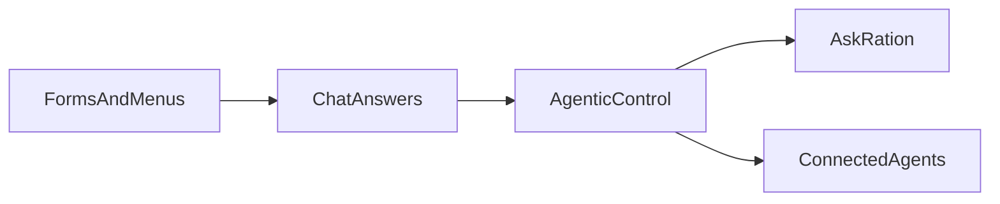
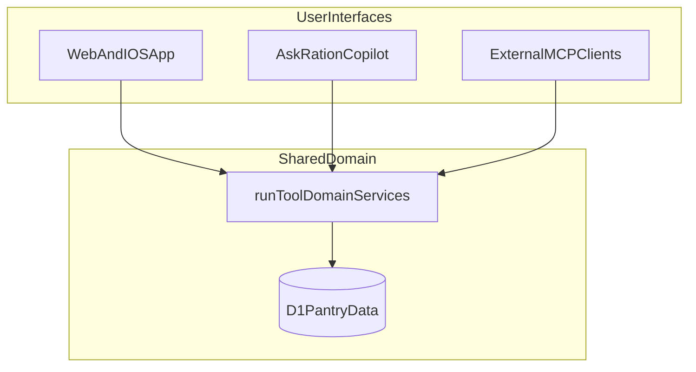

Most AI products still stop at conversation.

You ask a question. You get an answer. Then you go back to the app and do the work yourself.

That gap is closing. The next wave is not smarter chat. It is software that can take action inside the product on your behalf, with the same guardrails you would expect from a well-built UI.

Pantry management is a good place to see this shift early. Inventory, meal plans, and grocery lists are not abstract topics. They are structured operations with real data behind them. That makes them a strong test case for what people are starting to call agentic app control.

---

## What is agentic app control?

Agentic app control means an assistant can do useful work in the product, not just describe how you might do it.

In practice that requires four things working together:

1. A language model that can reason about what you want
2. Structured tools the model can call (list inventory, update a pantry item, read a meal plan)
3. Verified identity so actions stay scoped to your household
4. Safety boundaries so expensive or sensitive flows stay in the right place

A chatbot that only returns text fails the test. An agentic copilot that can check what is expiring in your Cargo, suggest meals from your Galley, and add missing items to your Supply list passes it.

Ration ships both patterns. **Ask Ration** is the built-in copilot. **Connected Agents** is the OAuth MCP path for Claude, Cursor, ChatGPT, and other external clients. Same pantry data. Two ways to reach it.

---

## Why pantry software is a natural fit

Home kitchens run on loops. You stock the pantry. You plan meals. You shop. You cook. Things expire. The loop restarts.

Most apps treat each step as a separate screen. That works, but it adds friction when you are standing in the aisle or staring at a half-empty fridge.

Agentic control fits because the underlying work is already operational:

- "What expires this week?"
- "Add oat milk to Cargo."
- "What can I cook with what I have?"
- "Put the missing ingredients on my Supply list."

Those are not open-ended creative prompts. They are logistics. That is exactly where tool-backed assistants earn trust.

If you have read [Breaking the Meal Planning Loop](/blog/meal-planning-loop), you already know how much of kitchen stress comes from the handoffs between planning, shopping, and cooking. A copilot that can operate across those modules reduces the number of times you have to context-switch.

---

## The interface is moving from forms to action

For years, the default interface for consumer software was forms and menus. You navigated. You tapped. You saved.

Then chat arrived, and products rushed to bolt on a message box. Helpful for FAQs. Less helpful when the user still has to execute every step manually.

Agentic control is the third step. The assistant becomes a control surface for the app itself.

*How kitchen software interfaces have evolved: from manual navigation, to Q&A chat, to assistants that can act on live pantry data.*

You still need screens. Scanning a receipt, reviewing a generated recipe, or approving a week plan benefits from a focused UI. Agentic control does not replace that. It handles the repetitive bridge work between those moments.

---

## Ration Copilot in practice

**Ration Copilot** (labeled **Ask Ration** in the app) is Ration's first-party assistant. It lives in the hub on web and in a native sheet on iOS. You ask in plain language. Copilot calls tools against your live household data and streams the result back.

When Copilot runs a tool, you see activity in Ration's domain language:

- **Cargo** for pantry inventory
- **Galley** for meals and recipes
- **Manifest** for meal plans
- **Supply** for grocery lists

So instead of a generic "searching…" spinner, you get "Checking your Cargo…" or "Matching Galley meals…". Small detail. Meaningful for trust.

Example flows Copilot handles today:

| You say | Copilot can |
| ------- | ----------- |
| "What's expiring soon?" | Query Cargo by expiry window |
| "Add 2 liters of milk" | Write to Cargo |
| "What meals match my pantry?" | Run Galley matching against live inventory |
| "What's on the meal plan this week?" | Read Manifest entries |
| "How do I connect Claude?" | Search Ration docs via managed AI Search |

Copilot is not a separate integration layer. It calls the same domain services as the dashboard and the MCP server. If meal matching logic improves, every entry point benefits.

---

## Two paths, one domain model

Ration's split is intentional: **Ask inside Ration. Or bring your own AI.**

*Copilot, the native UI, and external MCP clients all call the same domain services. No forked business logic.*

External agents connect through OAuth MCP, as described in [Your Kitchen Has an API Now](/blog/mcp-kitchen-assistant) and [Designing a Consumer App for AI Agents](/blog/mcp-consumer-app-architecture). Copilot is session-authenticated and scoped to the signed-in household.

That architecture matters for product trust. You are not maintaining two versions of "what add milk means." You are exposing one model through multiple interfaces.

---

## Safety is part of the design, not an afterthought

Agentic control without boundaries gets expensive and risky fast.

Ration keeps certain AI-heavy flows in native UI on purpose:

- Receipt and image **scan** (vision OCR)
- AI **recipe generation**
- URL **import** for recipes
- AI **week planning**

If you ask Copilot to scan a receipt, it does not pretend to do vision work in chat. It points you to the scan flow with a deep link. Same for recipe generation and week planning. The intent guard keeps credit-consuming features where latency, preview, and billing are predictable.

For write actions, Copilot can request confirmation before destructive changes. External MCP clients use OAuth scopes. Copilot uses verified session identity. Both paths enforce organization scoping on every database query.

---

## What this means if you are not building software

You do not need to care about Durable Objects or tool schemas to benefit from the shift.

You need software that meets you where you already are: mid-shop, mid-cook, mid-week when the plan fell apart.

An in-app copilot that can read your real pantry and update your real lists turns "I should check what we have" into a ten-second interaction. That is the practical promise of agentic control for home cooks and meal planners.

It also pairs well with the waste-reduction angle in [Food Waste Is a Data Pipeline Problem](/blog/food-waste-data-pipeline). When your assistant can see expiry dates and meal plans in one place, you make better decisions before food turns into trash.

---

## Where this is heading

MCP normalized the idea that everyday apps should expose structured tools to external agents. That was a big step.

The next step is first-party copilots that offer the same capability without leaving the product. Users should not have to choose between a good UI and a capable assistant. They should get both.

For operational software (inventory, scheduling, supply chain), agentic control is becoming the default expectation. Kitchen logistics is early territory, but the pattern is clear: less form-filling, more delegated execution, with humans still in charge of the decisions that matter.

Ration's orbital supply chain framing is not just branding. It is a mental model for a closed loop where an assistant can actually help run the loop, not just talk about it.

For the engineering side of how Copilot is built on Cloudflare Think, Workers AI, and AI Search, see [Building Ration Copilot on Cloudflare Think](/blog/building-ration-copilot-cloudflare-think).

---

## Frequently asked questions

**Is Ration Copilot the same as connecting Claude via MCP?**

No, but they share the same backend. Copilot is the built-in assistant inside Ration (Ask Ration). MCP lets external clients like Claude or Cursor connect with OAuth. Both can read and write pantry data through the same tool runtime.

**Does Copilot cost credits?**

Crew households get a small daily allowance of free Copilot conversations. After that, or for free-tier orgs from the first conversation, usage draws from your org credit balance. Billing is per conversation, scaled by token usage, not per message.

**Can Copilot scan my receipts?**

Not in chat. Receipt scanning uses vision models in the native scan flow. If you ask Copilot to scan, it will direct you there. That keeps cost and quality predictable.

**Can Copilot add items to my pantry?**

Yes. Copilot can add and update Cargo items through structured tools, scoped to your household.

**Do I need an external AI tool to use Ration?**

No. Copilot is built in. MCP is optional for people who already live in Claude, Cursor, or ChatGPT and want the pantry connected there too.

**How do I try it?**

Sign up at [ration.mayutic.com](https://ration.mayutic.com), open the hub, and tap **Ask Ration**. To connect an external agent instead, start at [/connect](https://ration.mayutic.com/connect).
