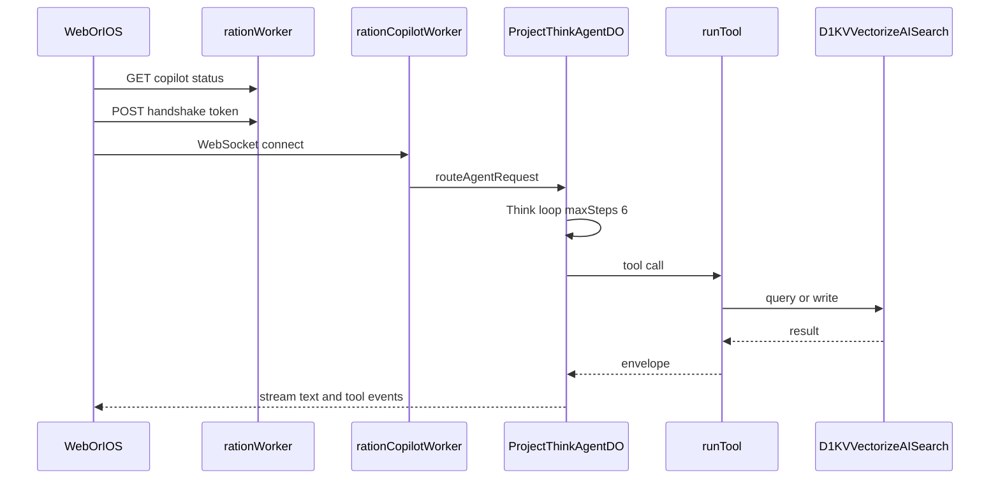
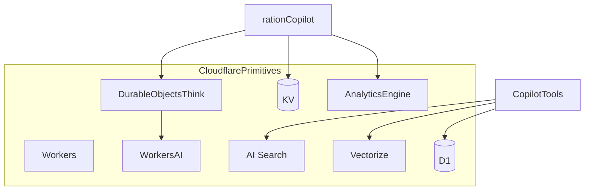
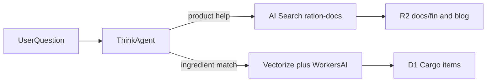

Shipping a first-party AI assistant inside a consumer app sounds straightforward until you list the requirements.

You need streaming responses, durable conversation state, a multi-step tool loop, organization-scoped auth, credit billing, rate limits, a kill switch, and observability. You also need it to stay consistent with the rest of the product. If Copilot adds milk differently than the dashboard does, users will notice.

This post walks through how Ration built **Ration Copilot** (the **Ask Ration** experience) on Cloudflare's edge stack: Project Think, Durable Objects, Workers AI, AI Search, Vectorize, D1, and KV. No separate "AI integration" codebase. One domain model, three Workers.

---

## Three Workers, one domain model

Ration runs three Cloudflare Workers that share bindings and business logic:

| Worker | Host | Role |
| ------ | ---- | ---- |
| `ration` | App domain | React Router app, REST API, copilot status/token routes |
| `ration-mcp` | `mcp.ration.mayutic.com` | External MCP server for Claude, Cursor, ChatGPT, etc. |
| `ration-copilot` | `copilot.ration.mayutic.com` | First-party Ask experience over WebSocket |

The main app handles authentication and billing gates. The copilot worker hosts the Think agent. The MCP worker exposes the broader tool catalog to third-party clients.

Copilot does not call MCP over HTTP. Both paths invoke the same `runTool()` middleware from `app/lib/mcp/tool-runtime.ts`. That is the core design choice. Tool behavior is defined once.

---

## End-to-end request flow

A Copilot session looks like this:

1. The client loads allowance and credit status from `/api/copilot/status` (web) or `/api/mobile/v1/copilot/status` (iOS).
2. Web obtains a 60-second handshake token from `POST /api/copilot/token` and stores it in KV. iOS sends a mobile Bearer token directly.
3. The client opens a WebSocket to `wss://copilot.ration.mayutic.com/copilot/{conversationId}`.
4. The copilot worker authenticates, checks the `ration-copilot` Flagship flag, rate-limits the connection, opens or resumes billing for the conversation, and routes to a Durable Object.
5. The Think agent runs a tool loop (up to six steps), streams events back, and reconciles token usage into credits.



*Copilot status and tokens go through the main app. The agent loop runs in a dedicated worker and Durable Object.*

---

## Project Think on Durable Objects

The agent class lives in `workers/copilot.ts` as `ProjectThinkAgent`, extending Cloudflare's `Think` class from `@cloudflare/think`.

Key configuration:

- **Model:** `@cf/moonshotai/kimi-k2.6` via Workers AI
- **Tool loop:** `maxSteps: 6` per user turn
- **Workspace bash:** disabled (`workspaceBash = false`)
- **DO identity:** `{orgId}:{userId}:{tier}:{conversationId}`

Each conversation maps to one Durable Object instance. Think persists session state there. KV stores billing metadata and a conversation-to-DO name index, not the full chat transcript.

Lifecycle hooks cover the operational concerns:

- `beforeTurn` enforces rate limits, session message caps (40), token caps (60,000), and intent guard checks for blocked features
- `beforeToolCall` / `afterToolCall` emit Analytics Engine events
- `onStepFinish` reconciles cumulative token usage into credit charges

There is no separate chain-of-thought channel exposed to clients. Users see **Copilot is thinking** between messages and tool-specific labels like **Checking your Cargo…** while tools run.

---

## Tool runtime: MCP semantics without the HTTP hop

Copilot wraps domain handlers through `toAiSdkTools()` in `app/lib/copilot/tools.server.ts`. Each tool definition includes a Zod input schema, a description, and an `execute` function that calls `runTool()`.

Copilot impersonates an internal MCP context:

- `authMethod: "oauth"`
- `keyName: "Ration Copilot"`
- Full write scopes: `mcp:read`, `mcp:inventory:write`, `mcp:galley:write`, `mcp:manifest:write`, `mcp:supply:write`, `mcp:preferences:write`

The current Copilot tool surface is an 11-tool subset of the full MCP catalog:

| Tool | Backend primitive |
| ---- | ----------------- |
| `search_docs` | Cloudflare AI Search (`ration-docs` instance) |
| `search_ingredients` | Workers AI embeddings + Vectorize, D1 hydration |
| `list_inventory` | D1 |
| `get_cargo_item` | D1 |
| `get_expiring_items` | D1 |
| `get_supply_list` | D1 |
| `get_meal_plan` | D1 |
| `list_meals` | D1 |
| `match_meals` | D1 + matching service |
| `add_cargo_item` | D1 write |
| `update_cargo_item` | D1 write |

External MCP clients can call a wider set of tools (supply writes, meal CRUD, preferences, and more). Copilot starts with the highest-frequency pantry workflows. Expanding the subset is a configuration change, not a new integration.

For the external MCP architecture, see [Designing a Consumer App for AI Agents](/blog/mcp-consumer-app-architecture). For the trend-level view of why a first-party copilot exists alongside MCP, see [Agentic App Control Is the Next Interface](/blog/agentic-app-control-copilot).

---

## Cloudflare primitives map



*Copilot's dedicated worker routes to Think DOs. Tools fan out to the retrieval and data bindings.*

Bindings come from `wrangler.copilot.jsonc`:

- `PROJECT_THINK` Durable Object namespace
- `DB` D1 database
- `RATION_KV` KV namespace
- `AI` Workers AI
- `VECTORIZE` index (`ration-cargo`)
- `AI_SEARCH` namespace (default)
- `COPILOT_ANALYTICS` Analytics Engine dataset
- `FLAGS` Flagship feature flags

---

## Retrieval: AI Search for docs, Vectorize for pantry

Copilot uses two different retrieval paths depending on what you ask.

### AI Search for product knowledge

The `search_docs` tool queries Cloudflare AI Search instance `ration-docs`. Source content lives in R2 bucket `ration-copilot-docs`, synced from `docs/fin/` (support articles) and `content/blog/` (this blog).

Ration does not implement chunking, BM25, hybrid scoring, or reranking in application code. The worker calls the managed `AI_SEARCH.search()` API with hybrid retrieval and reranking enabled. After docs or blog changes, a GitLab `ai_search_sync` job uploads Markdown to R2 and triggers reindexing.

This is the same content surface that powers `/llms.txt` and `/llms-full.txt` for external AI crawlers. Copilot grounds answers in the same corpus.

### Vectorize for ingredient semantics

The `search_ingredients` tool embeds query text with Workers AI (`@cf/google/embeddinggemma-300m`), searches Vectorize within the organization's namespace, and hydrates hits from D1 before returning results.

That path is shared with meal matching and deduplication elsewhere in the app. For a deeper dive, see [How Ration Uses Cloudflare Vectorize for Semantic Pantry Search](/blog/cloudflare-vectorize-semantic-pantry-search).



*Think chooses retrieval based on tool selection: docs corpus via AI Search, live pantry via Vectorize.*

---

## Auth, billing, and kill switches

**Web auth:** Better Auth session cookie, or a one-time handshake token (KV, 60-second TTL) exchanged for a WebSocket connection.

**iOS auth:** Mobile Bearer JWT with org membership assertion.

Identity always includes a verified `organizationId`. Client-supplied org IDs are never trusted.

**Billing model:**

- Crew orgs: 3 free Copilot conversations per UTC day (KV allowance)
- After allowance: requires auto-deduct consent (crew) or credits from the first conversation (free tier)
- Per conversation: 1-credit floor, reconciled upward by token brackets at 12k, 30k, and 60k cumulative tokens
- Not per message

**Kill switch:** Flagship flag `ration-copilot` gates the feature server-side. UI-only hiding is not sufficient.

**Blocked intents:** Regex intent guard in `app/lib/copilot/intent-guard.server.ts` detects requests for receipt scan, AI recipe generation, URL import, and AI week planning. Copilot responds with guidance and a deep link to the native flow instead of attempting the action in chat.

---

## Observability and session limits

Analytics Engine records events like `conversation_open`, `tool_start`, `tool_end`, `usage_reconciled`, and `blocked_feature`. Organization ID is the sampling index. User ID travels in a blob field for queryability without logging PII to stdout.

Session caps prevent runaway cost:

| Limit | Value |
| ----- | ----- |
| Max messages | 40 |
| Max tokens | 60,000 |
| Idle TTL | 20 minutes (KV conversation keys) |

Rate limiting uses the same `checkRateLimit()` helper as other AI endpoints.

---

## What we deliberately did not build

A few things are worth naming because absence is a design decision:

1. **Custom RAG pipeline.** AI Search handles docs retrieval. Vectorize handles pantry semantics. No LangChain-style orchestration in app code.
2. **HTTP MCP hop for Copilot.** Tools call domain handlers directly. Lower latency, fewer failure modes.
3. **Per-message billing.** Conversations are the billing unit. Token brackets scale cost within a session.
4. **Visible chain-of-thought.** Users see phase labels, not raw reasoning tokens.

These choices keep the copilot worker small and keep behavior aligned with the main app and MCP server.

---

## Local development and deploy

```sh
bun run dev:copilot      # Local copilot worker with remote bindings
bun run deploy:copilot   # Deploy ration-copilot
```

The copilot worker bundles `workers/copilot.ts` directly via Wrangler. It does not depend on the React Router build artifact.

Before enabling `ration-copilot` in production, verify AI Search indexing:

```sh
wrangler ai-search stats ration-docs
wrangler ai-search search ration-docs --query "How do I connect an agent?"
```

---

## Frequently asked questions

**Why a separate copilot worker instead of routing through the main app?**

WebSocket agent sessions, Durable Object routing, and long-lived Think loops benefit from isolation. The main app handles HTTP loaders and actions. Copilot handles streaming agent protocol. Shared bindings keep data access identical.

**Why Project Think instead of calling Workers AI directly from a route?**

Think provides the multi-step tool loop, Durable Object state, streaming protocol, and lifecycle hooks Copilot needs. Building that from scratch on every AI feature would duplicate framework work Cloudflare already ships.

**How does AI Search differ from Vectorize in Copilot?**

AI Search retrieves documentation and blog content from a managed R2-backed index. Vectorize retrieves semantically similar pantry items for a specific household. Different data, different tools, same agent.

**Does Copilot use the same code as the MCP server?**

Yes, for tool execution. `runTool()` is shared. MCP adds OAuth, API keys, and the full tool catalog surface. Copilot adds session auth and a curated tool subset.

**What model does Copilot use?**

`@cf/moonshotai/kimi-k2.6` through Workers AI, configured in `ProjectThinkAgent.getModel()`.

**How do I connect an external agent instead of using Copilot?**

Use OAuth MCP at [ration.mayutic.com/connect](https://ration.mayutic.com/connect). See [Your Kitchen Has an API Now](/blog/mcp-kitchen-assistant) for setup steps.
