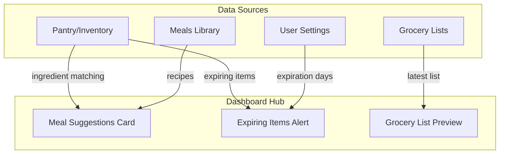
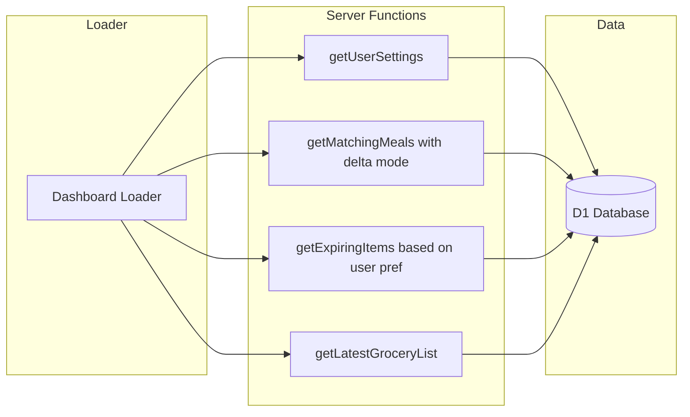

# Dashboard Restructure Plan

## Overview

Restructure the Ration app navigation to create a new AI-driven Dashboard as the home page, separating out the Pantry/Inventory management to its own route.

## Current vs. New Structure

### Current Navigation
```
/dashboard (index) → Inventory/Cargo Hold (ingredients)
/dashboard/meals → Meal Library
/dashboard/grocery → Grocery Lists
/dashboard/settings → Settings
```

### New Navigation
```
/dashboard (index) → Dashboard Hub (aggregated overview)
/dashboard/pantry → Pantry (inventory/ingredients) ← Scan goes here
/dashboard/meals → Meal Library
/dashboard/grocery → Grocery Lists
/dashboard/settings → Settings (now includes expiration alert config)
```

## Dashboard Hub Design

The new Dashboard Hub is the command center - a self-populating overview that shows:

1. **Meal Suggestions Card** - Top priority, card-view of meals user can make
2. **Expiring Items Alert** - Items expiring within user-configured timeframe
3. **Latest Grocery List Preview** - Quick view of most recent shopping list



## Component Architecture

### New Components to Create

| Component | Location | Purpose |
|-----------|----------|---------|
| `MealSuggestionsCard` | `app/components/dashboard/MealSuggestionsCard.tsx` | Shows top 3-6 makeable meals as cards |
| `ExpiringItemsCard` | `app/components/dashboard/ExpiringItemsCard.tsx` | Alert list of items expiring soon |
| `GroceryPreviewCard` | `app/components/dashboard/GroceryPreviewCard.tsx` | Preview of latest grocery list |

### Modified Components

| Component | Changes |
|-----------|---------|
| `BottomNav.tsx` | Add Pantry icon, reorder nav |
| `RailSidebar.tsx` | Add Pantry icon, reorder nav, redirect Scan FAB |

## Route Data Flow



## User Settings Extension

Add new field to user settings JSON:

```typescript
interface UserSettings {
  // existing fields...
  expirationAlertDays?: number; // default: 7
}
```

## Navigation Order

| Position | Route | Icon | Label |
|----------|-------|------|-------|
| 1 | `/dashboard` | home | Dashboard |
| 2 | `/dashboard/pantry` | package/box | Pantry |
| 3 | `/dashboard/meals` | chef-hat | Meals |
| 4 | `/dashboard/grocery` | shopping-cart | Grocery |
| 5 | `/dashboard/settings` | settings | Settings |

**Scan FAB**: Links to `/dashboard/pantry` (where scan adds ingredients)

## Dashboard Layout Mockup

```
┌─────────────────────────────────────────────────────────┐
│  DASHBOARD HUB                        [User] [Credits]  │
├─────────────────────────────────────────────────────────┤
│                                                         │
│  ┌─────────────────────────────────────────────────┐   │
│  │  🍳 MEALS YOU CAN MAKE                          │   │
│  │  ┌─────────┐ ┌─────────┐ ┌─────────┐           │   │
│  │  │ Pasta   │ │ Stir Fry│ │ Salad   │ → See All │   │
│  │  │ 100%    │ │ 85%     │ │ 75%     │           │   │
│  │  └─────────┘ └─────────┘ └─────────┘           │   │
│  └─────────────────────────────────────────────────┘   │
│                                                         │
│  ┌───────────────────────┐ ┌─────────────────────────┐ │
│  │  ⚠️ EXPIRING SOON     │ │  🛒 GROCERY LIST        │ │
│  │  • Milk - 2 days      │ │  Weekly Shopping        │ │
│  │  • Eggs - 5 days      │ │  ────────────────────   │ │
│  │  • Bread - 6 days     │ │  ☐ Tomatoes x4          │ │
│  │                       │ │  ☐ Chicken breast       │ │
│  │  → Manage Pantry      │ │  ☑ Olive oil            │ │
│  └───────────────────────┘ │  → View Full List       │ │
│                            └─────────────────────────┘ │
└─────────────────────────────────────────────────────────┘
```

## Implementation Sequence

1. **Phase 1: Create Infrastructure**
   - Create `/dashboard/pantry.tsx` route with existing inventory code
   - Update `/dashboard/index.tsx` to be new dashboard hub
   - Add `expirationAlertDays` to user settings schema

2. **Phase 2: Build Dashboard Cards**
   - Create `MealSuggestionsCard` component
   - Create `ExpiringItemsCard` component
   - Create `GroceryPreviewCard` component

3. **Phase 3: Server Logic**
   - Create `getExpiringItems()` server function
   - Update dashboard loader to fetch all aggregated data

4. **Phase 4: Navigation Updates**
   - Update `BottomNav.tsx` with new nav items and order
   - Update `RailSidebar.tsx` with new nav items and order
   - Redirect Scan FAB to `/dashboard/pantry`

5. **Phase 5: Settings Integration**
   - Add expiration alert days slider/input to settings page

## Files to Create

- `app/routes/dashboard/pantry.tsx` - New pantry route
- `app/components/dashboard/MealSuggestionsCard.tsx` - Meal suggestions
- `app/components/dashboard/ExpiringItemsCard.tsx` - Expiring items
- `app/components/dashboard/GroceryPreviewCard.tsx` - Grocery preview

## Files to Modify

- `app/routes/dashboard/index.tsx` - Complete rewrite for new dashboard
- `app/routes/dashboard/settings.tsx` - Add expiration days setting
- `app/components/shell/BottomNav.tsx` - New nav structure
- `app/components/shell/RailSidebar.tsx` - New nav structure + scan redirect
- `app/lib/inventory.server.ts` - Add getExpiringItems function
