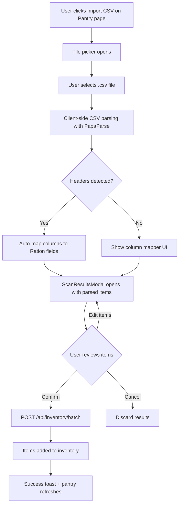

# Domain Column & CSV Import — Architecture Plan

## Feature A: Domain Column on Inventory, Meal, and Grocery Item

### Problem Statement

All inventory items, meals, and grocery items are currently implicitly "food". There is no way to distinguish household goods (laundry detergent, dish soap) or alcohol from food items. Adding a `domain` discriminator column enables domain filtering, domain-specific UI contexts, and the future alcohol/cocktail vertical — all without duplicating tables or server functions.

### Design Decision: Single Column, Three Values

Add a `domain` column to three tables: `inventory`, `meal`, and `grocery_item`. The column is a text enum with values `food | household | alcohol`.

- **Default:** `food` — all existing rows are food, migration sets the default.
- **Household items** don't have "meals" or "recipes". They participate in the Supply list directly via the existing manual-add or future "staple items" concept.
- **Alcohol items** mirror food: inventory = liquor cabinet, meals = cocktail recipes, list = what booze to buy.

### Migration SQL

```sql
ALTER TABLE inventory ADD COLUMN domain TEXT NOT NULL DEFAULT 'food';
ALTER TABLE meal ADD COLUMN domain TEXT NOT NULL DEFAULT 'food';
ALTER TABLE grocery_item ADD COLUMN domain TEXT NOT NULL DEFAULT 'food';

CREATE INDEX inventory_domain_idx ON inventory (organization_id, domain);
CREATE INDEX meal_domain_idx ON meal (organization_id, domain);
CREATE INDEX grocery_item_domain_idx ON grocery_item (list_id, domain);
```

This is fully backwards-compatible — existing rows get `food` by default, no data loss.

### Drizzle Schema Changes

#### [`app/db/schema.ts`](../app/db/schema.ts) — inventory table

Add after `category`:
```typescript
domain: text("domain").notNull().default("food"),
```

Add new index:
```typescript
index("inventory_domain_idx").on(table.organizationId, table.domain),
```

#### [`app/db/schema.ts`](../app/db/schema.ts) — meal table

Add after `name`:
```typescript
domain: text("domain").notNull().default("food"),
```

Add new index:
```typescript
index("meal_domain_idx").on(table.organizationId, table.domain),
```

#### [`app/db/schema.ts`](../app/db/schema.ts) — grocery_item table

Add after `category`:
```typescript
domain: text("domain").notNull().default("food"),
```

Add new index:
```typescript
index("grocery_item_domain_idx").on(table.listId, table.domain),
```

### Shared Constants

Create a new file [`app/lib/domain.ts`](../app/lib/domain.ts):

```typescript
export const ITEM_DOMAINS = ["food", "household", "alcohol"] as const;
export type ItemDomain = (typeof ITEM_DOMAINS)[number];

export const DOMAIN_LABELS: Record<ItemDomain, string> = {
  food: "Food",
  household: "Household",
  alcohol: "Alcohol",
};

export const DOMAIN_ICONS: Record<ItemDomain, string> = {
  food: "🥩",
  household: "🧹",
  alcohol: "🍸",
};
```

### Zod Schema Updates

#### [`app/lib/inventory.server.ts`](../app/lib/inventory.server.ts) — InventoryItemSchema

Add `domain` field:
```typescript
domain: z.enum(ITEM_DOMAINS).default("food"),
```

This means the `addItem` and `updateItem` functions automatically support domain via their existing Zod pipeline.

#### [`app/lib/schemas/scan.ts`](../app/lib/schemas/scan.ts) — BatchAddInventorySchema

Add `domain` field to the item schema:
```typescript
domain: z.enum(ITEM_DOMAINS).default("food"),
```

#### [`app/lib/schemas/meal.ts`](../app/lib/schemas/meal.ts) — MealSchema

Add `domain` field:
```typescript
domain: z.enum(ITEM_DOMAINS).default("food"),
```

### Server Logic Changes

#### [`app/lib/inventory.server.ts`](../app/lib/inventory.server.ts) — `addItem()`

Include `domain` in the insert values (it already flows through the Zod-validated `data` object). Same for `updateItem()`.

#### [`app/lib/inventory.server.ts`](../app/lib/inventory.server.ts) — `getInventory()`

Currently fetches all items for an org. Add an optional `domain` filter parameter:

```typescript
export async function getInventory(
  db: D1Database,
  organizationId: string,
  domain?: ItemDomain,
) {
  const d1 = drizzle(db);
  const conditions = [eq(inventory.organizationId, organizationId)];
  if (domain) conditions.push(eq(inventory.domain, domain));
  return await d1
    .select()
    .from(inventory)
    .where(and(...conditions))
    .orderBy(desc(inventory.createdAt));
}
```

#### [`app/lib/meals.server.ts`](../app/lib/meals.server.ts) — `getMeals()`

Add optional `domain` filter, same pattern as above. Store `domain` on create/update.

#### [`app/lib/grocery.server.ts`](../app/lib/grocery.server.ts) — `createGroceryListFromSelectedMeals()`

When inserting grocery items, copy the `domain` from the source meal/ingredient. For manual adds, default to `food`.

#### [`app/routes/api/inventory.batch.ts`](../app/routes/api/inventory.batch.ts)

Include `domain` in the SQL INSERT statement (currently hardcoded column list). Pass through from the validated schema.

### UI Changes

#### Pantry Page — [`app/routes/dashboard/pantry.tsx`](../app/routes/dashboard/pantry.tsx)

Add a **domain filter** alongside the existing category filter. This could be filter chips at the top:

```
[ All | 🥩 Food | 🧹 Household | 🍸 Alcohol ]
```

The loader accepts an optional `domain` query parameter and passes to `getInventory()`. Client-side filtering is also fine since the dataset is typically small.

#### IngestForm — [`app/components/cargo/IngestForm.tsx`](../app/components/cargo/IngestForm.tsx)

Add a domain selector (hidden by default under "More Details"). When on the pantry page with a domain filter active, auto-set the domain on new items.

#### Galley Page — [`app/routes/dashboard/meals.tsx`](../app/routes/dashboard/meals.tsx)

Add a domain filter alongside the existing tag filter. When `domain=alcohol` is selected, the page effectively becomes a "Cocktail Recipes" view.

#### Supply Page — [`app/routes/dashboard/grocery.tsx`](../app/routes/dashboard/grocery.tsx)

The Supply list shows all domains. Add domain filter chips to let users focus on food-only, household-only, etc. Group items by domain in the UI with section headers.

### Edge Cases

- **Domain change on existing item:** A user can edit an item and change its domain. No cascade effects needed — inventory items are standalone.
- **Meal ingredient from different domain:** A cocktail recipe might use a lime from the food domain. This is fine — meal ingredients reference by name, not by domain. The domain on the meal itself determines which "view" it appears in.
- **Grocery item domain:** When generated from a meal, inherit the meal's domain. When manually added, default to `food` (or the currently active domain filter).

---

## Feature B: CSV Import for Inventory

### Problem Statement

The biggest friction point is initial inventory population. Currently users must either manually add items one-by-one via [`IngestForm`](../app/components/cargo/IngestForm.tsx) or use the photo scan (which handles only small batches). A CSV import allows bulk loading of an entire pantry in one operation.

### User Flow



### CSV Format Support

#### Minimal format — auto-detected:
```csv
name,quantity,unit
olive oil,1,l
rice,2,kg
chicken breast,500,g
```

#### Extended format with optional columns:
```csv
name,quantity,unit,category,domain,tags,expires
olive oil,1,l,liquid,food,cooking,2026-06-01
laundry detergent,1,unit,other,household,,
rum,750,ml,liquid,alcohol,dark;spiced,
```

#### Auto-detect rules:
1. First row is treated as headers if entries match known column names
2. If first row is NOT headers, assume `name,quantity,unit` order
3. Column names are case-insensitive and support aliases: `item`→`name`, `qty`→`quantity`, `amount`→`quantity`, `expire`→`expires`

### Architecture

#### New File: `app/lib/csv-parser.ts`

Client-side CSV parsing utility. No server-side parsing needed — CSV is parsed in the browser, validated, and sent as JSON to the existing batch endpoint.

```typescript
export interface CsvParseResult {
  items: ParsedCsvItem[];
  warnings: string[];
  headerMapping: Record<string, string>;
}

export interface ParsedCsvItem {
  name: string;
  quantity: number;
  unit: string;
  category?: string;
  domain?: string;
  tags?: string[];
  expiresAt?: string;
}

export function parseInventoryCsv(csvText: string): CsvParseResult;
```

The parser:
1. Splits the text by newlines, respects quoted values
2. Detects header row vs raw data
3. Maps columns to Ration fields using alias lookup
4. Validates each row (name required, quantity must be numeric)
5. Returns items + warnings for any rows that couldn't be parsed

**No external dependency needed.** A simple split-based parser handles standard CSV. If we encounter edge cases with quoted commas, we can add a lightweight CSV lib later. The parsing runs entirely client-side.

#### New Component: `app/components/cargo/CsvImportButton.tsx`

A button + hidden file input that:
1. Accepts `.csv` and `.tsv` files
2. Reads the file as text using `FileReader`
3. Calls `parseInventoryCsv()` to get items
4. Converts items to `ScanResultItem[]` format (same as photo scan results)
5. Opens the existing [`ScanResultsModal`](../app/components/scanner/ScanResultsModal.tsx) with the parsed items

This is key: **we reuse the existing review modal.** No new modal needed. The user gets the same review/edit experience whether items came from a photo scan or CSV import.

#### Modify: `ScanResultsModal` to accept domain

The [`ScanResultsModal`](../app/components/scanner/ScanResultsModal.tsx) currently shows name, quantity, unit, category, expiry. Add a domain column/selector so users can set the domain during review.

Also update the `ScanResultItemSchema` to include `domain`:
```typescript
domain: z.enum(ITEM_DOMAINS).default("food"),
```

#### Modify: `app/routes/api/inventory.batch.ts`

Update the raw SQL INSERT to include the `domain` column. The batch schema already gets the `domain` field from the updated `BatchAddInventorySchema`.

Current INSERT:
```sql
INSERT INTO inventory (id, organization_id, name, quantity, unit, category, status, tags, created_at, updated_at)
```

New INSERT:
```sql
INSERT INTO inventory (id, organization_id, name, quantity, unit, category, domain, status, tags, created_at, updated_at)
```

#### Modify: Pantry Page toolbar

Add the CSV import button next to the existing `CameraInput`:

```typescript
<PanelToolbar
  primaryAction={
    <div className="flex gap-2">
      <CameraInput onScanComplete={handleScanComplete} />
      <CsvImportButton onImportComplete={handleImportComplete} />
    </div>
  }
  ...
/>
```

### Column Mapping Logic

```typescript
const COLUMN_ALIASES: Record<string, string> = {
  // name aliases
  name: "name",
  item: "name",
  product: "name",
  ingredient: "name",
  // quantity aliases
  quantity: "quantity",
  qty: "quantity",
  amount: "quantity",
  count: "quantity",
  // unit aliases
  unit: "unit",
  uom: "unit",
  measure: "unit",
  // category aliases
  category: "category",
  type: "category",
  // domain aliases
  domain: "domain",
  // tags aliases
  tags: "tags",
  tag: "tags",
  labels: "tags",
  // expiry aliases
  expires: "expiresAt",
  expiry: "expiresAt",
  expiration: "expiresAt",
  expires_at: "expiresAt",
  best_before: "expiresAt",
};
```

### Validation Rules

Per-row validation:
- `name` is required and must be non-empty after trimming
- `quantity` must be a positive number; if missing defaults to `1`
- `unit` must be one of the known units; if unrecognized defaults to `unit`
- `category` is optional; if unrecognized defaults to `other`
- `domain` is optional; defaults to `food`
- `tags` are optional; if present, split by `;` or `,`
- `expiresAt` is optional; if present, must be a valid date (YYYY-MM-DD)

Rows that fail validation are included in `warnings` but excluded from `items`.

### Size Limits

- Max file size: **1 MB** (prevents accidental large file uploads)
- Max rows: **500 items per import** (prevents DB overload; matches batch endpoint limits)
- Processing is entirely client-side, so no Worker CPU concerns

---

## Files to Create or Modify

### Feature A: Domain Column

#### New Files
| File | Purpose |
|------|---------|
| `app/lib/domain.ts` | Domain constants, types, labels, icons |
| Migration SQL (auto-generated by drizzle-kit) | `ALTER TABLE` for domain columns + indexes |

#### Modified Files
| File | Change |
|------|--------|
| [`app/db/schema.ts`](../app/db/schema.ts) | Add `domain` column to inventory, meal, grocery_item |
| [`app/lib/inventory.ts`](../app/lib/inventory.ts) | Export ITEM_DOMAINS if needed alongside INVENTORY_CATEGORIES |
| [`app/lib/inventory.server.ts`](../app/lib/inventory.server.ts) | Add `domain` to InventoryItemSchema, `getInventory()` filter param, `addItem()` / `updateItem()` pass-through |
| [`app/lib/schemas/scan.ts`](../app/lib/schemas/scan.ts) | Add `domain` to BatchAddInventorySchema and ScanResultItemSchema |
| [`app/lib/schemas/meal.ts`](../app/lib/schemas/meal.ts) | Add `domain` to MealSchema |
| [`app/lib/meals.server.ts`](../app/lib/meals.server.ts) | Store/filter `domain` on create/update/get |
| [`app/lib/grocery.server.ts`](../app/lib/grocery.server.ts) | Copy domain when generating grocery items from meals |
| [`app/routes/api/inventory.batch.ts`](../app/routes/api/inventory.batch.ts) | Add `domain` to INSERT SQL |
| [`app/routes/dashboard/pantry.tsx`](../app/routes/dashboard/pantry.tsx) | Add domain filter chips UI |
| [`app/components/cargo/IngestForm.tsx`](../app/components/cargo/IngestForm.tsx) | Add domain field |
| [`app/routes/dashboard/meals.tsx`](../app/routes/dashboard/meals.tsx) | Add domain filter |
| [`app/routes/dashboard/grocery.tsx`](../app/routes/dashboard/grocery.tsx) | Add domain filter chips for list items |
| [`app/components/scanner/ScanResultsModal.tsx`](../app/components/scanner/ScanResultsModal.tsx) | Add domain selector to item review |

### Feature B: CSV Import

#### New Files
| File | Purpose |
|------|---------|
| `app/lib/csv-parser.ts` | Client-side CSV parsing + column mapping |
| `app/components/cargo/CsvImportButton.tsx` | File input + CSV parse trigger + modal bridge |

#### Modified Files
| File | Change |
|------|--------|
| [`app/routes/dashboard/pantry.tsx`](../app/routes/dashboard/pantry.tsx) | Add CsvImportButton to toolbar |
| [`app/components/scanner/ScanResultsModal.tsx`](../app/components/scanner/ScanResultsModal.tsx) | Ensure it works for CSV-sourced items (domain, source metadata) |

---

## Implementation Order

The features should be implemented in this order because CSV import benefits from the domain column being available:

### Phase 1: Domain Column
1. Create `app/lib/domain.ts` with constants and types
2. Add `domain` column to inventory, meal, and grocery_item in `schema.ts`
3. Run `bun run db:generate` to create migration
4. Update `InventoryItemSchema` in `inventory.server.ts` to include domain
5. Update `addItem()` and `updateItem()` to pass domain through
6. Update `getInventory()` with optional domain filter
7. Update `BatchAddInventorySchema` in `schemas/scan.ts`
8. Update `ScanResultItemSchema` in `schemas/scan.ts`
9. Update `MealSchema` in `schemas/meal.ts`
10. Update `createMeal()` / `updateMeal()` in `meals.server.ts`
11. Update `getMeals()` with optional domain filter
12. Update grocery item generation to copy domain from meals
13. Update `inventory.batch.ts` INSERT SQL to include domain
14. Add domain filter chips to Pantry page UI
15. Add domain field to IngestForm
16. Add domain filter to Galley page
17. Add domain filter chips to Supply page
18. Add domain selector to ScanResultsModal

### Phase 2: CSV Import
19. Create `app/lib/csv-parser.ts` with parseInventoryCsv function
20. Create `app/components/cargo/CsvImportButton.tsx`
21. Integrate CsvImportButton into Pantry page toolbar
22. Test end-to-end: CSV file → parse → review modal → batch add → inventory

---

## Expected Outcomes

### Domain Column
- Users can classify items as food, household, or alcohol
- Pantry and Galley pages can filter by domain
- Supply list groups items by domain with section headers
- Foundation laid for the cocktail vertical (domain=alcohol meals)
- Adding household goods to inventory no longer feels out of place

### CSV Import
- Users can bulk-load their entire pantry from a spreadsheet
- The biggest onboarding friction (initial inventory population) is eliminated
- CSV items go through the same review modal as photo scan results
- Domain column is available during CSV import review
- No credits consumed (CSV parsing is free, client-side)
