# Group Sharing - Production Readiness Implementation Plan

## Objective
Address all critical, high, and medium priority issues identified in the code review to ensure the Group Sharing feature is production-ready with proper security, data integrity, and user experience.

---

## Phase 1: Critical Fixes (MUST COMPLETE BEFORE DEPLOY)
**Estimated Time**: 4-5 hours  
**Priority**: 🔴 CRITICAL

### 1.1 Database Schema Cleanup
**File**: [`app/db/schema.ts`](../app/db/schema.ts)

Remove the deprecated `user.credits` column:
```typescript
export const user = sqliteTable("user", {
  id: text("id").primaryKey(),
  name: text("name").notNull(),
  email: text("email").notNull().unique(),
  emailVerified: integer("email_verified", { mode: "boolean" }).notNull(),
  image: text("image"),
  createdAt: integer("created_at", { mode: "timestamp" }).notNull(),
  updatedAt: integer("updated_at", { mode: "timestamp" }).notNull(),
  settings: text("settings", { mode: "json" }).default("{}"),
  // REMOVE: credits: integer("credits").default(0),
});
```

**Create Migration**: [`drizzle/0007_remove_user_credits.sql`](../drizzle/)
```sql
-- Remove credits column from user table
-- NOTE: Ensure data migration (0006) has completed successfully before running
ALTER TABLE user DROP COLUMN credits;
```

**Justification**: Credits are now managed at organization level. Keeping this column could cause confusion and data inconsistency.

---

### 1.2 Personal Organization Auto-Activation
**File**: [`app/lib/auth.server.ts`](../app/lib/auth.server.ts)

Implement automatic activation of personal organization on session creation:

```typescript
databaseHooks: {
  user: {
    create: {
      after: async (user) => {
        try {
          const db = drizzle(env.DB, { schema });
          
          // Create personal organization
          const personalOrgId = crypto.randomUUID();
          await db.insert(schema.organization).values({
            id: personalOrgId,
            name: `${user.name || "My"}'s Personal Group`,
            slug: `personal-${user.id}`,
            metadata: { isPersonal: true },
            credits: 0,
            createdAt: new Date(),
          });

          // Add user as owner
          await db.insert(schema.member).values({
            id: crypto.randomUUID(),
            organizationId: personalOrgId,
            userId: user.id,
            role: 'owner',
            createdAt: new Date(),
          });

          console.log(`[Auth] Created personal group for user ${user.id}`);
        } catch (error) {
          console.error(`[Auth] Failed to create personal group:`, error);
        }
      },
    },
  },
  session: {
    create: {
      after: async (session, user) => {
        try {
          // Auto-set active organization if not already set
          if (!session.activeOrganizationId) {
            const db = drizzle(env.DB, { schema });
            
            // Find user's personal group
            const personalGroup = await db.query.organization.findFirst({
              where: (org, { like }) => like(org.slug, `personal-${user.id}`),
            });

            if (personalGroup) {
              await db
                .update(schema.session)
                .set({ activeOrganizationId: personalGroup.id })
                .where(eq(schema.session.id, session.id));
              
              console.log(`[Auth] Auto-activated personal group for session ${session.id}`);
            }
          }
        } catch (error) {
          console.error(`[Auth] Failed to auto-activate group:`, error);
        }
      },
    },
  },
}
```

**Benefits**:
- Users never see empty state on first login
- Seamless onboarding experience
- No manual group selection needed for new users

---

### 1.3 Comprehensive User Purge Implementation
**File**: [`app/routes/api/user/purge.tsx`](../app/routes/api/user/purge.tsx)

Replace the incomplete implementation with proper organization cleanup:

```typescript
export async function action({ request, context }: Route.ActionArgs) {
  const { user } = await requireAuth(context, request);
  const userId = user.id;

  const env = context.cloudflare.env;
  const db = drizzle(env.DB, { schema });

  await db.transaction(async (tx) => {
    // 1. Handle owned organizations
    const ownedMemberships = await tx
      .select()
      .from(schema.member)
      .where(and(
        eq(schema.member.userId, userId),
        eq(schema.member.role, 'owner')
      ));

    for (const membership of ownedMemberships) {
      const org = await tx.query.organization.findFirst({
        where: eq(schema.organization.id, membership.organizationId),
      });

      if (!org) continue;

      // Check if personal organization
      const metadata = org.metadata as { isPersonal?: boolean } | null;
      const isPersonal = metadata?.isPersonal === true;

      if (isPersonal) {
        // Delete personal organization (cascades to data via FK)
        await tx
          .delete(schema.organization)
          .where(eq(schema.organization.id, org.id));
        
        console.log(`[Purge] Deleted personal organization: ${org.id}`);
      } else {
        // For shared organizations, count remaining members
        const memberCount = await tx
          .select({ count: schema.member.id })
          .from(schema.member)
          .where(eq(schema.member.organizationId, org.id));

        if (memberCount.length <= 1) {
          // Last member - delete organization
          await tx
            .delete(schema.organization)
            .where(eq(schema.organization.id, org.id));
          
          console.log(`[Purge] Deleted empty shared organization: ${org.id}`);
        } else {
          // Transfer ownership to next admin/member
          const nextOwner = await tx.query.member.findFirst({
            where: and(
              eq(schema.member.organizationId, org.id),
              eq(schema.member.role, 'admin')
            ),
          });

          if (nextOwner) {
            await tx
              .update(schema.member)
              .set({ role: 'owner' })
              .where(eq(schema.member.id, nextOwner.id));
            
            console.log(`[Purge] Transferred ownership of ${org.id} to ${nextOwner.userId}`);
          }
        }
      }
    }

    // 2. Remove from all other memberships
    await tx
      .delete(schema.member)
      .where(eq(schema.member.userId, userId));

    // 3. Delete ledger entries (audit trail - userId is nullable now)
    await tx
      .delete(schema.ledger)
      .where(eq(schema.ledger.userId, userId));

    // 4. Delete auth-related data
    await tx.delete(schema.session).where(eq(schema.session.userId, userId));
    await tx.delete(schema.account).where(eq(schema.account.userId, userId));
    await tx.delete(schema.user).where(eq(schema.user.id, userId));

    console.log(`[Purge] Successfully deleted user ${userId}`);
  });

  return redirect("/");
}
```

**Key Features**:
- Handles personal organization deletion
- Transfers shared organization ownership  
- Cleans up orphaned data
- Transaction-safe
- Audit logging

---

## Phase 2: High Priority Enhancements (DEPLOY ASAP)
**Estimated Time**: 3-4 hours  
**Priority**: 🟠 HIGH

### 2.1 TypeScript Type Safety for Organization Extensions
**File**: [`app/lib/types.ts`](../app/lib/types.ts) (new file)

```typescript
import type { Session, organization as Organization } from "better-auth";

// Extended organization type with credits
export interface OrganizationWithCredits extends Organization {
  credits: number;
  metadata: {
    isPersonal?: boolean;
  } | null;
}

// Extended session with active organization
export interface SessionWithActiveOrg extends Session {
  activeOrganizationId: string | null;
}

// Member with user info
export interface MemberWithUser {
  id: string;
  organizationId: string;
  userId: string;
  role: 'owner' | 'admin' | 'member';
  createdAt: Date;
  user: {
    id: string;
    name: string;
    email: string;
    image: string | null;
  };
}

// Invitation with organization info
export interface InvitationWithOrg {
  id: string;
  organizationId: string;
  token: string;
  role: string;
  status: 'pending' | 'accepted' | 'canceled';
  expiresAt: Date;
  inviterId: string;
  createdAt: Date;
  organization: {
    id: string;
    name: string;
  };
  inviter: {
    id: string;
    name: string;
  };
}
```

**Update GroupSwitcher**:
```typescript
import type { OrganizationWithCredits } from "~/lib/types";

export function GroupSwitcher() {
  const session = authClient.useSession();
  const organizations = authClient.useListOrganizations();
  
  const active Org = organizations.data?.find(
    (org) => org.id === activeOrgId
  ) as OrganizationWithCredits | undefined;

  const credits = activeOrg?.credits ?? 0; // Type-safe!
  // ...
}
```

---

### 2.2 Enhanced GroupSwitcher with Loading States
**File**: [`app/components/shell/GroupSwitcher.tsx`](../app/components/shell/GroupSwitcher.tsx)

```typescript
import { useState } from "react";
import { useNavigate } from "react-router";
import { authClient } from "~/lib/auth-client";
import type { OrganizationWithCredits } from "~/lib/types";

export function GroupSwitcher() {
  const session = authClient.useSession();
  const organizations = authClient.useListOrganizations();
  const navigate = useNavigate();
  const [isOpen, setIsOpen] = useState(false);
  const [isSwitching, setIsSwitching] = useState(false);

  const activeOrgId = session.data?.session.activeOrganizationId;
  const activeOrg = organizations.data?.find(
    (org) => org.id === activeOrgId
  ) as OrganizationWithCredits | undefined;

  const displayName = activeOrg?.name || "Select Group";
  const credits = activeOrg?.credits ?? 0;

  const handleSwitch = async (orgId: string) => {
    if (isSwitching) return;
    
    setIsSwitching(true);
    try {
      await authClient.organization.setActive({
        organizationId: orgId,
      });
      window.location.reload();
    } catch (error) {
      console.error("Failed to switch group:", error);
      setIsSwitching(false);
    }
  };

  return (
    <div className="relative z-50">
      <button
        type="button"
        onClick={() => setIsOpen(!isOpen)}
        disabled={isSwitching}
        className="flex items-center gap-3 px-3 py-2 rounded-lg bg-platinum/50 hover:bg-platinum transition-all border border-transparent hover:border-carbon/10 disabled:opacity-50"
      >
        <div className="flex flex-col items-start text-left">
          <span className="text-sm font-bold text-carbon leading-tight">
          {isSwitching ? "Switching..." : displayName}
          </span>
          {activeOrg && !isSwitching && (
            <span className="text-[10px] uppercase tracking-wide text-hyper-green font-medium">
              {credits} Credits
            </span>
          )}
        </div>
        {isSwitching ? (
          <div className="w-4 h-4 border-2 border-hyper-green border-t-transparent rounded-full animate-spin" />
        ) : (
          <svg
            className="w-4 h-4 text-muted"
            fill="none"
            stroke="currentColor"
            viewBox="0 0 24 24"
          >
            <path
              strokeLinecap="round"
              strokeLinejoin="round"
              strokeWidth={2}
              d="M19 9l-7 7-7-7"
            />
          </svg>
        )}
      </button>

      {/* Dropdown Menu (click-based, not hover) */}
      {isOpen && !isSwitching && (
        <div className="absolute left-0 top-full mt-2 w-64 bg-ceramic border border-platinum rounded-xl shadow-xl">
          <div className="p-2 space-y-1">
            <div className="px-3 py-2 text-xs font-semibold text-muted uppercase tracking-wider">
              Switch Group
            </div>

            {organizations.data?.map((org) => {
              const orgWithCredits = org as OrganizationWithCredits;
              return (
                <button
                  key={org.id}
                  type="button"
                  onClick={() => {
                    setIsOpen(false);
                    handleSwitch(org.id);
                  }}
                  className={`w-full flex items-center justify-between px-3 py-2 rounded-lg text-sm transition-colors ${
                    org.id === activeOrgId
                      ? "bg-hyper-green/10 text-carbon font-medium"
                      : "text-muted hover:bg-platinum hover:text-carbon"
                  }`}
                >
                  <span className="truncate">{org.name}</span>
                  {org.id === activeOrgId && (
                    <svg
                      className="w-4 h-4 text-hyper-green"
                      fill="none"
                      stroke="currentColor"
                      viewBox="0 0 24 24"
                    >
                      <path
                        strokeLinecap="round"
                        strokeLinejoin="round"
                        strokeWidth={2}
                        d="M5 13l4 4L19 7"
                      />
                    </svg>
                  )}
                </button>
              );
            })}

            <div className="h-px bg-platinum my-1" />

            <button
              type="button"
              onClick={() => {
                setIsOpen(false);
                navigate("/dashboard/groups/new");
              }}
              className="w-full flex items-center gap-2 px-3 py-2 rounded-lg text-sm text-muted hover:bg-platinum hover:text-carbon transition-colors"
            >
              <svg
                className="w-4 h-4"
                fill="none"
                stroke="currentColor"
                viewBox="0 0 24 24"
              >
                <path
                  strokeLinecap="round"
                  strokeLinejoin="round"
                  strokeWidth={2}
                  d="M12 4v16m8-8H4"
                />
              </svg>
              Create New Group
            </button>
          </div>
        </div>
      )}
    </div>
  );
}
```

**Improvements**:
- Click-based dropdown (not hover)
- Loading state during switch
- Type-safe organization casting
- Disabled state during operations

---

### 2.3 Rate Limiting for Invitation Endpoints
**File**: [`app/routes/api/groups.invitations.create.ts`](../app/routes/api/groups.invitations.create.ts)

Add rate limiting to prevent abuse:

```typescript
import { checkRateLimit } from "~/lib/rate-limiter.server";

export async function action({ request, context }: Route.ActionArgs) {
  const { session, groupId } = await requireActiveGroup(context, request);
  const userId = session.user.id;

  // Rate limit: 10 invitations per hour per user
  const rateLimitResult = await checkRateLimit(
    context.cloudflare.env.RATION_KV,
    `invite:${userId}`,
    userId,
    { maxRequests: 10, windowMs: 60 * 60 * 1000 }
  );

  if (!rateLimitResult.allowed) {
    throw data(
      {
        error: "Too many invitation creationrequests. Please try again later.",
        retryAfter: rateLimitResult.retryAfter,
      },
      { status: 429 }
    );
  }

  // ... rest of implementation
}
```

---

## Phase 3: Medium Priority (Next Sprint)
**Estimated Time**: 6-8 hours  
**Priority**: 🟡 MEDIUM

### 3.1 Audit Logging System
**File**: [`app/lib/audit.server.ts`](../app/lib/audit.server.ts) (new file)

```typescript
import { drizzle } from "drizzle-orm/d1";
import * as schema from "../db/schema";

export interface AuditLog {
  id: string;
  organizationId: string;
  userId: string;
  action: string;
  resource: string;
  resourceId: string;
  metadata: Record<string, unknown>;
  ipAddress: string | null;
  createdAt: Date;
}

export async function logAuditEvent(
  env: Env,
  event: Omit<AuditLog, "id" | "createdAt">
) {
  const db = drizzle(env.DB, { schema });
  
  // Store in D1 for persistence
  await db.insert(schema.auditLog).values({
    id: crypto.randomUUID(),
    ...event,
    createdAt: new Date(),
  });

  // Also log to console for real-time monitoring
  console.log(`[AUDIT] ${event.action} on ${event.resource}:${event.resourceId} by user ${event.userId}`);
}

// Usage examples:
// await logAuditEvent(env, {
//   organizationId: groupId,
//   userId: session.user.id,
//   action: "member.added",
//   resource: "organization",
//   resourceId: groupId,
//   metadata: { role: "member", invitationId: invitation.id },
//   ipAddress: request.headers.get("cf-connecting-ip"),
// });
```

**Add audit_log table to schema**:
```typescript
export const auditLog = sqliteTable("audit_log", {
  id: text("id").primaryKey(),
  organizationId: text("organization_id")
    .notNull()
    .references(() => organization.id, { onDelete: "cascade" }),
  userId: text("user_id").references(() => user.id),
  action: text("action").notNull(),
  resource: text("resource").notNull(),
  resourceId: text("resource_id").notNull(),
  metadata: text("metadata", { mode: "json" }),
  ip Address: text("ip_address"),
  createdAt: integer("created_at", { mode: "timestamp" })
    .notNull()
    .default(sql`(unixepoch())`),
});
```

---

### 3.2 Member Management UI
**File**: [`app/routes/dashboard/groups.$id.members.tsx`](../app/routes/dashboard/groups.$id.members.tsx) (new file)

Create comprehensive member management interface with:
- List all members with roles
- Change member roles (owner/admin only)
- Remove members (owner only)
- View pending invitations
- Cancel invitations
- Resend invitation links

---

### 3.3 Credit Transaction History
**File**: [`app/routes/dashboard/credits.tsx`](../app/routes/dashboard/credits.tsx)

Enhance to show:
- Transaction history from ledger
- Who triggered each transaction
- Filterable by date range
- Export to CSV

---

## Implementation Order

```mermaid
gantt
    title Production Readiness Timeline
    dateFormat  HH:mm
    section Phase 1 (Critical)
    Schema Cleanup           :done, p1-1, 00:00, 1h
    Auto-Activation         :done, p1-2, 01:00, 2h
    User Purge              :done, p1-3, 03:00, 2h
    section Phase 2 (High)
    TypeScript Types        :active, p2-1, 05:00, 1h
    GroupSwitcher           :p2-2, 06:00, 1.5h
    Rate Limiting           :p2-3, 07:30, 1h
    section Phase 3 (Medium)
    Audit Logging           :p3-1, 08:30, 3h
    Member Management UI    :p3-2, 11:30, 3h
    Transaction History     :p3-3, 14:30, 2h
```



---

## Testing Checklist

After implementation, verify:

- [ ] New user signup creates personal group automatically
- [ ] Personal group is auto-activated on first login
- [ ] User can create new shared groups
- [ ] Invitation links work correctly
- [ ] Invitation expiration is enforced
- [ ] Duplicate invitations are prevented
- [ ] Group switching works smoothly
- [ ] Credits are scoped correctly to organizations
- [ ] Inventory/meals/grocery lists are isolated by organization
- [ ] User purge deletes all data correctly
- [ ] Ownership transfer works for shared groups
- [ ] Rate limiting prevents abuse
- [ ] Audit logs capture all sensitive operations

---

## Deployment Strategy

1. **Stage 1**: Deploy Phase 1 fixes to staging
2. **Stage 2**: Run migration to remove user.credits
3. **Stage 3**: Test all critical paths
4. **Stage 4**: Deploy to production with monitoring
5. **Stage 5**: Deploy Phase 2 enhancements
6. **Stage 6**: Deploy Phase 3 features in next sprint

---

## Success Criteria

✅ All security vulnerabilities addressed  
✅ Data integrity maintained  
✅ User experience is seamless  
✅ Type safety enforced  
✅ Audit trail exists for compliance  
✅ Rate limiting prevents abuse  
✅ Zero data loss on user deletion  
✅ Comprehensive test coverage

---

**Created**: 2026-01-29  
**Author**: Kilo Code  
**Status**: READY FOR IMPLEMENTATION
