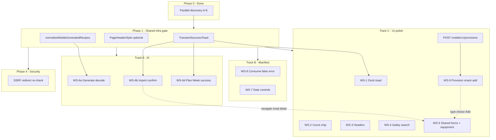

# iOS Post-Buildout Polish Plan

**Deliverable path:** [`plans/ios-post-buildout-polish-plan.md`](plans/ios-post-buildout-polish-plan.md)  
**Sources:** Phase 0 parallel discovery (domains A–E), [`plans/ios-polish-sprint-discovery.md`](plans/ios-polish-sprint-discovery.md), [`plans/ios-security-audit-fix-plan.md`](plans/ios-security-audit-fix-plan.md), agent transcript `5f882617-174e-4000-9ce4-248b7a7a955d`

---

## Executive summary

The iOS client is functionally complete but has **three P0 functional bugs** (generate decode, import confirm gap, manifest consume false-error), **two P1 AI/UX flows** (plan-week success, import regression URL), and **six polish parity items** (dock toast, count chip, headers, galley search, shared forms with equipment, provision/snack add). Server work includes **`normalizeMobileGeneratedRecipes()`**, hardening **`storeUndoToken`** on consume, a new **`POST /api/mobile/v1/provisions`** route, and **SSRF redirect re-validation** on import fetch (Phase 4, locked).

Implementation is organized into **4 phases** with **3 parallel tracks** after a thin shared-infrastructure gate. Estimated parallelizable streams: **Track A** (functional/AI), **Track B** (Manifest), **Track C** (UI polish + forms). Track A blocks on server normalization for WS-6a only; all other streams can start after Phase 0 merge.

**Current app version:** `1.4.15` ([`package.json`](package.json), [`app/lib/version.ts`](app/lib/version.ts))

---

## Locked product decisions

| # | Decision |
|---|----------|
| 1 | Manifest and Supply headers match Cargo/Galley (large title at scroll top; collapses inline when scrolled) |
| 2 | Count chips stay in toolbar; room for **4 digits** (1–9999) without clipping |
| 3 | Galley search: client-side `.searchable` on loaded meals, same pattern as Cargo |
| 4 | **One shared view** per entity (meal, cargo) for create + edit; all edit-flow attributes exposed |
| 5 | Supply dock toast: auto-dismiss ~5s **and** tap-to-dismiss |
| 6 | Plan Week: accept → dismiss → **Manifest tab** → toast **"N meals added to plan"** |
| 7 | Manifest chevrons: ±`calendarSpan` days; Today jumps (no sheet); calendar icon opens picker only |
| 8 | Import regression URL: `https://www.allrecipes.com/recipe/14430/simple-potato-salad/` — verify → confirm → meal detail |
| 9 | Generate directions: **server-primary** normalization; **thin iOS flexible decode** as defense-in-depth |
| 10 | Near production-ready before App Store — quality over rush |
| 11 | Physical device testing by user later — simulator + device handoff checklist included |
| 12 | **Equipment** field included in `MealFormView` create/edit — match web `MealBuilder` |
| 13 | **Provision/snack** (single-item meal, `type=provision`) available from Galley `plus.circle` FAB — choice step then form, matching web `AddTypeChoice` + `ProvisionQuickAdd` |
| 14 | **SSRF redirect re-check** on import URL fetch included in this sprint (Phase 4) |

---

## Priority matrix

| ID | Severity | Category | Blocks release? | Parallel track |
|----|----------|----------|-----------------|----------------|
| WS-6a | P0 | AI decode failure | Yes | A (server gate) |
| WS-6b | P0 | Import confirm gap | Yes | A |
| WS-8 | P0 | False consume error | Yes | B |
| WS-6d | P1 | Plan Week UX | No | A |
| WS-7 | P1 | Manifest date controls | No | B |
| WS-1 | P2 | Dock toast | No | C |
| WS-2 | P2 | Count chip clip | No | C |
| WS-3 | P2 | Header parity | No | C |
| WS-4 | P2 | Galley search | No | C |
| WS-5 | P2 | Shared forms (+ equipment) | No | C |
| WS-9 | P2 | Provision/snack add | No | C (+ server route) |
| WS-6c | Deferred | Photo scan device | No | Device handoff |

---

## Dependency graph

**Gates:**
- `normalizeMobileGeneratedRecipes()` must ship before iOS generate E2E sign-off
- `TransientSuccessToast` should land before WS-1, WS-6d (and optionally import success toast in WS-6b)
- **`POST /api/mobile/v1/provisions`** must ship before iOS provision E2E (WS-9)
- WS-5 (forms) is independent but large — can run parallel to Track A/B if separate agents own meal vs cargo vs provision forms

---

## Phase 0 discovery findings

### Agent A — iOS UI

| WS | Confirmed | Key anchors |
|----|-----------|-------------|
| WS-1 | `dockMessage` never cleared; raw `Text` overlay not `UndoToast` | [`SupplyView.swift:386-404`](ios/Ration/Features/Supply/SupplyView.swift), [`SupplyViewModel.dock()`](ios/Ration/Features/Supply/SupplyView.swift) ~206 |
| WS-2 | Count chip in crowded leading `HStack` with `OrgSwitcherBar`; no min-width/scale | [`GlobalPageToolbar.swift:14-27`](ios/Ration/Core/Design/GlobalPageToolbar.swift); Manifest always passes count including `0` at [`ManifestView.swift:236`](ios/Ration/Features/Manifest/ManifestView.swift) |
| WS-3 | Cargo/Galley use default large title; Manifest/Supply force `.inline` | [`ManifestView.swift:230-231`](ios/Ration/Features/Manifest/ManifestView.swift), [`SupplyView.swift:318-319`](ios/Ration/Features/Supply/SupplyView.swift) |
| WS-4 | `PageFilterEngine.filterMeals` wired in VM; no `.searchable` on view | [`GalleyViewModel.swift:21-34`](ios/Ration/Features/Galley/GalleyViewModel.swift), [`CargoListView.swift:49`](ios/Ration/Features/Cargo/CargoListView.swift) |
| WS-5 | `AddMealSheet` = name+directions only; `EditMealView` = full; `AddCargoView` missing tags | [`AddMealSheet.swift`](ios/Ration/Features/Galley/AddMealSheet.swift), [`AddCargoView.swift`](ios/Ration/Features/Cargo/AddCargoView.swift), [`CargoEditSheet`](ios/Ration/Features/Cargo/CargoDetailView.swift) ~285 |

### Agent B — iOS AI

| WS | Confirmed | Key anchors |
|----|-----------|-------------|
| WS-6a | `directions: string[]` + `ingredients[].name` vs `ingredientName` → Codable `typeMismatch` | [`Models.swift:610-620`](ios/Ration/Core/Models/Models.swift), [`meal-generate-consumer.server.ts:310-323`](app/lib/meal-generate-consumer.server.ts) |
| WS-6b | No `importRecipeConfirm` in [`RationAPI.swift`](ios/Ration/Core/Networking/RationAPI.swift); poll expects `meal` not `extractedRecipe` | [`ImportRecipeSheet.swift:41-47`](ios/Ration/Features/Galley/ImportRecipeSheet.swift), mobile route exists at [`v1.meals.import.confirm.ts`](app/routes/api/mobile/v1.meals.import.confirm.ts) |
| WS-6c | Scan wired; `showingPaywall` never set; `existingInventory` unused | [`ScanView.swift`](ios/Ration/Features/Scan/ScanView.swift) |
| WS-6d | `onComplete` = reload only; no tab switch/toast | [`PlanWeekSheet.swift:88-96`](ios/Ration/Features/Galley/PlanWeekSheet.swift), [`RootView.swift:56-66`](ios/Ration/App/RootView.swift) Manifest = tab 3 |

### Agent C — Manifest

| WS | Confirmed | Key anchors |
|----|-----------|-------------|
| WS-7 | Chevrons already ±`calendarSpan` with normalization | [`WeekNavigator.swift:172-204`](ios/Ration/Features/Manifest/WeekNavigator.swift); Today vs calendar split at `:163-267` |
| WS-7 risks | `restoreSnapshot` clobbers `rangeStart`; `hasInitializedAnchor` not reset on org switch; binding read-only until `navigateWeek` succeeds | [`ManifestView.swift:58-64,188-191`](ios/Ration/Features/Manifest/ManifestView.swift) |
| WS-8 | **Primary:** consume succeeds → `load()` fails → `errorMessage` set despite commit | [`ManifestViewModel.consume`](ios/Ration/Features/Manifest/ManifestView.swift) ~130-139 |
| WS-8 | **Secondary:** `storeUndoToken` KV failure → 500 after DB commit | [`v1.manifest.consume.ts:46-58`](app/routes/api/mobile/v1.manifest.consume.ts), [`undo-token.server.ts:20-28`](app/lib/undo-token.server.ts) |

### Agent D — Web parity

- Import: two-phase extract → verify → `POST /api/meals/import/confirm` → navigate [`ImportRecipeButton.tsx:151-244`](app/components/galley/ImportRecipeButton.tsx)
- Meal create: [`MealBuilder.tsx`](app/components/galley/MealBuilder.tsx) / [`MealQuickAdd.tsx`](app/components/galley/MealQuickAdd.tsx) — full field set
- Cargo create: [`IngestForm.tsx`](app/components/cargo/IngestForm.tsx) — tags in advanced section
- `normalizeAIResponse` is **generation-only** (`string[]`); import uses `RecipeStep[]` via separate path

### Agent E — Mobile API

- Generate status returns raw AI shape; no mobile normalization today in [`v1.meals.generate.$requestId.ts`](app/routes/api/mobile/v1/meals/generate.$requestId.ts)
- `MobileCreateMealSchema` / `MobileCreateCargoSchema` accept all fields iOS forms need ([`app/lib/schemas/mobile/meals.ts`](app/lib/schemas/mobile/meals.ts), [`cargo.ts`](app/lib/schemas/mobile/cargo.ts))
- Rate limits confirmed per route in [`rate-limiter.server.ts`](app/lib/rate-limiter.server.ts)
- SSRF: submit-time blocks private IPs; **gap:** consumer fetch does not re-check after redirects ([`import-url-consumer.server.ts`](app/lib/import-url-consumer.server.ts))
- OpenAPI mobile doc missing meals/generate/import/scan/plan-week paths

---

## WS-1 — Supply dock toast persistence

**Symptom:** "Docked X items into Cargo" banner never dismisses; blocks list.

**Root cause:** `dockMessage` set in `dock()` with no clear path; overlay uses static `Text`, not shared toast component ([`SupplyView.swift:394-402`](ios/Ration/Features/Supply/SupplyView.swift)).

**Fix:**
1. Add `TransientSuccessToast` (see Shared components) — message-only variant of [`UndoToast`](ios/Ration/Core/Design/UndoToast.swift) (5s auto-dismiss + tap dismiss, no undo button)
2. Replace `Text(message)` branch with `TransientSuccessToast(message:onDismiss:)`; `onDismiss` sets `dockMessage = nil`
3. Match bottom padding with undo toast (`.padding(.bottom, 80)`)

**Files:** [`SupplyView.swift`](ios/Ration/Features/Supply/SupplyView.swift), new [`TransientSuccessToast.swift`](ios/Ration/Core/Design/TransientSuccessToast.swift)

**Tests:** XCTest for toast timer callback (optional lightweight); manual simulator QA

**Deps:** `TransientSuccessToast` (Phase 1)

---

## WS-2 — Toolbar count chip clipping

**Symptom:** `countChip` clips for large counts on narrow devices.

**Root cause:** Leading `HStack` packs `OrgSwitcherBar` + capsule with no width budget ([`GlobalPageToolbar.swift:14-27`](ios/Ration/Core/Design/GlobalPageToolbar.swift)).

**Fix (locked: stay in toolbar, 4-digit room):**
1. Add `.frame(minWidth: 44)` (or computed from `"9999"` measured width) on count `Text`
2. `.minimumScaleFactor(0.8)` + `.lineLimit(1)` + `.fixedSize(horizontal: true, vertical: false)`
3. `.layoutPriority(1)` on chip; `.layoutPriority(0)` on `OrgSwitcherBar` compressible region
4. Normalize Manifest: `countChip: manifestEntryCount > 0 ? manifestEntryCount : nil`
5. Manual QA: iPhone SE (3rd gen) + iPhone 15 Pro Max simulators with count 9999

**Files:** [`GlobalPageToolbar.swift`](ios/Ration/Core/Design/GlobalPageToolbar.swift), [`ManifestView.swift:236`](ios/Ration/Features/Manifest/ManifestView.swift)

**Tests:** None required (layout); snapshot optional

**Deps:** None

---

## WS-3 — Page header parity (Manifest, Supply)

**Symptom:** Manifest/Supply always inline; Cargo/Galley use large collapsible title.

**Root cause:** Explicit `.navigationBarTitleDisplayMode(.inline)` only on Manifest/Supply.

**Fix:**
1. **Remove** `.navigationBarTitleDisplayMode(.inline)` from [`ManifestView.swift:231`](ios/Ration/Features/Manifest/ManifestView.swift) and [`SupplyView.swift:319`](ios/Ration/Features/Supply/SupplyView.swift)
2. Verify `.searchable` on Cargo does not break collapse (Cargo already combines large title + searchable — use as reference)
3. Optional DRY: `PageHeaderStyle` view modifier applying `.navigationTitle` only (no inline override) — only if ≥3 call sites benefit

**Files:** [`ManifestView.swift`](ios/Ration/Features/Manifest/ManifestView.swift), [`SupplyView.swift`](ios/Ration/Features/Supply/SupplyView.swift)

**Tests:** Manual scroll QA on all 4 list tabs

**Deps:** None

---

## WS-4 — Galley search bar

**Symptom:** No search UI; infrastructure exists in VM/engine.

**Root cause:** `GalleyViewModel.displayedMeals` filters via `PageFilterEngine` but view lacks `.searchable`.

**Fix:**
1. Add `.searchable(text: $model.filters.search, prompt: "Search meals")` after `.navigationTitle` in [`GalleyView.swift`](ios/Ration/Features/Galley/GalleyView.swift)
2. Empty state: distinguish "No meals" vs "No matches" (mirror [`CargoListView.swift:31-34`](ios/Ration/Features/Cargo/CargoListView.swift))
3. Client-side only — no API reload on search

**Files:** [`GalleyView.swift`](ios/Ration/Features/Galley/GalleyView.swift), [`GalleyViewModel.swift`](ios/Ration/Features/Galley/GalleyViewModel.swift) (empty-state helper if needed)

**Tests:** Add `testFilterMealsBySearch` to [`PageFilterEngineTests.swift`](ios/RationTests/PageFilterEngineTests.swift)

**Deps:** None

---

## WS-5 — Shared create/edit forms (meal + cargo)

**Symptom:** Create flows are minimal subsets of edit flows.

**Root cause:** Separate `AddMealSheet` / `AddCargoView` vs full `EditMealView` / `CargoEditSheet`.

**Fix:**
1. Extract **`MealFormView`** from [`AddMealSheet.swift`](ios/Ration/Features/Galley/AddMealSheet.swift):
   - Mode: `.create | .edit(Meal)`
   - Fields: name, domain, description, servings, prep/cook, **equipment** (comma-separated → `[String]`, mirror [`MealBuilder.tsx:136-146`](app/components/galley/MealBuilder.tsx)), tags (`TagChipEditor`), ingredients (`MealIngredientEditorView`), directions (`DirectionsEditorView`)
   - `CreateMealRequest.equipment` already exists on iOS ([`Models.swift:575`](ios/Ration/Core/Models/Models.swift)); wire UI in create **and** edit (today edit passes `meal.equipment ?? []` on save but has no editor at [`AddMealSheet.swift:180`](ios/Ration/Features/Galley/AddMealSheet.swift))
   - Create: `POST /api/mobile/v1/meals` with full `CreateMealRequest`
   - Edit: existing PATCH path
2. Extract **`CargoFormView`** from [`AddCargoView.swift`](ios/Ration/Features/Cargo/AddCargoView.swift) + [`CargoEditSheet`](ios/Ration/Features/Cargo/CargoDetailView.swift):
   - Fields: name, qty, unit, domain, expiry, tags (+ tag suggestions on create)
3. Replace sheet entry points; delete duplicated field UI
4. Web parity reference: [`MealBuilder.tsx`](app/components/galley/MealBuilder.tsx), [`IngestForm.tsx`](app/components/cargo/IngestForm.tsx)

**API:** `MobileCreateMealSchema` / `MobileCreateCargoSchema` already accept all fields ([`app/lib/schemas/mobile/meals.ts`](app/lib/schemas/mobile/meals.ts))

**Files:** New `MealFormView.swift`, `CargoFormView.swift`; update [`GalleyView.swift`](ios/Ration/Features/Galley/GalleyView.swift), [`CargoListView.swift`](ios/Ration/Features/Cargo/CargoListView.swift), [`CargoDetailView.swift`](ios/Ration/Features/Cargo/CargoDetailView.swift)

**Tests:** XCTest for form validation helpers if extracted; schema already covered in [`phase3-mobile.test.ts`](app/lib/schemas/mobile/__tests__/phase3-mobile.test.ts)

**Deps:** None (parallel meal/cargo sub-tasks)

---

## WS-9 — Galley provision/snack add (single-item meal)

**Symptom:** iOS Galley `plus.circle` FAB offers "Add meal" / Generate / Import only; no way to add a provision (snack, staple, single tracked item).

**Root cause:** Web Galley uses a two-step add flow — [`AddTypeChoice`](app/components/galley/AddTypeChoice.tsx) (Recipe vs Provision) then [`ProvisionQuickAdd`](app/components/galley/ProvisionQuickAdd.tsx) ([`galley.tsx:487-503`](app/routes/hub/galley.tsx)). iOS [`GalleyView.swift:71-80`](ios/Ration/Features/Galley/GalleyView.swift) jumps straight to `AddMealSheet`. No mobile provisions API route exists (web uses `POST /api/provisions`).

**Fix (locked — match web flow):**

**Server (required — no mobile route today):**
1. Add `POST /api/mobile/v1/provisions` route:
   - Auth: `requireMobileActiveGroup`
   - Body: `MobileProvisionSchema` (alias `ProvisionSchema` from [`app/lib/schemas/meal.ts:136-149`](app/lib/schemas/meal.ts)) — `name`, `quantity`, `unit`, `domain`, `tags`
   - Handler: `createProvision()` from [`app/lib/meals.server.ts:899`](app/lib/meals.server.ts) — sets `type: "provision"`, auto-creates single `meal_ingredient` row
   - Rate limit: `meal_mutation` (30/60s), same as web [`provisions.ts:15-18`](app/routes/api/provisions.ts)
   - Response: `{ provision: { id, name, type, ... } }` (minimal meal shape for navigation)
2. Register in [`app/routes.ts`](app/routes.ts); add Zod schema in [`app/lib/schemas/mobile/meals.ts`](app/lib/schemas/mobile/meals.ts)
3. Vitest: route auth, org scoping, `ProvisionSchema` validation, capacity_exceeded handling
4. Update README mobile API table + OpenAPI stub

**iOS:**
1. Add **`GalleyAddTypeChoiceSheet`** (or inline step in add flow) mirroring web copy:
   - **Recipe** — multi-ingredient meal → `MealFormView` (create mode)
   - **Provision** — single item/snack → `ProvisionFormView`
2. Add **`ProvisionFormView`** / `AddProvisionSheet`:
   - Fields: name, quantity, unit (`UnitPicker`), domain, tags (`TagChipEditor`)
   - Submit: `RationAPI.createProvision()` → new mobile route
   - On success: dismiss + reload Galley; optional navigate to provision detail (`MealDetailView` already renders meals — verify `type === "provision"` display in list row)
3. Update [`GalleyView.swift`](ios/Ration/Features/Galley/GalleyView.swift) FAB:
   - Change "Add meal" → **"Add"** opens type-choice sheet first (Generate / Import remain direct FAB actions per current pattern, or group under same menu — **prefer:** "Add" → choice (Recipe | Provision), keep Generate/Import as sibling FAB items unchanged)
4. Add `CreateProvisionRequest` / response types to [`Models.swift`](ios/Ration/Core/Models/Models.swift)
5. List display: ensure provisions appear in Galley list with distinct row styling if web does ([`MealListRow.tsx:61`](app/components/galley/MealListRow.tsx) checks `meal.type === "provision"`)

**Web parity reference:** [`AddTypeChoice.tsx`](app/components/galley/AddTypeChoice.tsx), [`ProvisionQuickAdd.tsx`](app/components/galley/ProvisionQuickAdd.tsx), [`ProvisionEditModal.tsx`](app/components/galley/ProvisionEditModal.tsx) (edit can be follow-up if create ships first)

**Files:** New `ProvisionFormView.swift`, `GalleyAddTypeChoiceSheet.swift`; [`GalleyView.swift`](ios/Ration/Features/Galley/GalleyView.swift), [`RationAPI.swift`](ios/Ration/Core/Networking/RationAPI.swift); server `v1.provisions.ts`, mobile schema

**Tests:** Vitest mobile provision route; XCTest `CreateProvisionRequest` encode/decode; manual: add "bananas" provision → appears in Galley + Hub snacks-ready widget

**Deps:** Phase 3 (can parallel server route with `MealFormView` work); server route must land before iOS E2E

---

## WS-6 — AI features

### WS-6a — Generate Meal decode failure

**Symptom:** `typeMismatch` on `recipes[0].directions` (expected `String`, found `Array`); also `ingredients[].name` vs `ingredientName`.

**Root cause:** Mobile status endpoint passthrough of raw AI job JSON ([`meal-generate-consumer.server.ts:310-323`](app/lib/meal-generate-consumer.server.ts)); iOS [`GeneratedRecipe`](ios/Ration/Core/Models/Models.swift) expects meal-storage shape.

**Fix (locked — server primary, iOS defense-in-depth):**

**Server:**
1. Create [`app/lib/mobile/generated-recipes.server.ts`](app/lib/mobile/generated-recipes.server.ts) with `normalizeMobileGeneratedRecipes(recipes)`:
   - `directions: string[]` → `serializeDirections(normalizeDirections(arr))` (canonical meal TEXT format)
   - `ingredients[].name` → `ingredientName`; add `orderIndex`, default `cargoId: null`
   - Defaults: `servings: 1`, `tags: ["ai-generated"]`
2. Call from [`v1.meals.generate.$requestId.ts`](app/routes/api/mobile/v1.meals.generate.$requestId.ts) before returning `completed`
3. Vitest: [`app/lib/mobile/__tests__/generated-recipes.server.test.ts`](app/lib/mobile/__tests__/generated-recipes.server.test.ts) with real-shaped fixture (`directions: string[]`, `ingredients[].name`)

**iOS:**
1. Add flexible `Decodable` for `GeneratedRecipe.directions` (accept `String` or `[String]` → normalize via `DirectionsParser`)
2. Tolerant ingredient decode: `name` or `ingredientName` CodingKeys
3. XCTest: decode fixtures for both shapes in new `GeneratedRecipeDecodingTests.swift`

**Files:** Server + [`Models.swift`](ios/Ration/Core/Models/Models.swift), [`GenerateMealSheet.swift`](ios/Ration/Features/Galley/GenerateMealSheet.swift)

**Deps:** Server normalization before E2E generate QA

---

### WS-6b — Import Recipe web parity

**Symptom:** "Import completed without a meal" on AllRecipes URL.

**Root cause:** iOS expects `meal` on poll `completed`; server returns `extractedRecipe` until confirm ([`import-url-consumer.server.ts:480-485`](app/lib/import-url-consumer.server.ts)).

**Fix (locked flow):**
1. Add `extractedRecipe` to [`ImportRecipeStatusResponse`](ios/Ration/Core/Models/Models.swift) (mirror `MealInput` / web shape)
2. Add `importRecipeConfirm(requestId:)` → `POST /api/mobile/v1/meals/import/confirm` in [`RationAPI.swift`](ios/Ration/Core/Networking/RationAPI.swift)
3. Refactor [`ImportRecipeViewModel`](ios/Ration/Features/Galley/ImportRecipeSheet.swift):
   - `completed` + `extractedRecipe` → `.verification` state (name, ingredient count preview)
   - `DUPLICATE_URL` on poll or 409 on submit → duplicate UI with "View existing" navigation
4. "Add to Galley" → confirm → dismiss → **navigate to `MealDetailView`** for `meal.id`
5. Wire navigation from [`GalleyView`](ios/Ration/Features/Galley/GalleyView.swift) via `NavigationPath` or selected meal ID binding

**Regression:** `https://www.allrecipes.com/recipe/14430/simple-potato-salad/`

**Files:** [`ImportRecipeSheet.swift`](ios/Ration/Features/Galley/ImportRecipeSheet.swift), [`RationAPI.swift`](ios/Ration/Core/Networking/RationAPI.swift), [`Models.swift`](ios/Ration/Core/Models/Models.swift), [`GalleyView.swift`](ios/Ration/Features/Galley/GalleyView.swift)

**Tests:** Vitest for confirm route auth (org scoping); XCTest for status decode + state machine

**Deps:** `TransientSuccessToast` optional for confirm success

---

### WS-6c — Photo scan AI (deferred)

**Plan only — device handoff:**
- Verify `AIConsentCoordinator` gate on Hub/Cargo FAB entry ([`ScanView.swift:198-201`](ios/Ration/Features/Scan/ScanView.swift))
- Wire `showingPaywall` on insufficient credits (parity with Manifest/Supply)
- Simulator: mock poll with fixture JSON; cannot test camera
- Device checklist: consent → capture → poll → confirm to Cargo → credit deduction

---

### WS-6d — Plan Week success UX

**Symptom:** Sheet dismisses + reload only; no confirmation or tab focus.

**Fix (locked):**
1. After `bulkManifest` success in [`PlanWeekViewModel.applySchedule`](ios/Ration/Features/Galley/PlanWeekViewModel.swift), return `appliedCount`
2. [`PlanWeekSheet`](ios/Ration/Features/Galley/PlanWeekSheet.swift) callback: `(Int) -> Void` with count
3. [`ManifestView`](ios/Ration/Features/Manifest/ManifestView.swift) passes closure to sheet; on success: dismiss, call `onPlanWeekComplete(count)`
4. [`RootView.MainTabView`](ios/Ration/App/RootView.swift): expose `selectedTab` binding or `onPlanWeekComplete` that sets `selectedTab = 3` and posts notification for Manifest toast
5. Manifest shows `TransientSuccessToast`: **"N meals added to plan"** (~5s)
6. `await reload()` for applied date range
7. Surface bulk-apply errors (today `reset()` silently on failure at `PlanWeekSheet:94-96`)

**Files:** [`PlanWeekSheet.swift`](ios/Ration/Features/Galley/PlanWeekSheet.swift), [`PlanWeekViewModel.swift`](ios/Ration/Features/Galley/PlanWeekViewModel.swift), [`RootView.swift`](ios/Ration/App/RootView.swift), [`ManifestView.swift`](ios/Ration/Features/Manifest/ManifestView.swift)

**Tests:** XCTest for callback count; manual tab switch QA

**Deps:** `TransientSuccessToast`

---

## WS-7 — Manifest date controls

**Symptom:** Today, calendar icon, and rocker feel redundant.

**Locked behaviors (mostly implemented — fix gaps):**

| Control | Current | Required action |
|---------|---------|-----------------|
| Chevrons | ±`calendarSpan` + normalize | **Verify only** — [`WeekNavigator.swift:172-204`](ios/Ration/Features/Manifest/WeekNavigator.swift) |
| Today | Jumps to anchor, hidden when current | **Verify** no calendar sheet opens — [`WeekNavigator.swift:163-222`](ios/Ration/Features/Manifest/WeekNavigator.swift) |
| Calendar icon | Opens `DatePicker` sheet | **Verify** distinct from Today |

**Binding fixes (from discovery WS-9):**
1. Reset `hasInitializedAnchor = false` when `organizationId` changes in [`ManifestView`](ios/Ration/Features/Manifest/ManifestView.swift)
2. `restoreSnapshot`: use `preserveRangeStart: true` when offline but user just navigated via chevrons; or normalize `rangeStart` from `manifest.startDate` after successful online load
3. After `navigateWeek` success, ensure `selectedDay` focuses today when jumping via Today button

**Tests:** Extend [`ManifestDateHelpersTests.swift`](ios/RationTests/ManifestDateHelpersTests.swift) — Today anchor for span 3/7, chevron ±span

**Deps:** None

---

## WS-8 — Manifest consume false error

**Symptom:** Generic error after consume; meal shows consumed on refresh.

**Root cause (validated):** `consume()` awaits `load()` which sets `errorMessage` on failure without distinguishing from consume success ([`ManifestViewModel.consume`](ios/Ration/Features/Manifest/ManifestView.swift) ~130-139). Secondary: KV undo token failure → 500 after DB commit.

**Fix:**

**iOS:**
1. Split consume result handling: on consume HTTP success, **optimistically** mark entry `consumedAt` locally before reload
2. Reload failure: show non-blocking offline banner or silent retry — **do not** set `errorMessage` if consume succeeded
3. Always show `UndoToast` when `undoToken` present regardless of reload outcome
4. Return structured result: `enum ConsumeOutcome { case success(undoToken: String?); case failed(Error) }`

**Server:**
1. Wrap `storeUndoToken` in try/catch in [`v1.manifest.consume.ts`](app/routes/api/mobile/v1.manifest.consume.ts): on KV failure, log (redacted) and return `{ consumed, undoToken: undefined }` with 200 — consume already committed
2. Vitest: mock KV throw → still 200 with `consumed > 0`

**Files:** [`ManifestView.swift`](ios/Ration/Features/Manifest/ManifestView.swift), [`v1.manifest.consume.ts`](app/routes/api/mobile/v1.manifest.consume.ts)

**Tests:** Vitest route test; XCTest for optimistic state + no error banner on reload fail

**Deps:** None (P0 — start early)

---

## Shared components

| Component | Purpose | Call sites | Location |
|-----------|---------|------------|----------|
| `TransientSuccessToast` | Auto-dismiss + tap dismiss, no undo | WS-1, WS-6d, optional WS-6b | `ios/Ration/Core/Design/TransientSuccessToast.swift` |
| `PageHeaderStyle` | Optional DRY for large-title tabs | WS-3 (if warranted) | `ios/Ration/Core/Design/PageHeaderStyle.swift` |
| `MealFormView` | Unified create/edit meal (incl. equipment) | WS-5 | `ios/Ration/Features/Galley/MealFormView.swift` |
| `CargoFormView` | Unified create/edit cargo | WS-5 | `ios/Ration/Features/Cargo/CargoFormView.swift` |
| `ProvisionFormView` | Create provision (single-item meal) | WS-9 | `ios/Ration/Features/Galley/ProvisionFormView.swift` |
| `GalleyAddTypeChoiceSheet` | Recipe vs Provision choice | WS-9 | `ios/Ration/Features/Galley/GalleyAddTypeChoiceSheet.swift` |
| `normalizeMobileGeneratedRecipes()` | Server canonical generate poll shape | WS-6a | `app/lib/mobile/generated-recipes.server.ts` |

**`TransientSuccessToast` spec:** Extract timer/progress ring from [`UndoToast.swift:48-54`](ios/Ration/Core/Design/UndoToast.swift); optional undo button omitted; same 5s duration.

---

## Test plan

### Unit tests (required)

| Area | Framework | File |
|------|-----------|------|
| Generate normalization | Vitest | `app/lib/mobile/__tests__/generated-recipes.server.test.ts` |
| Consume KV failure | Vitest | `app/routes/api/mobile/__tests__/v1.manifest.consume.test.ts` (or lib test) |
| Import confirm org scope | Vitest | extend `recipe-import.test.ts` / mobile route test |
| Page filter meals search | XCTest | `PageFilterEngineTests.swift` |
| GeneratedRecipe decode | XCTest | `GeneratedRecipeDecodingTests.swift` |
| Manifest date helpers | XCTest | `ManifestDateHelpersTests.swift` |
| Directions (existing) | XCTest | `DirectionsParserTests.swift` |
| Mobile provision route | Vitest | `app/lib/schemas/mobile/__tests__/phase3-mobile.test.ts` + route test |
| Equipment parse helper | XCTest | optional `EquipmentFieldParserTests.swift` if extracted |

### Simulator manual QA checklist

- [ ] Supply dock 50+ items → toast auto-dismisses + tap dismiss
- [ ] Count chip "9999" on SE + Pro Max — no clip
- [ ] Manifest/Supply large title collapses on scroll
- [ ] Galley search filters loaded meals; empty "No matches"
- [ ] Create meal with equipment, tags, ingredients; edit preserves equipment
- [ ] Create cargo with tags, expiry
- [ ] Galley FAB → Add → Provision → add snack (e.g. bananas) → appears in list
- [ ] Generate meal → pick recipe → save to Galley
- [ ] Import AllRecipes URL → verify → Add to Galley → meal detail
- [ ] Plan Week accept → Manifest tab + "N meals added" toast
- [ ] Manifest Today vs calendar icon behavior
- [ ] Consume meal → undo toast; no false error on airplane-mode reload

### Device handoff checklist (user-run later)

- [ ] Photo scan: consent, camera, credits, confirm to Cargo
- [ ] Universal Links / AASA (if enabled)
- [ ] Haptics + performance on physical device
- [ ] Import/generate on cellular network

### Definition of Done (each phase)

- `bun run test:unit`, `bun run typecheck`, `bun run lint`
- `bun run ios:check` (XCTest)
- Version bump in [`package.json`](package.json) + [`app/lib/version.ts`](app/lib/version.ts)
- README mobile section if API behavior changes

---

## Implementation phases

### Phase 1 — Shared infrastructure + P0 fixes (parallel after infra gate)

**Version target:** `1.4.16`

| Stream | Work | Owner track |
|--------|------|-------------|
| Infra | `TransientSuccessToast`, `normalizeMobileGeneratedRecipes()` | Shared |
| P0-A | WS-6a server + iOS decode | A |
| P0-B | WS-8 consume error split + KV hardening | B |
| P0-C | WS-6b import confirm + verification UI | A |

**Gate:** Server normalization merged before iOS generate E2E sign-off.

### Phase 2 — AI UX + Manifest polish

**Version target:** `1.4.17`

| Stream | Work |
|--------|------|
| A | WS-6d Plan Week success; WS-6b navigation polish |
| B | WS-7 date control verification + binding fixes |
| C | WS-1 dock toast (once TransientSuccessToast lands) |

### Phase 3 — UI parity sprint

**Version target:** `1.4.18`

| Stream | Work |
|--------|------|
| C | WS-2 count chip, WS-3 headers, WS-4 galley search |
| C | WS-5 `MealFormView` (incl. equipment) + `CargoFormView` (parallel sub-agents) |
| C + Server | WS-9 mobile `POST /api/mobile/v1/provisions` + `ProvisionFormView` + Galley FAB choice step |

### Phase 4 — Security hardening + doc + regression (locked SSRF)

**Version target:** `1.4.19`

- **SSRF redirect re-check (locked):** After `fetch(url, { redirect: "follow" })` in [`import-url-consumer.server.ts`](app/lib/import-url-consumer.server.ts), re-run `isBlockedImportUrl()` on final URL; abort with failed job if blocked. Vitest with mock redirect to `127.0.0.1`.
- X-Ration-Client derive from bundle version ([`APIClient.swift:95`](ios/Ration/Core/Networking/APIClient.swift))
- OpenAPI gaps (meals/generate/import/provisions/scan/plan-week)
- Update README mobile API section for normalized generate response, import confirm flow, provisions route

---

## Security audit

Builds on [`plans/ios-security-audit-fix-plan.md`](plans/ios-security-audit-fix-plan.md) and [`plans/ios-security-app-store-audit-2026-06.md`](plans/ios-security-app-store-audit-2026-06.md).

| ID | Area | Severity | Finding / action | Verification |
|----|------|----------|------------------|--------------|
| S-1 | AI consent symmetry | High | All 4 entry points use `AIConsentCoordinator`; server `requireMobileAIConsent` on generate/import/scan/plan-week | Grep routes + `AIConsentGateSymmetryTests.swift` |
| S-2 | Rate limits | Medium | Limits exist per [`rate-limiter.server.ts`](app/lib/rate-limiter.server.ts); verify touched routes unchanged | Route tests return 429 |
| S-3 | Import confirm org scope | High | `job.organizationId !== organizationId` → 404 in confirm | Vitest cross-tenant confirm rejection |
| S-4 | Import URL SSRF | Medium | Submit-time blocks private IPs; **add redirect re-validation in Phase 4 (locked)** | Vitest with mock redirect to `127.0.0.1` |
| S-5 | Consume undo tokens | High | TTL 5s, KV key scoped; **fix KV failure post-commit** (WS-8) | Vitest KV throw; manual undo within 5s |
| S-6 | PII in client logs | Medium | Audit poll loops in iOS ViewModels — no `print` of URLs/meals | Grep `print(` in `ios/Ration` |
| S-7 | PrivacyInfo.xcprivacy | Critical (store) | Confirm manifest accurate after new AI/toast flows | Xcode privacy report |
| S-8 | X-Ration-Client drift | Low | Hardcoded `ios/1.0.0` at [`APIClient.swift:95`](ios/Ration/Core/Networking/APIClient.swift) vs app `1.4.15` | Derive from `CFBundleShortVersionString` |
| S-9 | Zod on touched routes | Medium | Validate mobile provision route + any changed route bodies | `phase3-mobile.test.ts` + provision route test |
| S-10 | Security regression tests | Medium | Add tests listed in Test plan | CI green |

**New regression tests to add:**
1. `generated-recipes.server.test.ts` — directions array + ingredient rename
2. Import confirm cross-org 404
3. Consume with KV failure still returns 200
4. SSRF redirect re-check — **locked Phase 4 deliverable**
5. iOS `GeneratedRecipeDecodingTests` — defense-in-depth decode
6. Mobile provision route auth + validation

---

## Resolved decisions (formerly open questions)

| # | Decision | Resolution |
|---|----------|------------|
| 1 | Equipment field | **Include** in `MealFormView` create/edit — match web `MealBuilder` |
| 2 | Provisions/snacks | **Include** — Galley FAB "Add" → type choice → `ProvisionFormView`; new mobile API route |
| 3 | SSRF redirect re-check | **Include** in Phase 4 — not deferred |

---

## Appendix: file index

### iOS — Design
- [`ios/Ration/Core/Design/Theme.swift`](ios/Ration/Core/Design/Theme.swift)
- [`ios/Ration/Core/Design/Typography.swift`](ios/Ration/Core/Design/Typography.swift)
- [`ios/Ration/Core/Design/GlobalPageToolbar.swift`](ios/Ration/Core/Design/GlobalPageToolbar.swift)
- [`ios/Ration/Core/Design/UndoToast.swift`](ios/Ration/Core/Design/UndoToast.swift)
- [`ios/Ration/Core/Design/IconFAB.swift`](ios/Ration/Core/Design/IconFAB.swift)
- [`ios/Ration/Core/Directions/DirectionsParser.swift`](ios/Ration/Core/Directions/DirectionsParser.swift)

### iOS — Features
- [`ios/Ration/Features/Supply/SupplyView.swift`](ios/Ration/Features/Supply/SupplyView.swift)
- [`ios/Ration/Features/Cargo/CargoListView.swift`](ios/Ration/Features/Cargo/CargoListView.swift)
- [`ios/Ration/Features/Galley/GalleyView.swift`](ios/Ration/Features/Galley/GalleyView.swift)
- [`ios/Ration/Features/Manifest/ManifestView.swift`](ios/Ration/Features/Manifest/ManifestView.swift)
- [`ios/Ration/Features/Manifest/WeekNavigator.swift`](ios/Ration/Features/Manifest/WeekNavigator.swift)
- [`ios/Ration/Features/Galley/ImportRecipeSheet.swift`](ios/Ration/Features/Galley/ImportRecipeSheet.swift)
- [`ios/Ration/Features/Galley/GenerateMealSheet.swift`](ios/Ration/Features/Galley/GenerateMealSheet.swift)
- [`ios/Ration/Features/Galley/PlanWeekSheet.swift`](ios/Ration/Features/Galley/PlanWeekSheet.swift)
- [`ios/Ration/App/RootView.swift`](ios/Ration/App/RootView.swift)

### iOS — Networking / Models
- [`ios/Ration/Core/Networking/RationAPI.swift`](ios/Ration/Core/Networking/RationAPI.swift)
- [`ios/Ration/Core/Networking/APIClient.swift`](ios/Ration/Core/Networking/APIClient.swift)
- [`ios/Ration/Core/Models/Models.swift`](ios/Ration/Core/Models/Models.swift)

### Server — Mobile API
- [`app/routes/api/mobile/v1.meals.generate.$requestId.ts`](app/routes/api/mobile/v1.meals.generate.$requestId.ts)
- [`app/routes/api/mobile/v1.meals.import.confirm.ts`](app/routes/api/mobile/v1.meals.import.confirm.ts)
- [`app/routes/api/mobile/v1.meals.import.$requestId.ts`](app/routes/api/mobile/v1.meals.import.$requestId.ts)
- [`app/routes/api/mobile/v1.manifest.consume.ts`](app/routes/api/mobile/v1.manifest.consume.ts)
- [`app/lib/meal-generate-consumer.server.ts`](app/lib/meal-generate-consumer.server.ts)
- [`app/lib/recipe-import-confirm.server.ts`](app/lib/recipe-import-confirm.server.ts)
- [`app/lib/undo-token.server.ts`](app/lib/undo-token.server.ts)
- [`app/lib/schemas/meal.ts`](app/lib/schemas/meal.ts) (`normalizeAIResponse`)

### Web parity reference
- [`app/components/galley/ImportRecipeButton.tsx`](app/components/galley/ImportRecipeButton.tsx)
- [`app/components/galley/MealBuilder.tsx`](app/components/galley/MealBuilder.tsx)
- [`app/components/galley/AddTypeChoice.tsx`](app/components/galley/AddTypeChoice.tsx)
- [`app/components/galley/ProvisionQuickAdd.tsx`](app/components/galley/ProvisionQuickAdd.tsx)
- [`app/components/cargo/IngestForm.tsx`](app/components/cargo/IngestForm.tsx)
- [`app/routes/api/provisions.ts`](app/routes/api/provisions.ts) (web reference for mobile route)

### Tests
- [`ios/RationTests/PageFilterEngineTests.swift`](ios/RationTests/PageFilterEngineTests.swift)
- [`ios/RationTests/ManifestDateHelpersTests.swift`](ios/RationTests/ManifestDateHelpersTests.swift)
- [`ios/RationTests/DirectionsParserTests.swift`](ios/RationTests/DirectionsParserTests.swift)
- [`app/lib/schemas/mobile/__tests__/phase3-mobile.test.ts`](app/lib/schemas/mobile/__tests__/phase3-mobile.test.ts)
