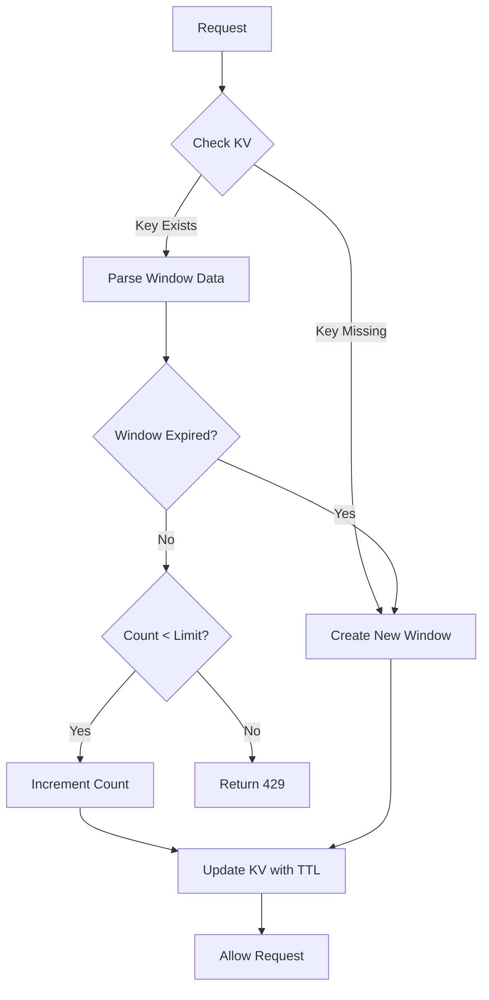
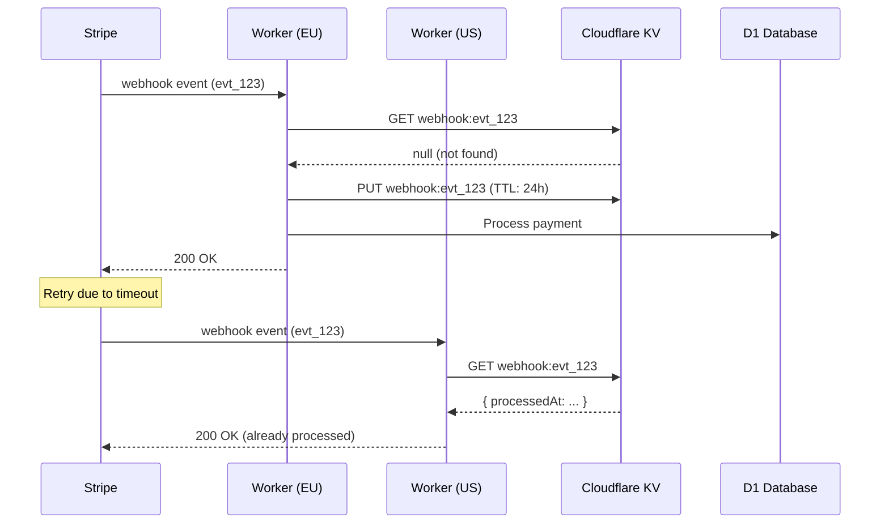

# Cloudflare KV Distributed State Architecture Plan

## Executive Summary

This document outlines the architectural plan for implementing Cloudflare KV as a distributed state store for the Ration application. The primary drivers are:

1. **Security**: Replace in-memory rate limiting and webhook idempotency tracking with distributed, globally consistent state
2. **Scalability**: Ensure consistent behavior across all Cloudflare edge locations
3. **Reliability**: Prevent duplicate payment processing and rate limit bypass attacks

---

## Current State Analysis

### Identified In-Memory State Issues

| Location | Current Implementation | Security Risk |
|----------|----------------------|---------------|
| [`app/routes/api/checkout.tsx:9`](../app/routes/api/checkout.tsx:9) | `Map<string, { count, resetAt }>` for rate limiting | **HIGH**: Rate limits can be bypassed by hitting different worker isolates |
| [`app/routes/api/webhook.tsx:8`](../app/routes/api/webhook.tsx:8) | `Set<string>` for processed event tracking | **CRITICAL**: Duplicate payment processing possible across isolates |

### Current Wrangler Configuration

The project already uses several Cloudflare bindings in [`wrangler.jsonc`](../wrangler.jsonc):
- D1 Database (`DB`)
- Vectorize (`VECTOR_INDEX`)
- R2 Storage (`STORAGE`)
- Workers AI (`AI`)
- Static Assets (`ASSETS`)

Adding KV follows the established pattern and integrates seamlessly.

---

## KV Namespace Design

### Namespace Strategy: Single Namespace with Key Prefixes

**Decision**: Use a single KV namespace with structured key prefixes rather than multiple namespaces.

**Rationale** (Best Practice Evidence):
- [Cloudflare Documentation](https://developers.cloudflare.com/kv/concepts/how-kv-works/) recommends minimizing namespace count for simpler management
- Key prefixes provide logical separation while maintaining operational simplicity
- Single namespace reduces binding complexity in wrangler configuration
- Easier to manage TTLs and monitor usage in one place

### Key Schema Design

```
┌─────────────────────────────────────────────────────────────────┐
│                     KV KEY STRUCTURE                            │
├─────────────────────────────────────────────────────────────────┤
│  PREFIX          │  IDENTIFIER           │  PURPOSE             │
├──────────────────┼───────────────────────┼──────────────────────┤
│  rate:checkout:  │  {userId}             │  Checkout rate limit │
│  rate:scan:      │  {userId}             │  Scan rate limit     │
│  rate:search:    │  {userId}             │  Search rate limit   │
│  webhook:        │  {stripeEventId}      │  Idempotency marker  │
│  session:cache:  │  {sessionId}          │  Session cache       │
│  feature:        │  {featureKey}         │  Feature flags       │
└─────────────────────────────────────────────────────────────────┘
```

### Key Pattern Specifications

| Key Pattern | Value Schema | TTL | Purpose |
|-------------|--------------|-----|---------|
| `rate:checkout:{userId}` | `{ count: number, windowStart: number }` | 60s | Checkout rate limiting |
| `rate:scan:{userId}` | `{ count: number, windowStart: number }` | 60s | Scan rate limiting |
| `rate:search:{userId}` | `{ count: number, windowStart: number }` | 10s | Search rate limiting |
| `webhook:{eventId}` | `{ processedAt: number, sessionId: string }` | 86400s (24h) | Stripe webhook idempotency |
| `session:cache:{sessionId}` | `{ userId: string, email: string, ... }` | 300s | Session data cache |
| `feature:{key}` | `{ enabled: boolean, config: object }` | 3600s | Feature flags |

---

## Implementation Architecture

### Wrangler Configuration Update

```jsonc
// wrangler.jsonc - Add to existing bindings
{
  "kv_namespaces": [
    {
      "binding": "KV",
      "id": "<production-namespace-id>",
      "preview_id": "<preview-namespace-id>"
    }
  ]
}
```

**CLI Commands for Setup**:
```bash
# Create production namespace
wrangler kv namespace create "RATION_KV"

# Create preview namespace for local development
wrangler kv namespace create "RATION_KV" --preview
```

### Type Definitions Update

```typescript
// worker-configuration.d.ts or load-context.ts
interface Env {
  // ... existing bindings
  KV: KVNamespace;
}
```

---

## Rate Limiting Implementation

### Algorithm: Sliding Window Counter

**Why Sliding Window** (Best Practice Evidence):
- More accurate than fixed window (prevents burst at window boundaries)
- Lower storage overhead than sliding log
- [Cloudflare Blog: Rate Limiting Best Practices](https://blog.cloudflare.com/counting-things-a-lot-of-different-things/) recommends this approach
- Atomic operations prevent race conditions

### Rate Limiter Service Design



### Proposed Implementation

**File**: [`app/lib/rate-limiter.server.ts`](../app/lib/rate-limiter.server.ts) (new file)

```typescript
interface RateLimitConfig {
  windowMs: number;      // Window duration in milliseconds
  maxRequests: number;   // Maximum requests per window
  keyPrefix: string;     // KV key prefix
}

interface RateLimitResult {
  allowed: boolean;
  remaining: number;
  resetAt: number;
  retryAfter?: number;
}

const RATE_LIMITS: Record<string, RateLimitConfig> = {
  checkout: { windowMs: 60_000, maxRequests: 10, keyPrefix: 'rate:checkout' },
  scan: { windowMs: 60_000, maxRequests: 20, keyPrefix: 'rate:scan' },
  search: { windowMs: 10_000, maxRequests: 30, keyPrefix: 'rate:search' },
};

export async function checkRateLimit(
  kv: KVNamespace,
  limitType: keyof typeof RATE_LIMITS,
  identifier: string
): Promise<RateLimitResult> {
  // Implementation details in code mode
}
```

### Security Considerations

| Concern | Mitigation |
|---------|------------|
| **Race Conditions** | KV's eventual consistency is acceptable for rate limiting; worst case allows slightly more requests |
| **Key Enumeration** | User IDs are UUIDs, not guessable; no sensitive data in keys |
| **Denial of Service** | Rate limits apply per-user; unauthenticated requests rejected before rate check |
| **Clock Skew** | Use relative timestamps within window; TTL handles cleanup |

### Efficiency Analysis

| Metric | In-Memory (Current) | KV (Proposed) | Impact |
|--------|---------------------|---------------|--------|
| Latency | ~0ms | ~10-50ms | Acceptable for security-critical operations |
| Consistency | Per-isolate only | Global | **Major improvement** |
| Memory | Grows unbounded | Zero worker memory | **Improvement** |
| Cost | Free | ~$0.50/million reads | Negligible at scale |

---

## Webhook Idempotency Implementation

### Current Problem

The current [`webhook.tsx`](../app/routes/api/webhook.tsx:8) uses an in-memory `Set` that:
1. Only tracks events within a single worker isolate
2. Clears when isolate is recycled
3. Cannot prevent duplicate processing across global edge locations

### Proposed Solution



### Implementation Strategy

**File**: [`app/lib/idempotency.server.ts`](../app/lib/idempotency.server.ts) (new file)

```typescript
interface IdempotencyRecord {
  processedAt: number;
  result?: string;  // Optional: store result for debugging
}

export async function checkAndMarkProcessed(
  kv: KVNamespace,
  eventId: string,
  ttlSeconds: number = 86400
): Promise<{ alreadyProcessed: boolean; record?: IdempotencyRecord }> {
  // Implementation details in code mode
}
```

### Security Considerations

| Concern | Mitigation |
|---------|------------|
| **Replay Attacks** | 24-hour TTL covers Stripe's retry window; signature verification remains primary defense |
| **Double Spending** | KV check happens before any database writes |
| **Eventual Consistency** | Acceptable risk; Stripe's own idempotency + our DB-level check provides defense in depth |

---

## Additional KV Use Cases Identified

### 1. Session Caching (Recommended)

**Current State**: Every authenticated request queries D1 for session validation via Better Auth.

**Opportunity**: Cache validated sessions in KV to reduce D1 load.

```
Key: session:cache:{sessionToken}
Value: { userId, email, expiresAt }
TTL: 300 seconds (5 minutes)
```

**Efficiency Gain**:
- D1 queries reduced by ~80% for authenticated requests
- Latency improvement: ~50ms → ~10ms for session validation
- Cost reduction on D1 read units

**Security Note**: Session tokens are already bearer tokens; caching doesn't increase attack surface.

### 2. Feature Flags (Future Enhancement)

**Use Case**: Enable gradual rollouts, A/B testing, kill switches.

```
Key: feature:{featureName}
Value: { enabled: boolean, percentage: number, allowlist: string[] }
TTL: 3600 seconds (1 hour)
```

**Benefits**:
- No deployment required to toggle features
- Instant propagation across all edge locations
- Supports percentage-based rollouts

### 3. AI Response Caching (Future Enhancement)

**Current State**: [`app/routes/api/scan.tsx`](../app/routes/api/scan.tsx:45) calls Workers AI for every scan.

**Opportunity**: Cache AI responses for identical/similar images.

```
Key: ai:scan:{imageHash}
Value: { items: [...], cachedAt: number }
TTL: 86400 seconds (24 hours)
```

**Considerations**:
- Requires image hashing (SHA-256 of image bytes)
- May not be practical if images are always unique
- Could save significant AI inference costs for repeated scans

### 4. Credit Balance Caching (Evaluated - Not Recommended)

**Why Not**:
- Credit balance is transactional data requiring strong consistency
- D1 transactions already handle this correctly
- Caching could lead to overselling credits
- Current implementation in [`ledger.server.ts`](../app/lib/ledger.server.ts:28) is correct

---

## Security Analysis Summary

### Threats Mitigated

| Threat | Current Risk | After KV Implementation |
|--------|--------------|------------------------|
| Rate limit bypass via isolate hopping | **HIGH** | **LOW** |
| Duplicate payment processing | **CRITICAL** | **LOW** |
| Memory exhaustion attacks | **MEDIUM** | **ELIMINATED** |

### New Attack Vectors Introduced

| Vector | Risk Level | Mitigation |
|--------|------------|------------|
| KV namespace compromise | **LOW** | Cloudflare's security; no secrets stored in KV |
| Timing attacks on rate limits | **NEGLIGIBLE** | Rate limits are not security-sensitive data |
| KV eventual consistency exploitation | **LOW** | Defense in depth with DB-level checks |

### Compliance Considerations

- **GDPR**: User IDs in keys are pseudonymous; no PII stored in KV values
- **PCI-DSS**: No payment card data touches KV; only event IDs for idempotency

---

## Implementation Checklist

### Phase 1: Infrastructure Setup
- [ ] Create KV namespace via Wrangler CLI
- [ ] Update [`wrangler.jsonc`](../wrangler.jsonc) with KV binding
- [ ] Update TypeScript types for `Env` interface
- [ ] Verify local development works with `--local` flag

### Phase 2: Rate Limiting Migration
- [ ] Create [`app/lib/rate-limiter.server.ts`](../app/lib/rate-limiter.server.ts)
- [ ] Refactor [`app/routes/api/checkout.tsx`](../app/routes/api/checkout.tsx) to use KV rate limiter
- [ ] Add rate limiting to [`app/routes/api/scan.tsx`](../app/routes/api/scan.tsx) (currently unprotected)
- [ ] Add rate limiting to [`app/routes/api/search.tsx`](../app/routes/api/search.tsx) (currently unprotected)
- [ ] Remove in-memory `rateLimitMap` from checkout.tsx

### Phase 3: Webhook Idempotency Migration
- [ ] Create [`app/lib/idempotency.server.ts`](../app/lib/idempotency.server.ts)
- [ ] Refactor [`app/routes/api/webhook.tsx`](../app/routes/api/webhook.tsx) to use KV idempotency
- [ ] Remove in-memory `processedEvents` Set
- [ ] Add comprehensive logging for audit trail

### Phase 4: Session Caching (Optional Enhancement)
- [ ] Create session cache wrapper in auth.server.ts
- [ ] Implement cache-aside pattern for session lookups
- [ ] Add cache invalidation on logout

### Phase 5: Testing & Validation
- [ ] Unit tests for rate limiter logic
- [ ] Integration tests for webhook idempotency
- [ ] Load testing to verify distributed behavior
- [ ] Security review of key patterns

---

## Cost Analysis

### Cloudflare KV Pricing (as of 2024)

| Operation | Free Tier | Paid Plan |
|-----------|-----------|-----------|
| Reads | 100,000/day | $0.50/million |
| Writes | 1,000/day | $5.00/million |
| Storage | 1 GB | $0.50/GB-month |

### Projected Usage (1,000 DAU)

| Use Case | Daily Reads | Daily Writes | Monthly Cost |
|----------|-------------|--------------|--------------|
| Rate Limiting | ~50,000 | ~50,000 | ~$2.50 |
| Webhook Idempotency | ~1,000 | ~500 | ~$0.10 |
| Session Caching | ~100,000 | ~10,000 | ~$2.00 |
| **Total** | ~151,000 | ~60,500 | **~$4.60** |

**Conclusion**: KV costs are negligible compared to the security and reliability benefits.

---

## Appendix: Alternative Approaches Considered

### Durable Objects

**Pros**:
- Strong consistency guarantees
- Transactional operations
- WebSocket support

**Cons**:
- Higher latency (~50-100ms vs ~10-50ms for KV)
- More complex programming model
- Higher cost for simple use cases
- Overkill for rate limiting and idempotency

**Decision**: KV is sufficient for our use cases; eventual consistency is acceptable.

### D1 Database

**Pros**:
- Already in use
- Strong consistency
- SQL queries

**Cons**:
- Higher latency than KV
- Not designed for high-frequency ephemeral data
- Would increase D1 load significantly

**Decision**: Keep D1 for persistent data; use KV for ephemeral/cache data.

### External Redis (Upstash)

**Pros**:
- Familiar Redis API
- Strong consistency options

**Cons**:
- Additional vendor dependency
- Network latency to external service
- Additional cost
- Cloudflare KV is native and optimized

**Decision**: Use native Cloudflare KV for simplicity and performance.

---

## References

1. [Cloudflare KV Documentation](https://developers.cloudflare.com/kv/)
2. [Cloudflare Workers Rate Limiting Patterns](https://developers.cloudflare.com/workers/examples/rate-limiting/)
3. [Stripe Webhook Best Practices](https://stripe.com/docs/webhooks/best-practices)
4. [OWASP Rate Limiting Cheat Sheet](https://cheatsheetseries.owasp.org/cheatsheets/Rate_Limiting_Cheat_Sheet.html)
