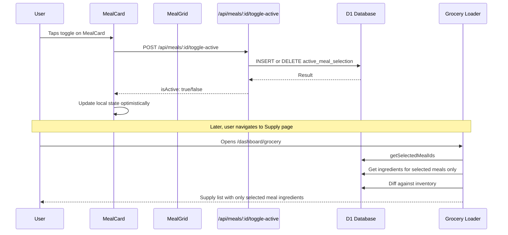

# Meal Selection Toggle — Architecture Plan

## Problem Statement

The current Supply list auto-generates from **every meal** in the organization via [`createGroceryListFromAllMeals()`](../app/lib/grocery.server.ts:560). This means adding a new meal to your recipe library immediately adds its missing ingredients to your shopping list — discouraging exploration and polluting the list with items you may not need this week.

**Goal:** Let users select which meals they intend to cook this week, and generate the Supply list only from those selected meals.

---

## Design Decision: "Active Meal Selection" Table

Rather than a full weekly planner with day/time slots, we use a simple join table `active_meal_selection` that tracks which meals are currently "on deck" for shopping. This is the lightest possible approach that fully solves the problem.

### Why Not a Boolean on the Meal Table?

A boolean `isActive` column on [`meal`](../app/db/schema.ts:230) would be simpler but creates problems:
- No audit trail of when it was toggled
- Can't distinguish "never activated" from "deactivated"
- Harder to extend later (e.g., adding `servings_planned` per selection)

A join table is only marginally more complex and has clean extension points.

---

## Data Model

### New Table: `active_meal_selection`

```sql
CREATE TABLE active_meal_selection (
    id TEXT PRIMARY KEY NOT NULL,
    organization_id TEXT NOT NULL REFERENCES organization(id) ON DELETE CASCADE,
    meal_id TEXT NOT NULL REFERENCES meal(id) ON DELETE CASCADE,
    servings_override INTEGER,
    created_at INTEGER DEFAULT (unixepoch()) NOT NULL,
    UNIQUE(organization_id, meal_id)
);

CREATE INDEX ams_org_idx ON active_meal_selection (organization_id);
CREATE INDEX ams_meal_idx ON active_meal_selection (meal_id);
```

**Columns:**
- `id` — UUID primary key (consistent with all other tables)
- `organization_id` — FK to organization, scoped to the group
- `meal_id` — FK to meal, which meal is selected
- `servings_override` — nullable; if set, overrides `meal.servings` for list generation (e.g., "I want to make 4 servings this time, not 2")
- `created_at` — when the selection was made
- **UNIQUE constraint** on `(organization_id, meal_id)` — a meal can only be selected once per org

### Drizzle Schema Addition

Add to [`app/db/schema.ts`](../app/db/schema.ts):

```typescript
export const activeMealSelection = sqliteTable(
    "active_meal_selection",
    {
        id: text("id")
            .primaryKey()
            .$defaultFn(() => crypto.randomUUID()),
        organizationId: text("organization_id")
            .notNull()
            .references(() => organization.id, { onDelete: "cascade" }),
        mealId: text("meal_id")
            .notNull()
            .references(() => meal.id, { onDelete: "cascade" }),
        servingsOverride: integer("servings_override"),
        createdAt: integer("created_at", { mode: "timestamp" })
            .notNull()
            .default(sql`(unixepoch())`),
    },
    (table) => [
        index("ams_org_idx").on(table.organizationId),
        index("ams_meal_idx").on(table.mealId),
        unique("ams_org_meal_unique").on(table.organizationId, table.mealId),
    ],
);

export const activeMealSelectionRelations = relations(
    activeMealSelection,
    ({ one }) => ({
        organization: one(organization, {
            fields: [activeMealSelection.organizationId],
            references: [organization.id],
        }),
        meal: one(meal, {
            fields: [activeMealSelection.mealId],
            references: [meal.id],
        }),
    }),
);
```

Also add to the `organizationRelations`:
```typescript
activeMealSelections: many(activeMealSelection),
```

And to `mealRelations`:
```typescript
activeSelection: one(activeMealSelection),
```

---

## Server Logic

### New File: `app/lib/meal-selection.server.ts`

This file encapsulates all active meal selection operations.

#### Functions

**`getActiveMealSelections(db, organizationId)`**
- Returns all active selections for the org with meal details joined
- Used by the Galley UI to show which meals are toggled on
- Used by grocery generation to know which meals to process

**`toggleMealSelection(db, organizationId, mealId)`**
- If the meal is currently selected → remove the selection row
- If the meal is not selected → insert a new selection row
- Returns `{ isActive: boolean }` so the UI can update optimistically

**`clearAllSelections(db, organizationId)`**
- Deletes all `active_meal_selection` rows for the org
- Used for "deselect all" functionality

**`getSelectedMealIds(db, organizationId)`**
- Returns just the `meal_id` array for use in grocery generation
- Lightweight query for the critical path

### Modify: `app/lib/grocery.server.ts`

#### New Function: `createGroceryListFromSelectedMeals(db, organizationId)`

This replaces `createGroceryListFromAllMeals()` as the primary list generator. It follows the same logic but with one critical difference:

```
BEFORE (line 570-574):
    const meals = await d1
        .select({ id: meal.id })
        .from(meal)
        .where(eq(meal.organizationId, organizationId));

AFTER:
    const selectedMealIds = await getSelectedMealIds(db, organizationId);
    
    // If no meals selected, return empty list (not ALL meals)
    if (selectedMealIds.length === 0) {
        return { list: ensureSupplyList(db, organizationId), summary: emptySummary };
    }
    
    const meals = selectedMealIds;
```

The rest of the function (ingredient aggregation, inventory diffing, list generation) stays **identical**.

#### Keep `createGroceryListFromAllMeals()` Available

Don't delete it — it may be useful as a fallback or for a "generate from all" action. Just stop using it as the default.

### Modify: `app/routes/dashboard/grocery.tsx`

The [`loader()`](../app/routes/dashboard/grocery.tsx:19) changes from:

```typescript
// OLD
const { list } = await createGroceryListFromAllMeals(db, groupId);

// NEW
const { list } = await createGroceryListFromSelectedMeals(db, groupId);
```

---

## API Endpoint

### New Route: `app/routes/api/meals.$id.toggle-active.ts`

```
POST /api/meals/:id/toggle-active
```

**Request:** No body needed — it's a toggle.

**Response:**
```json
{
    "success": true,
    "isActive": true,
    "mealId": "uuid-here"
}
```

**Implementation:**
1. `requireActiveGroup()` for auth
2. Verify meal belongs to organization
3. Call `toggleMealSelection(db, organizationId, mealId)`
4. Return result

### New Route: `app/routes/api/meals.clear-selections.ts`

```
POST /api/meals/clear-selections
```

**Response:**
```json
{
    "success": true,
    "cleared": 5
}
```

---

## UI Components

### Component Interaction Flow



### Modify: `MealCard.tsx`

Add a new prop and toggle button:

```typescript
interface MealCardProps {
    meal: /* existing type */;
    availableIngredients?: InventoryItem[];
    isActive?: boolean;           // NEW — is this meal selected for shopping?
    onToggleActive?: () => void;  // NEW — callback to toggle selection
}
```

**UI Addition:** A toggle indicator in the top-left corner of the card:

```
┌─────────────────────────────────┐
│ [●]  Chicken Tikka Masala  PREP │   ← [●] = active toggle (green when on)
│                            25m  │
│  dinner  indian  spicy          │
│                                 │
│  Servings: 4                    │
│  Ingredients: 12                │
└─────────────────────────────────┘
```

The toggle is a small circle/button:
- **Active (selected):** Filled green circle with checkmark, green left border on card
- **Inactive:** Empty circle outline, no border accent

This should use `useFetcher()` for an optimistic toggle — instant visual feedback, no page reload.

### Modify: `MealGrid.tsx`

Pass the active state and toggle handler through:

```typescript
interface MealGridProps {
    meals: /* existing */;
    enableMatching?: boolean;
    inventory?: /* existing */;
    activeMealIds?: Set<string>;           // NEW
    onToggleMealActive?: (id: string) => void;  // NEW
}
```

When rendering each `MealCard`, pass:
```typescript
<MealCard
    key={meal.id}
    meal={meal}
    availableIngredients={inventory}
    isActive={activeMealIds?.has(meal.id)}
    onToggleActive={() => onToggleMealActive?.(meal.id)}
/>
```

### Modify: `meals.tsx` Route

The loader needs to also fetch active selections:

```typescript
export async function loader({ request, context }: Route.LoaderArgs) {
    const { groupId } = await requireActiveGroup(context, request);
    // ... existing queries ...
    const [meals, availableTags, inventory, activeSelections] = await Promise.all([
        getMeals(context.cloudflare.env.DB, groupId, tag),
        getOrganizationMealTags(context.cloudflare.env.DB, groupId),
        getInventory(context.cloudflare.env.DB, groupId),
        getActiveMealSelections(context.cloudflare.env.DB, groupId), // NEW
    ]);
    
    const activeMealIds = new Set(activeSelections.map(s => s.mealId));
    return { meals, availableTags, currentTag: tag, inventory, activeMealIds: [...activeMealIds] };
}
```

The component converts the array back to a Set and passes it to MealGrid:

```typescript
const activeMealIdSet = useMemo(
    () => new Set(activeMealIds),
    [activeMealIds]
);
```

### New UI Element: Selection Summary Bar

Add a sticky bar at the top or bottom of the Galley page showing selection state:

```
┌──────────────────────────────────────────────────────┐
│  ✅ 4 meals selected for this week    [Clear All] │
└──────────────────────────────────────────────────────┘
```

This gives the user a persistent count of how many meals feed into their Supply list. The "Clear All" button calls `POST /api/meals/clear-selections`.

### Modify: `GroceryPreviewCard.tsx`

The dashboard grocery preview card should reflect that the list is now selection-based. Consider adding a subtitle like "Based on 4 selected meals" to make the source clear.

---

## Migration

### Drizzle Migration

Create a new migration file (e.g., `drizzle/0010_active_meal_selection.sql`):

```sql
CREATE TABLE active_meal_selection (
    id TEXT PRIMARY KEY NOT NULL,
    organization_id TEXT NOT NULL REFERENCES organization(id) ON DELETE CASCADE,
    meal_id TEXT NOT NULL REFERENCES meal(id) ON DELETE CASCADE,
    servings_override INTEGER,
    created_at INTEGER DEFAULT (unixepoch()) NOT NULL
);

CREATE UNIQUE INDEX ams_org_meal_unique ON active_meal_selection (organization_id, meal_id);
CREATE INDEX ams_org_idx ON active_meal_selection (organization_id);
CREATE INDEX ams_meal_idx ON active_meal_selection (meal_id);
```

**Migration is additive only** — no existing tables are modified. This means:
- Zero downtime deployment
- No data loss risk
- Fully backwards compatible

### Behavioral Migration

After deploying the schema, the Supply list starts empty (no meals selected). Two approaches:

**Option A: Auto-select all existing meals on first deploy**
- Run a one-time script that inserts all existing meals into `active_meal_selection`
- Users see no change initially, then can deselect what they don't want
- Less jarring

**Option B: Start fresh — empty selections**
- Users see an empty Supply list and the Galley page prompts them to select meals
- Cleaner UX education moment
- Forces engagement with the new feature

**Recommendation: Option B** with a clear onboarding prompt. The whole point is that users were frustrated by "everything on the list" — starting fresh is the fix.

---

## Edge Cases & Considerations

### What happens when a selected meal is deleted?
The `ON DELETE CASCADE` on the FK ensures the `active_meal_selection` row is automatically removed. The Supply list regenerates without it on next load.

### What happens when the Supply page loads with zero selections?
Return the Supply list with only manually-added items (items not sourced from meals). Show a prompt: "Select meals in the Galley to auto-populate your list."

### What about manually added grocery items?
Items added via the `AddItemForm` on the Supply page have `sourceMealId = null`. These are **never removed** by the selection-based generation — only meal-sourced items are regenerated. This preserves any manual additions.

### Concurrent usage (shared groups)?
Multiple group members can toggle selections. The `active_meal_selection` table is org-scoped, so all members share the same selections. The UNIQUE constraint prevents double-selecting.

### Should `servingsOverride` affect list generation now?
For Phase 1, ignore it. The infrastructure is there for later (e.g., "I want to double the pasta recipe this week"). The grocery generation already uses `meal.servings` — we'd just multiply ingredient quantities by `servingsOverride / meal.servings` when it's set.

---

## Files to Create or Modify

### New Files
| File | Purpose |
|------|---------|
| `drizzle/0010_active_meal_selection.sql` | Migration SQL |
| `app/lib/meal-selection.server.ts` | Server-side selection CRUD |
| `app/routes/api/meals.$id.toggle-active.ts` | Toggle API endpoint |
| `app/routes/api/meals.clear-selections.ts` | Clear all selections endpoint |

### Modified Files
| File | Change |
|------|--------|
| [`app/db/schema.ts`](../app/db/schema.ts) | Add `activeMealSelection` table + relations |
| [`app/lib/grocery.server.ts`](../app/lib/grocery.server.ts) | Add `createGroceryListFromSelectedMeals()` |
| [`app/routes/dashboard/grocery.tsx`](../app/routes/dashboard/grocery.tsx) | Use selected-meals generation in loader |
| [`app/routes/dashboard/meals.tsx`](../app/routes/dashboard/meals.tsx) | Load active selections, pass to grid |
| [`app/components/galley/MealCard.tsx`](../app/components/galley/MealCard.tsx) | Add active toggle button + visual state |
| [`app/components/galley/MealGrid.tsx`](../app/components/galley/MealGrid.tsx) | Pass active state through to cards |
| [`app/components/dashboard/GroceryPreviewCard.tsx`](../app/components/dashboard/GroceryPreviewCard.tsx) | Show selection count context |

### Unchanged Files
- [`app/lib/meals.server.ts`](../app/lib/meals.server.ts) — No changes needed; meal CRUD is independent
- [`app/lib/inventory.server.ts`](../app/lib/inventory.server.ts) — No changes needed; inventory operations unaffected
- [`app/components/galley/MealEditModal.tsx`](../app/components/galley/MealEditModal.tsx) — Edit modal doesn't interact with selection

---

## Expected Outcomes

1. **Users can freely add meals without list pollution** — Adding a new recipe no longer auto-adds its ingredients to the Supply list
2. **Shopping becomes intentional** — Before going to the store, the user opens the Galley, taps the meals they want this week, then checks the Supply page
3. **The Supply list remains the single source of truth** — One list, one place, but now curated by selection
4. **Manual items coexist with meal-sourced items** — Users can still add one-off items to the Supply list directly
5. **Group members share selections** — Everyone in the household sees and can modify the same weekly plan
