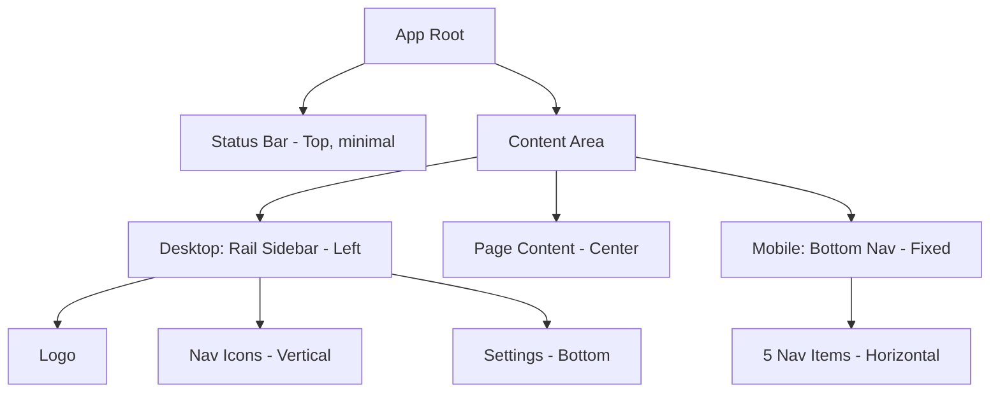
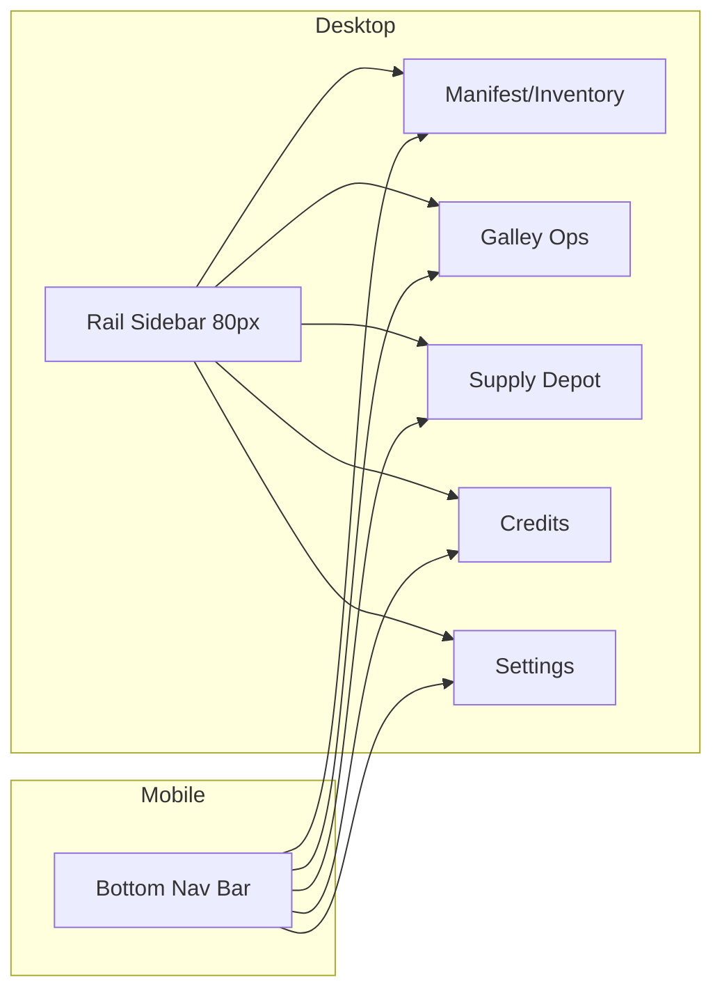

# Orbital Luxury UI Migration Plan

## Executive Summary

This document outlines the complete migration strategy for transforming the Ration SaaS application from the current **Brutalist/Terminal** design language to the new **Orbital Luxury** design system.

**Critical Constraint**: This is a pure UI/UX migration. All application logic, state management, Remix loaders/actions, D1 database calls, and Stripe webhooks remain 100% unchanged.

---

## 1. Current State Analysis

### 1.1 Design System Configuration

#### CSS Variables (app/app.css)
```css
:root {
  --neon-green: #39FF14;      /* Primary accent - terminal green */
  --void-dark: #051105;       /* Background - deep black-green */
}

@theme {
  --color-neon-green: var(--neon-green);
  --color-void-dark: var(--void-dark);
  --font-mono: ui-monospace, SFMono-Regular, Menlo, Monaco, Consolas, monospace;
}
```

#### Global Styling Characteristics
- **Background**: `bg-[#051105]` (void dark) - applied via body CSS
- **Text Color**: `text-[#39FF14]` (neon green) - high contrast terminal style
- **Font**: System monospace stack
- **Borders**: Heavy use of `border-[#39FF14]` with opacity variants
- **Border Radius**: Forcefully removed globally (`border-radius: 0px !important`)
- **Accent Colors**: Red for danger states, yellow for warnings

#### Font Loading (app/root.tsx)
Currently loads Inter font from Google Fonts (unused - will be replaced):
```typescript
href: "https://fonts.googleapis.com/css2?family=Inter:..."
```

### 1.2 Current Navigation Structure

**app/root.tsx Layout**:
- Full-width status bar at top containing credits, user info, logout
- No sidebar or bottom navigation
- Content flows directly below status bar

**app/routes/dashboard.tsx**:
- Simple wrapper with padding: `min-h-screen bg-[#051105] text-[#39FF14] font-mono p-4 md:p-8`
- Zero navigation elements - relies on DashboardHeader tabs

**DashboardHeader Navigation Tabs**:
- Horizontal inline links: Manifest, Galley Ops, Supply Depot, Credits, Config
- Active state: `text-[#39FF14] underline`
- Inactive state: `opacity-50 hover:opacity-100`

### 1.3 Component Inventory with Styling Patterns

| Component | File | Key Styling Patterns |
|-----------|------|---------------------|
| **IngestForm** | `cargo/IngestForm.tsx` | `border border-[#39FF14]`, `bg-[#051105]`, checkbox accent |
| **InventoryCard** | `cargo/InventoryCard.tsx` | Card with `border border-[#39FF14]`, hover glow, tags with borders |
| **InventoryEditModal** | `cargo/InventoryEditModal.tsx` | Modal overlay `bg-black/80`, form with underline inputs |
| **ManifestGrid** | `cargo/ManifestGrid.tsx` | 3-column grid, dashed empty state |
| **StatusGauge** | `cargo/StatusGauge.tsx` | Progress bar `bg-[#39FF14]/20`, fill states |
| **DashboardHeader** | `dashboard/DashboardHeader.tsx` | Border-bottom header, inline tab navigation |
| **MealCard** | `galley/MealCard.tsx` | Link card, hover reveal overlay |
| **MealGrid** | `galley/MealGrid.tsx` | Grid + matching controls UI |
| **MealMatchBadge** | `galley/MealMatchBadge.tsx` | Percentage badge with color states |
| **MealDetail** | `galley/MealDetail.tsx` | Detail view with ingredient list, action buttons |
| **MealBuilder** | `galley/MealBuilder.tsx` | Form with sections, underline inputs |
| **IngredientPicker** | `galley/IngredientPicker.tsx` | Repeatable row UI with remove buttons |
| **DirectionsEditor** | `galley/DirectionsEditor.tsx` | Textarea with border focus state |
| **Status** | `hud/Status.tsx` | Top bar with credits display, user avatar |
| **CameraInput** | `scanner/CameraInput.tsx` | Button with ping animation, analyzing state |
| **AddItemForm** | `supply/AddItemForm.tsx` | Expandable form, input with icon buttons |
| **GroceryList** | `supply/GroceryList.tsx` | Grouped list with progress bar |
| **GroceryItem** | `supply/GroceryItem.tsx` | Checkbox item with delete on hover |
| **ExportMenu** | `supply/ExportMenu.tsx` | Dropdown menu with icon options |
| **ShareModal** | `supply/ShareModal.tsx` | Modal with copy-to-clipboard functionality |

---

## 2. Target Design System: Orbital Luxury

### 2.1 Color Palette

| Token | Hex | Usage |
|-------|-----|-------|
| `ceramic` | `#F8F9FA` | Primary background |
| `platinum` | `#E6E6E6` | Secondary/subtle backgrounds |
| `carbon` | `#111111` | Primary text |
| `hyper-green` | `#00E088` | Primary accent, CTAs, active states |
| `hyper-green-subtle` | `#00E08820` | Subtle green tints |
| `glass-white` | `#FFFFFF80` | Glass panel overlays |

### 2.2 Typography

**Font Family**: Space Mono (Google Fonts)
- Weights: 400 (regular), 700 (bold)
- Character: Monospace with quirky geometry
- Use varying `letter-spacing` (tracking) for hierarchy

### 2.3 Visual Effects

| Effect | Implementation |
|--------|----------------|
| **Shadow Glow** | `shadow-[0_4px_20px_rgba(0,224,136,0.3)]` for active elements |
| **Glass Panels** | `bg-white/80 backdrop-blur-sm` with subtle borders |
| **Control Surface** | Cards with minimal borders, whitespace separation |
| **Border Treatment** | Minimal/no borders - use whitespace and shadows instead |
| **Radius** | Remove `!important` override, allow natural rounding `rounded-lg`, `rounded-xl` |

---

## 3. Migration Plan

### Phase 1: Foundation Layer

#### 3.1.1 Update app/app.css

**Current:**
```css
:root {
  --neon-green: #39FF14;
  --void-dark: #051105;
}
```

**Target:**
```css
:root {
  /* Orbital Luxury Design Tokens */
  --ceramic: #F8F9FA;
  --platinum: #E6E6E6;
  --carbon: #111111;
  --hyper-green: #00E088;
  --hyper-green-subtle: rgba(0, 224, 136, 0.125);
  --glass-white: rgba(255, 255, 255, 0.8);
  
  /* Shadows */
  --shadow-glow: 0 4px 20px rgba(0, 224, 136, 0.3);
  --shadow-soft: 0 2px 10px rgba(0, 0, 0, 0.05);
}

@theme {
  --color-ceramic: var(--ceramic);
  --color-platinum: var(--platinum);
  --color-carbon: var(--carbon);
  --color-hyper-green: var(--hyper-green);
  --font-mono: 'Space Mono', ui-monospace, monospace;
}

@layer base {
  body {
    background-color: var(--ceramic);
    color: var(--carbon);
    font-family: var(--font-mono);
  }
}

@layer utilities {
  .shadow-glow {
    box-shadow: var(--shadow-glow);
  }
  .shadow-soft {
    box-shadow: var(--shadow-soft);
  }
  .glass-panel {
    background: var(--glass-white);
    backdrop-filter: blur(8px);
    -webkit-backdrop-filter: blur(8px);
  }
  .control-surface {
    background: white;
    border-radius: 1rem;
    box-shadow: var(--shadow-soft);
  }
}
```

**Actions:**
1. Replace all CSS variables with Orbital Luxury tokens
2. Remove the `border-radius: 0px !important` brutalist reset
3. Change body background from void-dark to ceramic
4. Change body text color from neon-green to carbon
5. Add utility classes for `shadow-glow`, `glass-panel`, `control-surface`

#### 3.1.2 Update app/root.tsx Font Loading

**Current:**
```typescript
{
  rel: "stylesheet",
  href: "https://fonts.googleapis.com/css2?family=Inter:..."
}
```

**Target:**
```typescript
{
  rel: "stylesheet",
  href: "https://fonts.googleapis.com/css2?family=Space+Mono:wght@400;700&display=swap"
}
```

#### 3.1.3 Update app/root.tsx Body Classes

**Current:**
```tsx
<body className="bg-[#051105] text-white">
```

**Target:**
```tsx
<body className="bg-ceramic text-carbon font-mono antialiased">
```

---

### Phase 2: Shell and Navigation

#### 3.2.1 Transform Status Component (app/components/hud/Status.tsx)

**Concept**: Convert from full-width top bar to compact header element integrated into dashboard layout.

**Class Transformations:**

| Current | Target |
|---------|--------|
| `border-b border-[#39FF14]/20` | `border-b border-platinum` |
| `bg-[#051105]/80` | `bg-white/80 backdrop-blur-sm` |
| `text-[#39FF14]` | `text-carbon` |
| `border border-[#39FF14]/30` | `border border-hyper-green/20` or no border |
| `hover:bg-[#39FF14]` | `hover:bg-hyper-green shadow-glow` |
| `text-black` (on hover) | `text-white` (on hover with green bg) |

**Structural Changes:**
- Add rounded corners to buttons
- Credits display: soft background pill-style
- Avatar: add ring-2 ring-hyper-green on focus

#### 3.2.2 Transform Dashboard Layout (app/routes/dashboard.tsx)

**Current:**
```tsx
<div className="min-h-screen bg-[#051105] text-[#39FF14] font-mono p-4 md:p-8">
```

**Target Structure:**
```tsx
<div className="min-h-screen bg-ceramic text-carbon font-mono">
  {/* Desktop: Rail sidebar on left */}
  <aside className="hidden lg:flex fixed left-0 top-0 h-screen w-20 flex-col items-center py-8 bg-white border-r border-platinum">
    {/* Logo */}
    {/* Nav icons */}
    {/* Settings at bottom */}
  </aside>
  
  {/* Main content area */}
  <main className="lg:ml-20 pb-20 lg:pb-8">
    <Outlet />
  </main>
  
  {/* Mobile: Bottom nav bar */}
  <nav className="lg:hidden fixed bottom-0 left-0 right-0 bg-white/90 backdrop-blur-sm border-t border-platinum">
    {/* 5 nav items with icons */}
  </nav>
</div>
```

**Navigation Items:**
1. **Manifest** (Home/Inventory) - Package icon
2. **Galley** (Meals) - Utensils icon  
3. **Supply** (Grocery) - ShoppingCart icon
4. **Credits** - CreditCard icon
5. **Settings** - Settings icon

#### 3.2.3 Transform DashboardHeader (app/components/dashboard/DashboardHeader.tsx)

**Concept**: Simplify to page title + search bar only (navigation moves to shell).

**Current:** Full header with tabs, search, item count
**Target:** Clean page header with title, subtitle, optional search

**Class Transformations:**

| Current | Target |
|---------|--------|
| `border-b border-[#39FF14]` | `border-b border-platinum` or whitespace only |
| `text-[#39FF14]` | `text-carbon` |
| `bg-black/50` (search) | `bg-platinum/50` with `rounded-full` |
| `border-[#39FF14]/30` | `border-transparent` or `border-platinum` |
| `focus:border-[#39FF14]` | `focus:ring-2 focus:ring-hyper-green` |

**Remove:** Navigation tabs (moved to shell sidebar/bottom nav)

---

### Phase 3: Component Migration

Each component follows a consistent transformation pattern. The following sections detail specific changes for each component group.

#### 3.3.1 Cargo Components

##### IngestForm.tsx

**Container:**
- Current: `border border-[#39FF14] bg-[#051105]`
- Target: `control-surface p-6` (white bg, rounded, subtle shadow)

**Section Header:**
- Current: `border-b border-[#39FF14]/50`
- Target: `border-b border-platinum pb-4 mb-4`

**Labels:**
- Current: `text-xs uppercase opacity-70`
- Target: `text-xs uppercase tracking-wider text-carbon/60`

**Inputs:**
- Current: `bg-black/50 border border-[#39FF14]/50`
- Target: `bg-platinum/30 border border-platinum rounded-lg focus:ring-2 focus:ring-hyper-green focus:border-transparent`

**Select Dropdowns:**
- Same transformation as inputs

**Checkboxes:**
- Current: `accent-[#39FF14]`
- Target: `accent-hyper-green` with custom styling using green

**Submit Button:**
- Current: `bg-[#39FF14] text-black hover:bg-[#32cc12]`
- Target: `bg-hyper-green text-white rounded-lg shadow-glow hover:shadow-lg transition-all`

##### InventoryCard.tsx

**Container:**
- Current: `border border-[#39FF14] bg-[#051105]/90`
- Target: `control-surface p-4` (rounded, white bg, soft shadow)

**Hover State:**
- Current: `hover:bg-[#0a220a]`
- Target: `hover:shadow-md transition-shadow`

**Tags:**
- Current: `border border-[#39FF14]/50`
- Target: `bg-hyper-green-subtle text-hyper-green rounded-full px-2 py-0.5`

**Action Buttons (hover reveal):**
- Current: `shadow-[0_0_10px_rgba(57,255,20,0.3)]`
- Target: `shadow-glow rounded-lg`

**Delete Button:**
- Keep red color scheme: `text-red-500` → `text-red-500 hover:bg-red-50 rounded-lg`

##### InventoryEditModal.tsx

**Overlay:**
- Current: `bg-black/80`
- Target: `bg-carbon/40 backdrop-blur-sm`

**Modal Container:**
- Current: `bg-[#051105] border border-[#39FF14] shadow-[0_0_30px_rgba(57,255,20,0.3)]`
- Target: `bg-white rounded-2xl shadow-xl`

**Form Inputs:**
- Current: `border-b border-[#39FF14]/50 bg-transparent`
- Target: `border border-platinum rounded-lg bg-platinum/20 focus:ring-2 focus:ring-hyper-green`

**Action Buttons:**
- Cancel: `text-carbon/50 hover:text-carbon`
- Update: `bg-hyper-green text-white rounded-lg shadow-glow`

##### ManifestGrid.tsx

**Empty State:**
- Current: `border border-dashed border-[#39FF14]/30`
- Target: `bg-platinum/30 rounded-xl text-carbon/50 py-16`

**Grid:**
- Current: `grid grid-cols-1 md:grid-cols-2 lg:grid-cols-3 gap-4`
- Target: `grid grid-cols-1 md:grid-cols-2 xl:grid-cols-3 gap-6` (increased gap)

##### StatusGauge.tsx

**Progress Bar Background:**
- Current: `bg-[#39FF14]/20`
- Target: `bg-platinum rounded-full`

**Progress Fill:**
- Current: `bg-[#39FF14]`
- Target: `bg-hyper-green rounded-full`

**Status Colors:**
- Stable: `bg-hyper-green`
- Warning: `bg-amber-400`
- Critical: `bg-red-500`

---

#### 3.3.2 Galley Components

##### MealCard.tsx

**Card Container:**
- Current: `border border-[#39FF14] bg-[#051105]/90`
- Target: `control-surface overflow-hidden`

**Hover Overlay:**
- Current: `bg-[#39FF14] text-black`
- Target: `bg-hyper-green text-white rounded-full shadow-glow`

**Tags:**
- Same transformation as InventoryCard tags

##### MealGrid.tsx

**Matching Controls Panel:**
- Current: `border border-[#39FF14]/30 bg-[#051105]/50`
- Target: `control-surface p-4`

**Toggle Buttons:**
- Current: `bg-[#39FF14] text-black` (active)
- Target: `bg-hyper-green text-white rounded-lg` (active)
- Current: `text-[#39FF14] hover:bg-[#39FF14]/10` (inactive)
- Target: `text-carbon hover:bg-platinum rounded-lg` (inactive)

**Range Input:**
- Current: `accent-[#39FF14]`
- Target: Custom styling with `bg-hyper-green` thumb and `bg-platinum` track

##### MealMatchBadge.tsx

**Badge Container:**
- Current: `border rounded` with color variants
- Target: `rounded-full font-bold` with color variants

**Color States:**
- 100%: `bg-hyper-green/20 text-hyper-green`
- 75%+: `bg-amber-100 text-amber-600`
- 50%+: `bg-orange-100 text-orange-600`
- <50%: `bg-red-100 text-red-600`

##### MealDetail.tsx

**Header Border:**
- Current: `border-b-2 border-[#39FF14]`
- Target: `border-b border-platinum`

**Protocol Text:**
- Current: `text-white glow-green`
- Target: `text-carbon` (remove glow effect)

**Ingredient List Panel:**
- Current: `border border-[#39FF14]/30 bg-[#051105]/50`
- Target: `control-surface p-6`

**Availability Indicators:**
- Available: `bg-hyper-green` (green dot)
- Partial: `bg-amber-400` (yellow dot)
- Missing: `bg-red-500` (red dot)

**Cook Button:**
- Current: `bg-[#39FF14]/10 border border-[#39FF14] hover:bg-[#39FF14]`
- Target: `bg-hyper-green text-white rounded-lg shadow-glow hover:shadow-lg`

##### MealBuilder.tsx

**Form Container:**
- Current: `font-mono text-[#39FF14]`
- Target: `font-mono text-carbon`

**Section Headers:**
- Current: `border-b border-[#39FF14]`
- Target: `border-b border-platinum font-bold text-carbon`

**Submit Button:**
- Current: `bg-[#39FF14] text-black shadow-[0_0_15px_rgba(57,255,20,0.5)]`
- Target: `bg-hyper-green text-white rounded-lg shadow-glow`

##### IngredientPicker.tsx

**Container:**
- Current: `border border-[#39FF14]/30 bg-[#051105]/50`
- Target: `control-surface p-4`

**Add Button:**
- Current: `bg-[#39FF14]/20 border border-[#39FF14]`
- Target: `bg-hyper-green-subtle text-hyper-green rounded-lg hover:bg-hyper-green hover:text-white`

**Row Dividers:**
- Current: `border-b border-[#39FF14]/10`
- Target: `border-b border-platinum`

**Remove Button:**
- Keep red styling: `text-red-500 hover:text-red-400`

##### DirectionsEditor.tsx

**Textarea:**
- Current: `bg-[#051105] border border-[#39FF14]/50 text-[#39FF14]`
- Target: `bg-platinum/30 border border-platinum rounded-lg text-carbon focus:ring-2 focus:ring-hyper-green`

---

#### 3.3.3 Supply Components

##### AddItemForm.tsx

**Input Field:**
- Current: `bg-black border border-[#39FF14]/50`
- Target: `bg-white border border-platinum rounded-lg focus:ring-2 focus:ring-hyper-green`

**Expand Button:**
- Current: `border border-[#39FF14]/50 text-[#39FF14]`
- Target: `border border-platinum rounded-lg text-carbon hover:bg-platinum`

**Add Button:**
- Current: `bg-[#39FF14] text-black`
- Target: `bg-hyper-green text-white rounded-lg shadow-glow`

**Expanded Options Panel:**
- Current: `border border-[#39FF14]/30 bg-[#051105]/50`
- Target: `bg-platinum/20 rounded-lg p-4`

##### GroceryList.tsx

**Progress Bar:**
- Current: `bg-[#39FF14]/20` track, `bg-[#39FF14]` fill
- Target: `bg-platinum rounded-full` track, `bg-hyper-green rounded-full` fill

**Action Buttons (Share, Export):**
- Current: `border border-[#39FF14]/50 text-[#39FF14]`
- Target: `border border-platinum text-carbon rounded-lg hover:bg-platinum`

**Empty State:**
- Current: `border border-[#39FF14]/20 border-dashed`
- Target: `bg-platinum/30 rounded-xl py-16`

**Category Headers:**
- Current: `text-xs uppercase tracking-widest opacity-70`
- Target: `text-xs uppercase tracking-wider text-carbon/60 font-bold`

##### GroceryItem.tsx

**Item Container:**
- Current: `border border-[#39FF14]/30 bg-[#051105]/90`
- Target: `bg-white rounded-lg p-3 shadow-sm hover:shadow-md transition-shadow`

**Checkbox:**
- Current: `border-2 border-[#39FF14]` / `bg-[#39FF14]`
- Target: `border-2 border-platinum rounded` / `bg-hyper-green border-hyper-green rounded`

**Purchased State:**
- Current: `opacity-50 line-through`
- Target: `opacity-40 line-through bg-platinum/30`

**Category Badge:**
- Current: `border border-[#39FF14]/30 opacity-50`
- Target: `bg-platinum/50 rounded-full text-carbon/50`

##### ExportMenu.tsx

**Trigger Button:**
- Current: `border border-[#39FF14]/50 text-[#39FF14]`
- Target: `border border-platinum text-carbon rounded-lg hover:bg-platinum`

**Dropdown:**
- Current: `bg-[#051105] border border-[#39FF14]/50`
- Target: `bg-white rounded-xl shadow-lg border border-platinum`

**Menu Items:**
- Current: `hover:bg-[#39FF14]/10`
- Target: `hover:bg-platinum rounded-lg`

##### ShareModal.tsx

**Overlay:**
- Current: `bg-black/80`
- Target: `bg-carbon/40 backdrop-blur-sm`

**Modal:**
- Current: `bg-[#051105] border border-[#39FF14]`
- Target: `bg-white rounded-2xl shadow-xl`

**URL Input:**
- Current: `bg-black border border-[#39FF14]/50`
- Target: `bg-platinum/30 border-none rounded-lg`

**Copy Button:**
- Current: `bg-[#39FF14] text-black` (copied state)
- Target: `bg-hyper-green text-white rounded-lg` (copied state)

**Revoke Button:**
- Keep red styling: `border-red-500/50 text-red-500 hover:bg-red-50`

---

#### 3.3.4 HUD and Scanner Components

##### Status.tsx (HUD)

**Container:**
- Current: `border-b border-[#39FF14]/20 bg-[#051105]/80 backdrop-blur-sm`
- Target: `bg-white/90 backdrop-blur-sm border-b border-platinum`

**Credits Button:**
- Current: `text-[#39FF14]`
- Target: `text-carbon hover:text-hyper-green`

**Credits Value:**
- Add subtle background: `bg-hyper-green-subtle text-hyper-green rounded-full px-3 py-1`

**Divider:**
- Current: `bg-[#39FF14]/20`
- Target: `bg-platinum`

**Avatar:**
- Current: `border border-[#39FF14]/50`
- Target: `rounded-full ring-2 ring-platinum`

**Logout Button:**
- Current: `border border-[#39FF14]/30 hover:bg-[#39FF14] hover:text-black`
- Target: `border border-platinum rounded-lg hover:bg-platinum text-carbon`

##### CameraInput.tsx (Scanner)

**Scan Button:**
- Current: `bg-[#39FF14]/10 border border-[#39FF14] text-[#39FF14]`
- Target: `bg-hyper-green-subtle border border-hyper-green text-hyper-green rounded-lg hover:bg-hyper-green hover:text-white`

**Analyzing State Animation:**
- Current: `animate-pulse` with green
- Target: `animate-pulse` with hyper-green spinner

**Ping Effect:**
- Current: `border-2 border-[#39FF14] animate-ping`
- Target: `border-2 border-hyper-green animate-ping rounded-lg`

---

## 4. Design System Reference

### 4.1 Color Mapping Table

| Old (Brutalist) | New (Orbital Luxury) | Usage |
|-----------------|----------------------|-------|
| `bg-[#051105]` | `bg-ceramic` / `bg-white` | Primary backgrounds |
| `bg-black` / `bg-black/50` | `bg-platinum/30` | Input backgrounds |
| `text-[#39FF14]` | `text-carbon` | Primary text |
| `text-[#39FF14]/50` | `text-carbon/50` | Muted text |
| `text-white` | `text-carbon` | Body text |
| `border-[#39FF14]` | `border-platinum` | Default borders |
| `border-[#39FF14]/30` | `border-transparent` or `border-platinum/50` | Subtle borders |
| `hover:bg-[#39FF14]` | `hover:bg-hyper-green shadow-glow` | Primary hover |
| `hover:text-black` | `hover:text-white` | Hover text on green |
| `bg-[#39FF14]` | `bg-hyper-green` | Primary buttons |
| `text-black` (on green) | `text-white` | Button text |
| `opacity-70` | `text-carbon/70` | Secondary text |
| `bg-red-500` | `bg-red-500` | Keep unchanged |
| `bg-yellow-500` | `bg-amber-400` | Warning states |

### 4.2 Typography Implementation

**Space Mono Loading:**
```html
<link href="https://fonts.googleapis.com/css2?family=Space+Mono:wght@400;700&display=swap" rel="stylesheet">
```

**Typography Scale:**
- Headers: `text-3xl font-bold tracking-tight`
- Subheaders: `text-lg font-bold tracking-wide`
- Body: `text-base tracking-normal`
- Labels: `text-xs uppercase tracking-wider`
- Badges: `text-[10px] uppercase tracking-widest font-bold`

### 4.3 New Utility Classes

```css
/* Add to app/app.css */

.shadow-glow {
  box-shadow: 0 4px 20px rgba(0, 224, 136, 0.3);
}

.shadow-soft {
  box-shadow: 0 2px 10px rgba(0, 0, 0, 0.05);
}

.glass-panel {
  background: rgba(255, 255, 255, 0.8);
  backdrop-filter: blur(8px);
  -webkit-backdrop-filter: blur(8px);
}

.control-surface {
  @apply bg-white rounded-xl shadow-soft;
}

.input-field {
  @apply bg-platinum/30 border border-platinum rounded-lg px-4 py-2 
         focus:outline-none focus:ring-2 focus:ring-hyper-green focus:border-transparent
         transition-all;
}

.btn-primary {
  @apply bg-hyper-green text-white font-bold uppercase tracking-wider 
         rounded-lg px-6 py-3 shadow-glow 
         hover:shadow-lg active:shadow-md
         transition-all;
}

.btn-secondary {
  @apply bg-transparent border border-platinum text-carbon
         rounded-lg px-4 py-2
         hover:bg-platinum
         transition-all;
}

.badge {
  @apply text-[10px] uppercase tracking-widest font-bold
         rounded-full px-2 py-0.5;
}

.badge-green {
  @apply badge bg-hyper-green-subtle text-hyper-green;
}
```

### 4.4 Component Pattern: Control Surface

A **Control Surface** is the primary container pattern in Orbital Luxury:

```tsx
// Pattern
<div className="control-surface p-6">
  {/* Content with whitespace */}
</div>

// Compiled Classes
<div className="bg-white rounded-xl shadow-soft p-6">
  {/* Content */}
</div>
```

---

## 5. Architecture Diagrams

### 5.1 New Shell Structure



### 5.2 Navigation Flow



### 5.3 Component Color State Flow

```mermaid
stateDiagram-v2
    [*] --> Default: Initial
    Default --> Hover: Mouse Enter
    Hover --> Active: Click
    Active --> Default: Release
    
    state Default {
        bg: bg-white
        border: border-platinum
        text: text-carbon
    }
    
    state Hover {
        bg: bg-platinum/50
        shadow: shadow-md
        text: text-carbon
    }
    
    state Active {
        bg: bg-hyper-green
        shadow: shadow-glow
        text: text-white
    }
```

---

## 6. Implementation Checklist

### Phase 1: Foundation
- [ ] Update CSS variables in app/app.css
- [ ] Remove brutalist border-radius override
- [ ] Add new utility classes to app/app.css
- [ ] Update Google Fonts link to Space Mono in app/root.tsx
- [ ] Update body classes in app/root.tsx Layout component

### Phase 2: Shell
- [ ] Create new sidebar component for desktop navigation
- [ ] Create new bottom navigation component for mobile
- [ ] Update app/routes/dashboard.tsx layout structure
- [ ] Migrate Status.tsx to new color scheme
- [ ] Simplify DashboardHeader.tsx - remove nav tabs

### Phase 3: Cargo Components
- [ ] Migrate IngestForm.tsx
- [ ] Migrate InventoryCard.tsx
- [ ] Migrate InventoryEditModal.tsx
- [ ] Migrate ManifestGrid.tsx
- [ ] Migrate StatusGauge.tsx

### Phase 4: Galley Components
- [ ] Migrate MealCard.tsx
- [ ] Migrate MealGrid.tsx
- [ ] Migrate MealMatchBadge.tsx
- [ ] Migrate MealDetail.tsx
- [ ] Migrate MealBuilder.tsx
- [ ] Migrate IngredientPicker.tsx
- [ ] Migrate DirectionsEditor.tsx

### Phase 5: Supply Components
- [ ] Migrate AddItemForm.tsx
- [ ] Migrate GroceryList.tsx
- [ ] Migrate GroceryItem.tsx
- [ ] Migrate ExportMenu.tsx
- [ ] Migrate ShareModal.tsx

### Phase 6: HUD/Scanner
- [ ] Migrate CameraInput.tsx

### Phase 7: Error States and Misc
- [ ] Update ErrorBoundary in app/root.tsx
- [ ] Update any remaining route-specific styling

---

## 7. Testing Strategy

After each phase:
1. Visual regression check all affected pages
2. Verify responsive behavior (mobile bottom nav, desktop rail)
3. Confirm all interactive states work (hover, focus, active)
4. Test accessibility (color contrast, focus rings)
5. Verify no regressions in application logic

---

## Appendix A: Files to Modify

| File | Phase |
|------|-------|
| `app/app.css` | 1 |
| `app/root.tsx` | 1, 2 |
| `app/routes/dashboard.tsx` | 2 |
| `app/routes/dashboard/index.tsx` | 2 (minor padding) |
| `app/components/hud/Status.tsx` | 2 |
| `app/components/dashboard/DashboardHeader.tsx` | 2 |
| `app/components/cargo/IngestForm.tsx` | 3 |
| `app/components/cargo/InventoryCard.tsx` | 3 |
| `app/components/cargo/InventoryEditModal.tsx` | 3 |
| `app/components/cargo/ManifestGrid.tsx` | 3 |
| `app/components/cargo/StatusGauge.tsx` | 3 |
| `app/components/galley/MealCard.tsx` | 4 |
| `app/components/galley/MealGrid.tsx` | 4 |
| `app/components/galley/MealMatchBadge.tsx` | 4 |
| `app/components/galley/MealDetail.tsx` | 4 |
| `app/components/galley/MealBuilder.tsx` | 4 |
| `app/components/galley/IngredientPicker.tsx` | 4 |
| `app/components/galley/DirectionsEditor.tsx` | 4 |
| `app/components/supply/AddItemForm.tsx` | 5 |
| `app/components/supply/GroceryList.tsx` | 5 |
| `app/components/supply/GroceryItem.tsx` | 5 |
| `app/components/supply/ExportMenu.tsx` | 5 |
| `app/components/supply/ShareModal.tsx` | 5 |
| `app/components/scanner/CameraInput.tsx` | 6 |

## Appendix B: New Files to Create

| File | Purpose |
|------|---------|
| `app/components/shell/RailSidebar.tsx` | Desktop navigation sidebar |
| `app/components/shell/BottomNav.tsx` | Mobile bottom navigation |

---

*Document Version: 1.0*
*Last Updated: January 2026*
