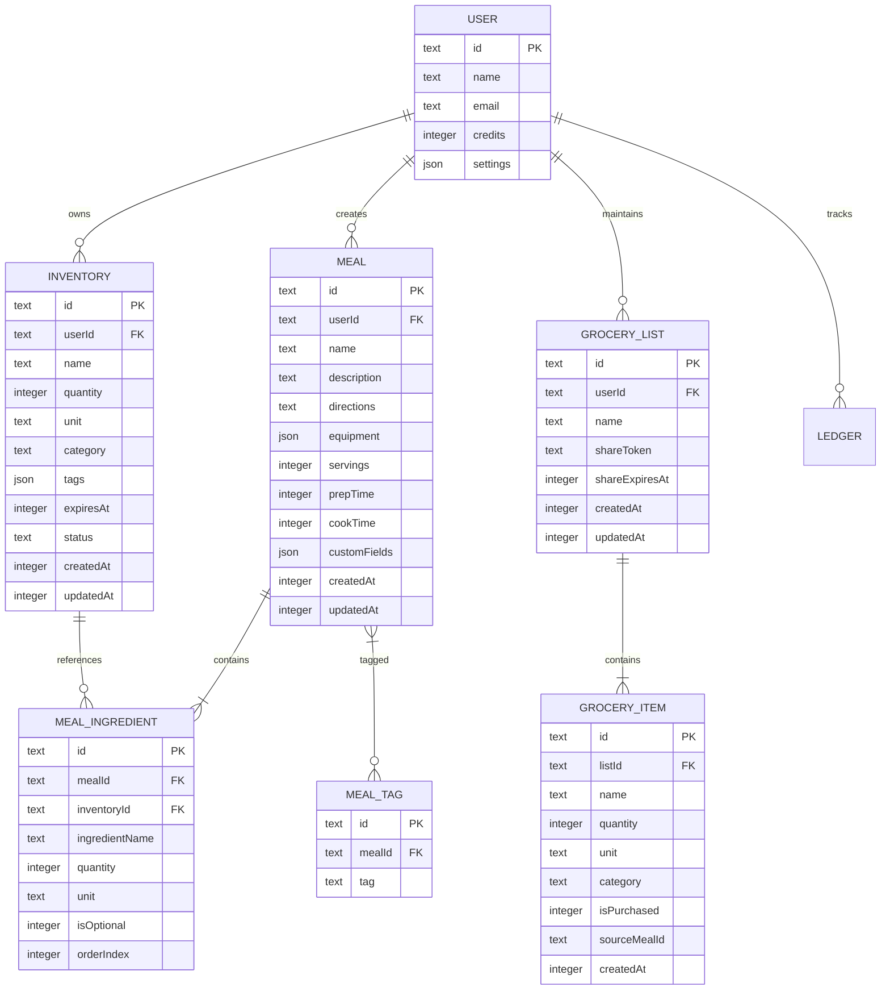
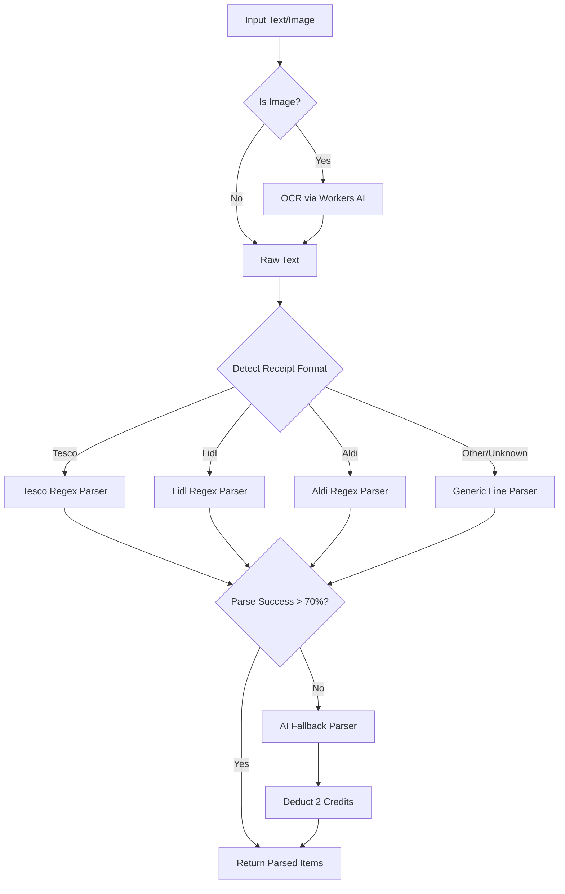
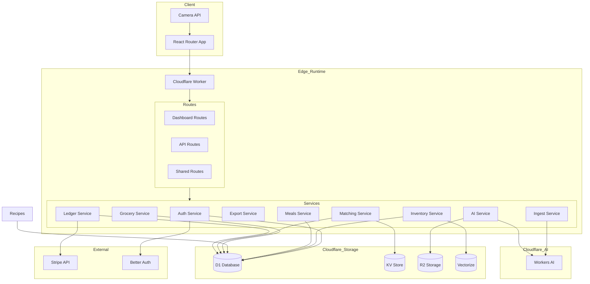

# Ration Application - Comprehensive Architectural Evaluation & Implementation Roadmap

## Executive Summary

This document provides a comprehensive gap analysis, architectural design, and phased implementation roadmap for expanding the Ration meal planning application from its current partial inventory management state to a fully-featured meal planning platform.

### Recently Implemented

- **Queues for Scan and Meal Generate** — `ration-scan` and `ration-meal-generate` queues offload long-lived AI operations; producer returns immediately, client polls status endpoints; consumer runs in separate invocation.
- **Browser Rendering for Recipe Import** — URL import uses Cloudflare Browser Rendering Markdown API as fallback for JS-heavy recipe sites; plain fetch first, BR when content is insufficient or blocked.

---

## Part 1: Gap Analysis

### Current State Assessment

#### Technology Stack
| Component | Current Implementation |
|-----------|----------------------|
| **Runtime** | Cloudflare Workers (Edge) |
| **Framework** | React Router v7 |
| **Database** | Cloudflare D1 (SQLite) |
| **ORM** | Drizzle ORM |
| **Vector Search** | Cloudflare Vectorize |
| **File Storage** | Cloudflare R2 |
| **AI** | Cloudflare Workers AI |
| **KV Store** | Cloudflare KV (rate limiting) |
| **Auth** | Better Auth |
| **Payments** | Stripe |
| **Styling** | Tailwind CSS v4 |

#### Existing Database Schema

```
┌─────────────────┐     ┌─────────────────┐     ┌─────────────────┐
│      user       │     │    inventory    │     │     ledger      │
├─────────────────┤     ├─────────────────┤     ├─────────────────┤
│ id (PK)         │◄────│ userId (FK)     │     │ id (PK)         │
│ name            │     │ id (PK)         │     │ userId (FK)     │◄──┐
│ email           │     │ name            │     │ amount          │   │
│ emailVerified   │     │ quantity        │     │ reason          │   │
│ image           │     │ unit            │     │ createdAt       │   │
│ createdAt       │     │ tags (JSON)     │     └─────────────────┘   │
│ updatedAt       │     │ expiresAt       │                           │
│ settings (JSON) │     │ createdAt       │                           │
│ credits         │─────┼─────────────────┼───────────────────────────┘
└─────────────────┘     └─────────────────┘

+ session, account, verification (Better Auth tables)
```

### Feature Gap Matrix

| Feature | Requirement | Current State | Gap Status |
|---------|-------------|---------------|------------|
| **Inventory Management** | Full CRUD operations | Create & Delete only | 🟡 Partial |
| Taxonomy tags | Dry Goods, Cryo/Frozen, Perishable | Generic tags array | 🟡 Partial |
| Visual status indicators | Green/Yellow/Red gauges | Basic expiry based | 🟡 Partial |
| **Recipe System** | Recipe entity with ingredients | Not implemented | 🔴 Missing |
| Strict Matching mode | Boolean ingredient availability | Not implemented | 🔴 Missing |
| Delta Matching mode | Percentage match + missing list | Not implemented | 🔴 Missing |
| **Meal Creation** | Meals as ingredient combinations | Not implemented | 🔴 Missing |
| Meal metadata | Prep directions, tools, times | Not implemented | 🔴 Missing |
| **Grocery List** | Shopping list manifest | Not implemented | 🔴 Missing |
| Recipe-to-List transfer | One-click missing ingredients | Not implemented | 🔴 Missing |
| Export capabilities | Plain text, shareable URL | Not implemented | 🔴 Missing |
| **Bulk Ingestion** | Text parsing for receipts | Not implemented | 🔴 Missing |
| OCR image parsing | Receipt line extraction | Not implemented | 🔴 Missing |
| **Visual Analysis** | Image upload for storage scan | Partial via `/api/scan` | 🟡 Partial |
| AI item identification | Partial via scan endpoint | 🟡 Partial |
| **Generative Planning** | Ration Mode (caloric efficiency) | Not implemented | 🔴 Missing |
| Chef Mode (ad-hoc cooking) | Not implemented | 🔴 Missing |
| **Credits Economy** | Credit balance tracking | Implemented | 🟢 Complete |
| Credit deduction | Implemented for scans | 🟢 Complete |
| Stripe integration | Fully implemented | 🟢 Complete |

### Existing Implementation Details

#### What Works
- **Inventory Add/Delete**: [`addItem()`](app/lib/inventory.server.ts:46) and [`jettisonItem()`](app/lib/inventory.server.ts:82)
- **Vector Search**: Semantic search via [`querySimilarItems()`](app/lib/vector.server.ts:83)
- **AI Visual Scan**: Image analysis via [`/api/scan`](app/routes/api/scan.tsx:1) endpoint
- **Credits System**: Full ledger with [`deductCredits()`](app/lib/ledger.server.ts:20) and [`addCredits()`](app/lib/ledger.server.ts:64)
- **Rate Limiting**: Distributed via KV in [`checkRateLimit()`](app/lib/rate-limiter.server.ts)
- **Authentication**: Google OAuth via Better Auth

#### What Needs Enhancement
- **Inventory Update**: No [`updateItem()`](app/lib/inventory.server.ts) function exists
- **Taxonomy**: Tags exist but lack structured categories
- **Expiry Indicators**: Basic calculation in [`ManifestGrid.tsx`](app/components/cargo/ManifestGrid.tsx:35) needs enhancement

---

## Part 2: Data Model Architecture

### Extended Entity-Relationship Diagram

> **Architecture Decision**: Meals serve as the user's personal recipe system. There is no global/shared recipe database - users create and manage their own meals which function as recipes.



> **Note**: Share tokens expire after 7 days (604800 seconds).

### New Table Schemas

#### 1. Inventory Enhancements

```sql
-- Migration: Add category and status columns to inventory
ALTER TABLE inventory ADD COLUMN category TEXT DEFAULT 'uncategorized';
ALTER TABLE inventory ADD COLUMN status TEXT DEFAULT 'stable';
ALTER TABLE inventory ADD COLUMN updated_at INTEGER DEFAULT (unixepoch());

-- Create index for category filtering
CREATE INDEX inventory_category_idx ON inventory (user_id, category);
```

**Drizzle Schema Addition:**
```typescript
// Category enum values: dry_goods, cryo_frozen, perishable, produce, canned, liquid, other
category: text("category").default("other"),
// Status enum values: stable, decay_imminent, biohazard
status: text("status").default("stable"),
updatedAt: integer("updated_at", { mode: "timestamp" }).default(sql`(unixepoch())`),
```

#### 2. Meal Table

```sql
CREATE TABLE meal (
    id TEXT PRIMARY KEY NOT NULL,
    user_id TEXT NOT NULL REFERENCES user(id),
    name TEXT NOT NULL,
    description TEXT,
    directions TEXT,
    equipment TEXT DEFAULT '[]',
    servings INTEGER DEFAULT 1,
    prep_time INTEGER,
    cook_time INTEGER,
    custom_fields TEXT DEFAULT '{}',
    created_at INTEGER DEFAULT (unixepoch()) NOT NULL,
    updated_at INTEGER DEFAULT (unixepoch()) NOT NULL
);

CREATE INDEX meal_user_idx ON meal (user_id);
```

#### 3. Meal Ingredients Junction Table

```sql
CREATE TABLE meal_ingredient (
    id TEXT PRIMARY KEY NOT NULL,
    meal_id TEXT NOT NULL REFERENCES meal(id) ON DELETE CASCADE,
    inventory_id TEXT REFERENCES inventory(id) ON DELETE SET NULL,
    ingredient_name TEXT NOT NULL,
    quantity INTEGER NOT NULL,
    unit TEXT NOT NULL,
    is_optional INTEGER DEFAULT 0,
    order_index INTEGER DEFAULT 0,
    UNIQUE(meal_id, ingredient_name)
);

CREATE INDEX meal_ingredient_meal_idx ON meal_ingredient (meal_id);
CREATE INDEX meal_ingredient_name_idx ON meal_ingredient (ingredient_name);
```

#### 4. Meal Tags Table

```sql
CREATE TABLE meal_tag (
    id TEXT PRIMARY KEY NOT NULL,
    meal_id TEXT NOT NULL REFERENCES meal(id) ON DELETE CASCADE,
    tag TEXT NOT NULL,
    UNIQUE(meal_id, tag)
);

CREATE INDEX meal_tag_meal_idx ON meal_tag (meal_id);
CREATE INDEX meal_tag_tag_idx ON meal_tag (tag);
```

> **Note**: The meal table functions as the user's personal recipe system. Users can tag meals for filtering (e.g., "breakfast", "quick", "vegetarian") and perform matching against their inventory.

#### 5. Grocery List Tables

```sql
CREATE TABLE grocery_list (
    id TEXT PRIMARY KEY NOT NULL,
    user_id TEXT NOT NULL REFERENCES user(id),
    name TEXT DEFAULT 'Shopping List',
    share_token TEXT UNIQUE,
    share_expires_at INTEGER,
    created_at INTEGER DEFAULT (unixepoch()) NOT NULL,
    updated_at INTEGER DEFAULT (unixepoch()) NOT NULL
);

CREATE INDEX grocery_list_user_idx ON grocery_list (user_id);
CREATE INDEX grocery_list_share_idx ON grocery_list (share_token);

CREATE TABLE grocery_item (
    id TEXT PRIMARY KEY NOT NULL,
    list_id TEXT NOT NULL REFERENCES grocery_list(id) ON DELETE CASCADE,
    name TEXT NOT NULL,
    quantity INTEGER DEFAULT 1,
    unit TEXT DEFAULT 'unit',
    category TEXT DEFAULT 'other',
    is_purchased INTEGER DEFAULT 0,
    source_meal_id TEXT REFERENCES meal(id) ON DELETE SET NULL,
    created_at INTEGER DEFAULT (unixepoch()) NOT NULL
);

CREATE INDEX grocery_item_list_idx ON grocery_item (list_id);
```

---

## Part 3: API Architecture

### RESTful Endpoint Specifications

#### Naming Conventions
- All endpoints use kebab-case
- Collection endpoints are pluralized
- Actions use verbs as sub-resources

#### Authentication Middleware
All `/api/*` and `/dashboard/*` routes require authentication via [`requireAuth()`](app/lib/auth.server.ts:35)

### Inventory API Enhancements

| Method | Endpoint | Description |
|--------|----------|-------------|
| GET | `/dashboard` | List inventory with filters |
| POST | `/dashboard` | Create inventory item (existing `intent=create`) |
| PUT | `/api/inventory/:id` | Update inventory item |
| DELETE | `/dashboard` | Delete inventory item (existing `intent=delete`) |
| POST | `/api/inventory/bulk` | Bulk create from parsed data |

#### PUT `/api/inventory/:id` - Update Item

**Request:**
```typescript
interface UpdateInventoryRequest {
  name?: string;
  quantity?: number;
  unit?: string;
  category?: 'dry_goods' | 'cryo_frozen' | 'perishable' | 'produce' | 'canned' | 'liquid' | 'other';
  tags?: string[];
  expiresAt?: string; // ISO date
}
```

**Response:**
```typescript
interface UpdateInventoryResponse {
  success: boolean;
  item?: InventoryItem;
  errors?: ValidationErrors;
}
```

### Meal API

| Method | Endpoint | Description |
|--------|----------|-------------|
| GET | `/api/meals` | List user meals |
| GET | `/api/meals/:id` | Get meal details with ingredients |
| POST | `/api/meals` | Create new meal |
| PUT | `/api/meals/:id` | Update meal |
| DELETE | `/api/meals/:id` | Delete meal |
| POST | `/api/meals/:id/cook` | Mark meal as cooked, deduct inventory |

#### POST `/api/meals` - Create Meal

**Request:**
```typescript
interface CreateMealRequest {
  name: string;
  description?: string;
  directions?: string;
  equipment?: string[];
  servings?: number;
  prepTime?: number; // minutes
  cookTime?: number; // minutes
  customFields?: Record<string, string>;
  ingredients: {
    inventoryId?: string; // Reference existing inventory
    name: string;
    quantity: number;
    unit: string;
  }[];
}
```

**Response:**
```typescript
interface CreateMealResponse {
  success: boolean;
  meal?: Meal & { ingredients: MealIngredient[] };
  errors?: ValidationErrors;
}
```

### Meal Matching API

> **Note**: Since meals serve as the user's recipe system, matching is performed against the user's own meals.

| Method | Endpoint | Description |
|--------|----------|-------------|
| GET | `/api/meals/match` | Match user meals to current inventory |

#### GET `/api/meals/match` - Meal Matching

**Query Parameters:**
```typescript
interface MealMatchQuery {
  mode: 'strict' | 'delta';
  minMatch?: number; // 0-100 for delta mode, default 50
  limit?: number; // default 20
  tag?: string; // filter by meal tag
}
```

**Response:**
```typescript
interface MealMatchResponse {
  results: {
    meal: Meal;
    matchPercentage: number;
    availableIngredients: {
      name: string;
      requiredQuantity: number;
      availableQuantity: number;
      unit: string;
    }[];
    missingIngredients: {
      name: string;
      requiredQuantity: number;
      unit: string;
      isOptional: boolean;
    }[];
    canMake: boolean;
  }[];
}
```

### Grocery List API

| Method | Endpoint | Description |
|--------|----------|-------------|
| GET | `/api/grocery-lists` | List user grocery lists |
| GET | `/api/grocery-lists/:id` | Get list with items |
| POST | `/api/grocery-lists` | Create new list |
| PUT | `/api/grocery-lists/:id` | Update list metadata |
| DELETE | `/api/grocery-lists/:id` | Delete list |
| POST | `/api/grocery-lists/:id/items` | Add item to list |
| PUT | `/api/grocery-lists/:id/items/:itemId` | Update item |
| DELETE | `/api/grocery-lists/:id/items/:itemId` | Remove item |
| POST | `/api/grocery-lists/:id/from-meal` | Add missing meal ingredients |
| POST | `/api/grocery-lists/:id/share` | Generate share URL |
| GET | `/shared/:token` | Public view of shared list |
| GET | `/api/grocery-lists/:id/export` | Export as plain text |

#### POST `/api/grocery-lists/:id/from-meal` - Add Missing Ingredients

**Request:**
```typescript
interface AddFromMealRequest {
  mealId: string;
}
```

**Response:**
```typescript
interface AddFromMealResponse {
  success: boolean;
  addedItems: GroceryItem[];
  skippedItems: { name: string; reason: string }[];
}
```

### Bulk Ingestion API

> **Architecture Decision**: Use a hybrid parsing approach - attempt regex/heuristic parsing first (free), fallback to AI (costs credits) when structured parsing fails.

| Method | Endpoint | Description |
|--------|----------|-------------|
| POST | `/api/ingest/text` | Parse text blob to inventory |
| POST | `/api/ingest/receipt` | OCR parse receipt image |

#### Hybrid Parsing Strategy



**Supported Receipt Formats** (Regex parsers):
- Tesco Ireland
- Lidl Ireland
- Aldi Ireland
- SuperValu
- Dunnes Stores
- Generic line-item format

#### POST `/api/ingest/text` - Text Parsing

**Request:**
```typescript
interface TextIngestRequest {
  text: string;
  source?: 'receipt' | 'email' | 'clipboard' | 'other';
  forceAI?: boolean; // Skip regex, go straight to AI (costs credits)
}
```

**Response:**
```typescript
interface TextIngestResponse {
  success: boolean;
  parsed: {
    name: string;
    quantity: number;
    unit: string;
    confidence: number;
    category?: string;
  }[];
  failedLines: string[];
  parsingMethod: 'regex' | 'ai'; // Which method was used
  creditsUsed: number; // 0 for regex, 2 for AI fallback
  previewMode: boolean; // True if not yet committed
}
```

### AI Features API

| Method | Endpoint | Description |
|--------|----------|-------------|
| POST | `/api/ai/scan` | Visual storage scan (existing, enhanced) |
| POST | `/api/ai/ration-plan` | Generate caloric efficiency plan |
| POST | `/api/ai/chef-mode` | Generate ad-hoc cooking instructions |

---

## Part 4: Frontend Architecture

### Component Hierarchy

```
app/
├── components/
│   ├── cargo/                    # Inventory components
│   │   ├── IngestForm.tsx        # Existing - enhance
│   │   ├── ManifestGrid.tsx      # Existing - enhance
│   │   ├── InventoryCard.tsx     # Extract from ManifestGrid
│   │   ├── InventoryEditModal.tsx # New
│   │   └── StatusGauge.tsx       # New - visual indicator
│   │
│   ├── galley/                   # Meal components
│   │   ├── MealBuilder.tsx       # New - meal creation form
│   │   ├── MealCard.tsx          # New - meal display with match badge
│   │   ├── MealGrid.tsx          # New - filterable meal listing
│   │   ├── MealDetail.tsx        # New - full meal view with directions
│   │   ├── MealMatchBadge.tsx    # New - match percentage display
│   │   ├── IngredientPicker.tsx  # New - search/select ingredients
│   │   └── DirectionsEditor.tsx  # New - rich text for directions
│   │
│   ├── procurement/              # Grocery list components
│   │   ├── GroceryList.tsx       # New - main list view
│   │   ├── GroceryItem.tsx       # New - individual item
│   │   ├── AddItemForm.tsx       # New - manual add form
│   │   ├── ShareModal.tsx        # New - share URL generator
│   │   └── ExportMenu.tsx        # New - export options
│   │
│   ├── ingest/                   # Bulk ingestion components
│   │   ├── TextParser.tsx        # New - text blob input
│   │   ├── ReceiptScanner.tsx    # New - OCR camera input
│   │   ├── ParsePreview.tsx      # New - review parsed items
│   │   └── ConfirmImport.tsx     # New - commit parsed items
│   │
│   ├── ai/                       # AI feature components
│   │   ├── RationPlanner.tsx     # New - caloric planning UI
│   │   ├── ChefMode.tsx          # New - random recipe generator
│   │   └── ScanResults.tsx       # New - enhanced scan display
│   │
│   ├── dashboard/                # Dashboard chrome
│   │   ├── DashboardHeader.tsx   # Existing
│   │   ├── SideNav.tsx           # New - navigation
│   │   └── QuickStats.tsx        # New - dashboard summary
│   │
│   └── shared/                   # Shared components
│       ├── Modal.tsx             # Generic modal
│       ├── Dropdown.tsx          # Generic dropdown
│       ├── Badge.tsx             # Status badges
│       └── LoadingSpinner.tsx    # Loading state
│
├── routes/
│   ├── dashboard.tsx             # Existing - becomes layout
│   ├── dashboard/
│   │   ├── index.tsx             # New - inventory view (move from dashboard.tsx)
│   │   ├── meals.tsx             # New - meal management with matching view
│   │   ├── meals.$id.tsx         # New - single meal view/edit
│   │   ├── meals.new.tsx         # New - create new meal
│   │   ├── grocery.tsx           # New - grocery list management
│   │   ├── grocery.$id.tsx       # New - single list view
│   │   ├── ingest.tsx            # New - bulk import tools
│   │   ├── settings.tsx          # Existing
│   │   └── credits.tsx           # Existing
│   │
│   └── shared/
│       └── $token.tsx            # New - public shared list view (7-day TTL)
```

### State Management Approach

The application should use **React Router's built-in patterns** for state management:

1. **Server State**: All persistent data via loaders/actions
2. **URL State**: Filters, search, pagination via URL params
3. **Local State**: UI-only state (modals, form inputs) via `useState`
4. **Optimistic UI**: Via `useFetcher` patterns (already implemented)

**No additional state library required** - React Router v7 provides sufficient capabilities.

### Form Handling Patterns

For complex nested data like meals with ingredients:

```typescript
// Pattern: Use fieldset with indexed names
<fieldset name="ingredients">
  {ingredients.map((ing, i) => (
    <div key={i}>
      <input name={`ingredients[${i}].name`} />
      <input name={`ingredients[${i}].quantity`} type="number" />
      <input name={`ingredients[${i}].unit`} />
    </div>
  ))}
</fieldset>

// Server-side parsing
const formData = await request.formData();
const ingredients = parseNestedFormData(formData, 'ingredients');
```

### Real-time Considerations

For the current architecture, real-time sync is **not required**. The application uses:
- Server-rendered initial state
- Optimistic UI updates via fetchers
- Full page revalidation on mutations

If real-time becomes necessary (collaborative lists), consider:
- Cloudflare Durable Objects for WebSocket connections
- Polling with SWR-style revalidation

---

## Part 5: Service Layer Architecture

### Service Abstractions

```
app/lib/
├── auth.server.ts              # Existing
├── inventory.server.ts         # Enhanced - add updateItem function
├── meals.server.ts             # New - meal CRUD operations
├── grocery.server.ts           # New - grocery list CRUD + sharing
├── ingest.server.ts            # New - hybrid parsing (regex + AI)
├── matching.server.ts          # New - meal matching logic
├── parsers/                    # New - receipt parser modules
│   ├── index.ts               # Parser registry and detection
│   ├── tesco.ts               # Tesco receipt regex
│   ├── lidl.ts                # Lidl receipt regex
│   ├── aldi.ts                # Aldi receipt regex
│   ├── supervalu.ts           # SuperValu receipt regex
│   ├── dunnes.ts              # Dunnes Stores receipt regex
│   └── generic.ts             # Generic line-item parser
├── ledger.server.ts            # Existing
├── rate-limiter.server.ts      # Existing
├── vector.server.ts            # Existing
├── ai.server.ts                # New - AI operations abstraction
└── export.server.ts            # New - grocery list export utilities
```

### Key Service Implementations

#### Matching Service Pattern

```typescript
// app/lib/matching.server.ts

export interface MatchResult {
  mealId: string;
  matchPercentage: number;
  availableIngredients: AvailableIngredient[];
  missingIngredients: MissingIngredient[];
  canMake: boolean;
}

export async function matchMeals(
  env: Env,
  userId: string,
  mode: 'strict' | 'delta',
  options: { minMatch?: number; limit?: number; tag?: string }
): Promise<MatchResult[]> {
  // 1. Fetch user inventory
  const inventory = await getInventory(env.DB, userId);
  
  // 2. Index inventory by normalized name for O(1) lookups
  const inventoryIndex = buildInventoryIndex(inventory);
  
  // 3. Fetch user's meals (with optional tag filter)
  const meals = await getUserMeals(env.DB, userId, options.tag);
  
  // 4. Calculate matches
  return meals
    .map(meal => calculateMatch(meal, inventoryIndex))
    .filter(result => {
      if (mode === 'strict') return result.canMake;
      return result.matchPercentage >= (options.minMatch ?? 50);
    })
    .sort((a, b) => b.matchPercentage - a.matchPercentage)
    .slice(0, options.limit ?? 20);
}
```

---

## Part 6: Cross-Cutting Concerns

### Audit Logging

Inventory changes should be logged for debugging and potential rollback:

```sql
CREATE TABLE audit_log (
    id TEXT PRIMARY KEY NOT NULL,
    user_id TEXT NOT NULL,
    entity_type TEXT NOT NULL,
    entity_id TEXT NOT NULL,
    action TEXT NOT NULL,
    old_data TEXT,
    new_data TEXT,
    created_at INTEGER DEFAULT (unixepoch()) NOT NULL
);

CREATE INDEX audit_log_user_idx ON audit_log (user_id, created_at);
CREATE INDEX audit_log_entity_idx ON audit_log (entity_type, entity_id);
```

### Soft Delete Strategy

For user-generated content (meals, grocery lists):

```typescript
// Add to relevant tables
deletedAt: integer("deleted_at", { mode: "timestamp" }),

// Query pattern
.where(and(
  eq(table.userId, userId),
  isNull(table.deletedAt)
))
```

For inventory: **Hard delete** is appropriate (user explicitly jettisons items).

### Data Migration

Existing inventory data needs category/status population:

```sql
-- Migration script for existing data
UPDATE inventory 
SET category = CASE
  WHEN tags LIKE '%Dry%' THEN 'dry_goods'
  WHEN tags LIKE '%Frozen%' THEN 'cryo_frozen'
  WHEN tags LIKE '%Fridge%' THEN 'perishable'
  ELSE 'other'
END
WHERE category IS NULL OR category = 'uncategorized';

-- Status based on expiration
UPDATE inventory
SET status = CASE
  WHEN expires_at IS NULL THEN 'stable'
  WHEN (expires_at - unixepoch()) / 86400 < 0 THEN 'biohazard'
  WHEN (expires_at - unixepoch()) / 86400 < 3 THEN 'decay_imminent'
  ELSE 'stable'
END;
```

### Caching Strategy

For recipe matching (computationally expensive):

```typescript
// Use KV for caching match results
const cacheKey = `match:${userId}:${mode}:${inventoryHash}`;
const cached = await env.RATION_KV.get(cacheKey, 'json');

if (cached && !options.bypassCache) {
  return cached as MatchResult[];
}

const results = await computeMatches(...);

// Cache for 5 minutes
await env.RATION_KV.put(cacheKey, JSON.stringify(results), {
  expirationTtl: 300
});
```

### Background Jobs

For bulk ingestion operations:

```typescript
// Option 1: Cloudflare Queues (recommended)
await env.INGEST_QUEUE.send({
  userId,
  items: parsedItems,
  source: 'receipt_ocr'
});

// Option 2: Inline processing with streaming response
// (Current pattern for scan endpoint)
```

---

## Part 7: Phased Implementation Roadmap

### Phase 1: Core Meal Management

**Goal**: Enable users to create and manage meals as personal recipes

#### Database Tasks
- [ ] Create meal table migration
- [ ] Create meal_ingredient table migration
- [ ] Create meal_tag table migration
- [ ] Run migrations and verify schema

#### Backend Tasks
- [ ] Implement meals.server.ts with CRUD operations
- [ ] Add validation schemas for meal creation (MealSchema, MealIngredientSchema)
- [ ] Create GET /api/meals endpoint with tag filtering
- [ ] Create GET /api/meals/:id endpoint
- [ ] Create POST /api/meals endpoint
- [ ] Create PUT /api/meals/:id endpoint
- [ ] Create DELETE /api/meals/:id endpoint
- [ ] Create POST /api/meals/:id/cook endpoint (deducts inventory)

#### Frontend Tasks
- [ ] Create MealBuilder component with ingredient picker
- [ ] Create IngredientPicker component with inventory search integration
- [ ] Create DirectionsEditor component
- [ ] Create MealCard component
- [ ] Create MealGrid component with tag filter
- [ ] Create MealDetail component for viewing/editing
- [ ] Add dashboard/meals route
- [ ] Add dashboard/meals.$id route
- [ ] Add dashboard/meals.new route

### Phase 2: Inventory Enhancements and Taxonomy

**Goal**: Enhance inventory with categories and status tracking

#### Database Tasks
- [ ] Add category column to inventory
- [ ] Add status column to inventory
- [ ] Add updated_at column to inventory
- [ ] Create data migration for existing inventory

#### Backend Tasks
- [ ] Implement updateItem function in inventory.server.ts
- [ ] Add category and status validation
- [ ] Create PUT /api/inventory/:id endpoint
- [ ] Implement automatic status calculation based on expiry

#### Frontend Tasks
- [ ] Extract InventoryCard from ManifestGrid
- [ ] Create StatusGauge component
- [ ] Create InventoryEditModal
- [ ] Enhance IngestForm with category selection
- [ ] Add category filter to dashboard

### Phase 3: Meal Matching Engine

**Goal**: Implement strict and delta matching against user's meals

#### Backend Tasks
- [ ] Implement matching.server.ts service
- [ ] Create inventory indexing utilities (normalize names, build lookup map)
- [ ] Implement strict matching algorithm (100% ingredients available)
- [ ] Implement delta matching with percentage calculation
- [ ] Create GET /api/meals/match endpoint
- [ ] Add KV caching for match results (5-minute TTL)

#### Frontend Tasks
- [ ] Create MealMatchBadge component showing percentage
- [ ] Update MealGrid with match mode toggle (strict/delta)
- [ ] Add minimum match percentage slider for delta mode
- [ ] Enhance MealDetail with ingredient availability indicators

### Phase 4: Grocery List and Export Features

**Goal**: Full grocery list management with sharing

#### Database Tasks
- [ ] Create grocery_list table migration
- [ ] Create grocery_item table migration

#### Backend Tasks
- [ ] Implement grocery.server.ts with CRUD operations
- [ ] Implement share token generation
- [ ] Implement export.server.ts for text export
- [ ] Create /api/grocery-lists endpoints
- [ ] Create POST /api/grocery-lists/:id/from-meal
- [ ] Create /shared/:token public route

#### Frontend Tasks
- [ ] Create GroceryList component
- [ ] Create GroceryItem with purchase toggle
- [ ] Create AddItemForm
- [ ] Create ShareModal with URL copy
- [ ] Create ExportMenu with plain text option
- [ ] Add dashboard/grocery route

### Phase 5: Bulk Ingestion Capabilities

**Goal**: Text and image receipt parsing using hybrid approach (regex first, AI fallback)

#### Backend Tasks
- [ ] Implement ingest.server.ts with hybrid parsing architecture
- [ ] Create regex parsers for Irish grocery receipts (Tesco, Lidl, Aldi, SuperValu, Dunnes)
- [ ] Create generic line-item regex parser for unknown formats
- [ ] Create AI fallback parsing prompt (used when regex fails)
- [ ] Implement confidence scoring for parsed results
- [ ] Create POST /api/ingest/text endpoint with forceAI option
- [ ] Create POST /api/ingest/receipt endpoint (OCR + parsing)
- [ ] Implement preview/commit workflow (previewMode flag)
- [ ] Create POST /api/inventory/bulk endpoint to commit preview

#### Frontend Tasks
- [ ] Create TextParser component with paste area
- [ ] Create ReceiptScanner component with camera integration
- [ ] Create ParsePreview with editable parsed items
- [ ] Create ConfirmImport dialog showing credits cost
- [ ] Show parsingMethod indicator (regex vs AI)
- [ ] Add dashboard/ingest route

### Phase 6: Credits Economy Enhancements

**Goal**: Tier credits costs across features

#### Backend Tasks
- [ ] Define credit costs for new features
- [ ] Update ledger reasons for new operations
- [ ] Implement feature-specific credit checks

#### Cost Structure
| Operation | Credit Cost | Notes |
|-----------|------------|-------|
| Visual Scan | 5 CR | AI image analysis |
| Text Ingest (Regex) | 0 CR | Free when regex succeeds |
| Text Ingest (AI Fallback) | 2 CR | Only charged on fallback |
| Receipt OCR | 1 CR | OCR extraction only |
| Receipt OCR + AI Parse | 3 CR | When regex parse fails |
| Ration Plan | 10 CR | AI generation |
| Chef Mode | 5 CR | AI generation |

### Phase 7: AI-Powered Features

**Goal**: Implement generative planning modes

#### Backend Tasks
- [ ] Implement ai.server.ts abstraction
- [ ] Create Ration Mode AI prompt
- [ ] Create Chef Mode AI prompt
- [ ] Create POST /api/ai/ration-plan endpoint
- [ ] Create POST /api/ai/chef-mode endpoint
- [ ] Implement credit deduction for AI features

#### Frontend Tasks
- [ ] Create RationPlanner component
- [ ] Create ChefMode component
- [ ] Enhance ScanResults display
- [ ] Add AI feature access points in dashboard

---

## Part 8: System Architecture Diagram



---

## Appendix A: Technology Compatibility

### Cloudflare Workers Constraints

| Concern | Solution |
|---------|----------|
| CPU Time Limits | Use streaming for large operations |
| Memory Limits | Process large datasets in chunks |
| No Background Jobs | Use Queues or Durable Objects |
| SQLite Limitations | D1 batch operations, no FOR UPDATE locks |

### Recommended Libraries

| Purpose | Library | Notes |
|---------|---------|-------|
| Validation | Zod v4 | Already in use |
| Date Handling | Native Date | Avoid dayjs bundle size |
| ID Generation | crypto.randomUUID() | Native, already in use |
| Image Processing | Workers AI | Use for OCR |

---

## Appendix B: Testing Strategy

### Unit Tests
- Service layer functions
- Validation schemas
- Matching algorithms

### Integration Tests
- API endpoint contracts
- Database operations
- AI prompt responses

### E2E Tests
- Critical user flows
- Authentication
- Payment flow

---

## Next Steps

1. Review and approve this architectural plan
2. Begin Phase 1 implementation with database migrations
3. Set up CI/CD for database migrations
4. Initialize component library with shared primitives
