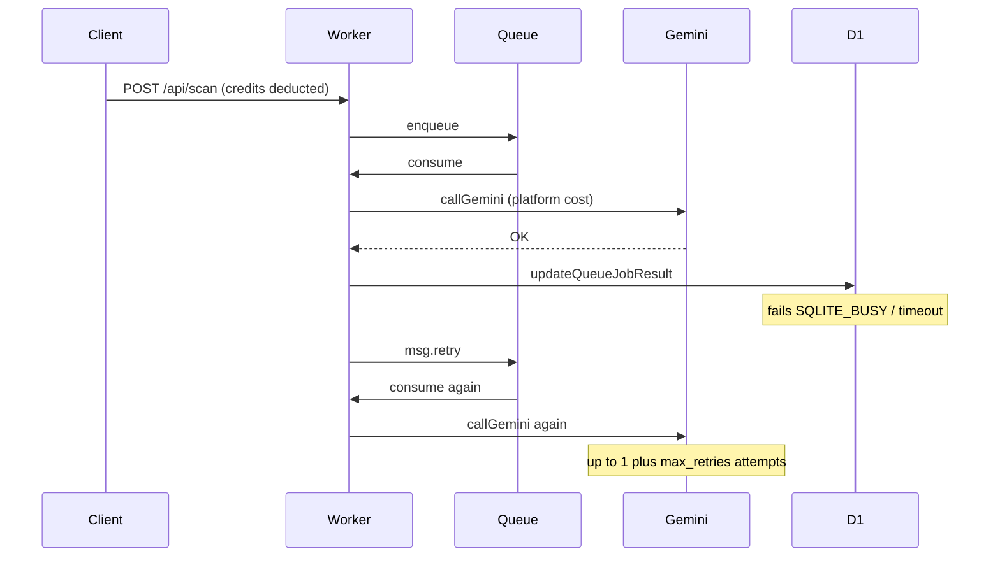
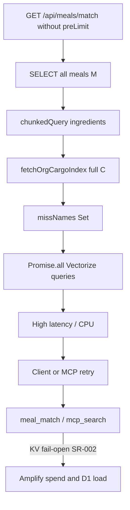
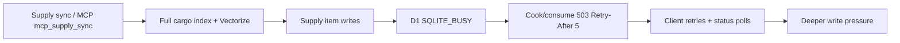
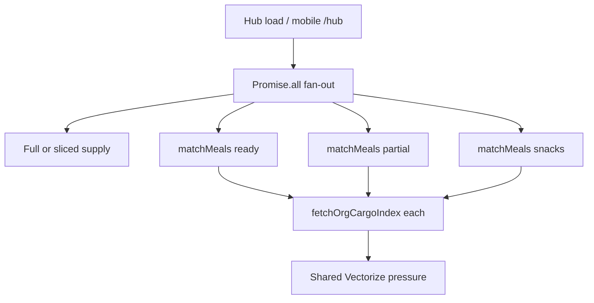

# Ration Holistic Scalability, Resilience & Big-O Audit

**Version audited:** 1.6.10 (`package.json` / `app/lib/version.ts`)  
**Date:** 2026-07  
**Status:** Research complete — implementation deferred to a follow-up agent session  
**Method:** Orientation docs + 8-track code evidence (read-only). Parallel Task agents hit API limits; parent agent completed all tracks via codebase research.  
**Prior audits reconciled:** [`audit-v1.5-2026-07.md`](audit-v1.5-2026-07.md), [`ios-security-app-store-audit-2026-06.md`](ios-security-app-store-audit-2026-06.md), [`stream-c-audit-gate.md`](stream-c-audit-gate.md), [`pre-claim-write-review.md`](pre-claim-write-review.md)

**How to use this doc:** Kick off a new agent session with “Implement P0 items from `plans/scalability-resilience-audit-2026-07.md`” (then P1, etc.). Do not re-litigate product design; execute the sequenced backlog.

---

## A. Executive summary

Ration’s **core resilience stack is solid** for free-tier and moderate Crew usage:

- AI work is offloaded to Queues (`ration-scan`, `ration-meal-generate`, `ration-plan-week`, `ration-import-url`)
- Credits gate enqueue; failed jobs refund via idempotent `ai-refund:${requestId}`
- D1 bound-param chunking is correct (`D1_MAX_INGREDIENT_ROWS_PER_STATEMENT = 10`)
- Rate-limit coverage is broad (web + mobile + MCP + Copilot + `status_poll` + `hub_read`)
- Hub / mobile match paths pass `preLimit: 12`
- Org delete chunks Vectorize deletes (500 IDs)
- Webhooks use KV idempotency; Copilot has session message/token caps

**Top 5 risks**

| Rank | Risk | Severity | Why it matters at 10K→100K |
|------|------|----------|----------------------------|
| 1 | Queue retry re-invokes Gemini after partial success | **P0** | Platform AI spend with no extra credit charge (`max_retries: 3`) |
| 2 | KV rate-limiter **fail-open** on spend paths | **P0** | Under KV outage/attack, throttles vanish; credits don’t cover MCP search / retries |
| 3 | Meal-match candidate pool unbounded / inconsistent across Galley, hub, mobile, MCP | **P1** | Web Galley scores all meals; other surfaces use 12–200 — standardize candidates to **200**; Galley result `limit` to **100** on web + iOS |
| 4 | Unbounded `fetchOrgCargoIndex` + hub fan-out | **P1** | Every match/sync loads full pantry; web hub loads full supply; mobile hub 3× match |
| 5 | Main Worker observability gap | **P1** | Queue lag, 503/429, credit drain not alertable |

**Readiness verdict**

| Target | Verdict |
|--------|---------|
| 10K users (mostly free / small Crew) | **Go** — capacity caps + queues + credits hold |
| 10K with many large Crew pantries | **Conditional** — fix P0 + P1-A/B/C first |
| 100K Crew-scale | **No-go** until P0–P1 + cargo-index strategy + observability |

**Do not thrash (already solid):** queue offload, credit reserve + idempotent refund, D1 `db.batch` + chunk constants, MCP org revalidation, Copilot caps (40 msgs / 128k tokens), webhook idempotency, `status_poll` 60/min, search `LIMIT 20`.

---

## Orientation snapshot (Phase 0)

### Stack (verified)

| Layer | Location |
|-------|----------|
| Main Worker | `workers/app.ts` (queue + cron) |
| MCP Worker | `workers/mcp.ts` |
| Copilot Worker + DO | `workers/copilot.ts`, `app/lib/copilot/` |
| Schema | `app/db/schema.ts` |
| Queues | `ration-scan` (batch 5), others batch 3; `max_retries: 3` — `wrangler.jsonc` |
| Consumers | `app/lib/*-consumer.server.ts` via `ai-queue-registry.server.ts` |
| Rate limits | `app/lib/rate-limiter.server.ts` (`RATE_LIMITS`) |
| Tier caps | `app/lib/tiers.ts` — free: 35 cargo / 15 meals; Crew: unlimited |

### Request → systems map (top 15 journeys)

| # | Journey | Systems touched |
|---|---------|-----------------|
| 1 | Hub load (web) | D1×~7, match×3, KV match cache, Vectorize on misses, full supply list |
| 2 | Visual scan | Auth → RL → credits → R2 → queue → Gemini → D1 `queue_job` → client polls |
| 3 | Meal generate | Same async pattern (`ration-meal-generate`) |
| 4 | Plan week | Same (`ration-plan-week`, cost 3) |
| 5 | Import URL | Same (`ration-import-url`) |
| 6 | Meal match API | D1 meals + ingredients + full cargo index + Vectorize misses |
| 7 | Supply sync | Cargo index + Vectorize + supply item writes |
| 8 | Cook / consume | Ingredient resolve + cargo updates (`db.batch`) |
| 9 | Cargo batch ingest | Capacity + D1 + optional Vectorize upsert |
| 10 | Mobile hub | `hub_read` + 10-way fan-out (bounded widgets / `preLimit`) |
| 11 | MCP match/search | `mcp_search` + embed + Vectorize |
| 12 | MCP supply sync | `mcp_supply_sync` (8/min) |
| 13 | Copilot turn | DO caps + credits + tools → D1 |
| 14 | Stripe / RevenueCat webhook | Signature → KV idempotency → ledger |
| 15 | GDPR purge | D1 cascade + Vectorize chunks + R2 + purge retry cron |

### Cron coverage (`workers/app.ts` scheduled, `0 3 * * *`)

- Expired sessions purge
- Expired `queue_job` purge
- Orphan agent kitchen purge
- Re-engagement emails
- Failed purge job retry

---

## B. Hotspot inventory

| ID | Area | Trigger | Complexity | Cascade risk | Severity | Evidence | Existing mitigation |
|----|------|---------|------------|--------------|----------|----------|---------------------|
| SR-001 | AI queues | Scan/generate/plan/import fail after Gemini | ≤4× model calls / job | Retry → Gateway spend | **P0** | `workers/app.ts` 85–101; consumers lack job-status guard; `wrangler.jsonc` `max_retries: 3` | Credits at enqueue; refund on `failJob` only |
| SR-002 | Rate limit | KV get/put error on AI/MCP buckets | Unbounded while KV down | Fail-open → enqueue/search storm | **P0** | `rate-limiter.server.ts` ~463–535 | Credits (partial); L1 per-isolate only |
| SR-003 | Match API / Galley | Web Galley Match Mode + `/api/meals/match` | O(M·I + C + V_miss), M unbounded on web; other surfaces 12–200 | Divergent UX; slow match → retries | **P1** | `MealGrid.tsx` limit 50 no preLimit; hub 12; iOS ≤100; MCP 200 | Candidates **200** everywhere; Galley `limit` **100** web+iOS (P1-A) |
| SR-004 | Cargo index | Any match/sync/cook/scan | O(C) full read | Large Crew → mem/D1 | **P1** | `cargo-index.server.ts` 27–44 no LIMIT | Free cap 35; Crew unlimited |
| SR-005 | Vectorize | Match miss / supply sync | O(I_miss) parallel `query` | Subrequest/CPU | **P1** | `vector.server.ts` 260–289 `Promise.all` | Embed KV cache (`sha256Hex`); batch embed |
| SR-006 | Hub web | Hub loader | ~7 queries + 3 match + full supply | Slow hub → refresh storms | **P1** | `hub/index.tsx` 70–126; `getSupplyList` no limit | Match `preLimit: 12`; 10s match KV cache |
| SR-007 | Hub mobile | `GET /api/mobile/v1/hub` | 10-way fan-out; 3× match | Amplifies SR-004/005 | **P1** | `mobile/hub.server.ts` 72–120 | `hub_read` 60/min; supply slice when untagged |
| SR-008 | Supply sync | Sync from meals / MCP | O(I_agg + C + V) + writes | D1 busy → cook 503 | **P1** | `supply.server.ts` ~1852–1870 | `mcp_supply_sync` 8/min |
| SR-009 | Status poll | AI job UI / iOS | O(U·polls) @ 1.5s × 80 | Soft D1 read amp | **P2** | `polling.ts`; `status_poll` 60/min | Bounded attempts + RL |
| SR-010 | Observability | Ops | N/A | Silent backlog/spend | **P1** | No `analytics_engine` / `logpush` in `wrangler.jsonc` | Copilot Worker has Analytics; logs only on main |
| SR-011 | GDPR purge | Account/org delete | O(C) chunked | Hang if unchunked (mitigated) | **P2** | `organizations.server.ts` 57–80 chunk 500 | Retry cron; failure notify |
| SR-012 | Pre-claim MCP | Agent write storm | Capacity × rate | Free-tier blast | **P2** | `pre-claim-write-review.md`; `mcp_write_preclaim` 10/min | Capacity + tighter |

### Big-O models (top hotspots)

Variables: **C** = org cargo rows, **M** = meals, **I** = ingredients (per meal or aggregate), **D** = plan days, **P** = scan images/pages, **U** = concurrent users, **Q** = queue depth, **V_miss** = ingredient names missing from exact cargo index.

| Hotspot | Work function | Notes |
|---------|---------------|-------|
| `matchMeals` (no preLimit) | O(M + ΣI + C + V_miss) | Meal SELECT unbounded; then chunked ingredients; full cargo; Vectorize per miss |
| `matchMeals` (preLimit=k) | O(k + ΣI_k + C + V_miss_k) | Target k=`MEAL_MATCH_CANDIDATE_CAP` (**200**) everywhere after P1-A |
| `fetchOrgCargoIndex` | O(C) | Narrow projection but unbounded rows |
| `findSimilarCargoBatch` | O(V_miss) embeds + O(V_miss) parallel Vectorize queries | Embeds chunked 100; queries unbounded fan-out |
| Supply `buildMealContributions` | O(I_agg + C + V) | One batch embed + parallel queries + full cargo |
| Scan consumer | O(P) image encode + 1 Gemini + O(C) inventory attach | Retry multiplies Gemini |
| Hub mobile | ≈ 10 parallel D1/AI paths; 3× match ⇒ up to 3× cargo reads on cache miss | |
| Status poll | O(1) D1 read per poll; client ≤80 attempts | Rate limit 60/min/user |

### Prior audit reconciliation

| Prior ID | Status | Notes |
|----------|--------|-------|
| DATA-001 | **Fixed** | Divisor 10; `query-utils.test.ts` asserts `floor(100/10)=10` |
| LIB-001 | **Fixed** | `sha256Hex` in `vector.server.ts` for embed cache keys |
| LIB-003 | **Fixed** | `bulkUpdateCargoImportItems` uses `d1.batch` |
| LIB-004 | **Fixed** | `resolveTagIds` uses `d1.batch` + `chunkArray` |
| LIB-005 | **Likely fixed / verify** | Meal import paths use batching; spot-check if reopening imports |
| API-007 | **Fixed** | `api_key_create` on `api/api-keys.ts` |
| DATA-007 | **Mostly fixed** | Org delete chunks Vectorize (500); `deleteCargoVectors` per chunk |
| DATA-006 | **Verify in purge tests** | Org cascade via `deleteOrganization`; watch for orphan tables |
| FE-005 | **Still open** | PWA offline-first directive unmet |
| Stream-C supply pagination | **Partial** | Mobile `v1.supply` has limit/offset; web hub / some share paths still full |
| Pre-claim residual risks | **Still open (accepted)** | Mitigated by capacity + tighter preclaim RL |

---

## C. Cascade maps

### Cascade 1 — Queue retry AI spend (SR-001) — worst spend path



**Blast radius:** Platform-wide AI/Gateway billing (not charged back per retry).  
**Amplifiers:** `max_retries: 3`; no `getQueueJob` short-circuit; D1 contention during write storms.

### Cascade 2 — Unbounded match under load (SR-003 + SR-004 + SR-005)



**Blast radius:** Single large org can stress shared D1 primary + Vectorize; fail-open couples to platform spend.

### Cascade 3 — Supply sync → D1 contention → 503 storm (SR-008)



**Blast radius:** Org-level UX failure; can couple to other orgs via single D1 writer under extreme concurrency.

### Cascade 4 — Hub fan-out amplification (SR-006 / SR-007)



**Blast radius:** Per-user / per-org; multiplied by U concurrent hub opens (e.g. morning open).

### Cascade 5 — KV fail-open spend (SR-002)

Under KV errors, `checkRateLimit` returns `allowed: true`. Credit-gated routes still need balance, but:

- MCP `search_ingredients` / `match_meals` burn Workers AI + Vectorize without credits
- Queue retries (SR-001) burn Gateway without extra credits
- Many isolates each have empty L1 → no local backpressure

---

## D. Gap analysis vs best practices

| Practice | Current state | Gap |
|----------|---------------|-----|
| Backpressure | Queues + rate limits + credits | No consumer `max_concurrency`; no queue-depth circuit breaker; RL fail-open |
| Idempotency | Stripe/RC/refunds strong | Queue consumers **not** idempotent w.r.t. model calls |
| Timeouts / budgets | AI Gateway timeouts | Match/sync lack wall-clock budgets |
| Bulkheads | Queues isolate AI latency from HTTP | Shared D1; fail-open couples failure domains |
| Pagination | MCP lists, mobile cargo/supply | Cargo index, web supply, `meals.match` meals |
| Bounded concurrency | Embed batch ≤100 | Vectorize `Promise.all` unbounded |
| Cache correctness | Match 10s TTL; embed sha256 | Good after LIB-001 |
| Graceful degradation | Vectorize errors → empty matches | Rate limit fails **open** (availability over spend safety) |
| Observability | Structured logs; Copilot Analytics | Main Worker: no Analytics Engine / Logpush / lag alerts |

---

## E. Prioritized fix plan (implementation backlog)

Each item is sized for a follow-up agent session. Follow Definition of Done: `test:unit`, `typecheck`, `lint`, version bump, README if behavior/docs change.

### Phase 1 — P0 Stabilize

#### P0-A — Queue consumer idempotency (SR-001)

| Field | Detail |
|-------|--------|
| **Problem** | `workers/app.ts` retries the whole handler on throw. Consumers call `callGemini` then `updateQueueJobResult`. If D1 write fails after Gemini succeeds, retry pays for Gemini again. No check of existing `queue_job.status`. |
| **Evidence** | `workers/app.ts` 85–101; `scan-consumer.server.ts` (and siblings) — no `getQueueJob`; `queue-job.server.ts` `updateQueueJobResult` is unconditional UPDATE; wrangler `max_retries: 3`. |
| **Proposed fix** | 1) At start of each consumer: `getQueueJob`; if `completed` or `failed`, return (ack). 2) Optionally claim: `UPDATE queue_job SET status='processing' WHERE requestId=? AND status='pending'` (add status if needed) or use a KV/D1 lease. 3) Only call Gemini after claim. 4) Ensure final failure path still uses `failAiJobWithRefund` once. Shared helper e.g. `runIdempotentAiJob` in `queue-job.server.ts`. |
| **Complexity improvement** | ≤1 Gemini call per `requestId` (amortized), even under retries. |
| **Risk** | Medium — claim races; must not skip legitimate first run; must not double-refund. |
| **Test plan** | Unit: job already `completed` → mock `callGemini` never called; Gemini OK + D1 fail then retry → second invoke skips model if status written; refund still once on terminal fail. Extend `scan-consumer-refund.test.ts` pattern. |
| **Owner** | backend |
| **Effort** | M |
| **Deps** | None — do first |

#### P0-B — Fail-closed rate limits for spend-sensitive buckets (SR-002)

| Field | Detail |
|-------|--------|
| **Problem** | On KV get/put failure, limiter returns `allowed: true` for all buckets including AI/MCP search. |
| **Evidence** | `rate-limiter.server.ts` comments + catch blocks ~463–535; README §9.1 documents fail-open. |
| **Proposed fix** | Introduce `failClosed: true` (or allowlist) on: `scan`, `generate_meal`, `recipe_import`, meal plan week bucket, `meal_match`, `mcp_search`, `copilot`, `copilot_connect`, optionally `status_poll`. On KV error → `allowed: false` with short `retryAfter`. Keep fail-open for auth/read-light buckets if desired (`inventory_mutation`, `search` optional). |
| **Complexity improvement** | Removes unbounded amplifier during KV incidents. |
| **Risk** | Low–medium — AI features unavailable during KV outages (preferred over spend runaway). |
| **Test plan** | Unit: mock KV throw → spend bucket denied; non-spend bucket still open (if kept). |
| **Owner** | backend |
| **Effort** | S |
| **Deps** | None — parallel with P0-A |

---

### Phase 2 — P1 Harden

#### P1-A — Standardize meal-match candidate cap across all consumers (SR-003)

| Field | Detail |
|-------|--------|
| **Problem** | Consumers disagree on how many meals are **scored** before ranking: web Galley scores **all** meals (returns `limit` 50); iOS uses `preLimit = max(12, limit)` (≤100); hub uses `preLimit: 12`; MCP uses `preLimit: 200`. Same pantry → different “what can I cook?” sets. |
| **Evidence** | `meals.match.ts` omits `preLimit`; `MealGrid.tsx` `limit: "50"`; `v1.meals.match.ts` `preLimit: Math.max(MOBILE_PRE_LIMIT, limit)`; hub `preLimit: 12`; MCP `preLimit: 200`. No `ORDER BY` before `.limit(preLimit)`. |
| **Product decision (locked)** | **Same 200 meals considered (scored) on every consumer.** Separate from how many results each UI **shows**. |
| **Chosen limits** | **`MEAL_MATCH_CANDIDATE_CAP = 200`** (`preLimit`) — shared by web API, web Galley, iOS Galley, mobile match API, MCP, hub. **Web Galley + iOS Galley both use result `limit = 100`** (web today 50; iOS already 100). Hub widgets keep small display limits (e.g. 6) but still score the same 200-candidate pool. |
| **Why 200 candidates** | Free (≤15) complete. Moderate (≤150) complete. Large (~200) at the edge complete. Very large (300+) truncate predictably. Matches current MCP. Cost O(200) not O(M). |
| **Why Galley result limit 100** | Schema max; web/iOS parity for how many matches are **listed**; still `limit ≤ preLimit` (100 ≤ 200). |
| **Proposed fix** | See numbered steps immediately below this table. |
| **Hub note** | Widget rows (6) are a **display** subset of the same 200-candidate scoring pass (ideally one shared `matchMeals` — P1-C). |
| **Complexity improvement** | O(M) → O(200) meal scan everywhere; identical candidate set across surfaces. |
| **Risk** | Medium for orgs with **>200** meals. Mitigated by stable `ORDER BY` + docs + truncated flag. Orgs ≤200: complete vs exhaustive. Web Galley may show more result rows (50→100) from the same ranked set. |
| **Test plan** | Default preLimit = 200 everywhere; web + iOS Galley `limit=100`; hub/MCP assert same cap constant; fixture 250 meals → 200 candidates newest-first; web/iOS/MCP same candidate IDs for identical filters. |
| **Owner** | backend + web Galley (`MealGrid`) + iOS confirm `matchFetchLimit = 100` |
| **Effort** | M |
| **Deps** | After or parallel P0; before/with P1-C |

**P1-A proposed fix (steps):**

1. Add `MEAL_MATCH_CANDIDATE_CAP = 200`.
2. In `matchMeals`: default `preLimit` to 200 when omitted; never exceed 200; require `preLimit >= limit`.
3. `ORDER BY meal.updatedAt DESC` (then `id`) before `preLimit` (“200 most recently updated”).
4. Web Galley (`MealGrid.tsx`): `limit: "100"`; API default supplies `preLimit` 200.
5. iOS Galley: keep `matchFetchLimit = 100`; mobile API sets `preLimit = MEAL_MATCH_CANDIDATE_CAP` (200), not `max(12, limit)`.
6. MCP: keep/align `preLimit` 200 via constant.
7. Hub: score with 200; display limits stay small; no `preLimit: 12`.
8. Optional `meta.candidateCap` / `meta.truncated` when meal count > 200.
9. README + `docs/fin/52`.


#### P1-B — Bound Vectorize query concurrency (SR-005)

| Field | Detail |
|-------|--------|
| **Problem** | `findSimilarCargoBatch` runs `Promise.all` over all ingredient names. |
| **Evidence** | `vector.server.ts` 260–289. |
| **Proposed fix** | Chunk queries with concurrency limit (8–16) via existing `chunkArray` + sequential chunk `Promise.all`, or a small `mapPool` helper. |
| **Complexity improvement** | Same work, bounded peak subrequests/CPU. |
| **Risk** | Low — slightly higher latency for large miss sets. |
| **Test plan** | Unit with mocked Vectorize: N=50 names → ≤ concurrency parallel calls (spy). |
| **Owner** | backend |
| **Effort** | S |
| **Deps** | None |

#### P1-C — Hub read amplification (SR-006 / SR-007)

| Field | Detail |
|-------|--------|
| **Problem** | Web hub calls `getSupplyList` with no limit; three independent `matchMeals` each reload cargo index on cache miss. |
| **Evidence** | `hub/index.tsx` 70–126; `mobile/hub.server.ts` 72–120 (mobile already slices supply when untagged). |
| **Proposed fix** | 1) Web hub: pass supply limit like mobile (`MOBILE_SUPPLY_ITEMS_SLICE` or shared constant). 2) Prefer **one** `matchMeals` with `MEAL_MATCH_CANDIDATE_CAP` (**200**) then filter by type/tags for widgets (ready / partial / snacks), **or** cache cargo index per-request. Do **not** reintroduce hub-only `preLimit: 12`. Widget **display** limits stay small (6). 3) Keep deferred promises for streaming UX. |
| **Complexity improvement** | Fewer full cargo reads per hub load; bounded supply payload; hub matches Galley candidate set. |
| **Risk** | Medium — hub widget parity / tag-filter full-list case; single match pass must preserve type/tag filters. |
| **Test plan** | `hub.server` tests: supply limited; match uses shared candidate cap; widget subsets of one result set. Manual hub + Galley Match Mode parity smoke (same pantry). |
| **Owner** | backend (+ light web) |
| **Effort** | M |
| **Deps** | **P1-A first** (shared cap constant) |

#### P1-D — Cargo index strategy for large C (SR-004)

| Field | Detail |
|-------|--------|
| **Problem** | Crew orgs have unlimited inventory; every hot path loads full index. |
| **Evidence** | `cargo-index.server.ts`; `tiers.ts` Crew `-1`. |
| **Proposed fix** | Short-TTL KV cache of serialized index keyed by `orgId` + cargo version/updated watermark; invalidate on cargo write. Longer term: name-hash lookup for sync when C ≫ 1k. |
| **Complexity improvement** | Hot path O(C) → O(1) cache hit; writes pay invalidation. |
| **Risk** | Medium — stale match windows; KV size limits. |
| **Test plan** | Unit cache hit/miss/invalidation; Hypothesis load test C=2k. |
| **Owner** | backend |
| **Effort** | M–L |
| **Deps** | P1-C can land without this; needed before 100K Crew |

#### P1-E — Observability MVP (SR-010)

| Field | Detail |
|-------|--------|
| **Problem** | Main Worker cannot alert on queue failures, 503 rates, credit drain, lag. |
| **Evidence** | No `analytics_engine_datasets` / `logpush` in `wrangler.jsonc` (Copilot config has Analytics). Prior iOS plan noted Analytics as follow-up. |
| **Proposed fix** | Add Analytics Engine binding + `"logpush": true`; `writeDataPoint` at: queue consumer catch, `failAiJobWithRefund`, `handleApiError` 503/429 paths, credit deduct/refund. Document dashboard queries in README / ops note. No PII in points (use redacted IDs or counters only). |
| **Complexity improvement** | N/A — enables detection. |
| **Risk** | Low — additive. |
| **Test plan** | Mock Analytics binding in unit tests; confirm no raw emails/secrets in payloads. |
| **Owner** | ops / backend |
| **Effort** | M |
| **Deps** | None |

---

### Phase 3 — P2 Scale (100K architecture)

| ID | Item | Effort | Notes |
|----|------|--------|-------|
| P2-A | Soft caps / warnings for Crew pantry & meal counts | M | Product-aware; prevent silent O(C) death |
| P2-B | Queue `max_concurrency` + DLQ / lag metrics | M | Depends on P1-E |
| P2-C | Supply sync write-path audit under large active-meal sets | M | Ensure `db.batch` + chunk constants |
| P2-D | Optional `meta.truncated` UX when meal count &gt; 200; soft warning in Galley | S | Candidate cap locked at 200 in P1-A |
| P2-E | Match/sync wall-clock budgets + graceful partial results | M | |

### Phase 4 — P3 Polish

| ID | Item | Effort |
|----|------|--------|
| P3-A | FE-005 offline-first decision (IndexedDB vs downgrade README directive) | M |
| P3-B | Update README §9.1/9.2 + `docs/fin/51` + `docs/fin/52` after P0/P1 | S |
| P3-C | Pre-claim reissue 403/429 metrics | S |
| P3-D | Verify DATA-006 purge completeness with regression test | S |

### Suggested implementation order for next agent

```text
1. P0-A consumer idempotency
2. P0-B fail-closed spend rate limits
3. P1-A MEAL_MATCH_CANDIDATE_CAP=200 everywhere; web + iOS Galley both result limit=100; ORDER BY updatedAt DESC
4. P1-B Vectorize concurrency bound
5. P1-C hub amplification (must use shared 200-candidate cap from P1-A)
6. P1-E observability MVP
7. P1-D cargo index cache (when targeting large Crew)
8. P2 → P3 as needed
```

**Kickoff prompt for next session:**

> Implement P0-A and P0-B from `plans/scalability-resilience-audit-2026-07.md`. Do not skip tests or version bump. Then implement P1-A (`MEAL_MATCH_CANDIDATE_CAP = 200` on all consumers; web + iOS Galley `limit = 100`; stable `ORDER BY`) and P1-B if time remains.

---

## F. Load-test / verification matrix

| Scenario | How to run (manual / script later) | Success signals |
|----------|-----------------------------------|-----------------|
| Concurrent scan + match (≈50 users) | k6/Artillery against staging | p95 match &lt; 2s; 503 &lt; 1%; queue lag &lt; 60s; **≤1 Gemini / requestId** |
| Large pantry match (C=2000, M=500) | Seed org; hit `/api/meals/match` with/without preLimit | With P1-A: bounded CPU; baseline regression |
| Supply rebuild (50 meals) | UI or MCP `sync_supply_from_selected_meals` | p95 &lt; 5s; no cook-path 503 storm |
| MCP write storm | Burst write tools | 429 at `mcp_write` / per-key; no cross-org rows |
| Status-poll storm | 80 clients × 1.5s | 429 at 60/min; D1 reads healthy |
| Copilot multi-turn | Long chat | Cap at 40 msgs / 128k tokens; credit brackets correct |
| GDPR purge (C=5000) | Account delete owned org | Completes via chunks; Vectorize empty; no hang |
| KV failure drill | Mock/fault KV in staging | P0-B: AI routes 429; no spend spike |

---

## G. README / docs impact (after fixes land)

| Doc | Update when |
|-----|-------------|
| `README.md` §9.1 Scalability | Consumer idempotency, fail-closed AI limits, match preLimit defaults, Analytics/Logpush |
| `README.md` §9.2 Rate Limiting Matrix | Note fail-closed vs fail-open by bucket class |
| `docs/fin/51-reliability-and-async-jobs.md` | Retry/idempotency semantics (user-facing: job won’t double-charge; may take longer) |
| `docs/fin/52-limits-and-rate-limits.md` | Document candidate cap **200** vs Galley result `limit` **100** (web+iOS); hub/MCP same candidates |
| `.cursor/rules/d1-query-safety.mdc` | Already good; add note that `fetchOrgCargoIndex` is intentional full scan pending P1-D cache |

---

## Security-coupled load risks (Phase 3 checklist)

| Check | Result |
|-------|--------|
| AuthZ uses session/org from verified context, not client orgId alone | **Hold** — `requireActiveGroup`, MCP membership revalidation; no `args.organizationId` trust found in MCP tools |
| AI/billing: rate limit + credits + Zod | **Mostly hold** — credits on enqueue; RL fail-open is the spend hole (P0-B) |
| KV fail-open | **Spend vulnerability under attack/outage** — treat as P0 for AI/MCP search buckets |
| GDPR purge D1 + Vectorize + R2 | **Mostly hold** — chunked vectors; verify tables (P3-D); purge retry cron exists |
| Feature flags safety-critical default off | Not re-audited in depth this pass — follow existing Flagship rules on new kill-switches for match/sync if added |
| PII/secret logging | Consumers log redacted org IDs via `redactId` patterns; Analytics must stay counter/redacted-only |

---

## What is already solid (preserve)

1. **Async AI queues** with separate batch sizes for scan vs generate/plan/import  
2. **Credit ledger** atomic deduct + idempotent async refund  
3. **D1 safety**: `D1_MAX_*` constants, `chunkedQuery`, `db.batch`, `isD1ContentionError` → 503 + `Retry-After: 5`  
4. **Rate limit matrix** covering web, mobile hub/supply, MCP, Copilot, status poll, agent preclaim  
5. **Hub/mobile match `preLimit`** today (12 / ≤100) — P1-A replaces scoring with shared **200** candidates everywhere  
6. **Embed cache** with `sha256Hex`  
7. **Org Vectorize purge** chunked at 500  
8. **Copilot** `COPILOT_SESSION_MAX_MESSAGES = 40`, `COPILOT_SESSION_MAX_TOKENS = 128_000`  
9. **Webhook** KV idempotency (Stripe / RevenueCat)  
10. **Capacity** free-tier caps via `capacity.server.ts` / `tiers.ts`

---

## Track coverage attestation

| Track | Focus | Coverage |
|-------|-------|----------|
| 1 | AI cost & queue throughput | Consumers, ledger refunds, wrangler retries, polling |
| 2 | D1 write & contention | query-utils, error-handler, cargo import batch, tags batch |
| 3 | Read amplification | cargo-index, matching, hub web/mobile, meals.match |
| 4 | Embedding & Vectorize | vector.server, purge chunking, LIB-001 fixed |
| 5 | Rate-limit & abuse | RATE_LIMITS, fail-open, api_key_create fixed |
| 6 | Multi-tenant auth | requireActiveGroup, capacity, pre-claim residual accepted |
| 7 | Client surfaces | Hub loaders, iOS poller/supply pagination partial, Copilot caps, FE-005 open |
| 8 | Observability & ops | Cron inventory, Analytics gap on main Worker |

---

## Ready for implementation

**Start with P0 items: P0-A (consumer idempotency), P0-B (fail-closed spend rate limits), then P1-A (**200 meals considered everywhere**; web + iOS Galley both show up to **100** results).**

No application code was changed in the research pass; this plan doc is the handoff artifact (including the P1-A product decision below).

---

## Appendix — Meal-match limit decision (P1-A)

### Two knobs (do not conflate)

| Knob | Meaning | Locked value |
|------|---------|--------------|
| **`preLimit` / candidate cap** | How many meals are **scored** (considered) | **`MEAL_MATCH_CANDIDATE_CAP = 200`** on **all** consumers (web API, web Galley, iOS Galley, mobile API, MCP, hub) |
| **`limit`** | How many matches are **returned/shown** after scoring | **Web Galley + iOS Galley: 100**. Hub widgets: ~6. MCP: ≤50 OK. |

Same pantry + same filters → **same 200 candidate IDs** everywhere. Galley UIs may then show the top 100 of those matches; hub shows a smaller top slice — still from the same scored set.

### Candidate completeness at 200

| Galley size | Free (≤15) | Moderate (≤150) | Large (~200) | Very large (300+) |
|-------------|------------|-----------------|--------------|-------------------|
| Cap 200 | Complete | Complete | At edge, complete | Truncate oldest-updated |

Combine with `ORDER BY updated_at DESC` so oversize galleys fail predictably (“200 most recently updated”), not by arbitrary rowid.
