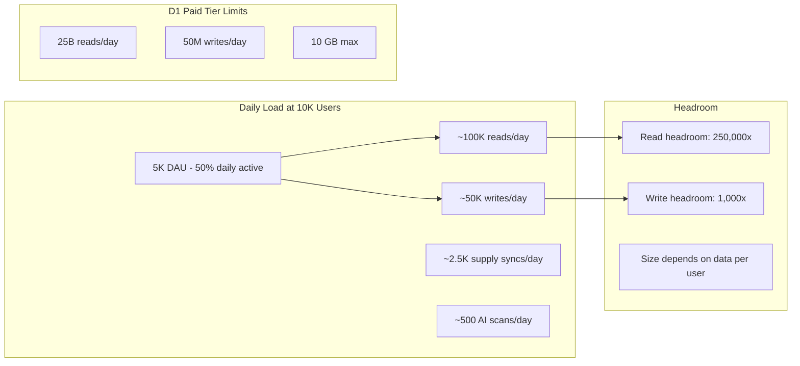
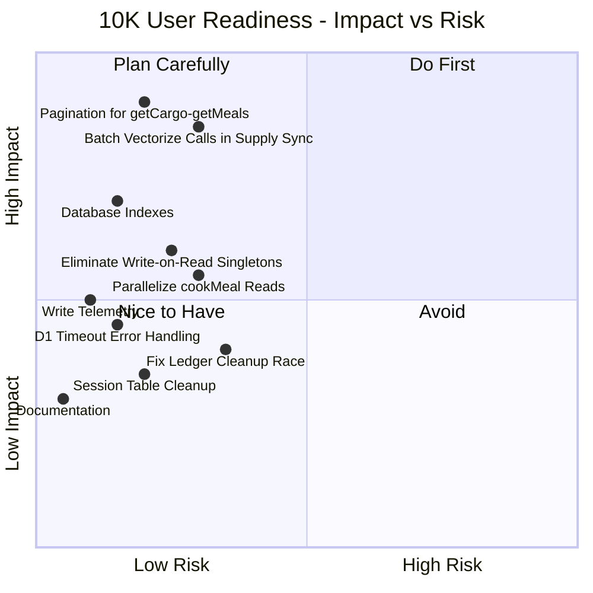

# Ration Scaling Mitigation Plan — 10K User Target

## Executive Summary

This plan combines evaluation of an external scaling report with an independent full-codebase audit targeting safe operation at 10,000 typical users. The goal: prevent cascading failures, ensure reliability, and build on an extensible foundation.

**Key findings**: 6 concerns from the external report were validated, 3 were partially/fully invalidated. The independent audit uncovered 7 additional concerns not covered in the original report, primarily around the supply sync pipeline, Vectorize call patterns, and write-on-read singletons.

---

## Part 1: External Report Evaluation

### Concern 2.1 — D1 Write Contention: **VALID — Monitor, dont redesign** ✅
- D1 is single-writer SQLite. All writes serialize through one leader.
- [`createMeal()`](app/lib/meals.server.ts:181) uses `d1.batch()` with 1 meal INSERT + N ingredient/tag INSERTs.
- [`ingestCargoItems()`](app/lib/cargo.server.ts:445) builds batch ops for merge/create sets.
- [`deductCredits()`](app/lib/ledger.server.ts:64) uses raw SQL batch.
- **10K user model**: Average 5 writes/day per user = 50K writes/day. Paid tier allows 50M/day. TPS concern only at concurrent spikes.
- **Mitigated by**: Smart Placement enabled at [`wrangler.jsonc:30`](wrangler.jsonc:30) co-locates Worker near D1.

### Concern 2.2 — Credit Deduction Race: **VALID, well-mitigated** ⚠️
- SQL guard `WHERE credits >= cost RETURNING id` at [`deductCredits()`](app/lib/ledger.server.ts:79) is atomic within D1 batch.
- Cleanup DELETE at [line 97](app/lib/ledger.server.ts:97) runs outside the batch.
- **Action**: Move cleanup inside batch or restructure to avoid orphan.

### Concern 2.3 — Hub Dashboard N+1: **PARTIALLY INVALID** ❌/✅
- **REPORT WRONG**: [`getCargoStats()`](app/lib/cargo.server.ts:759) already uses `COUNT(*)` in a D1 batch. No rows cross the network.
- **`matchMeals()` concern is VALID but mitigated**: Already has KV caching with 60s TTL at [line 367](app/lib/matching.server.ts:367) and `preLimit: 12` at [line 50](app/routes/hub/index.tsx:50).

### Concern 2.4 — Drizzle Instance Per Request: **OVERSTATED** ⚠️
- `drizzle(env.DB)` is a trivial wrapper, not a connection. Negligible overhead.
- `cookMeal()` sequential queries at [line 683](app/lib/meals.server.ts:683) are valid — 4+ round-trips.

### Concern 2.5 — Rate Limiter KV Race: **VALID, already well-mitigated** ✅
- L1 cache + edge cache + max-merge strategy at [line 211](app/lib/rate-limiter.server.ts:211).
- **No changes needed** — advisory rate limiting by design.

### Concern 2.6 — Unbounded Queries: **VALID** ✅
- [`getMeals()`](app/lib/meals.server.ts:47) and [`getCargo()`](app/lib/cargo.server.ts:110) have no LIMIT.
- **Action**: Add pagination.

### Concern 2.7 — Worker CPU Limits: **VALID but bounded** ⚠️
- `matchMeals()` already caps via `preLimit: 12`. Galley page is the risk.

### Concern 2.8 — Missing Indexes: **PARTIALLY VALID** ✅/❌
- `session.userId` index: MISSING — confirmed at [line 46](app/db/schema.ts:46).
- `cargo.expiresAt` compound: MISSING — would help [`getCargoStats()`](app/lib/cargo.server.ts:759) and [`getExpiringCargo()`](app/lib/cargo.server.ts).
- `cargo.name` LIKE: NOT ACTIONABLE — leading wildcard defeats B-tree.

### Concern 2.9 — Batch Size Limits: **Already handled** ✅
- [`query-utils.server.ts`](app/lib/query-utils.server.ts) correctly chunks.

---

## Part 2: Independent Audit — New Findings

### NEW-1: CRITICAL — Supply Sync Fetches ALL Org Cargo Unbounded

**Source**: [`syncSupplyFromIngredientRows()`](app/lib/supply.server.ts:1556) at line 1556-1559.

```typescript
const orgCargo = await d1
  .select()
  .from(cargo)
  .where(eq(cargo.organizationId, organizationId));
```

This fetches EVERY cargo item into Worker memory on every supply sync. At 10K users where power users have 500-2000 items, this loads massive datasets. The same pattern exists in [`addItemsFromMeal()`](app/lib/supply.server.ts:1058) at line 1058-1061.

**Impact**: Worker memory pressure, CPU time for serialization, and response size on every supply page interaction.

### NEW-2: HIGH — Sequential Vectorize API Calls in Loops

**Source**: [`getAvailableCargoQuantity()`](app/lib/supply.server.ts:138) calls [`findSimilarCargo()`](app/lib/vector.server.ts) as a fallback at line 164. This function is called inside a loop:

- In [`syncSupplyFromIngredientRows()`](app/lib/supply.server.ts:1580) — once per aggregated ingredient
- In [`addItemsFromMeal()`](app/lib/supply.server.ts:1079) — once per ingredient

A meal with 20 ingredients could trigger 20 sequential Vectorize API calls + 20 embedding calls. The `matchMeals()` function already uses `findSimilarCargoBatch()` which is much more efficient.

**Impact**: At 10K users, supply sync for a 20-ingredient meal takes 20x longer than necessary.

### NEW-3: HIGH — Write-on-Read Singleton Patterns

**Source**: [`ensureSupplyList()`](app/lib/supply.server.ts:285) at line 285 and [`ensureMealPlan()`](app/lib/manifest.server.ts:48) at line 48.

Both functions follow a GET-or-CREATE pattern that executes on every page visit:
1. Fetch all lists/plans for the org
2. If none exist, create one
3. If multiples exist, delete extras

After initial creation, the read path still fetches all rows and checks. The DELETE of extras is unnecessary overhead on every visit.

**Impact**: Unnecessary write operations on read paths. At 10K users, multiplied across every dashboard/supply page visit.

### NEW-4: MEDIUM — Session Table Grows Unbounded

**Source**: [`session`](app/db/schema.ts:46) table has no TTL-based cleanup mechanism.

Sessions are created on login but never cleaned up after expiry. At 10K users with 2-3 sessions each, the table grows to 20-30K+ rows. Better Auth may handle some cleanup, but there is no explicit purge mechanism in the codebase.

**Impact**: Session table bloat increases D1 database size and slows session-related queries.

### NEW-5: MEDIUM — ensureActiveOrganization Cascading Queries on Auth Path

**Source**: [`ensureActiveOrganization()`](app/lib/auth.server.ts:219) at line 219.

When no active org is set, this makes up to 5 sequential database operations:
1. User fetch for theme cookie
2. User fetch for default group
3. Member lookup for group verification
4. Session update for active org
5. Personal group lookup fallback
6. Session update again

**Impact**: First login after session creation is slow with 4-5 sequential D1 reads.

### NEW-6: LOW — Idempotency KV Race Window

**Source**: [`checkAndMarkProcessed()`](app/lib/idempotency.server.ts:34) at line 34.

Uses KV read-then-write pattern. Two concurrent webhook deliveries could both read not processed. However, [`addCredits()`](app/lib/ledger.server.ts:122) has its own SQL-level idempotency guard, providing a second layer of protection.

**Impact**: Very low — double defense already in place.

### NEW-7: POSITIVE — Existing Strengths

Several scaling-positive patterns already exist:
- **Smart Placement** at [`wrangler.jsonc:30`](wrangler.jsonc:30) — co-locates Worker near D1
- **Auth instance caching** at [`auth.server.ts:196`](app/lib/auth.server.ts:196) — avoids reconstruction per request
- **Observability enabled** at [`wrangler.jsonc:10`](wrangler.jsonc:10)
- **Vector embed KV caching** at [`vector.server.ts:9`](app/lib/vector.server.ts:9) — 7-day TTL
- **Match result KV caching** at [`matching.server.ts:367`](app/lib/matching.server.ts:367) — 60s TTL
- **Supply sync telemetry** at [`supply.server.ts:1503`](app/lib/supply.server.ts:1503) — comprehensive per-phase timing
- **Chunked operations** at [`query-utils.server.ts`](app/lib/query-utils.server.ts) — D1 param limit handling

---

## Part 3: 10K User Capacity Model



**Assumptions per typical user per day:**
- 3 page views generating 5-10 reads each = ~20 reads
- 1 meal/cargo mutation = ~10 write statements
- 0.5 supply syncs = ~15 write statements
- D1 read: 100K/day = 0.0004% of paid limit ✅
- D1 write: 50K/day = 0.1% of paid limit ✅
- **The bottleneck is not daily limits but TPS**: 50K writes across 86,400 seconds = <1 TPS average, with spikes of 10-50 TPS during peak hours

**Real risk at 10K users**: Not daily limits, but concurrent spike handling. If 100 users all trigger supply sync simultaneously, that is 100 heavy write transactions competing for the single D1 writer.

---

## Part 4: Implementation Phases

### Phase 1: Unbounded Query Pagination — Prevents Memory Blowout

| File | Change | Why |
|------|--------|-----|
| [`cargo.server.ts:110`](app/lib/cargo.server.ts:110) | Add `limit` and `offset` params to `getCargo()` with defaults of 200/0 | Power users with 2000+ items crash Workers |
| [`meals.server.ts:47`](app/lib/meals.server.ts:47) | Add `limit` and `offset` params to `getMeals()` with defaults of 100/0 | Same concern for galley page |
| Galley route loader | Pass pagination from URL search params | Enable scroll-based or page-based loading |
| Cargo route loader | Pass pagination from URL search params | Same |
| [`cargo.server.ts:133`](app/lib/cargo.server.ts:133) | Replace `getCargoTags()` row fetch with SQL `json_each` extraction | Currently loads all rows just for tag names |

### Phase 2: Vectorize Call Batching — Prevents Cascading Latency

| File | Change | Why |
|------|--------|-----|
| [`supply.server.ts:1580`](app/lib/supply.server.ts:1580) | Replace per-ingredient `getAvailableCargoQuantity()` loop with batch pattern using `findSimilarCargoBatch()` | 20 sequential Vectorize calls → 1 batch call |
| [`supply.server.ts:1079`](app/lib/supply.server.ts:1079) | Same optimization in `addItemsFromMeal()` | Same — per-ingredient sequential calls |
| [`supply.server.ts:1556`](app/lib/supply.server.ts:1556) | Evaluate adding LIMIT to the `orgCargo` fetch in supply sync, or use the existing cargo index pattern from matching.server | Unbounded SELECT of all org cargo |

### Phase 3: Query Parallelization — Reduces Latency

| File | Change | Why |
|------|--------|-----|
| [`meals.server.ts:683`](app/lib/meals.server.ts:683) | Batch `cookMeal()` initial reads: meal + ingredients + active selection in one `d1.batch()` | Currently 4+ sequential round-trips |
| [`ledger.server.ts:97`](app/lib/ledger.server.ts:97) | Restructure `deductCredits()` orphan cleanup: either use conditional INSERT or wrap cleanup in same batch | DELETE runs outside atomic batch |
| [`supply.server.ts:1020`](app/lib/supply.server.ts:1020) | Batch `addItemsFromMeal()` initial reads: list + ingredients + meal record in parallel | Currently 3 sequential reads |

### Phase 4: Database Indexes — Reduces Query Latency

New migration `drizzle/0011_scaling_indexes.sql`:

```sql
-- session.userId: Used by Better Auth for session lookups
CREATE INDEX IF NOT EXISTS session_user_id_idx ON session(user_id);

-- cargo org+expiresAt compound: Used by getCargoStats and getExpiringCargo
CREATE INDEX IF NOT EXISTS cargo_org_expires_idx ON cargo(organization_id, expires_at);

-- mealPlanEntry: supply sync lookups by plan+date range
CREATE INDEX IF NOT EXISTS mpe_meal_idx ON meal_plan_entry(meal_id);
```

Update [`schema.ts`](app/db/schema.ts) to match:
- `session` table: add `index on userId`
- `cargo` table: add compound index on `organizationId, expiresAt`
- `mealPlanEntry` table: add index on `mealId`

### Phase 5: Write-on-Read Elimination — Reduces D1 Write Pressure

| File | Change | Why |
|------|--------|-----|
| [`supply.server.ts:285`](app/lib/supply.server.ts:285) | Convert `ensureSupplyList()` to: 1. Try SELECT with LIMIT 1. 2. If found, return immediately. 3. Only INSERT if not found. Remove the delete-extras logic or make it a separate cleanup. | Currently fetches ALL lists + may delete on every visit |
| [`manifest.server.ts:48`](app/lib/manifest.server.ts:48) | Same optimization for `ensureMealPlan()` | Same write-on-read pattern |
| Session table | Add a scheduled CRON handler or periodic purge that deletes sessions past `expiresAt` | Session table grows unbounded |

### Phase 6: Resilience and Observability

| File | Change | Why |
|------|--------|-----|
| [`error-handler.ts`](app/lib/error-handler.ts) | Add detection for D1 timeout/contention errors with user-friendly messaging | Currently returns generic 500 |
| [`telemetry.server.ts`](app/lib/telemetry.server.ts) | Add `trackD1BatchSize()` helper that logs batch statement counts | Need visibility into how close batches are to limits |
| Heavy write paths | Instrument `createMeal()`, `ingestCargoItems()`, `cookMeal()` with the same per-phase timing as supply sync | Supply sync has excellent telemetry; other paths have none |

### Phase 7: Documentation

| Deliverable | Contents |
|-------------|----------|
| `docs/d1-scaling-guide.md` | D1 limits, 10K user capacity model, projected ceiling, migration paths to Durable Objects or Hyperdrive+Postgres |
| `docs/monitoring-runbook.md` | What to watch: Worker timeouts, D1 latency spikes, batch size alerts, KV cache miss rates |

---

## Part 5: Priority Matrix



---

## Part 6: What NOT to Change

These were validated as already handled or not worth the risk:

| Concern | Status | Reason |
|---------|--------|--------|
| getCargoStats N+1 | ❌ REPORT WRONG | Already uses `COUNT(*)` aggregates |
| Drizzle instance overhead | ❌ OVERSTATED | Trivial wrapper, not a connection |
| Rate limiter KV race | ✅ Already mitigated | L1 + edge cache + max-merge |
| Batch size limits | ✅ Already handled | Chunking in query-utils.server.ts |
| Auth instance per request | ✅ Already cached | Map-based cache at auth.server.ts:196 |
| Vector embed caching | ✅ Already cached | KV with 7-day TTL |
| Match result caching | ✅ Already cached | KV with 60s TTL |
| D1 redesign to Postgres | 🚫 Not yet needed | 1000x headroom on daily limits at 10K users |

---

## Part 7: Files Changed Summary

| Phase | Files Modified | Files Created |
|-------|---------------|---------------|
| 1 | `cargo.server.ts`, `meals.server.ts`, galley route, cargo route | — |
| 2 | `supply.server.ts` | — |
| 3 | `meals.server.ts`, `ledger.server.ts`, `supply.server.ts` | — |
| 4 | `schema.ts` | `drizzle/0011_scaling_indexes.sql` |
| 5 | `supply.server.ts`, `manifest.server.ts` | Session cleanup handler |
| 6 | `error-handler.ts`, `telemetry.server.ts`, write-path files | — |
| 7 | — | `docs/d1-scaling-guide.md`, `docs/monitoring-runbook.md` |
