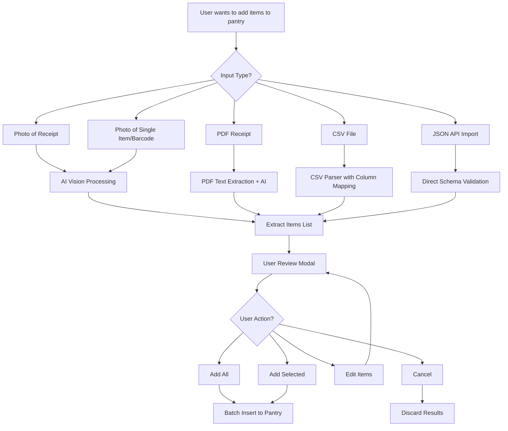
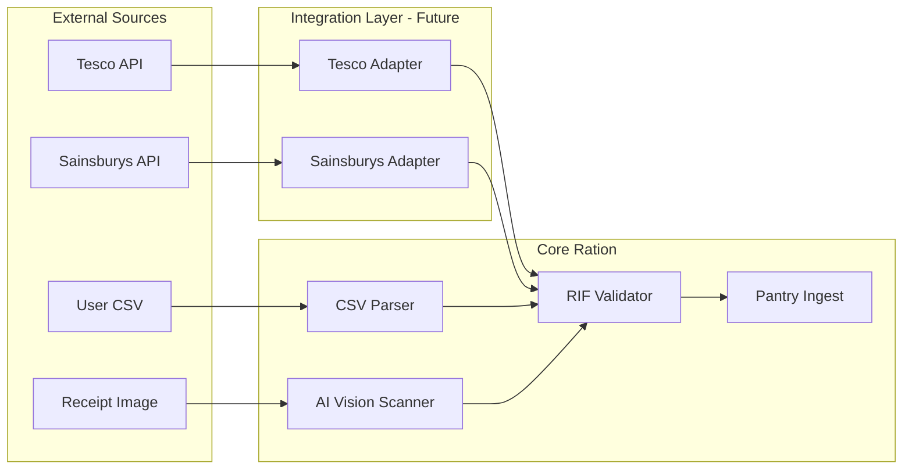

# Scan & Ingest Feature Enhancement Plan

## Executive Summary

The current scan feature in Ration has a **critical bug** preventing it from working - the image is being sent in the wrong format to the Cloudflare Workers AI Llama 3.2 Vision model. Beyond fixing this bug, we need to enhance the feature to support multiple input types and provide a user-friendly review workflow with bulk edit capabilities.

**Key Requirements:**
- Build complete feature with review modal before deploying
- Add bulk edit support for expiration dates
- Only extract expiration dates if obviously listed in source
- Create standardized Ration Import Format for programmatic data ingestion
- Design for future store-specific integration adapters

## Root Cause Analysis

### Current Bug

In [`app/routes/api/scan.tsx`](../app/routes/api/scan.tsx:63), the image is converted to `Array.from(uint8Array)`:

```typescript
const arrayBuffer = await imageFile.arrayBuffer();
const uint8Array = new Uint8Array(arrayBuffer);
const imageArray = Array.from(uint8Array); // WRONG FORMAT
```

However, per [Cloudflare Workers AI documentation](https://developers.cloudflare.com/workers-ai/guides/tutorials/llama-vision-tutorial/), Llama 3.2 Vision expects a **base64-encoded data URL**:

```typescript
const imageBase64 = "data:image/png;base64,IMAGE_DATA_HERE";
```

**Fix:** Convert the image buffer to base64 and construct a proper data URL.

---

## Feature Requirements

### Use Cases



### Input Types

| Type | File Extensions | Processing Method | Cost |
|------|----------------|-------------------|------|
| Photo - Receipt | jpg, png, heic, webp | Llama 3.2 Vision | 5 credits |
| Photo - Single Item | jpg, png, heic, webp | Llama 3.2 Vision | 5 credits |
| PDF Receipt | pdf | Text extraction + optional AI | Variable |
| CSV Import | csv | Parser + column mapping | Free |
| JSON API | application/json | Direct schema validation | Free |

### Scan Result Schema

```typescript
interface ScanResult {
  items: ScanResultItem[];
  metadata: {
    source: 'image' | 'pdf' | 'csv' | 'json';
    filename?: string;
    processedAt: string;
    confidence?: number;
  };
}

interface ScanResultItem {
  id: string; // Temporary UUID for UI state
  name: string;
  quantity: number;
  unit: 'kg' | 'g' | 'lb' | 'oz' | 'l' | 'ml' | 'unit' | 'can' | 'pack';
  category?: InventoryCategory;
  tags?: string[];
  expiresAt?: string; // ISO date string
  selected: boolean; // For UI selection state
  confidence?: number; // AI confidence score
  rawText?: string; // Original text from receipt
}
```

---

## Architecture

### API Endpoints

| Endpoint | Method | Purpose |
|----------|--------|---------|
| `/api/scan` | POST | Process image -> returns ScanResult |
| `/api/scan/pdf` | POST | Process PDF -> returns ScanResult |
| `/api/scan/csv` | POST | Process CSV -> returns ScanResult |
| `/api/scan/import` | POST | Process JSON -> returns ScanResult |
| `/api/inventory/batch` | POST | Bulk create inventory items |

### Component Structure

```
app/
├── components/
│   ├── scanner/
│   │   ├── CameraInput.tsx        # Enhanced file input
│   │   ├── ScanResultsModal.tsx   # NEW: Review/edit modal
│   │   ├── ScanResultItem.tsx     # NEW: Editable item row
│   │   ├── ImportDropzone.tsx     # NEW: Drag-drop for files
│   │   └── CsvColumnMapper.tsx    # NEW: CSV column mapping
│   └── cargo/
│       └── IngestForm.tsx         # Existing - integrate scan
├── lib/
│   ├── scan.server.ts             # NEW: Scan processing logic
│   ├── schemas/
│   │   └── scan.ts                # NEW: Scan result schemas
│   └── inventory.server.ts        # Add batch operations
└── routes/
    └── api/
        ├── scan.tsx               # Fix + enhance
        ├── scan.pdf.tsx           # NEW
        ├── scan.csv.tsx           # NEW
        ├── scan.import.tsx        # NEW: JSON import
        └── inventory.batch.tsx    # NEW: Batch add
```

---

## User Experience Design

### Mobile-First Receipt Scanning

The primary use case is a user at a grocery store, quickly scanning their receipt on mobile:

1. **Scan Button**: Large, prominent, thumb-reachable at bottom of pantry page
2. **Camera Opens**: Native camera or file picker
3. **Processing**: Full-screen loading with progress animation
4. **Review Modal**: 
   - Lists detected items
   - Each item is editable inline
   - Checkboxes for selective addition
   - Quick action buttons: Add All / Add Selected / Cancel
5. **Success**: Toast notification, modal closes, pantry updates

### Desktop Power User Flow

For users importing structured data from grocery store APIs:

1. **Import Button**: Secondary action in toolbar
2. **Dropzone Modal**: Drag-and-drop zone for files
3. **Type Detection**: Auto-detect CSV, JSON, PDF
4. **Column Mapping** for CSV: Map source columns to Ration fields
5. **Schema Validation** for JSON: Show validation errors inline
6. **Review**: Same modal as mobile, with bulk edit controls

### UI Mockup - Scan Results Modal

```
┌─────────────────────────────────────────────────────┐
│  ✕  Scan Results                           ⋮ Menu  │
├─────────────────────────────────────────────────────┤
│  ☑  Select All                      12 items found │
├─────────────────────────────────────────────────────┤
│  ☑  WHOLE MILK 2L         2    L    [Fridge ▾]  ✎ │
│  ☑  BREAD SLICED          1    unit [Dry ▾]     ✎ │
│  ☑  CHICKEN BREAST 500G   1    kg   [Fridge ▾]  ✎ │
│  ☐  SHOPPING BAG          1    unit [Other ▾]   ✎ │
│  ☑  EGGS FREE RANGE       12   unit [Fridge ▾]  ✎ │
│  ...                                               │
├─────────────────────────────────────────────────────┤
│  [Scan Another]     [Cancel]     [Add Selected ▶] │
└─────────────────────────────────────────────────────┘
```

---

## Ration Import Format - RIF

A standardized JSON format for programmatic data ingestion. This format serves as the canonical representation that all integrations must map to.

### Schema Definition

```typescript
// Ration Import Format v1
interface RationImportPayload {
  version: '1.0';
  source: {
    type: 'manual' | 'api' | 'integration';
    name?: string; // e.g., tesco, sainsburys, user-script
    timestamp: string; // ISO 8601
  };
  items: RationImportItem[];
}

interface RationImportItem {
  name: string; // Required: item name
  quantity: number; // Required: numeric quantity
  unit: 'kg' | 'g' | 'lb' | 'oz' | 'l' | 'ml' | 'unit' | 'can' | 'pack';
  category?: 'produce' | 'dairy' | 'meat' | 'frozen' | 'dry_goods' | 'beverages' | 'condiments' | 'bakery' | 'other';
  tags?: string[];
  expiresAt?: string; // ISO 8601 date - only if explicitly known
  metadata?: {
    sku?: string;
    barcode?: string;
    price?: number;
    originalText?: string; // For debugging/auditing
  };
}
```

---

## Future Integration Architecture

While not in scope for Phase 1, the architecture supports future store-specific adapters:



---

## Implementation Phases

### Phase 1: Core Scan Fix & Review Modal
- Fix image format conversion to base64 data URL
- Create Zod schemas for ScanResult types
- Build ScanResultsModal with item list display
- Implement inline edit for individual items
- Add bulk selection with Select All/None
- Add bulk edit panel for expiration dates
- Create batch add to pantry endpoint
- Update CameraInput to trigger modal flow

### Phase 2: Enhanced Input Support
- Define and implement Ration Import Format schema
- Create `/api/import` endpoint for JSON ingestion
- Add CSV import with column mapping UI
- Implement PDF text extraction and parsing
- Update file input to accept image/pdf/csv types

### Phase 3: Polish & Future Prep
- Add progress indicators during AI processing
- Implement graceful error handling with retry
- Design adapter interface for future integrations
- Write comprehensive tests
- Optimize AI prompts for receipt accuracy

---

## Technical Considerations

### Edge Runtime Compatibility
- All processing must work within Cloudflare Workers
- No Node.js-specific APIs
- PDF parsing: Consider using PDF.js or pdfjs-dist edge build
- CSV parsing: Use papaparse or similar edge-compatible library

### Credit Economy
- Image scans: 5 credits per scan
- PDF scans: Variable based on pages
- CSV/JSON imports: Free or minimal cost

### Rate Limiting
- Current: Uses KV-based rate limiter
- Ensure batch operations are also rate-limited
- Consider separate limits for different scan types

### Error Handling Strategy
Per SKILL requirements: Graceful degradation

```typescript
try {
  const aiResult = await scanWithAI(image);
  return aiResult;
} catch (error) {
  // Fallback: Return empty result with user-friendly message
  return {
    items: [],
    error: 'AI processing failed. Please try again or add items manually.',
    fallbackAvailable: true
  };
}
```

---

## Best Practice References

1. **Progressive Enhancement**: [MDN Web Docs](https://developer.mozilla.org/en-US/docs/Glossary/Progressive_Enhancement) - Build mobile-first, add desktop features progressively
2. **File Input UX**: [NNGroup](https://www.nngroup.com/articles/upload-ux/) - Best practices for file upload experiences
3. **Error Handling**: [Cloudflare Workers Best Practices](https://developers.cloudflare.com/workers/best-practices/debugging/error-handling/) - Graceful degradation in serverless
4. **Base64 in Workers**: [Cloudflare Docs](https://community.cloudflare.com/t/how-to-convert-an-image-file-to-base64-in-workers/394816) - Proper image encoding
5. **React Router Actions**: [React Router v7 Docs](https://reactrouter.com/en/main/route/action) - Form submission patterns

---

## Questions for User

1. **Tesco Integration**: You mentioned a Tesco API use case. Do you have a specific receipt format from their API we should target? Would it be JSON with specific fields?

2. **Expiration Date Extraction**: For perishable items, should the AI attempt to extract expiration dates from receipts, or is this only for single-item/barcode scans?

3. **Credit Cost**: Should CSV/JSON imports be free or have a small cost? This affects the economy balance.

4. **Offline Support**: Per the SKILL, Ration targets offline-first. Should scan results be cached locally for later submission?

5. **Bulk Edit UX**: In the review modal, should users be able to bulk-edit fields? E.g., set all selected items to expire in 7 days?
