# Ration Testing Strategy & Implementation Plan

## Executive Summary

Ration currently has **zero meaningful test coverage** — the only test file is [`app/test/sanity.test.ts`](app/test/sanity.test.ts) which asserts `true === true`. This plan establishes a comprehensive unit and integration testing strategy, prioritised by risk and testability, with targeted refactoring to decouple business logic from infrastructure dependencies.

---

## Current State Audit

| Metric | Value |
|--------|-------|
| Test files | 1 (trivial sanity check) |
| Meaningful assertions | 0 |
| Test runner | Vitest 4.0.17 |
| Test environment | `node` (not `miniflare`) |
| Test helpers/mocks | None |
| Fixtures/factories | None |
| CI integration | `test:unit` script exists but runs against empty suite |

### Vitest Configuration

[`vitest.config.ts`](vitest.config.ts) is minimal — `globals: true`, `environment: "node"`, matching `app/**/*.test.ts` and `app/**/*.test.tsx`. This is functional but lacks:
- Setup files for shared test utilities
- Coverage configuration
- Path aliases for test helpers
- Timeout configuration for integration tests

---

## Module Taxonomy — Testability Tiers

After auditing every file in `app/lib/`, the codebase breaks down into four distinct testability tiers:

```mermaid
graph TD
    subgraph Tier1[Tier 1: Pure Functions - Zero Dependencies]
        U[units.ts - 322 LOC]
        M[matching.ts - 111 LOC]
        S[scale.ts - 57 LOC]
        D[date-utils.ts - 13 LOC]
        MD[manifest-dates.ts - 83 LOC]
        FQ[format-quantity.ts - 67 LOC]
        FD[format-display.ts - 33 LOC]
        CT[cargo.ts - 23 LOC]
        CSV[csv-parser.ts - 170 LOC]
        FU[form-utils.ts - 63 LOC]
        ID[ingredient-density.ts - 250 LOC]
        QU[query-utils.server.ts - 72 LOC]
        T[tiers.server.ts - 53 LOC]
    end

    subgraph Tier2[Tier 2: Zod Schemas - Validation Logic]
        ZS[schemas/scan.ts]
        ZU[schemas/units.ts]
        ZD[schemas/directions.ts]
        ZM[schemas/meal.ts]
        ZSU[schemas/supply.ts]
        ZMA[schemas/manifest.ts]
        ZRI[schemas/recipe-import.ts]
        ZGM[schemas/galley-manifest.ts]
    end

    subgraph Tier3[Tier 3: Mixed - Pure Logic Trapped in Server Modules]
        CS[cargo.server.ts - calculateInventoryStatus, normalizeTags, normalizeForCargoKey]
        MS[matching.server.ts - buildCargoIndex, strictMatch, deltaMatch]
        CAP[capacity.server.ts - getEffectiveTier]
        EH[error-handler.ts - isD1ContentionError, handleApiError]
    end

    subgraph Tier4[Tier 4: Full Integration - DB/KV/Vectorize Required]
        LS[ledger.server.ts]
        SS[supply.server.ts]
        MLS[meals.server.ts]
        MFS[manifest.server.ts]
        AK[api-key.server.ts]
        RL[rate-limiter.server.ts]
    end

    Tier1 --> Tier2
    Tier2 --> Tier3
    Tier3 --> Tier4

    style Tier1 fill:#0a2e0a,stroke:#39FF14,color:#39FF14
    style Tier2 fill:#1a2e1a,stroke:#39FF14,color:#39FF14
    style Tier3 fill:#2a2e0a,stroke:#FFD700,color:#FFD700
    style Tier4 fill:#2e0a0a,stroke:#FF6347,color:#FF6347
```



---

## Refactoring Rationale

Several server modules contain **pure business logic tightly coupled to D1 database operations**. The refactoring extracts these pure functions without changing any runtime behaviour or performance characteristics.

### Refactor 1: Extract Pure Functions from `cargo.server.ts`

**Problem:** [`calculateInventoryStatus()`](app/lib/cargo.server.ts:76), [`normalizeTags()`](app/lib/cargo.server.ts:85), and [`normalizeForCargoKey()`](app/lib/cargo.server.ts:45) are pure functions embedded alongside 28K of DB operations. They cannot be imported without pulling in the entire drizzle/D1 dependency chain.

**Solution:** Create `app/lib/cargo-utils.ts` and move these three functions there. Update `cargo.server.ts` to re-import from the new module.

**Risk:** Zero — these are leaf functions with no DB dependency. The re-export maintains the same public API.

### Refactor 2: Export Matching Helpers from `matching.server.ts`

**Problem:** [`buildCargoIndex()`](app/lib/matching.server.ts:73) is already exported but [`sumConvertedToTarget()`](app/lib/matching.server.ts:101), [`strictMatch()`](app/lib/matching.server.ts:167), and [`getAvailableQuantityWithMap()`](app/lib/matching.server.ts:135) are private. These are pure functions that accept pre-fetched data arrays — they do not touch D1 directly.

**Solution:** Export these functions and add `@internal` JSDoc annotations. They operate on data structures, not database handles.

**Risk:** Zero runtime impact. Functions already exist; we only change `function` to `export function`.

### Refactor 3: Extract `getEffectiveTier()` and `isD1ContentionError()`

**Problem:** [`getEffectiveTier()`](app/lib/capacity.server.ts:40) is a pure function that computes tier status from tier slug + expiry date. [`isD1ContentionError()`](app/lib/error-handler.ts:10) is a pure error classifier. Both are private but contain critical logic.

**Solution:** Export both functions. `getEffectiveTier` can move to `tiers.server.ts` since it operates on tier data only.

### Refactor 4: Inject `now` Parameter for Time-Dependent Functions

**Problem:** Several functions use `Date.now()` internally, making tests non-deterministic:
- [`calculateInventoryStatus()`](app/lib/cargo.server.ts:79) — compares expiry to `Date.now()`
- [`formatSnoozeTimeLeft()`](app/lib/format-display.ts:23) — compares snooze date to `new Date()`

**Solution:** Add optional `now?: Date` parameter to each, defaulting to `new Date()`. Zero behaviour change for existing callers; tests can freeze time.

---

## Test File Structure

```
app/
├── test/
│   ├── helpers/
│   │   ├── fixtures.ts        # Shared data factories for cargo, meals, users
│   │   └── setup.ts           # Global test setup - vitest setup file
│   ├── sanity.test.ts         # Existing - keep
│   └── ...
├── lib/
│   ├── __tests__/             # Grouped unit tests for lib modules
│   │   ├── units.test.ts
│   │   ├── matching.test.ts
│   │   ├── scale.test.ts
│   │   ├── date-utils.test.ts
│   │   ├── manifest-dates.test.ts
│   │   ├── format-quantity.test.ts
│   │   ├── format-display.test.ts
│   │   ├── cargo-utils.test.ts
│   │   ├── csv-parser.test.ts
│   │   ├── form-utils.test.ts
│   │   ├── ingredient-density.test.ts
│   │   ├── query-utils.test.ts
│   │   ├── tiers.test.ts
│   │   ├── error-handler.test.ts
│   │   └── cargo-index.test.ts
│   └── schemas/
│       └── __tests__/
│           ├── scan.test.ts
│           ├── directions.test.ts
│           ├── units.test.ts
│           ├── meal.test.ts
│           ├── supply.test.ts
│           └── galley-manifest.test.ts
└── ...
```

**Justification for `__tests__/` directories:** Co-locating tests with the modules they test keeps the cognitive overhead low for developers, and the `app/**/*.test.ts` glob in [`vitest.config.ts`](vitest.config.ts:9) already captures this pattern. This is the standard convention for non-component tests.

---

## Phase 0: Test Infrastructure Setup

### 0.1 Update `vitest.config.ts`
- Add `setupFiles` pointing to `app/test/helpers/setup.ts`
- Add coverage configuration with thresholds
- Add longer timeout for integration tests via `testTimeout`

### 0.2 Create `app/test/helpers/setup.ts`
- Global setup for `vi.useFakeTimers()` patterns
- Shared `beforeEach`/`afterEach` for test isolation

### 0.3 Create `app/test/helpers/fixtures.ts`
- Factory functions: `createCargoItem()`, `createMealIngredient()`, `createCargoIndexRow()`, `createOrganization()`, `createUser()`
- Use `crypto.randomUUID()` for IDs
- Sensible defaults with override support via partial params

### 0.4 Remove `app/test/sanity.test.ts`
- After Phase 1 delivers real tests, remove the placeholder

---

## Phase 1: Unit Tests — Pure Functions

These modules have **zero external dependencies** and can be tested immediately. Combined they represent the core algorithmic logic of Ration.

### 1A: Core Utility Modules

| Module | Key Test Cases | Priority |
|--------|---------------|----------|
| [`units.ts`](app/lib/units.ts) | `toSupportedUnit` normalises aliases; `normalizeUnitAlias` handles plurals; `convertQuantity` within family; `convertQuantity` cross-family returns null; `convertQuantityWithDensity` weight↔volume; `chooseReadableUnit` thresholds; `areSameFamily` edge cases | **Critical** |
| [`matching.ts`](app/lib/matching.ts) | `normalizeForMatch` strips punctuation; `normalizeForCargoDedup` applies synonyms; `tokenize` strips stop words; `tokenMatchScore` symmetric similarity; regional synonym mapping | **Critical** |
| [`scale.ts`](app/lib/scale.ts) | `getScaleFactor` zero/negative base; `scaleQuantity` count units round to integers; `scaleQuantity` continuous units round to 2dp; minimum 1 for non-zero count | **High** |
| [`date-utils.ts`](app/lib/date-utils.ts) | Unix seconds vs milliseconds; null/undefined returns null; Date passthrough; NaN string returns null | **High** |
| [`manifest-dates.ts`](app/lib/manifest-dates.ts) | `getWeekStart` with Sunday vs Monday preference; `getWeekEnd`; `getWeekDates` returns 7 days; `getDayName` short/long variants | **High** |

### 1B: Formatting Modules

| Module | Key Test Cases | Priority |
|--------|---------------|----------|
| [`format-quantity.ts`](app/lib/format-quantity.ts) | Vulgar fraction matching for ¼, ½, ¾, ⅓, ⅔; whole + fraction combos; count vs continuous rounding; integer fast path | **High** |
| [`format-display.ts`](app/lib/format-display.ts) | `toTitleCase` multi-word; `formatSnoozeTimeLeft` days/hours/soon/expired | **Medium** |
| [`cargo.ts`](app/lib/cargo.ts) | `formatCargoStatus` all known statuses; unknown status fallback; `formatTag` capitalisation | **Medium** |

### 1C: Data Processing

| Module | Key Test Cases | Priority |
|--------|---------------|----------|
| [`csv-parser.ts`](app/lib/csv-parser.ts) | Comma delimiter; tab delimiter; quoted fields; escaped quotes; header alias resolution; MAX_ROWS enforcement; missing name column; unit normalisation; domain parsing; tag splitting; BOM handling | **Critical** |
| [`form-utils.ts`](app/lib/form-utils.ts) | Simple field extraction; comma-separated arrays for tags/equipment; nested array syntax; MAX_ARRAY_SIZE overflow; ingredients filtering | **High** |
| [`ingredient-density.ts`](app/lib/ingredient-density.ts) | `lookupDensity` canonical keys; alias fallback; unknown returns undefined; density bounds validation | **Medium** |

### 1D: Query Utilities & Tiers

| Module | Key Test Cases | Priority |
|--------|---------------|----------|
| [`query-utils.server.ts`](app/lib/query-utils.server.ts) | `chunkArray` splits correctly; empty array; single chunk; `chunkedInsert` calls writeChunk per chunk; `chunkedQuery` combines results; zero chunkSize throws | **High** |
| [`tiers.server.ts`](app/lib/tiers.server.ts) | `isTierSlug` valid/invalid; TIER_LIMITS structure verification; CREW_MEMBER_PRODUCT constants | **Medium** |

---

## Phase 2: Zod Schema Validation Tests

Zod schemas define the **API contract boundary** — testing them catches validation regressions before they hit production routes.

### 2A: Schema Tests

| Schema | Key Test Cases |
|--------|---------------|
| [`schemas/scan.ts`](app/lib/schemas/scan.ts) | `ScanResultItemSchema` accepts valid item; rejects missing name; `ScanAIItemSchema` normalises unit aliases; coerces quantity; `BatchAddCargoSchema` mergeTargetId must be UUID |
| [`schemas/directions.ts`](app/lib/schemas/directions.ts) | `normalizeDirections` from string with numbered steps; from string array; from RecipeStep array; from null; `parseDirections` JSON string; legacy newline string; `serializeDirections` round-trip |
| [`schemas/units.ts`](app/lib/schemas/units.ts) | Accepts all SUPPORTED_UNITS; rejects unknown units |
| [`schemas/meal.ts`](app/lib/schemas/meal.ts) | Valid meal creation; ingredient array validation; optional fields |
| [`schemas/supply.ts`](app/lib/schemas/supply.ts) | Supply item schema; purchase quantity override; domain defaults |
| [`schemas/galley-manifest.ts`](app/lib/schemas/galley-manifest.ts) | Full manifest round-trip; recipe vs provision typing |

---

## Phase 3: Targeted Refactoring

These refactors **extract pure business logic** from database-coupled modules. Every change preserves existing call sites through re-exports.

### 3A: Create `app/lib/cargo-utils.ts`

Extract from [`cargo.server.ts`](app/lib/cargo.server.ts):
- `normalizeForCargoKey(name: string): string` — line 45
- `normalizeTags(tags: unknown): string[]` — line 85
- `calculateInventoryStatus(expiresAt?: Date | null, now?: Date): string` — line 76 — add optional `now` param

Add re-exports in `cargo.server.ts`:
```typescript
export { normalizeForCargoKey, normalizeTags, calculateInventoryStatus } from './cargo-utils';
```

### 3B: Export Matching Helpers

In [`matching.server.ts`](app/lib/matching.server.ts):
- Change `function sumConvertedToTarget(...)` to `export function sumConvertedToTarget(...)` — line 101
- Change `function getAvailableQuantityWithMap(...)` to `export function getAvailableQuantityWithMap(...)` — line 135
- Change `function strictMatch(...)` to `export function strictMatch(...)` — line 167

These functions accept pre-fetched data and Map structures — no D1 involvement.

### 3C: Export Tier & Error Helpers

- [`capacity.server.ts`](app/lib/capacity.server.ts): Export `getEffectiveTier()` — line 40. It accepts primitive tier slug + expiry date.
- [`error-handler.ts`](app/lib/error-handler.ts): Export `isD1ContentionError()` — line 10. Pure error message classifier.

### 3D: Add `now` Parameter to Time-Dependent Functions

| Function | File | Change |
|----------|------|--------|
| `calculateInventoryStatus` | cargo.server.ts:76 | Add `now = new Date()` parameter; replace `Date.now()` with `now.getTime()` |
| `formatSnoozeTimeLeft` | format-display.ts:21 | Add `now = new Date()` parameter |

---

## Phase 4: Integration & Extracted-Function Tests

### 4A: Tests for Extracted Pure Functions

After Phase 3 refactoring:

| Module | Key Test Cases |
|--------|---------------|
| `cargo-utils.ts` | `normalizeForCargoKey` plural stripping — eggs→egg, tomatoes→tomato, berries→berry; `normalizeTags` from array, JSON string, comma string, invalid; `calculateInventoryStatus` expired/imminent/stable with frozen time |
| `matching.server.ts` exports | `buildCargoIndex` groups by normalized name; `sumConvertedToTarget` cross-unit with density fallback; `strictMatch` 100% match, partial miss, optional ingredient pass-through |
| `getEffectiveTier` | Crew member not expired; Crew member expired falls to free; Free tier passthrough |
| `isD1ContentionError` | Each known D1 error pattern; non-D1 errors return false |

### 4B: Mock Environment Factory

Create `app/test/helpers/mock-env.ts`:
- Mock `Env` type with stub D1, KV, R2, Vectorize bindings
- Use `vi.fn()` for all KV methods
- Provide `createMockD1()` — consider using Drizzle's SQLite in-memory mode for real query testing

### 4C: Error Handler Integration Tests

[`error-handler.ts`](app/lib/error-handler.ts) — test `handleApiError()` with:
- ZodError → 400 response
- Response passthrough
- capacity_exceeded → 403
- Insufficient Cargo → 422
- D1 contention → 503 with Retry-After
- Generic Error → 500

**Note:** This requires mocking `react-router`'s `data()` function or importing it from test context.

### 4D: Ledger Integration Tests

[`ledger.server.ts`](app/lib/ledger.server.ts) — These are the highest-value integration tests because credit operations are **financially critical**:
- `deductCredits` with sufficient balance succeeds
- `deductCredits` with insufficient balance throws `InsufficientCreditsError`
- `deductCredits` with zero/negative cost throws
- `checkBalance` returns correct balance
- Atomic deduction — no ledger entry created on failed deduction

### 4E: Capacity Enforcement Integration Tests

[`capacity.server.ts`](app/lib/capacity.server.ts) — Tier enforcement:
- Free tier at capacity throws `CapacityExceededError`
- Crew member unlimited
- Expired crew member falls back to free limits
- `invalidateTierCache` clears KV

---

## Phase 5: CI Pipeline Integration

Update `.gitlab-ci.remove.yml` (or the active CI config) to:
- Run `bun run test:unit` as a quality gate before deployment
- Add coverage reporting with minimum threshold enforcement
- Fail the pipeline if any test fails

---

## Implementation Priority

The phases are ordered by **value-to-effort ratio**:

1. **Phase 0** — Infrastructure. Must come first. Unlocks everything else.
2. **Phase 1** — Immediate, high value. ~13 pure modules with zero mocking needed. This alone catches the majority of algorithmic regressions (unit conversion, ingredient matching, CSV parsing, recipe scaling).
3. **Phase 2** — Zod schemas are the API contract. Validating them catches malformed data before it reaches DB.
4. **Phase 3** — Minimal-risk refactoring. Extract, export, re-export. No runtime changes.
5. **Phase 4** — Unlocked by Phase 3. Tests the critical business logic that was previously untestable.
6. **Phase 5** — CI gate. Ensures the test suite stays green.

---

## What This Plan Does NOT Cover

- **E2E testing** — Explicitly excluded per requirements
- **React component testing** — Component tests require JSDOM/browser environment setup and testing-library. This is a separate initiative once the backend logic is covered.
- **Miniflare/Workerd integration** — Full Workers runtime testing is overkill for unit tests. The `node` environment with mock bindings is sufficient for Phases 1–4.
- **Snapshot testing** — Not appropriate for this codebase. Business logic assertions are more maintainable.

---

## Expected Outcomes

| Metric | Current | After Implementation |
|--------|---------|---------------------|
| Test files | 1 | ~25 |
| Meaningful assertions | 0 | 300+ |
| Modules with test coverage | 0 | 20+ |
| Pure function coverage | 0% | ~90% |
| Schema validation coverage | 0% | ~80% |
| Server logic coverage | 0% | ~40% (extractable pure logic) |
| CI quality gate | None | Fails on test regression |
